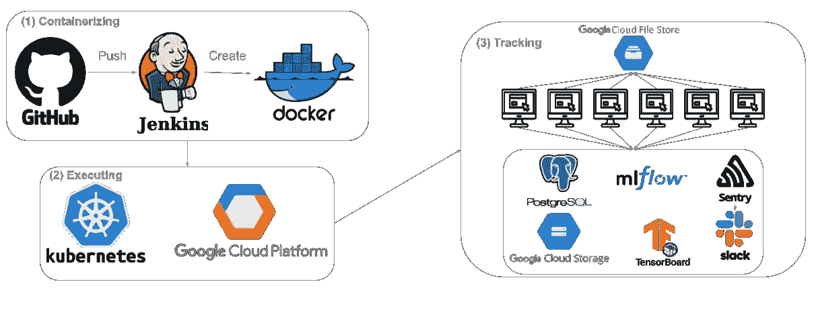

# 为训练机器学习模型创建基础设施

> 原文：<https://towardsdatascience.com/creating-infrastructure-for-training-machine-learning-models-aec52cf37929>

## 引入用于训练、跟踪和比较机器学习实验的自动管道

[Firmbee.com](https://unsplash.com/@firmbee?utm_source=medium&utm_medium=referral)在 [Unsplash](https://unsplash.com?utm_source=medium&utm_medium=referral) 上拍照

让我们想象一下下面的场景:你有一个新项目要做。对于这个项目，你需要开发一个机器学习模型，这将需要运行和训练几个实验。每个实验可能需要几个小时甚至几天，并且需要跟踪。

在开发阶段，你有自己的笔记本电脑，但是用自己的笔记本电脑进行培训和运行所有的实验是不现实的。首先，您的计算机可能没有所需的硬件，例如 GPU。第二，浪费时间。如果你可以**并行运行和训练所有的实验**，为什么要在一台计算机上顺序训练？

如果你平行训练，每次实验在不同的机器上进行，你如何容易地**跟踪和比较**他们？你如何**访问训练数据**？你能实时意识到任何故障以便你能够修复并再次运行它吗？

所有这些问题都将得到解答。在这篇博文中，我想描述一个解决上述所有问题的可能方案。

该解决方案结合了不同的服务，并将它们联合起来，以创建一个用于训练机器学习模型的完整管道解决方案。

在下图中，您可以找到该管道的方案。

作者图片

流水线由三个步骤组成——将代码容器化，以便我们以后能够运行它，在几台独立的机器上执行代码，以及跟踪所有的实验。

# (1)集装箱化

大规模运行训练实验的最佳方式是构建一个 [**docker**](https://www.docker.com/) 映像。创建这种图像的一种方法是使用 [**詹金斯**](https://www.jenkins.io/) 。开源自动化服务器，支持构建、测试和部署软件。另一种方法是使用 [**GitHub 动作**](https://github.com/features/actions) **。**持续集成和持续交付(CI/CD)平台，允许您自动化您的构建、测试和部署管道。这可以直接从你的 GitHub 账户上完成。

让我描述一个可能的场景——每个对我们的 **git** 分支的推送都会触发一个 Jenkins 管道。这个管道构建 docker 映像(除了它能做的其他事情之外)，标记它，并将其存储在 docker 注册表中。

一旦我们有了这个图像，我们就可以执行它，并使用虚拟云机器大规模地训练我们的模型。

# (二)执行

我们已经准备好代码，我们想开始训练。假设我们有 10 个实验要运行，我们希望并行运行它们。一种选择是使用 10 个**虚拟机**，使用 ssh 连接每个虚拟机，并在每个虚拟机上手动执行我们的代码。我想你明白这不是最优的。

由于我们已经在上一步中容器化了我们的应用程序，我们可以利用最流行的容器编排平台来运行我们的培训— [**Kubernetes**](https://kubernetes.io/) 。Kubernetes 是一个开源系统，用于自动化容器化应用程序的部署、扩展和管理。这意味着，通过使用它，我们可以获得 docker 映像并大规模部署它。我们可以使用一个简单的 bash 脚本在 10 台独立的机器上运行 10 个实验。

你可以在这里阅读更多相关信息[。](https://kubernetes.io/docs/tasks/job/automated-tasks-with-cron-jobs/)

# (3)跟踪

## 训练数据采集

为了执行培训，我们首先需要访问我们的培训数据。最好的方法是从训练机器直接访问**存储器**中所需的训练文件( [S3](https://aws.amazon.com/s3/) 、 [GCS](https://cloud.google.com/storage) 等)以及**数据库**中所需的表格信息。为了确定这一点，我们可能需要帮助来访问相关的凭证和[秘密管理器](https://cloud.google.com/secret-manager#:~:text=Secret%20Manager%20is%20a%20secure,audit%20secrets%20across%20Google%20Cloud.)(一个用于 API 密钥、密码、证书和其他敏感数据的安全而方便的存储系统)。一旦配置完成，我们就可以开始了。

## NFS 磁盘—共享磁盘

用于培训的所有机器都连接到一个 NFS 磁盘(在我们的例子中，我们使用 GCP 的托管解决方案，称为[文件存储](https://cloud.google.com/filestore))，这是一个额外的共享磁盘，所有机器都可以对其进行读写访问。我们添加这个共享磁盘有三个主要原因—

1.  当在不同的机器上训练时，我们不想为每台机器反复下载我们的训练数据。相反，我们可以将所有机器连接到一个共享文件存储，这是一个所有机器都可以访问的附加磁盘。这样我们可以**只下载一次数据**。
2.  培训模型可能需要时间，因此成本可能很高。让训练更便宜的一个选择是使用 [**现货实例**](https://cloud.google.com/spot-vms) ，价格低得多。但是，如果需要回收计算容量以分配给其他虚拟机，您的云提供商可能会停止(抢占)这些实例。使用 Kubernetes，一旦实例停止，它会被自动替换并再次执行相同的实验。在这种情况下，我们希望从停止加载最后一个保存的检查点的地方继续训练。只有使用共享磁盘才能做到这一点，没有共享磁盘，我们将无法访问先前机器中保存的检查点。其他解决方案，如将所有检查点上传到云存储并在其上应用逻辑，也是可行的，但开销(和成本)很高。
3.  [**TensorBoard**](https://www.tensorflow.org/tensorboard#:~:text=TensorBoard%20provides%20the%20visualization%20and,as%20they%20change%20over%20time) —使用 TensorBoard 比较不同机器的不同实验，所有信息必须写入同一父目录。我们将把所有信息写入同一个父日志目录，TensorBoard UI 将从中读取。

## 实验跟踪

训练模型中最重要的一点是能够跟踪训练进度并比较不同的实验。对于每个实验，我们希望保存我们使用的参数、我们训练的数据、损失值、结果等等。我们将使用这些数据进行跟踪、追踪和比较。

有许多跟踪工具。当我想要高级可视化时，我使用 [**MLflow**](https://mlflow.org/) 和 **TensorBoard** 。它们都是以这样一种方式部署的，即所有团队都可以访问同一个实例，并看到团队的所有实验。

MLflow 是一个管理端到端机器学习生命周期的开源平台。它提供了一个简单的 API 来集成，并提供了一个很好的 UI 来跟踪和比较结果。

TensorBoard 提供了机器学习实验所需的可视化和工具。它提供了一个 API，将我们的信息记录到机器磁盘上的文件中。TensorBoard UI 从传递的输入目录中读取这些文件。

## 错误警报

由于培训可能需要时间、几个小时甚至几天，因此如果出现错误，我们希望得到实时通知。一种方法是将我们的代码与 [**Sentry**](https://sentry.io/welcome/) 集成，将 Sentry 与 **Slack** 集成。这样，代码中出现的每个错误都将作为事件发送给 Sentry，并触发 Slack 通知。

现在，我可以实时收到错误通知。这不仅减少了我监视运行的需要(不管它们是崩溃了还是还在运行)，而且还减少了错误发生和触发下一次运行之间的时间，代码是固定的。

# 摘要

当我第一次训练模型时，是在我的笔记本电脑上完成的。很快，它就不可伸缩了，所以我使用 ssh 转移到虚拟机上。这种选择也有缺陷。对于每台机器，我不得不登录、提取代码、下载数据、手动运行代码，并希望我没有混淆我传递的参数。数据部分是最容易解决的，我们为我的所有虚拟机添加了一个共享磁盘。但我仍然对参数感到困惑，并在几台机器上传递了相同的参数。**正如我在这篇文章中所描述的，是时候使用可扩展的、更加自动化的基础设施了。**与 DevOps 团队一起，我们定义并构建了我们今天拥有的强大渠道。现在，我有了一个可伸缩、易于执行的管道，甚至在每次出现错误时都发送一个 Slack 通知。这种流水线不仅由于实验的并行性而节省了时间，而且最大限度地减少了参数错误和由于错误而导致的空闲时间，除非主动检查每台机器，否则我们不会知道这些错误。

               