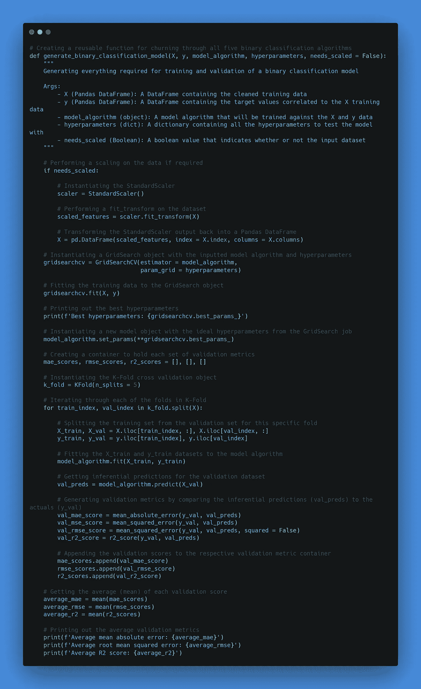

# 创建电影分级模型第 3 部分:测试候选模型算法

> 原文：<https://towardsdatascience.com/creating-movie-rating-model-part-3-testing-out-model-algorithm-candidates-612c7cf480ce>


## 尝试五种二元分类和回归算法来支持我们的电影分级模型项目

朋友们好！是的，我们已经连续第二天在我们的电影分级模型系列中有了新的条目。正如我在昨天的帖子中所说的[，我仍然在以博客的形式玩着我迄今为止作为](https://medium.com/towards-data-science/creating-a-movie-rating-model-part-2-five-feature-engineering-tactics-dc9d363bebcd) [YouTube 直播系列](https://youtube.com/playlist?list=PLNBQNFhVrlVRCyhEM0c9dTkWswzk_FeaR)所做的事情。在那篇文章中，我们介绍了从[原始系列文章](https://medium.com/towards-data-science/creating-a-movie-rating-model-part-1-data-gathering-944bee6167c0)中收集的原始数据集，并执行了一个特征工程来筛选一些干净的特征。如果你想进一步了解，你可以在这个 GitHub 库中找到所有这些工作和支持数据[。GitHub 项目的自述文件解释了这个项目的所有内容，所以我建议你去看看，而不是在这里重复。(我想我刚刚创下了一个段落中超链接数量的个人记录！)](https://github.com/dkhundley/movie-ratings-model)

既然我们的数据已经进行了适当的特征工程，我们准备开始测试一些不同的机器学习模型算法候选，以查看哪一个将在本系列的下一篇文章中最适合创建正式训练的模型。请记住，我们实际上将为这个项目创建**两个模型**。这是因为电影评论家卡兰·比恩(Caelan Biehn)为他的电影提供了两个评分。第一个分数更像是一个“是或否”的二元评级，第二个分数是一个介于 0 和 10 之间的数字分数。后者被称为“比恩等级”，可以用一个小数位来表示，例如，电影可以得到 4.2 或 6.9 的评级。因为有两个不同的分数，我们将为二进制“是或否”分数训练一个**二进制分类** **算法**，为 Biehn 标度分数训练一个**回归算法**。

因为我们希望创建尽可能精确的模型，所以我们将为二元分类和回归模型尝试五种不同的算法。在我们开始测试各种算法之前，让我们为如何继续这篇文章制定建模策略。

# 建模策略

虽然我们已经注意到，我们将测试每种算法中的五种，但是在执行建模时，我们还需要做一些特定的活动。这些事情包括以下内容:

*   **超参数调整**:为了确保每个算法都以最佳状态运行，我们将执行超参数调整，为每个模型寻找理想的超参数。具体来说，我们将使用 [Scikit-Learn 的 GridSearchCV 工具](https://scikit-learn.org/stable/modules/generated/sklearn.model_selection.GridSearchCV.html)来帮助我们。
*   **K 倍验证**:因为我们将要训练的数据集相对较小(大约 125 条记录)，所以我们不能像对待通常较大的数据集那样进行典型的训练测试分割。因为我们想最有效地利用我们的数据集，所以我们将使用 [Scikit-Learn 的 k 倍验证](https://scikit-learn.org/stable/modules/generated/sklearn.model_selection.KFold.html)。这个过程会将数据集分成几个小的训练和验证批次，这将发生多次。该过程的输出将允许我们最大程度地评估数据集。(如果你想了解更多关于 k 倍验证的知识，我最近[发表了一篇不同的文章](https://medium.com/towards-data-science/how-and-why-to-perform-a-k-folds-cross-validation-adf88665893b)正是关于这个话题！)
*   **指标验证**:对于经过训练的模型，我们希望通过将它们与适当的验证指标进行比较，来确保它们能够有效地执行。我们将在下一节详细讨论验证指标。
*   **特征缩放(可选)**:根据我们使用的算法，我们可能需要也可能不需要对数据集执行特征缩放。为了执行这种缩放，我们将使用 [Scikit-Learn 的 StandardScaler](https://scikit-learn.org/stable/modules/generated/sklearn.preprocessing.StandardScaler.html) 对数据执行基本的标准化。

现在，我们已经在一个高层次上制定了我们的策略，让我们更多地讨论验证指标，然后继续创建一些帮助函数，使测试五个算法中的每一个都变得非常容易。

## 模型验证指标

确保任何模型按预期执行的基础是，我们必须为每种不同类型的算法定义一些模型验证度量。对于二元分类和回归模型，我们将使用三种不同的度量来验证每个模型的性能。所有这些验证指标都将在 Scikit-Learn 内置函数的帮助下进行计算。

对于我们的二元分类算法，下面是我们将测试的模型验证指标:

*   **准确性**:在这个列表的所有指标中，这个指标显然是最基本的。归根结底，这是我最关心的指标，但是这个验证指标本身并不能说明全部情况。为了全面了解模型是否正常运行，我们需要其他验证指标的帮助。
*   **ROC AUC** :这个指标的全称其实是“受试者工作特征曲线/曲线下面积”自然，它经常被缩写为 ROC AUC，因为全称很拗口。这个指标的作用是计算算法在一条曲线上多个不同阈值下的性能，我们可以从技术上把这条曲线画在图上。一旦计算出这条曲线，我们就可以用曲线下面积(AUC)来为这个模型的表现给出一个分数。
*   **F1** :如上所述，准确性本身并没有多大帮助。我可以做的是计算模型的精确度和召回率，或者我可以通过计算 F1 分数让生活变得简单一点。F1 评分发现了精确性和回忆性评分之间的和谐，从而产生单一评分。

对于回归算法，我们将计算以下三个验证指标:

*   **平均绝对误差(MAE)** :对于每个数据点，此验证度量计算观察点离模型生成的回归线有多远。回归线和观察点之间的距离通常被称为误差，因为一些观察点可能低于回归线，这意味着我们可能会有负误差。为了抑制这种情况，我们取误差的绝对值，然后取所有这些绝对值的平均值来产生我们的单个 MAE 分数。
*   **均方根误差(RMSE)** :这个验证指标与上面的非常相似，除了我们不是取误差的绝对值，而是取误差的平方。这些误差的平均值也将被平方，如果我们愿意，我们可以停下来计算均方误差(MSE)。因为我不是特别喜欢 MSE 不代表实际误差，所以我要取 MSE 的平方根，这自然会产生 RMSE。
*   **R 平方**:也称为“决定系数”，这个验证度量计算模型输出相对于模型输入的可解释性。值为 1 的 R 平方得分意味着模型输入完美地解释了模型输出，而接近 0 的数字意味着模型输入不能很好地解释输出。是的，R 平方度量可以是负的，这意味着当试图解释模型输出时，模型输入是一种倒退。请记住这一点，因为这个特定的指标将在这篇文章的结尾非常有说服力。

## 助手功能

因为我们将测试许多不同的算法，所以我将创建两个可重用的辅助函数:一个用于二进制分类算法，另一个用于回归算法。这些函数将做一些事情，如特征缩放(根据需要)，执行超参数调整，用理想的超参数训练模型，用 k-fold 验证来验证训练的模型，并打印出来自每个 k-fold 训练的平均验证度量。

(因为这些是大块的代码，这里有一个友好的提醒，你可以在[这个 Jupyter 笔记本](https://github.com/dkhundley/movie-ratings-model/blob/main/notebooks/model-selection.ipynb)中找到这些相同的功能。)

以下是二进制分类算法的辅助函数:


作者创建的图像和代码

这是回归算法的辅助函数:



作者创建的图像和代码

唷！这些是一些很大的函数，但是好消息是，你将会看到这两个函数将会使测试每一个算法变得多么容易。说到这里，让我们继续讨论我们将要测试的不同算法。

# 候选模型算法

如上所述，我们将为每种不同类型的模型测试五种不同的算法。让我们简单地谈谈每个候选人将要参加的选拔。

(M1 Mac 用户请注意:对于这两种类型的模型，我想尝试一下 Catboost 库中的一些算法，因为我的同事已经发现了这些算法的许多成功之处。不幸的是，Catboost 库还不能在基于 M1 的 Mac 电脑上运行。因为我在 M1 Mac mini 和微软 Surface Pro 8 之间工作，所以我必须在我的 Surface 上测试 Catboost 算法。对不起，M1 用户！)

## 二元分类候选

*   **Scikit-Learn 的逻辑回归算法**:虽然名字中的“回归”可能具有欺骗性，但逻辑回归是一种非常简单但功能强大的二元分类算法。因为我们想要测试各种算法类型，所以我们选择 Scikit-Learn 的逻辑回归算法作为更简单的变体。
*   Scikit-Learn 的高斯朴素贝叶斯(GaussianNB)算法:朴素贝叶斯算法最流行的实现，我们将测试 Scikit-Learn 的 GaussianNB 实现，看看它在我们的数据集上表现如何。
*   **Scikit-Learn 的支持向量机(SVM)算法**:虽然不像逻辑回归算法那么简单，但 SVM 是一种更简单的算法。这种算法往往在更高维度(即具有更多特征的数据集)中表现更好，尽管我们的数据集维数更少，但我仍然认为它值得一试。
*   **Scikit-Learn 的随机森林分类器算法**:这是 ML 行业中最流行的二进制分类算法之一。这是因为它经常产生非常准确的结果，并且具有更容易的算法解释能力。随机森林分类器也是被称为*集合模型*的经典例子。
*   CatBoost 的 CatBoostClassifier 算法:你可能以前没有听说过这个算法，但它在我的财富 50 强公司的同事中非常流行。这是因为它经常被证明可以提供最佳的性能结果。因此，很自然地，我想看看它与我的数据相比如何！

## 回归算法候选

*   **Scikit-Learn 的线性回归**:就像我们用二元分类器分析的逻辑回归算法一样，这可能是我们可以测试的回归算法的最简单实现。鉴于它的简单性，我显然不抱太大期望，但无论如何它总是值得一试！
*   **Scikit-Learn 的 Lasso 回归**:这个算法和上面的算法是一个家族，Lasso 实际上是一个缩写，代表最小绝对选择收缩算子。坦白地说，我并不精通这个算法背后的数学，所以我甚至不打算解释它。😂
*   **Scikit-Learn 的支持向量回归机**:类似于我们如何尝试二进制分类模型的支持向量分类器，我们将在这里看到支持向量回归机的表现。因为支持向量机通常计算特征之间的距离，所以这里的特征将需要被适当地缩放。
*   **Scikit-Learn 的随机森林回归**:就像我们对二元分类模型使用随机森林分类器一样，我想在这里尝试一下它的回归变体，特别是因为这被认为是一个集合模型。
*   CatBoost 的 CatBoostRegressor :最后，就像我们对前面提到的一些变体所做的那样，我想尝试这个最终算法作为第二个集合选项。

当我们使用上面的特殊助手函数时，我们可以非常简单地用几行简短的代码就能完成每一个候选函数。例如，下面是我需要为逻辑回归算法运行的所有附加代码:

```
*# Setting the hyperparameter grid for the Logistic Regression algorithm*
logistic_reg_params **=** {
    'penalty': ['l1', 'l2'],
    'C': np**.**logspace(**-**4, 4, 20),
    'solver': ['lbfgs', 'liblinear']
}*# Instantiating the Logistic Regression algorithm object*
logistic_reg_algorithm **=** LogisticRegression()*# Feeding the algorithm into the reusable binary classification function*
generate_binary_classification_model(X **=** X,
                                     y **=** y,
                                     model_algorithm **=** logistic_reg_algorithm,
                                     hyperparameters **=** logistic_reg_params)
```

看看助手函数是如何让测试所有这些算法变得如此容易的？我停在了五种不同的算法上，但是因为助手函数使它变得如此简单，如果我愿意，我可以非常容易地添加额外的候选算法。但是正如您将在我们的下一节中看到的，这并不是真正必需的。

# **模型验证结果**

因为这个帖子已经有点过时了，所以我打算鼓励你去看看[这个 Jupyter 笔记本](https://github.com/dkhundley/movie-ratings-model/blob/main/notebooks/model-selection.ipynb)看看具体的结果。此外，我不打算在这里进入每个算法的性能的本质细节，因为**每个算法都或多或少地表现相同**。当然，有些人比其他人过得好，但差别几乎可以忽略不计。让我们更多地讨论每种模型类型的验证结果。

## 二元分类验证结果

就准确性而言，每一个算法都有 78%或 79%的准确率。同样，每一个算法的 F1 分数也相当不错，要么是 87%，要么是 88%。ROC AUC 是事情变得有趣的地方，原因有二。首先，ROC AUC 得分在这里变化最大，与准确性和 F1 相反。算法之间的差异不是 1 点，而是 8 点。但是第二点和坏消息 ROC AUC 分数对每一个算法来说都很糟糕。它们在 50%和 58%之间。我并不特别惊讶，我会在即将到来的结论中解释我的不惊讶。

## 回归验证结果

哦，天啊…我们回归候选人的情况很糟糕。虽然与二元分类算法相比，我们有更多的结果分布，但结果并不太好。对于 MAE，我们看到的平均误差约为 1.6，对于 RMSE，我们看到的平均误差约为 2.0。请记住，我们讨论的是 0 到 10 分之间的分数范围，所以这个误差相当大。甚至谈论 R 平方分数都让我感到痛苦…记住，零或负的验证分数真的很糟糕，而且…嗯，我们看到几个候选人的分数是负的。在最好的情况下，一些算法几乎没有超过零。呀。

# 最终候选人选择和结论

好吧，伙计们…这并不像我希望的那样好！诚然，这只是一个帮助我们更好地了解数据科学概念的有趣项目，老实说，结果并没有让我感到惊讶。影评人卡兰·比恩(Caelan Biehn)并不是一个严肃的影评人，所以他给电影打出一些非常怪异的分数并不罕见。例如，他可能会给一部电影二进制“是的，去看这部电影”，但随后会给它一个像 1.3 这样极低的比恩评分。请记住，卡兰给出的评论是喜剧播客的一部分，所以荒谬有助于喜剧！此外，我正在处理的这个数据集非常小，目前只有大约 125 条记录(评论)。如果我有一个更大的数据集，也许我们会看到更强的信号。

那么，未来我们将采用什么样的候选算法呢？对于二进制分类模型，我们将使用 **Scikit-Learn 的随机森林分类器算法**。这是在这个和逻辑回归算法之间的一次掷硬币，但是在一天结束时，每次我重新运行网格搜索和模型训练/验证时，随机森林分类器仍然表现得更好一些。我们也可以使用 Catboost 分类器，但正如你在帖子前面看到的，显然 CatBoost 还不能在 M1 的 Mac 电脑上使用。鉴于我计划继续在我的 M1 Mac mini 上进行正式的模型训练和推理的直播，我不打算使用 Catboost，因为它根本无法在那台计算机上工作。

对于回归模型，我们将使用 **Scikit-Learn 的 Lasso 回归算法**。同样，我们看到所有回归模型的结果非常相似，但我们看到验证指标之间最大的差异是 R 平方得分。当然，所有的回归算法在 R 平方得分方面都表现得非常糟糕，但 Lasso 回归算法在我每次重新运行模型训练和验证时都表现得更好一些。(如果我完全诚实的话，我有点高兴 Lasso Regression 挤掉了他们，因为我有点希望那个算法“赢”，因为奇妙的电视节目 *Ted Lasso* 。😂)

这篇文章到此结束！即使我们的模型在以后的推理中不会很棒，我仍然认为这个项目为了学习的目的是值得继续的。在本系列的第 4 部分中，我们将创建一个正式的模型训练管道，它还捆绑了所有适当的特性工程，以将所有这些转换序列化为两个 pickle 文件。即使这里的结果很糟糕，我仍然希望你学到了一些东西，并且一路上玩得开心。下期帖子再见！