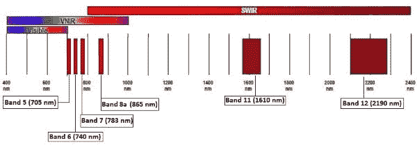
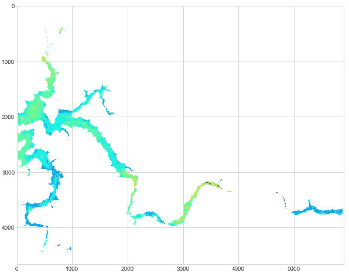

# 用 Python 制作遥感影像水质图

> 原文：<https://towardsdatascience.com/creating-water-quality-maps-from-remote-sensed-images-with-python-ca5274041f4c>


作者图片

# 介绍

水安全是联合国制定的 2030 年可持续发展目标之一。拥有适当数量和质量的水对地球上的生命来说是必不可少的。据估计，到 2050 年，世界人口将达到 100 亿。此外，气候变化也增加了水供应的压力，增加了与水有关的灾害，如干旱。

改善水治理至关重要，利益相关者需要获得数据以做出明智的决策。获取水质参数的成本很高，因为需要在野外获取，而且通常是点状的，难以在大区域或沿河进行空间概化。许多水体缺乏水质测量，特别是在发展中国家。

在这种情况下，使用卫星传感器正在成为从空间测量某些水质参数的一种可行的解决办法。例如，欧洲航天局的哥白尼任务每 4-5 天提供高达 10m 的中等分辨率图像。随着新卫星的发射，光谱分辨率也在提高。

在我之前的文章 [**中，我展示了如何使用`waterdetect` Python 包从卫星图像中提取水掩膜。在当前的故事中，我将介绍如何使用另一个包(`waterquality` 包)，它使得从遥感图像创建水质地图更加容易。**](/water-detection-in-high-resolution-satellite-images-using-the-waterdetect-python-package-7c5a031e3d16)

# 装置

可以从下面的 github 库获得`waterquality` 包:[https://github.com/cordmaur/WaterQuality](https://github.com/cordmaur/WaterQuality)

> 在安装它之前，确保您有一个可用的 GDAL 活动环境。

使用`pip`安装`waterquality`:

```
pip install git+https://github.com/cordmaur/WaterQuality.git@main
```

或者，您可以克隆项目并在编辑模式下安装它

```
git clone https://github.com/cordmaur/WaterQuality.git
cd WaterQuality
pip install -e .
```

安装后，您可以通过键入`waterdetect -h`来测试安装，它将从控制台显示基本用法。这里我们将调用 jupyter 笔记本中的包。

# 来自朱庇特

运行这个包我们需要做的第一件事是为`waterdetect`和`waterquality`准备配置文件。在这些文件中，可以配置所有的处理。我准备了两份样本，可以放在项目的`test`文件夹中。因此，如果您在`waterdetect` 根文件夹中，下面的命令应该通过。

然后，我们必须创建一个水质类的实例，并指向正确的文件夹。对于本例，必须下载并解压缩至少一幅图像(Sentinel-2 或 Landsat 8)。我将使用哨兵-2 L2-从欧空局获得的图像。这些图像是用 Sen2Cor 算法进行大气校正处理的，所以我用的是`product = ‘S2_S2COR’`。此外，我指定了一个较小的区域来关注我的水库。这可以通过将带有一个多边形的 shapefile 作为参数传递给创建函数来实现。另外，由于我只处理一幅图像，我选择了`single_mode=True`。创建实例的命令如下所示:

```
Initializing waterquality package (version=1.1.0) 
Waterdetect version: 1.5.12 
Loading configuration file ..\tests\aux_data\WaterQuality.ini 
File ..\tests\aux_data\WaterQuality.ini verified. 
Loading configuration file ..\tests\aux_data\WaterDetect.ini 
File ..\tests\aux_data\WaterDetect.ini verified. 
Folder d:/images/22KEV/S2A_MSIL2A_20210706T133231_N0301_R081_T22KEV_20210706T172741.SAFE verified. 
File d:/images/shp/22KEV.shp verified. Folder d:/images/output verified.
```

您应该在开始时看到一条消息，表明包已经初始化，并且找到了 waterdetect。它还会检查通知文件夹。

# 选择反转功能

在开始处理之前，有必要创建负责将光谱特征转化为实际水质参数的函数(称为转化函数)。

这些函数可以在文献中找到，并且它们将取决于各种因素，例如水的类型、卫星传感器、大气条件等等。

一旦选择了正确的功能，有必要告知`waterquality`如何使用该功能进行反转。例如，您可以为不同的参数通知多个功能，或者在同一区域测试不同的功能。

例如，我将实现 Nechad 等人(2010) [2]提出的总悬浮物质(TSM)函数。这是建议的功能:

应在包含{ '名称 f1 ':功能 1，'名称 f2 ':功能 2，…}的字典中告知这些功能

下面是一个使用 Nechad 等人(2010)提出的 SPM 算法的例子。


> 注意:在使用反演函数之前，检查函数在待分析区域的有效性是很重要的，最好是通过将结果与现场测量进行比较。

文章中的表 1 和表 4 列出了要使用的参数 A、B 和 C，具体取决于所用的传感器波长。为了选择波长，我们可以看到最佳的决定系数 R，在这种情况下是 82.9%，大约 710nm。然后，我们可以检查卫星的波段，看是否有接近这个波长的波段。



图 1:空间分辨率为 20 米的哨兵-2 波段。来源:[欧空局](https://sentinels.copernicus.eu/web/sentinel/user-guides/sentinel-2-msi/resolutions/spatial)。

从图 1 中，我们可以看到波段 5，即 705 纳米，最接近 710 纳米，因此我们将根据该波长获得参数。在这种情况下，我们将得到:A = 493.65，B = 1.16，C = 0.188。

# 实现反转功能

现在我们有了一个函数及其参数，让我们用 Python 实现它并将其传递给我们的 waterquality 对象。要实现的功能可以使用卫星图像中可用的任何波段，但是，由于软件对于不同的卫星和大气处理程序是通用的，因此该名称必须与 waterdetect 包内部使用的名称相匹配。因此，在编写反演函数之前，检查卫星可用的频带，这些频带是在`waterdetect`的`InputOutput.py`模块中通知的。

```
{'bands_names': {'Blue': 'B02_10m', 'Green': 'B03_10m', 'Red': 'B04_10m', 'Mir': 'B11_20m', 'Mir2': 'B12_20m', 'RedEdg1': 'B05_20m', 'RedEdg2': 'B06_20m', 'RedEdg3': 'B07_20m', 'Nir': 'B08_10m', 'Nir2': 'B8A_20m'}, 'suffix': '.jp2', 'string': '', 'metadata': '*MTD_TL.xml', 'subdir': 'GRANULE/*/IMG_DATA', 'recursive': True}
```

从结果中，我们可以看到 Band5 在 waterdetct 内部被称为 RedEdg1。所以，要利用这个波段，在函数参数中使用这个名字就足够了。为了简化质量参数的计算，所有波段将被重新调整为相同的形状，如配置文件`WaterDetect.ini`中的`reference_band`所定义。我们的函数将如下所示:

请注意，我们不必为没有数据像素或水域与陆地像素而烦恼，因为软件包会为我们处理这些问题。现在，我们必须告诉包使用这个函数作为反转函数来运行处理。这可以通过将字典传递给`run_water_quality`方法来实现。

```
Starting WaterDetection version: 1.5.11 
Opening image in folder d:\images\22KEV\S2A_MSIL2A_20210706T133231_N0301_R081_T22KEV_20210706T172741.SAFE 
Retrieving bands for product S2_S2COR 35 were found: 
Loading band: Blue 
Loading band: Green 
Loading band: Red 
Loading band: Mir 
Loading band: Mir2 
Loading band: RedEdg1...
```

# 显示结果

一旦处理完成，结果将可用，我们可以在 jupyter 笔记本上绘制结果。如果在 WaterDetect.ini 中将 PDF Reports 设置为 True，将在输出文件夹中写入一个报告，其中包含有关处理的所有信息(图 2)。该报告将显示原始图像(RGB)、水掩膜、阳光照射概率和带有色标的水质参数。


图 2:水质报告示例。该图(左下角)表示用于识别场景中水像素的聚类。图片作者。

从笔记本中，可以通过`quality_parameters`成员访问结果。功能`plot_param`也可用于创建结果的快速视图:

```
wq.plot_param('SPM', cmap='jet', vmin=5, vmax=20)
```



图 3:代码输出。图片作者。

# 结论

近年来，文献中关于利用遥感图像进行水质评价的研究越来越多。然而，我们可以注意到，它仍然缺乏操作工具，以使其能够为更广泛的受众所用。这些软件通常是在特定的研究范围内开发的，并停留在实验阶段，被锁在大学或研究中心里。我希望从这个项目和其他类似`waterdetect`的项目中，越来越多的实用遥感工具可供人们使用、研究和分享。

谢谢，下一个故事再见。

# 保持联系

*如果你喜欢这篇文章，想支持我成为一名作家，可以考虑通过我的推荐链接成为* [*媒介会员*](https://cordmaur.medium.com/membership) *。每月只需 5 美元，我会从你的会员费中收取一小笔佣金，不需要你额外付费。或者你可以随时给我买杯咖啡。*

[](http://cordmaur.medium.com/membership) [## 通过我的推荐链接加入媒体-毛里西奥·科代罗

### 作为一个媒体会员，你的会员费的一部分会给你阅读的作家，你可以完全接触到每一个故事…

cordmaur.medium.com](http://cordmaur.medium.com/membership) 

# 参考

[1] *联合国《2021 年世界水资源开发报告:珍惜水资源》。* 2021。S.l .:联合国教育。

[2]内恰德、b、K. G .鲁迪克和 y .帕克。2010."混浊水中总悬浮物质绘图的通用多传感器算法的校准和验证."环境遥感 114(4):854–66。https://doi.org/10.1016/j.rse.2009.11.022。