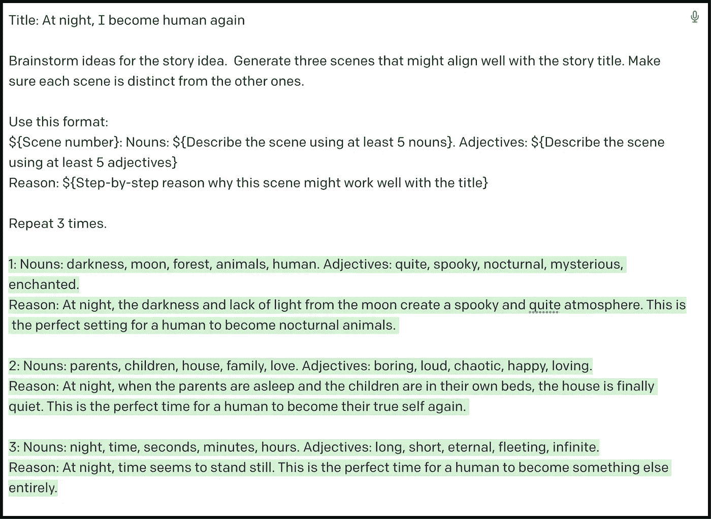
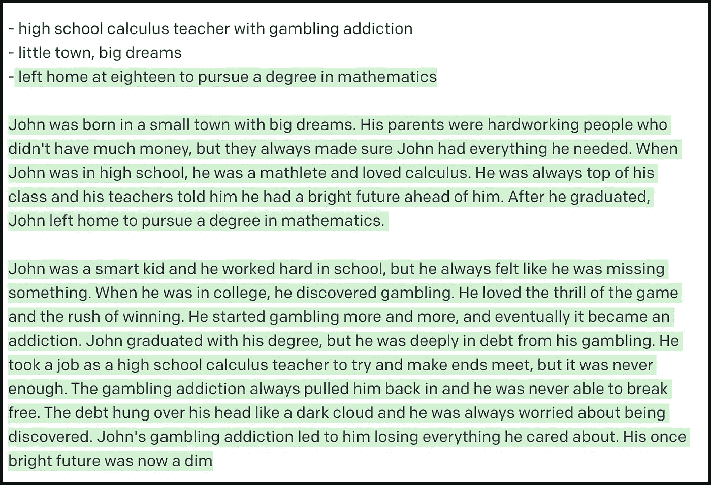

# GPT 创意写作-3:从表情符号到 Flash 小说

> 原文：<https://towardsdatascience.com/creative-writing-with-gpt-3-from-emoji-to-flash-fiction-219f2ca3f5a6>

## 用人工智能增强创造性写作过程


一个负责写故事的机器人！作者使用 [DALL-E 2](https://openai.com/dall-e-2/) 生成的图像。

# 使用人工智能开发完整的故事

作为一名创意小说作家，我想知道我是否可以让人工智能帮我写故事。人工智能已经被用来创作小说，比如一本[儿童读物](https://medium.com/@FrantzLight/i-wrote-a-book-with-ai-200abbccc533)，一本[诗集](https://medium.com/swlh/i-wrote-a-book-with-gpt-3-ai-in-24-hours-and-got-it-published-93cf3c96f120)，以及一篇关于其自身的[学术文章](https://www.scientificamerican.com/article/we-asked-gpt-3-to-write-an-academic-paper-about-itself-mdash-then-we-tried-to-get-it-published/)。人工智能写作工具，如谷歌的 [Wordcraft](https://arxiv.org/abs/2107.07430) ，也增强了计划、写作和编辑故事的过程。

在这篇文章中，我使用 GPT-3，一个由 [OpenAI](https://openai.com/api/) 创建的生成式人工智能语言模型，在一个迭代的、人在回路中的过程中写一篇短篇小说。通过这个过程中的每一步，我以不同的方式约束 GPT-3，使用少量学习、详细说明和参数化来诱导不同水平的特异性和稀疏性。使用 GPT-3，我

*   使用表情符号产生故事创意，
*   充实场景和人物背景
*   综合背景知识，创建一个压缩的 100 字的小故事

我对于创造性写作的哲学，就像大多数其他的创造性追求一样，是人对于创作过程是至关重要的。GPT-3 没有自动化的角色，也没有取代创意作家的工作。相反，它是增强创造者工作的工具。我希望展示这种创造性写作的过程，在人工智能的帮助下，确保人类仍然处于创作过程的中心。

# 形式:Flash 小说

[Flash 小说](https://en.wikipedia.org/wiki/Flash_fiction)是一个非常短的故事，长度从 1000 字到 6 字不等。Flash 小说迫使作家用尽可能少的话来抓住故事的本质。每一个字都必须经过深思熟虑，对故事至关重要。参见[NYT 小爱故事](https://int.nyt.com/data/documenttools/teaching-with-tiny-love-stories-pdf/753c41721cde1b10/full.pdf)或 [100 字故事](https://100wordstory.org/about/)中的例子。

# 该方法

在这一部分，我概述了我用迭代和互动的方式创作一篇短篇小说的方法。

## 1)使用表情符号选择标题

六个单词的故事是一个更短，更受限制的 flash 小说版本，在其中你只用六个单词讲述一个完整的故事。其中最著名的是海明威写的:“待售:婴儿鞋。没穿过。”

我生成了一个六个字的故事，并用它作为 flash 小说的标题。我使用一种叫做[少数镜头学习](https://huggingface.co/blog/few-shot-learning-gpt-neo-and-inference-api)的方法将表情符号映射到现有的六个单词故事。通过少量的镜头学习，GPT-3 首先获得一些将表情符号映射到六个单词故事的例子，它从中学习，为看不见的表情符号生成一个新的六个单词故事。由于 GPT-3 不太擅长计算单词，我强迫它故意计算每个单词。我随机选择了两个表情符号，看着 GPT 3 为我的新故事起了个名字。


用简单的学习用两个表情符号用六个单词讲述一个故事。作者截图。

标题:**夜晚，我又变回人类**

## 2)根据标题制作一个场景

接下来，我为故事生成一个场景。我使用标题(在第一步中生成)作为上下文。我还使用参数来约束格式，并提示 GPT-3 给我三个不同的例子供我选择。我强迫 GPT-3 想出具体的名词和形容词来描述一个场景，以及为什么这可能符合标题的原因。

这是我的提示:

```
Title: At night, I become human againBrainstorm ideas for the story idea.  Generate three scenes that might align well with the story title. Make sure each scene is distinct from the other ones.Use this format:
${Scene number}: Nouns: ${Describe the scene using at least 5 nouns}. Adjectives: ${Describe the scene using at least 5 adjectives}
Reason: ${Step-by-step reason why this scene might work well with the title}Repeat 3 times.
```



使用人工智能生成的标题作为上下文和参数化格式，为小说生成三种可能的设置。作者截图

我喜欢第三代的暗示性和神秘感，我就选这个。这种方法的好处是您可以利用不同的约束。例如，你可能想用副词或短语更具体地描述一个场景。

## 3)创造一个主要角色

接下来，我为故事创造了一个主角。我鼓励《GPT 3》去想象这个角色的详细背景故事。这些细节中的大部分可能不会在最终的故事中使用，但它构建了角色的丰富性。

我以两个要点开始(“有赌瘾的高中微积分老师”和“小镇，大梦想”)，并提示 GPT-3 填写其余部分。GPT-3 增加了第三个要点，然后生成了两段描述主要人物的文字。由此产生的一代包括关于主角的背景和上下文:他的动机、欲望和个性。

我的提示:

```
Write a back story for the following person. Do not repeat any of the traits verbatim. Work them into sentences with additional background context. Do not repeat the same sentence twice.In the first paragraph, include the character's name. Describe their childhood and their relationship with their family, if they have any. Include the major event that led to their main personality traits.In the second paragraph, expand upon each of the points to show how they contributed to them as a person. Talk about the character's main fears and weaknesses and where they originated from. End the paragraph with a major conflict the character faces and the consequences of it.
```



使用 GPT-3 生成主要人物的详细背景。作者截图。

## 4)组合这些片段以生成一个故事

现在，我有了一个标题，一个场景和一个主角。为了生成最终的故事，我在提示中使用所有这些片段作为*上下文。然后，我向 GPT-3 提供以下指令，解释最终输出的格式。输出被限制为 100 个单词。*

```
Task: Write a 100-word flash fiction short story.
- You only have 100 words, so think very carefully about each word that you use
- Employ brevity of word while still including the important elements of the story
- Use the character's background as context and refer to it as needed. However, do NOT repeat any sentences from the Character background. Only refer to it cryptically and do not bring up the obvious parts
- The story must include elements of conflict, character building, and a dramatic arc
- The story must be in first person.
- Do NOT include the character's name
- The story takes place in a few minutes
- Tell a story that needs to be told.Begin.
```

我运行了几次 context + prompt 来获得几个不同的故事供选择！你最喜欢哪一个？

**版本#1** :一个令人沮丧且相当模糊的故事，讲述了一个男人白天感觉自己像机器人/计算器，晚上可以通过感受自己的情绪“变成人类”。


版本#1 在生成一个标题为“在晚上，我又变成了人类”的 flash 小说作者截图。

**第二版**:一个稍微不那么模糊，但仍然令人沮丧的故事，关于一个焦虑的男人担心他的赌债，他可以在晚上“变成人”，在晚上有几分钟独处的时间。


第二个版本是生成一篇名为“在夜晚，我又变成了人类”的 flash 小说作者截图。

**版本#3:** 这个故事翻转了第一个故事，主角白天是数学老师，晚上通过变身成为赌徒的秘密激情而“变成人类”。这个版本有点重复(“我是……”)，但有一个很好的节奏风格。


版本#3 在生成一个标题为“在晚上，我又变成了人类”的 flash 小说作者截图。

## 5)额外收获:以不同的风格重写

GPT-3 可以模仿著名作家的风格。有史以来我最喜欢的作家之一是加布里埃尔·加西亚·马尔克斯，所以我促使 GPT-3 用他的风格重写了这个故事。有一些从原来的故事复制粘贴，但也有新的风格的新点缀。


用 GPT-3 改写一个马尔克斯风格的故事。作者截图。

# 结束语

在本文中，我展示了一个如何使用 GPT-3 生成一篇短篇小说的例子。这些方法只是限制 GPT-3 在创造性写作过程中发挥作用的众多方法之一。在每个步骤中，人在循环中的部分都很明显:在选择表情符号时，在选择最佳生成设置时，在选择描述主要角色的元素时。此外，我多次生成我的输出，直到生成令我满意的东西。

我希望像 GPT-3 这样的工具能在作家遇到瓶颈的时候帮助有创造力的作家！为了获得更多由 GPT-3 产生的创造性写作和诗歌的很酷的例子，我推荐看看 Gwern.net。

我希望你喜欢这篇文章！