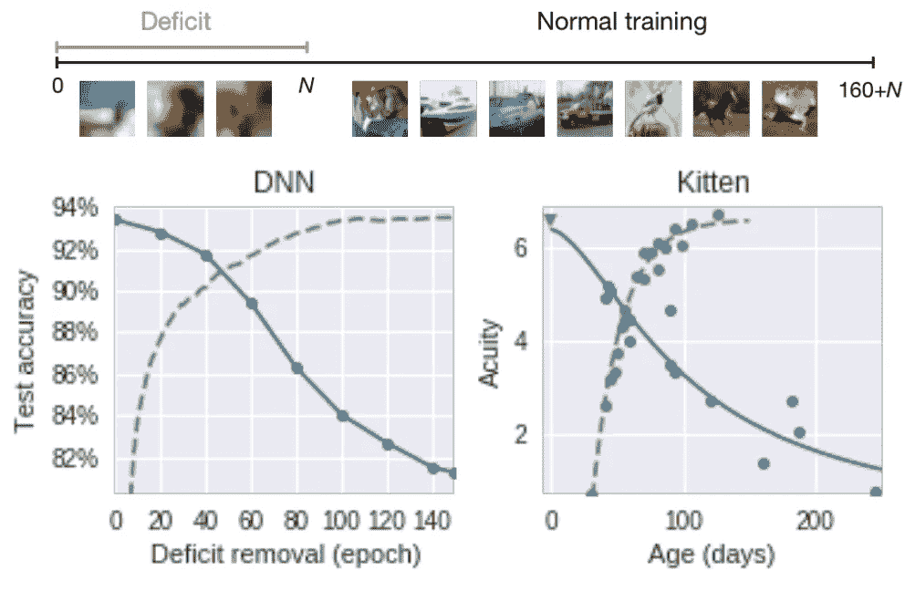
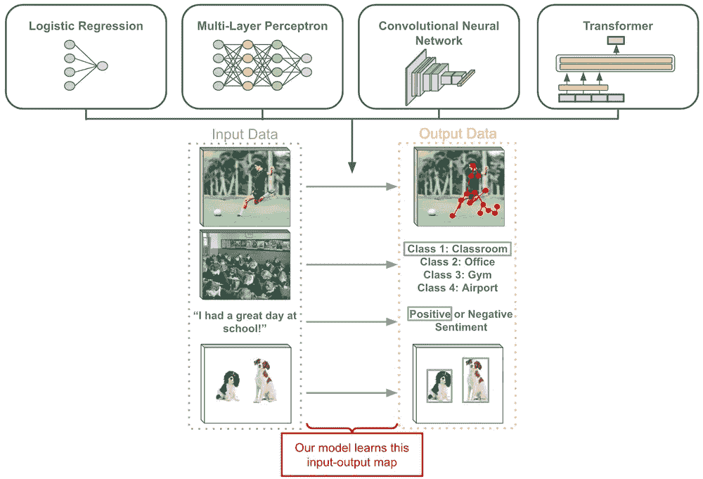
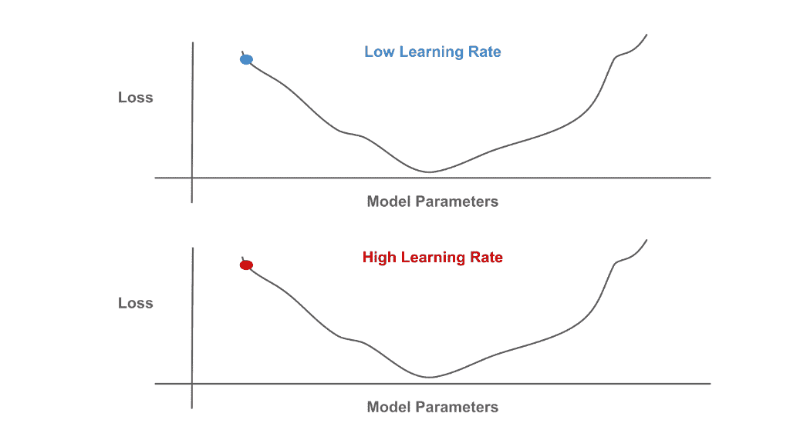
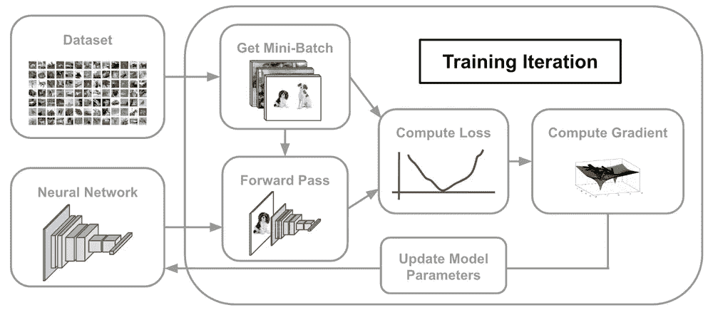
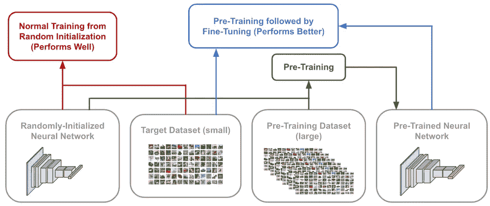
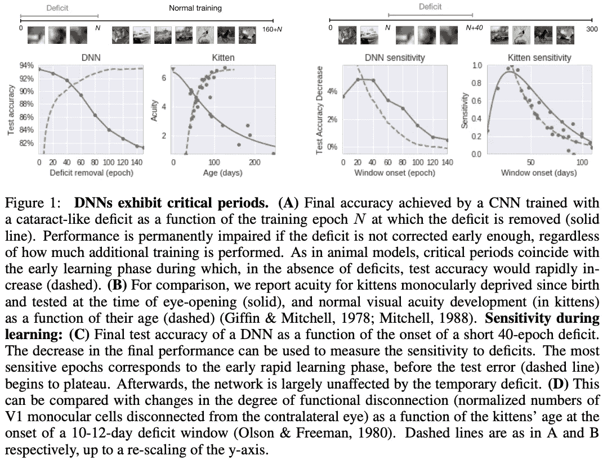
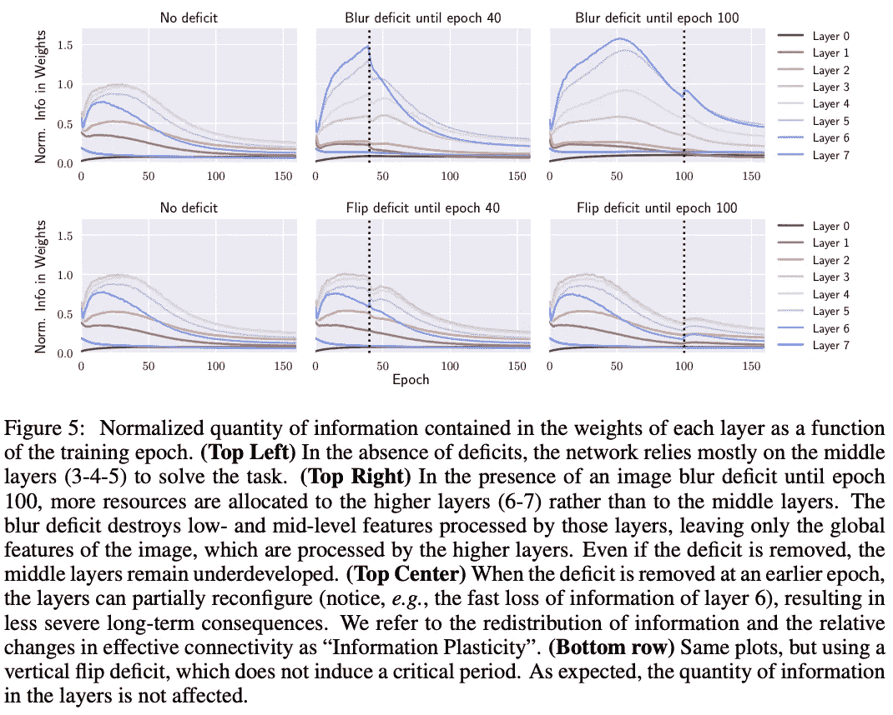
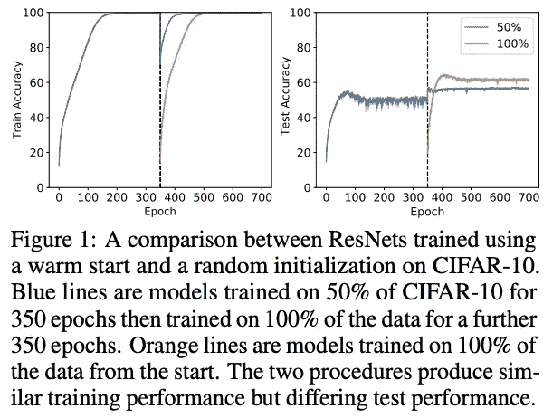

# 深度网络中的关键学习阶段

> 原文：<https://towardsdatascience.com/critical-learning-periods-in-deep-networks-35b2f17c4bbe>

## 为什么第一个纪元最重要…

人工系统和生物系统中临界学习期存在的经验证明(来自[1])

# 什么是关键的学习时期？

为了理解深度学习中的关键学习阶段，首先看一下生物系统的相关类比是有帮助的。在人类和动物中，关键期被定义为出生后早期(即出生后)发育时期，在此期间，学习障碍(如感觉缺陷)可能会导致个人技能的永久性损伤[5]。例如，年轻时的视力障碍——一个人视力发展的关键时期——通常会导致成年人出现弱视等问题。

虽然我远非生物学专家(事实上，我从高中起就没有上过生物学课)，但关键学习期的概念仍然与深度学习有着奇怪的关联，因为在神经网络的学习过程中也表现出了同样的行为。如果神经网络在学习的早期阶段受到一些损害(例如，仅显示模糊的图像或没有适当地调整)，则所得到的网络(在训练完全完成之后)相对于从未受到这种早期学习损害的网络将概括得更差，即使给定了无限的训练预算。从这种早期学习障碍中恢复是不可能的。

在分析这种奇怪的行为时，研究人员发现神经网络训练似乎分为两个阶段。在第一阶段——对学习缺陷敏感的关键时期——网络记忆数据并通过优化领域的瓶颈，最终找到一个表现更好的区域，在该区域内可以实现收敛。从这里开始，网络经历一个遗忘过程，学习可概括的特征，而不是记忆数据。在这一阶段，网络存在于损耗图的一个区域内，在该区域内存在许多同等性能的局部最优解，并最终收敛于这些解之一。

关键的学习阶段对于我们整体理解深度学习是至关重要的。在这个概述中，我将通过首先概述神经网络学习过程的基本组成部分来拥抱这个主题的基本性质。鉴于这一背景，我希望由此产生的对关键学习阶段的概述将提供一个更微妙的视角，揭示训练深度网络的真正复杂性。

# 背景资料

在这一部分，我将概述深层网络训练中的基本概念。这种基本思想对于理解神经网络的一般学习过程和学习期间的关键时期都是至关重要的。本节中的概述非常广泛，可能需要时间才能真正掌握，所以我为那些需要更多深度的人提供了进一步的链接。

## 神经网络训练

神经网络训练是深度学习的一个基本方面。涵盖该主题的全部深度超出了本概述的范围。然而，为了理解关键的学习阶段，人们必须至少对神经网络的训练过程有一个基本的了解。

神经网络训练的目标是-从具有随机初始化的权重的神经网络开始-学习一组参数，这些参数允许神经网络在给定一些输入的情况下准确地产生期望的输出。这种输入和输出可以采取多种形式——图像上预测的关键点、文本分类、视频中的对象检测等等。此外，神经网络体系结构经常根据输入数据的类型和正在解决的问题而变化。然而，尽管神经网络定义和应用存在差异，但模型训练的基本概念仍然(或多或少)相同。

*神经网络在不同问题域中学习的输入输出图的描述(作者创建)*

为了学习输入和期望输出之间的映射，我们需要一个(最好是大的)输入输出对的训练数据集。为什么？这样我们就可以:

1.  根据数据做出预测
2.  查看模型的预测与期望的输出相比如何
3.  更新模型参数以提高预测效果

通过训练数据更新模型参数以更好地匹配已知标签的过程是学习过程的关键。对于深度网络，该学习过程针对几个**时期**执行，定义为通过训练数据集的完整遍数。

为了确定模型预测的质量，我们定义了一个**损失函数**。训练的目标是最小化这个损失函数，从而最大化对训练数据的模型预测的质量。因为损失函数通常选择为可微分的，所以我们可以对模型中每个参数的损失进行微分，并使用**随机梯度下降(SGD)** 生成模型参数的更新。总的来说，SGD 只是:

*   计算损失函数的梯度
*   使用[微积分链规则](https://www.khanacademy.org/math/ap-calculus-ab/ab-differentiation-2-new/ab-3-1a/a/chain-rule-review)计算模型中每个参数的损失梯度
*   从每个参数中减去由**学习率**缩放的梯度

虽然详细理解起来有点复杂，但直观层面上的 SGD 非常简单— *每次迭代只是确定模型参数应该更新以减少损失的方向，并在该方向上迈出一小步*。我们对网络参数进行**优化**，以最小化训练损失。请参见下面对该过程的示意图，其中学习速率设置控制每个 SGD 步长的大小。

*不同学习率下的训练损失最小化(作者创建)*

总之，神经网络训练过程持续几个时期，每个时期对训练数据执行 SGD 的多次迭代——通常一次使用几个数据示例的**小批量**。在训练过程中，神经网络在训练数据集上的损失越来越小，从而产生一个模型，该模型很好地拟合了训练数据，并(有希望地)推广到看不见的测试数据，这意味着它也表现良好。

*神经网络训练迭代步骤的基本说明(由作者创建)*

有关神经网络训练过程的高级描述，请参见上图。关于神经网络训练还有更多细节，但是本概述的目的是理解关键的学习阶段，而不是深入研究神经网络训练。因此，我在下面提供了一些有用文章的链接，可以帮助感兴趣的读者更详细地理解关键的神经网络训练概念。

*   神经网络训练概述[ [博客](/how-do-we-train-neural-networks-edd985562b73) ] [ [视频](https://www.youtube.com/watch?v=VMj-3S1tku0)
*   了解反向传播[ [博客](https://mattmazur.com/2015/03/17/a-step-by-step-backpropagation-example/) ] [ [视频](https://www.youtube.com/watch?v=Ilg3gGewQ5U)
*   SGD(和其他优化算法)[ [博客](https://ruder.io/optimizing-gradient-descent/) ]
*   PyTorch [ [笔记本](https://github.com/udacity/deep-learning-v2-pytorch/blob/master/convolutional-neural-networks/mnist-mlp/mnist_mlp_solution.ipynb)中的基本神经网络训练
*   什么是泛化？[ [博客](https://deepai.space/what-is-generalization-in-machine-learning/) ]

## 正规化

神经网络训练执行更新，使训练数据集的损失最小化。然而，我们训练这个神经网络的目标不仅仅是在训练集上获得良好的性能。我们还希望网络在部署到现实世界中时，能够在看不见的测试数据上表现良好。在这种看不见的数据上表现良好的模型被认为能够很好地概括 T1。

最小化训练数据的损失并不保证模型将一般化。例如，模型可能只是“记住”每个训练示例，从而阻止它学习可应用于看不见的数据的可归纳模式。为了确保良好的泛化，深度学习实践者通常利用**正则化**技术。存在许多这样的技术，但与本文目的最相关的是**重量衰减**和**数据增加**。

权重衰减是一种常用于训练机器学习模型(甚至超越神经网络)的技术。这个想法很简单。在训练期间，调整您的损失函数来惩罚具有大幅度的学习参数的模型。然后，优化损失函数变成了 *(i)* 最小化训练集上的损失和 *(ii)* 使网络参数在量值上较低的联合目标。训练期间体重衰减的强度可以调整，以在这两个目标之间找到不同的折衷方案——这是学习过程中可以调整/修改的另一个超参数(类似于学习速率)。想了解更多，建议阅读[这篇文章](/this-thing-called-weight-decay-a7cd4bcfccab)。

根据应用的领域和环境，数据扩充有许多不同的形式。但是，数据扩充背后的基本思想保持不变-每次您的模型在训练过程中遇到一些数据时，应该以仍然保留数据输出标签的方式随机更改数据一点点。因此，您的模型不会两次看到相同的数据示例。相反，数据总是稍有扰动，阻止模型简单地记忆训练集中的例子。尽管数据扩充可以采取多种不同的形式，但是有大量的调查报告和解释可以用来更好地理解这些技术。

*   计算机视觉的数据增强[ [博客](/complete-guide-to-data-augmentation-for-computer-vision-1abe4063ad07) ] [ [调查](https://arxiv.org/abs/2204.08610)
*   自然语言处理的数据增强[ [博客](https://blog.paperspace.com/data-augmentation-for-nlp/) ] [ [调查](https://arxiv.org/abs/2105.03075)

## 培训、预培训和微调

除了本节介绍的基本神经网络训练框架，人们还会经常遇到针对深度网络的**预训练**和**微调**的想法。所有这些方法都遵循上面概述的相同学习过程——预训练和微调只是针对相同训练过程的特定、稍微修改的设置的术语。

预训练通常是指在非常大的数据集上从头开始(即随机初始化)训练模型。尽管在大的预训练数据集上的这种训练在计算上是昂贵的，但是从预训练中学习的模型权重可以是非常有用的，因为它们包含从训练大量数据中学习的模式，这些模式可以在别处推广(例如，学习如何检测边缘、理解形状/纹理等)。).

*说明神经网络的预训练、微调和正常训练之间的差异(由作者创建)*

预先训练的模型参数通常被用作在其他数据集上执行训练的“热启动”，其他数据集通常被称为下游或目标数据集。不是在执行下游训练时随机初始化模型参数，而是我们可以将模型参数设置为等于预先训练的权重，并在下游数据集上微调或进一步训练这些权重；见上图。如果预训练数据集足够大，这种方法会产生改进的性能，因为模型在更大的数据集上进行预训练时会学习概念，而这些概念不能单独使用目标数据集来学习。

# 出版物

在以下概述中，我将讨论几篇证明深度神经网络中存在关键学习期的论文。第一篇论文研究了数据模糊对学习过程的影响，而随后的论文研究了在训练期间关于模型正则化和数据分布的学习行为。尽管采用了不同的方法，但这些作品都遵循类似的方法:

*   对学习过程的一部分施加一些损害
*   分析这种不足如何影响训练后的模型性能

## 深度网络中的关键学习期[1]

(来自[1])

**主旨。**这项由深度学习和神经科学专家混合进行的研究，探索了生物和人工神经网络中关键学习时期之间的联系。也就是说，作者发现将缺陷(例如，图像模糊)引入深度神经网络的训练，即使只是很短的一段时间，也会导致性能下降。更进一步说，对表现的损害程度取决于损害出现的时间和时间——这一发现反映了生物系统的行为。

例如，如果在训练开始时应用损害，则存在足够数量的受损学习时期，超过这些时期，深度网络的性能将永远不会恢复。生物神经网络在学习的早期损伤方面表现出相似的特性。也就是说，在发展的早期阶段经历太长时间的学习障碍可能会产生永久性的后果(例如[弱视](https://www.nei.nih.gov/learn-about-eye-health/eye-conditions-and-diseases/amblyopia-lazy-eye#:~:text=Amblyopia%20%28also%20called%20lazy%20eye,the%20sight%20from%201%20eye.))。上图展示了人工和生物系统中关键学习阶段的影响。

概括地说，本文中的发现可以简单地表述如下:

> *如果一个人在训练的早期以持续的方式损害了深度网络的训练过程，网络的性能就不能从这种损害中恢复*

为了更好地理解这一现象，作者定量研究了网络权重矩阵的连通性，发现学习是由两步过程组成的“记忆”，然后是“遗忘”。更具体地说，网络在早期学习阶段记忆数据，然后当它开始学习更有效、可概括的模式时，重新组织/忘记这些数据。在早期记忆期间，网络在损失景观中航行一个瓶颈——当它穿过这个狭窄的景观时，网络对学习障碍相当敏感。然而，最终，该网络摆脱了这一瓶颈，发现了一个包含许多高性能解决方案的更广阔的山谷——该网络对该区域内的学习障碍更具鲁棒性。

**方法论。**在这项工作中，作者在 CIFAR-10 数据集上训练了一个卷积神经网络架构。为了模拟学习障碍，数据集内的图像在学习过程中的不同时间点被模糊化不同数量的时期。然后，在完整的训练过程完成后，通过模型的测试精度来测量这种损伤的影响。值得注意的是，学习障碍通常仅适用于整个学习过程的一小部分。通过研究这种损伤对网络性能的影响，作者发现:

*   如果在训练期间没有足够早地消除损害，那么网络性能将会永久受损。
*   对这种学习障碍的敏感性在学习的早期(即前 20%的时期)达到峰值。

为了进一步探索深度网络中关键学习期的属性，作者测量了模型参数中的 [Fisher 信息](https://agustinus.kristia.de/techblog/2018/03/11/fisher-information/#:~:text=Fisher%20Information%20Matrix%20is%20defined,in%20second%20order%20optimization%20methods.)，该信息定量描述了网络层之间的连接性，或网络权重中包含的“有用信息”的数量。

费希尔信息被发现在早期训练阶段迅速增加，然后在训练的剩余阶段衰减。这种趋势表明，该模型首先在早期学习阶段记忆信息，然后通过消除冗余和建立对数据中非相关可变性的鲁棒性，慢慢地重新组织或减少这些信息，即使分类性能有所提高。当应用损伤时，Fisher 信息增长并保持比正常情况高得多，即使在赤字被消除之后，揭示网络在这种情况下学习可概括数据表示的能力较低。这一趋势的图示见下图。

(来自[1])

**发现。**

*   在训练的早期阶段，网络性能对损伤最敏感。如果图像模糊没有在深度网络的前 25–40%的训练时段内消除(即，确切的比例取决于网络架构和训练超参数)，那么网络性能将会永久受损。
*   数据的高级更改(例如..图像的垂直翻转、输出标签的排列)对网络性能没有任何影响。此外，用白噪声进行受损训练不会损害网络性能——完全感觉剥夺(即，这类似于生物系统中的黑暗饲养)对学习没有问题。
*   如果执行得不好(例如，使用太模糊的图像)，预训练可能对网络性能有害。
*   Fisher 信息通常位于中间网络层的最高层，在这里可以最有效地处理中低层图像特征。对学习过程的损害导致 Fisher 信息集中在最终的网络层，该网络层不包含低级或中级特征，除非在训练中足够早地消除该缺陷。

## 深度网络正规化的时间问题:权重衰减和数据增加影响早期学习动态，在收敛附近关系不大[2]

(来自[2])

**主旨。** 正则化的典型观点(例如，通过权重衰减或数据扩充)假定正则化简单地改变网络的损失情况，以使学习过程偏向具有低曲率的最终解决方案。学习的最后一个关键点是损失图中的平滑/平坦，这(可以说)表明了良好的泛化性能。这样的直觉是否正确是一个激烈争论的话题——你可以在网上阅读几篇关于局部曲率和泛化之间联系的[有趣文章](https://www.inference.vc/sharp-vs-flat-minima-are-still-a-mystery-to-me/)。

本文提出了正则化的另一种观点，超越了这些基本的直觉。作者发现，在训练的早期阶段之后去除正则化(即，权重衰减和数据增加)不会改变网络性能。另一方面，如果正则化仅在训练的后期阶段应用，它不会有益于网络性能——网络的性能就像从未应用正则化一样差。这些结果共同证明了深层网络正规化的关键时期的存在，这是最终性能的指示；见上图。

这样的结果揭示了正则化并不简单地将网络优化偏向于具有良好泛化能力的最终解决方案。如果这种直觉是正确的，那么在训练后期——当网络开始收敛到它的最终解时——取消正则化将会有问题。相反，发现正则化对早期学习瞬态有影响，使网络优化过程偏向包含许多具有良好泛化能力的解决方案的损失景观区域，这些解决方案将在以后的训练中探索。

**方法论。** 与之前的工作类似，在 CIFAR-10 数据集上使用卷积神经网络架构研究了正则化对网络性能的影响。在每个实验中，作者将正则化(即，权重衰减和数据增加)应用于第一个 t 时期的学习过程，然后在没有正则化的情况下继续训练。当比较在训练开始时在不同持续时间应用正则化的网络的泛化性能时，作者发现仅在训练的早期阶段执行正则化可以实现良好的泛化。

除了这些初始实验之外，作者还进行了一些实验，在这些实验中，正则化只在训练中的不同点应用不同的持续时间。这些实验证明了正则化的临界周期的存在。也就是说，如果正则化仅在训练中的某个较晚时期之后应用，那么它在最终的泛化性能方面没有产生任何益处。这样的结果反映了[1]中的发现，因为所施加的正则化的缺乏可以被视为损害网络性能的学习缺陷的一种形式。

**发现。**

*   在最初的“关键”训练时期，正规化对最终表现的影响是最大的。
*   重量衰减的临界周期行为比数据增加的更明显。在整个训练过程中，数据扩充同样会影响网络性能，而权重衰减在训练的早期应用时最为有效。
*   在训练的整个持续时间内执行正则化产生了与那些仅在早期学习过渡期间(即，前 50%的训练时期)接收正则化的网络相比，实现了相当的泛化性能的网络。
*   在以后的训练期间使用正则化或不使用正则化会导致不同的收敛点(即，最终的解是不相同的)，但是最终的泛化性能是相同的。这样的结果揭示了正则化在早期将训练“引导”到具有多个不同解决方案的区域，这些解决方案表现得同样好。

## 关于热启动神经网络的训练[3]

(摘自[3])

**主旨。**在现实世界的机器学习系统中，新数据以增量方式到达是很常见的。一般来说，我们将从一些聚合数据集开始，然后随着时间的推移，随着新数据的出现，该数据集将不断增长和发展。在这种情况下，深度学习模型的序列在数据集的每个版本上进行训练，其中每个模型利用了迄今为止可用的所有数据。然而，给定这样的设置，人们可能开始想知道“热启动”是否可以被公式化，使得该序列中的每个模型以先前模型的参数开始训练，模仿允许模型训练更高效和高性能的预训练形式。

在[3]中，作者发现简单地用先前训练的模型的参数初始化模型参数不足以实现良好的泛化性能。虽然最终的训练损失是相似的，但是与使用完整数据集随机初始化和训练的模型相比，首先在较小的数据子集上进行预训练，然后在完整数据集上进行微调的模型实现了降低的测试准确性。这一发现模拟了[1，2]中概述的关键学习期的行为-早期阶段的训练完全集中在较小的数据子集(即新数据到达之前的数据集版本)，一旦模型暴露于完整的数据集，就会导致性能下降。然而，作者提出了一种简单的热启动技术，可以用来避免这种测试精度的恶化。

**方法论。**考虑新数据每天到达系统一次的设置。在这样的系统中，当新数据每天到达时，人们会理想地重新训练他们的模型。然后，为了最小化训练时间，可以通过在训练/微调之前用前几天的模型的参数初始化新模型的参数来实现简单的热启动方法。然而，有趣的是，发现这种热启动方法产生的模型泛化能力很差，这表明在关键时期应用时，在不完整的数据子集上进行预训练是一种学习障碍。

为了克服这种损伤的影响，作者提出了一种叫做**收缩、扰动、重复**的简单技术:

1.  将模型权重向零收缩。
2.  向模型权重添加少量噪波。

如果将这样的过程应用于在不完整的数据子集上训练的先前模型的权重，则该模型的参数可以用于在整个数据集上热启动训练，而不会导致泛化性能的任何恶化。虽然噪声的收缩量和规模给训练过程引入了新的超参数，但这种简单的技巧产生了显著的计算节省，这是因为它能够热启动，从而加速模型训练，而不会恶化网络性能。

为了阐明这种方法的有效性，作者解释说，一种简单的热启动方法在新旧数据的梯度之间经历了显著的不平衡。众所周知，这种不平衡会对学习过程产生负面影响[4]。然而，在训练 *(i)* 和 *(ii)* 之前收缩和噪声化模型参数保持了网络预测，并且平衡了新旧数据的梯度贡献，从而在利用先前学习的信息和适应新到达的数据之间取得了平衡。

**发现。**

*   尽管在深度网络中证明了与不完整数据集相关的关键学习周期，但更简单的模型(例如，逻辑回归)不会经历这种影响(即，可能因为训练是[凸](https://en.wikipedia.org/wiki/Convex_function))。
*   由于简单的热启动导致的测试精度下降不能通过调整批量大小或学习率等超参数来缓解。
*   只需要在不完整的数据子集上进行少量的训练(即，几个时期)就可以破坏在完整数据集上训练的模型的测试准确性，这进一步揭示了在不完整数据上的训练是一种与关键学习阶段有关的学习障碍。
*   利用收缩、扰动、重复方法完全消除了随机初始化和热启动模型之间的泛化差距，从而显著节省了计算量。

## 深度学习理论是否失之于众？

关键学习周期的存在为深度神经网络的学习过程提供了一个有趣的视角。也就是说，这种网络不能从早期训练阶段的损伤中恢复的事实揭示了学习分两个不同的阶段进行，每个阶段都有有趣的特性和行为。

1.  **关键学习期**:识记期。网络必须穿越损失景观的狭窄/瓶颈区域。
2.  **收敛到最终解**:遗忘期。在穿越了损失景观的瓶颈区域之后，网络进入了一个由许多同等性能的解决方案组成的宽广的山谷，在那里它可以收敛。

早期学习过渡期间的关键学习阶段在决定最终网络性能方面起着关键作用。以后对学习过程的改变不能减少早期的错误。

有趣的是，深度学习领域的大多数理论工作本质上都是渐进的。简而言之，这意味着这种分析方法关注于经过多次迭代训练后的最终收敛解决方案的属性。没有关键学习时期或不同学习阶段的概念出现。令人信服的实证结果概述了深度网络中关键学习期的存在，表明深度学习比当前的渐近分析所揭示的要多。真正抓住深度网络中学习的复杂性的理论分析还没有到来。

# 外卖食品

概述中的要点可以简单地表述为:

*   神经网络训练似乎分两个主要阶段进行——记忆(T0)和遗忘(T2)。
*   在最初的阶段削弱学习过程是不好的。

更具体地说，第一阶段的学习障碍不仅仅是坏的…它们看起来是灾难性的。在第二阶段，人们无法从这些损伤中恢复，在大多数情况下，由此产生的网络注定性能不佳。这里概述的工作已经在许多领域中证明了这种性质，表明在学习的第一阶段应用的下列损伤会降低网络的泛化能力:

*   足够模糊的图像
*   缺乏正则化(即数据增加或权重衰减)
*   缺乏足够的数据

关键学习阶段提供了神经网络训练的独特视角，即使是经验丰富的研究人员也会质疑他们的直觉。这种神经网络训练的两阶段观点挑战了普遍持有的信念，并且没有反映在深度网络的大部分理论分析中，这表明如果我们要共同达成对深度学习的更细致入微的理解，还有更多工作要做。考虑到这一点，人们可能会开始怀疑我们对深层网络的理解是否会有最根本的突破。

## 进一步阅读

1.  [线性模式连接和 LTH](https://arxiv.org/abs/1912.05671)
2.  [友好训练:神经网络可以调整数据，使学习更容易](https://arxiv.org/abs/2106.10974)
3.  [灾难性费希尔爆炸:早期费希尔矩阵影响泛化](https://arxiv.org/abs/2012.14193)

## 结论

非常感谢你阅读这篇文章。我希望你喜欢它并且学到一些新的东西。我是 [Cameron R. Wolfe](https://cameronrwolfe.me/) ，是 [Alegion](https://www.alegion.com/) 的研究科学家，也是莱斯大学的博士生，研究深度学习的经验和理论基础。如果你喜欢这篇文章，请关注我的[深度(学习)焦点时事通讯](https://cameronrwolfe.me/signup)，在那里我挑选了一个双周一次的深度学习研究主题，提供了对相关背景信息的理解，然后概述了一些关于该主题的热门论文。也可以看看我的[其他著述](https://cameronrwolfe.me/blog)！

## 文献学

[1]阿奇利，亚历山德罗，马特奥·罗韦尔和斯特凡诺索阿托。"深度网络中的关键学习期."*国际学习代表会议*。2018.

[2] Golatkar、Aditya Sharad、Alessandro Achille 和 Stefano Soatto。"时间对于规范深层网络很重要:权重衰减和数据增加会影响早期学习动态，但对于接近收敛则没什么影响."*神经信息处理系统进展* 32 (2019)。

[3]阿什、乔丹和瑞安·亚当斯。"热启动神经网络训练."*神经信息处理系统进展*33(2020):3884–3894。

[4]于，天河，等.“多任务学习的梯度手术”*神经信息处理系统进展*33(2020):5824–5836。

[5]埃里克·R·坎德尔、詹姆斯·H·施瓦茨、托马斯·M·杰塞尔、史蒂文·A·西格尔鲍姆和詹姆斯·哈德斯佩斯。神经科学原理。纽约州纽约市麦格劳-希尔公司，第 5 版，2013 年。