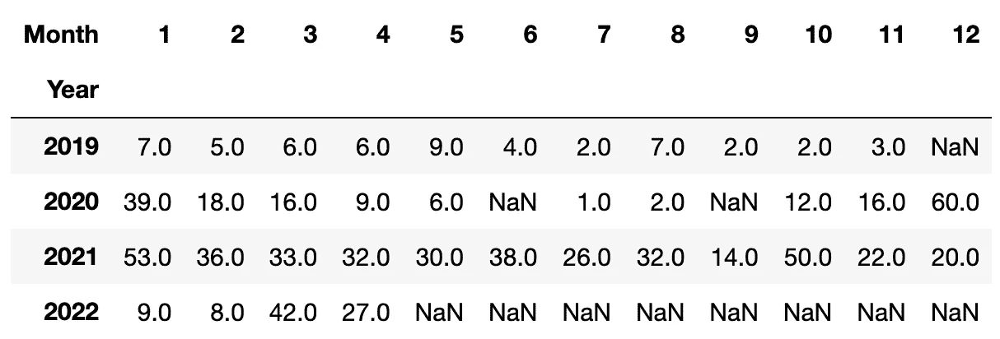
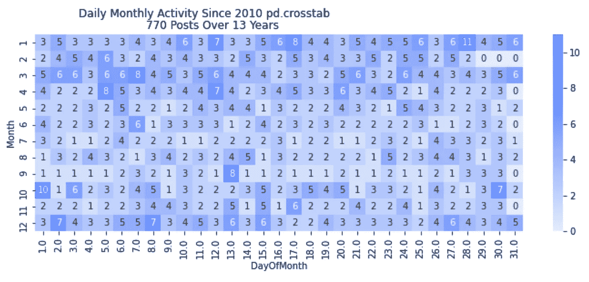
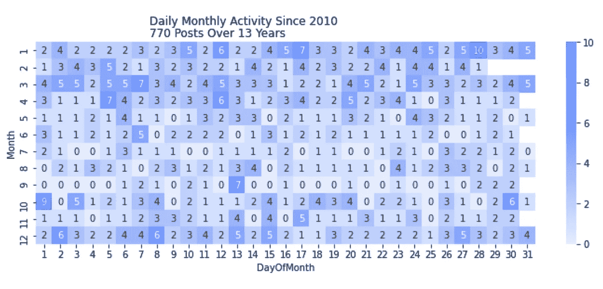

# 交叉表或数据透视表(在 Pandas 中)决定何时使用哪个

> 原文：<https://towardsdatascience.com/crosstab-or-pivot-table-in-pandas-deciding-when-to-use-which-a8ee3a9adfd0>

## 交叉制表和数据透视表之间的选择可能会令人困惑

# 概观

熊猫的许多特征可以产生类似的结果。对于初学者和有经验的用户来说，这种明显的模糊性可能会令人困惑和沮丧。本文对`pd.crosstab`和`pd.pivot_table`进行了比较，以帮助您了解两者的不同表现。

在这个演示中，我将引用一个个人数据源:我在 LinkedIn 上的发帖活动。这篇相关文章展示了如何自己查找和访问这些数据。

[](/linkedin-the-best-example-data-source-you-never-knew-737d624f24b7) [## LinkedIn:你从来不知道的最好的示例数据源

### 使用本指南了解和浏览 LinkedIn 允许您从个人资料中下载的数据

towardsdatascience.com](/linkedin-the-best-example-data-source-you-never-knew-737d624f24b7) 

# 数据

如果您是来寻求热图建议的:请浏览文章末尾的代码摘录，它可以生成如下所示的最佳热图。

以下是我的`shares.csv`文件[中的前五条记录，你可以从 LinkedIn](https://www.linkedin.com/psettings/member-data) 下载。


图片鸣谢:作者资料节选。显示了我在 LinkedIn 上的前五篇文章，在文章中有进一步的描述。

我在 2010 年(或者更早)开始了在 LinkedIn 上的生活。我的第一篇文章是“工作时吹口哨”。让它发生！”我不知道我在想什么。另外，显然我对 Audible.com 有着长久的兴趣。

根据这些信息，我将准备一个新的数据框，让我按年、月、日、周和小时来统计帖子。

```
# Prepare An Empty Year Of Data To Avoid Index Errors
next_year = int(str(date.today())[:4]) + 1
next_year = pd.date_range(start=f'1/1/{next_year}', 
                          end=f'12/31/{next_year}')
next_year = pd.DataFrame({'Count':[0] * len(next_year)}, 
                         index=next_year)# Extract The Columns Of Interest From Shares DataFrame
shares_viz = pd.DataFrame(shares.index)
shares_viz['Count'] = 1
shares_viz = shares_viz.set_index('Date')# Concatenate Shares With The Empty Year
shares_viz = pd.concat([shares_viz, next_year])shares_viz['Year'] = pd.DatetimeIndex(shares_viz.index).year
shares_viz['Month'] = pd.DatetimeIndex(shares_viz.index).month
shares_viz['DOfMonth'] = pd.DatetimeIndex(shares_viz.index).day
shares_viz['DOfWeek'] = pd.DatetimeIndex(shares_viz.index).dayofweek
svshares_viz['HourOfDay'] = pd.DatetimeIndex(shares_viz.index).hour
```

完成后，新数据将类似于:


图片鸣谢:作者资料节选。显示我的前五条记录，在文章中有进一步的描述。

# 熊猫杂交列表

根据文档`pd.crosstab()`将“计算两个(或更多)因素的简单交叉列表”以上述数据为例，我们可以使用`pd.crosstab(shares_viz['Year'], shares_viz['Month'])`快速总结历年来每月的发布模式:


图片鸣谢:作者资料节选。显示文章中描述的交叉列表。

要解释上面的(摘录)输出，请查看标记为 2020 的行。2020 年 1 月，我在 LinkedIn 上发了 39 次帖子。然而在 2020 年 6 月的晚些时候，我根本没有发帖。

# 熊猫旋转餐桌

数据透视表产生类似的结果，但不完全相同。`pd.pivot_table()`的文档解释说它将“创建一个电子表格风格的数据透视表作为数据框架”使用`pd.pivot_table(shares_viz, values='Count', index='Year', columns='Month' aggfunc='sum')`,我们看到以下版本:



图片鸣谢:作者资料节选。显示文章中描述的数据透视表。

结果*与*相似。例如，在 2020 年，我们再次看到 2020 年 1 月有 39 个帖子，2020 年 6 月没有。

您还可以在两个表格中看到，2022 年 5 月或 5 月之后没有帖子，本文的数据贯穿于 2022 年 4 月。

# 差异

注意`pd.crosstab()`如何返回没有计数的`0`，而`pd.pivot_table()`如何返回没有计数的`NaN`。

一些调整可以使输出更加匹配。例如，通过添加`fillna(0)`对`pd.pivot_table()`的简单修改将会用`0`替换那些`NaN`值。

# 为什么这很重要

这在很多情况下都很重要。例如，考虑数据可视化。`pd.crosstab()`和`pd.pivot_table()`的一个常见用例是将输出传递给`sns.heatmap()`。

一个常见的热图用例是将月份放在行中，将月份中的日期放在列中。这样的热图概括了一年中的日常活动。在下图中，每个单元格(或方块)计算该行当月相应日期(列)的帖子数。

## 交叉列表热图



作者的形象化。显示文章中描述的热图。

在上面的许多问题中，这里是其中的一个:注意 2 月 29 日、30 日和 31 日有零，4 月、6 月、9 月和 11 月 31 日也有零。那些日子是不存在的。难道我们不应该把它们渲染成某种形式的空的吗？

## 数据透视表热图



作者的形象化。显示文章中描述的热图。

首先注意不存在的日子与此输出有何不同。在这里，数据透视表输出似乎以一种更有助于数据可视化的方式执行。

数据透视表优于交叉制表还有另一个重要原因(在这种特定情况下)。为了避免数据可视化和分析过程中的索引错误，上面的代码添加了一个“空”年份。上图交叉列表中，空的一年错误地将“计数”增加了一。

# 结论

在数据分析中，通常有许多方法来完成相同的任务。Pandas 是众多工具中的一个，它提供了多种方法和技术，可以产生相似但不完全相同的结果。

本文展示了`pd.crosstab()`和`pd.pivot_table()`如何执行相似的功能——有时会产生相似的输出。输出结果可能非常相似，如果不仔细检查，分析师可能会无意中误报结果。

在上面给出的用例中，`pd.pivot_table()`是产生期望结果的最好和最快的选项。`pd.crosstab()`也是一种选择吗？是的，`pd.crosstab()`也是一个选择——但这需要额外的工作来确保输出完全符合预期。

这个故事的寓意是:一遍又一遍地检查你的代码和结果。

# 感谢阅读

你准备好了解更多关于数据科学职业的信息了吗？我进行一对一的职业辅导，并有一份每周电子邮件列表，帮助专业求职者获取数据。联系我了解更多信息。

感谢阅读。把你的想法和主意发给我。你可以写信只是为了说声嗨。如果你真的需要告诉我是怎么错的，我期待着尽快和你聊天。推特:[@ adamrossnelson](https://twitter.com/adamrossnelson)LinkedIn:[亚当罗斯尼尔森](https://www.linkedin.com/in/arnelson/)。

# 热图代码

```
import pandas as pd
import seaborn as sns
import matplotlib.pyplot as plt
from datetime import dateshares = pd.read_csv('shares.csv').set_index(['Date']).sort_index()# Prepare An Empty Year Of Data To Avoid Index Errors
next_year = int(str(date.today())[:4]) + 1
next_year = pd.date_range(start=f'1/1/{next_year}', 
                          end=f'12/31/{next_year}')
next_year = pd.DataFrame({'Count':[0] * len(next_year)}, 
                         index=next_year)# Extract The Columns Of Interest From Shares DataFrame
shares_viz = pd.DataFrame(shares.index)
shares_viz['Count'] = 1
shares_viz = shares_viz.set_index('Date')# Concatenate Shares With The Empty Year
shares_viz = pd.concat([shares_viz, next_year])shares_viz['Year'] = pd.DatetimeIndex(shares_viz.index).year
shares_viz['Month'] = pd.DatetimeIndex(shares_viz.index).month
shares_viz['DOfMonth'] = pd.DatetimeIndex(shares_viz.index).day
shares_viz['DOfWeek'] = pd.DatetimeIndex(shares_viz.index).dayofweek
shares_viz['HourOfDay'] = pd.DatetimeIndex(shares_viz.index).hour# Month & Day Posting Patterns
plt.figure(figsize = (12,4))
sns.heatmap(pd.pivot_table(shares_viz, 
                           values='Count', 
                           index='Month', 
                           columns='DayOfMonth',
                           aggfunc='sum'),
            cmap=my_blues,
            annot=True)
plt.suptitle(f'Daily Monthly Activity Since {shares_viz["Year"].min()}', 
             horizontalalignment='right')
plt.title(f'{total_posts} Posts Over {shares_viz["Year"].max() - shares_viz["Year"].min()} Years',
          horizontalalignment='right')
```