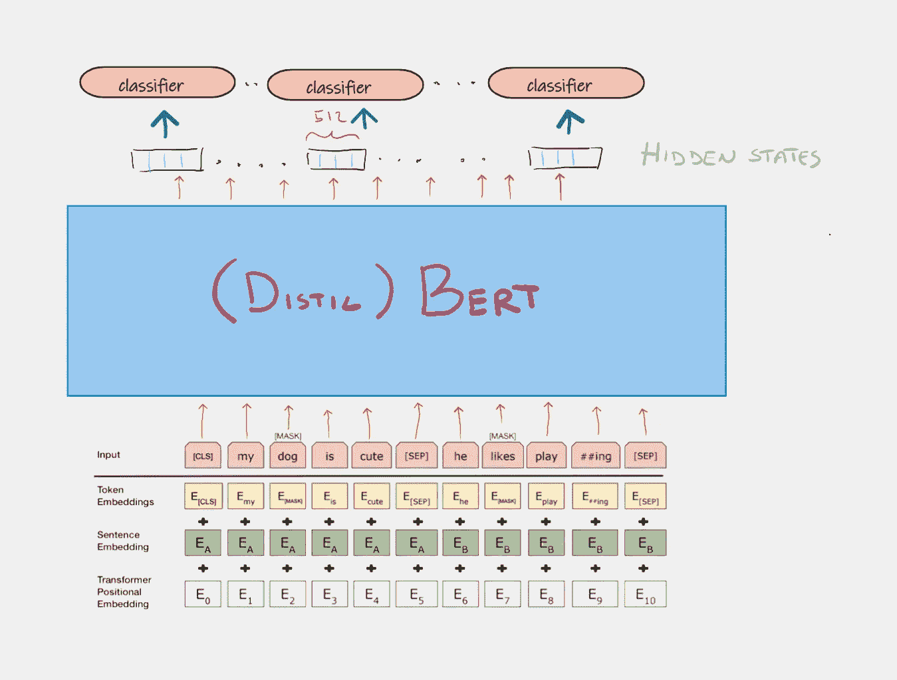
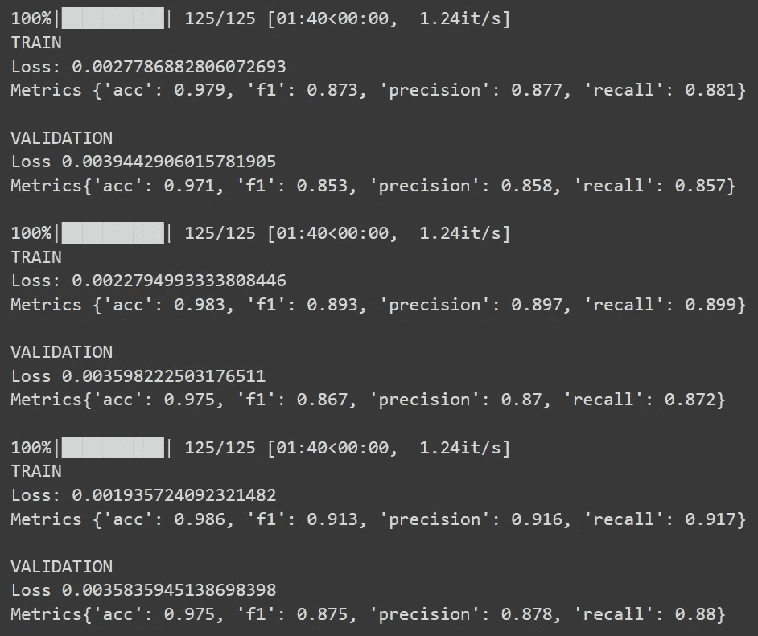

# 用 BERT 进行自定义命名实体识别

> 原文：<https://towardsdatascience.com/custom-named-entity-recognition-with-bert-cf1fd4510804>

[亚历山德拉](https://unsplash.com/@alex_tsl?utm_source=medium&utm_medium=referral)在 [Unsplash](https://unsplash.com?utm_source=medium&utm_medium=referral) 上的照片

## 如何使用 PyTorch 和拥抱脸对文本中的命名实体进行分类

## 命名实体识别(NER)

> 是[信息提取](https://en.wikipedia.org/wiki/Information_extraction)的一个子任务，它试图定位[非结构化文本](https://en.wikipedia.org/wiki/Unstructured_data)中提到的[命名实体](https://en.wikipedia.org/wiki/Named_entity)并将其分类成预定义的类别，如人名、组织、位置、[医疗代码](https://en.wikipedia.org/wiki/Medical_classification)、时间表达式、数量、货币值、百分比等。

作者图片

## 背景:

*在本文中，我们将使用一些我在之前的* [*文章中介绍过的概念。*](https://medium.com/@marcellopoliti/feature-extraction-with-bert-for-text-classification-533dde44dc2f)

BERT 是一种基于 Transformer 编码器的语言模型。如果你对《变形金刚》不熟悉，我推荐你阅读[这篇惊人的文章](https://jalammar.github.io/illustrated-transformer/)。

  

**伯特一言以蔽之**:

*   它将一个或多个句子的嵌入标记作为输入。
*   第一个令牌总是一个叫做**【CLS】**的特殊令牌。
*   句子之间由另一个叫做**【SEP】**的特殊记号分隔。
*   对于每个令牌，BERT 输出一个称为**隐藏状态**的嵌入。
*   伯特接受了**掩蔽语言模型**和**下一句预测**任务的训练。

在**屏蔽语言模型(MLM)** 中，一个输入单词(或标记)被屏蔽，伯特必须试图找出被屏蔽的单词是什么。对于**下一个句子预测(NSP)** 任务，伯特的输入中给出了两个句子，他必须弄清楚第二个句子是否在语义上跟随第一个句子。

你想想看，解决命名实体识别任务意味着**用标签(人，位置，..).因此，完成这项任务最直观的方式是**获取每个令牌的相应隐藏状态，并通过一个分类层**将其输入。最终的分类器共享权重，因此实际上我们只有一个分类器，但对于演示目的，我认为更容易将它想象成有更多的分类器。**

作者图片

从上面的图片中你可以看到我们将使用一个叫做**蒸馏伯特**的伯特的轻量级版本。这个经过提炼的模型比原来的小了 40%,但是在各种 NLP 任务上仍然保持了大约 97%的性能。
你可以注意到的另一件事是，BERT 的输入不是原始单词而是令牌。BERT 已经关联了一个预处理文本的标记器，以便它对模型有吸引力。分词器通常将单词拆分成子词，此外还会添加特殊的记号:**【CLS】**表示句子的开始，**【SEP】**分隔多个句子，以及**【PAD】**使每个句子具有相同数量的记号。

此外，每个标记嵌入与一个嵌入的**句子相加，嵌入**的句子是一个向量，该向量以某种方式添加了**信息，即标记是指作为输入给 BERT 的第一个还是第二个句子**。
由于与递归神经网络不同，变压器模型中的计算是并行的，因此我们失去了时间维度，即辨别句子的第一个单词和第二个单词的能力等。
因此，每个标记还被加和到一个**位置嵌入中，该嵌入考虑了标记在序列中的位置**

如果你想了解更多关于 BERT 或他的**单词标记器**的信息，请查看以下资源:

        

# 我们来编码吧！

# 资料组

我们要用的数据集叫做[*CoNLL-2003*](https://www.kaggle.com/datasets/rajnathpatel/ner-data)*，你可以在 Kaggle 上找到(带开放许可证)。*

*直接从 Colab 下载 Kaggle 数据集(记得上传你的个人 Kaggle 密钥)。*

## *进口*

*进口*

## *分割数据集*

*让我们加载数据帧的前 N 行，并更改列名。然后将数据帧分成训练集、开发集和测试集。*

*分割数据*

# *自定义类别*

*我现在要定义这个项目需要的三个类。第一个类定义了我们的蒸馏模型。不需要在预训练的语言模型之上手动构建分类器，因为 HuggingFace 已经为我们提供了一个内置的模型，其中包含作为最后一层的分类器。这个型号叫做***DistilBertForTokenClassification***。*

## *蒸馏器类*

*init 方法将输入分类的维度，即我们可以预测的令牌数，并实例化预训练的模型。*

*向前计算简单地采用 ***输入 _ id***(令牌)和 ***注意 _ 屏蔽*** (告诉我们令牌是否是填充符的 0/1 数组)和在输出字典中返回:{loss，logits}*

*模型类*

## *NerDataset 类*

*第二类是模块 *nn 的扩展。数据集*，它使我们能够创建自定义数据集。*

*给定输入数据帧，该方法将对文本进行标记化，并将额外生成的标记与正确的标记进行匹配(如我们在[上一篇文章](https://gist.github.com/March-08/1bff63505282bdd0f108109e5344e499)中所述)。现在您可以索引数据集，它将返回一批文本和标签。*

*自定义数据集*

## *度量跟踪类*

*有时计算火车循环中的所有指标很烦人，这就是为什么这个类帮助我们做到这一点。您只需要实例化一个新对象，并在每次对批处理进行预测时调用 update 方法。*

# *自定义方法*

*   ***tags_2_labels** :获取标签列表和将标签映射到标签的字典的方法，并返回与原始标签关联的标签列表。*

*标签对标签*

*   ***tags_mapping** :取输入一个数据帧的 *tags* 列，返回: **(1)** 一个将标签映射到索引(标签)的字典 **(2)** 将索引映射到标签的字典 **(3)** 标签对应的标签*O***(4)***一组在训练数据中遇到的唯一标签，这些标签将定义分类器的维数。**

**标签映射**

*   ****match_tokens_labels** :从标记化的文本和原始标记(与单词而非标记相关联)中，它为每个单独的标记输出一个标记数组。它将一个标记与其原始单词的标签相关联。**

*   ****freeze_model** :冻结模型的最后几层，防止灾难性遗忘。**

*   ****列车 _ 环线**:通常的列车环线。**

# **主要的**

**现在让我们使用主作用域中的所有内容。**

**创建映射标记-标签**

**标记文本**

**火车模型**

**现在，您应该会得到与这些类似的结果**

****

**结果**

**恭喜您，您基于预先训练的语言模型构建了您的命名实体识别模型！**

# **最后的想法**

**在这篇实践文章中，我们看到了如何利用预训练模型的功能来创建一个简单的模型，从而在很短的时间内解决命名实体识别难题。请记住，当您根据新数据训练整个模型时，您可能会过多地更改原始 DistilBert 权重，从而降低模型的性能。为此，您可以决定冻结除最后一层(分类层)之外的所有层，并防止出现名为 [**精神错乱遗忘**](https://en.wikipedia.org/wiki/Catastrophic_interference) 的问题。在模型选择阶段，你可以通过冻结最后的 k 层来尝试不同的模型。**

# **结束了**

**马赛洛·波利蒂**

**[Linkedin](https://www.linkedin.com/in/marcello-politi/) ， [Twitter](https://twitter.com/_March08_) ， [CV](https://march-08.github.io/digital-cv/)**