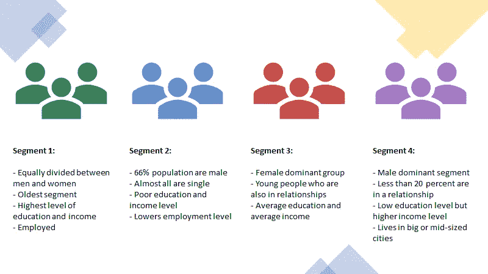

# 用 Python 进行客户细分(实现 STP 框架——第 2/5 部分)

> 原文：<https://towardsdatascience.com/customer-segmentation-with-python-implementing-stp-framework-part-2-689b81a7e86d>

## 使用 Python 实现 k-means 聚类的分步指南


艾萨克·史密斯在 [Unsplash](https://unsplash.com?utm_source=medium&utm_medium=referral) 上拍摄的照片

在我的[上一篇文章](https://medium.com/@analyticsoul/5c2d93066f82)中，我们开始了实施流行的 STP 营销框架的旅程，在这篇文章中，我们将通过使用最流行的无监督机器学习算法之一“k-means 聚类”来克服分层分割的局限性，从而继续我们的旅程。

整个笔记本和数据集都可以在 [Deepnote 笔记本](https://deepnote.com/workspace/asish-biswas-a599-b6cca607-3c12-4ae6-b54d-32861e7e9438/project/Analytic-School-8e6c85bd-e8c9-4387-ba40-0b94fb791066/%2Fnotebooks%2Fcustomer_segmentation.ipynb)中获得。

```
**Table of contents** ∘ [Introduction](#2740)
  ∘ [Implementing K-Means Clustering](#99d8)
  ∘ [Observations](#9494)
  ∘ [Visualize our customer segments](#2617)
  ∘ [Conclusion](#b70d)
```

## 介绍

分层聚类对于小型数据集非常有用，但是随着数据集大小的增长，计算需求也会快速增长。因此，层次聚类是不实际的，在行业中，平面聚类比层次聚类更受欢迎。在这篇文章中，我们将使用 k-means 聚类算法来划分我们的数据集。

有许多无监督聚类算法，但 k-means 是最容易理解的。K-means 聚类可以将未标记的数据集分割成预定数量的组。输入参数“k”代表我们希望在给定数据集中形成的聚类或组的数量。然而，我们必须小心选择“k”的值。如果“k”太小，那么质心就不会位于簇内。另一方面，如果我们选择‘k’太大，那么一些集群可能会过度分裂。

我推荐下面这篇文章来学习更多关于 k-means 聚类的知识:

</understanding-k-means-clustering-in-machine-learning-6a6e67336aa1>  

## 实现 K 均值聚类

k 均值算法的工作方式是:

1.  我们选择我们想要的集群数量“k”
2.  随机指定簇质心
3.  直到聚类停止变化，重复以下步骤:
    i .将每个观察值分配给质心最近的聚类
    ii。通过取每个聚类中点的平均向量来计算新的质心


[https://commons . wikimedia . org/wiki/File:K-means _ convergence . gif](https://commons.wikimedia.org/wiki/File:K-means_convergence.gif)

k-means 算法的局限性在于，您必须预先决定您期望创建多少个聚类。这需要一些领域知识。如果您没有领域知识，您可以应用“肘法”来确定“k”(聚类数)的值。
这种方法本质上是一种蛮力方法，在这种方法中，对于某个“k”值(例如 2-10)，计算每个聚类成员与其质心之间的平方距离之和，并根据平方距离绘制“k”。随着簇数量的增加，平均失真将会减少，这意味着簇质心将会向每个数据点移动。在图中，这将产生一个肘状结构，因此命名为“肘法”。我们将选择距离突然减小的“k”值。

正如我们在上面的图表中看到的，这条线僵硬地下降，直到我们到达第 4 类的数字，然后下降更加平稳。这意味着我们的肘在 4，这是我们的最佳集群数量。这也符合我们在[上一篇文章](https://medium.com/p/5c2d93066f82)中所做的层次聚类的输出。

现在，让我们对 4 个集群执行 k-means 聚类，并在我们的数据帧中包含段号。

## 观察

太好了，我们已经把客户分成了 4 组。现在让我们试着去了解每一组的特点。首先，让我们通过聚类来查看每个特征的平均值:

以下是我的一些观察:



作者图片

根据以上观察，我感觉第 1 和第 4 部分比第 2 和第 3 部分富裕，收入更高，职业更好。
最好给每个组分配合适的名称。

```
1: 'well-off'
2: 'fewer-opportunities'
3: 'standard'
4: 'career-focused'
```

让我们来看看每个细分市场的客户数量:

## 可视化我们的客户群

年龄与收入:

教育与收入:

## 结论

我们在“年龄与收入”散点图中观察到，高收入(富裕)的高年龄客户是分开的，但其他三个细分市场没有那么明显。

在第二个观察‘学历 vs 收入’小提琴情节中，我们看到没有学历的客户收入较低，毕业的客户收入较高。但是其他部分不是那么可分的。

根据这些观察，我们可以得出结论，k-means 在将数据分成簇方面做得不错。然而，结果并不令人满意。在下一篇文章中，我们将把 k-means 和主成分分析结合起来，看看我们如何能取得更好的结果。

和以前一样，全部代码和所有支持数据集都可以在 [Deepnote 笔记本](https://deepnote.com/workspace/asish-biswas-a599-b6cca607-3c12-4ae6-b54d-32861e7e9438/project/Analytic-School-8e6c85bd-e8c9-4387-ba40-0b94fb791066/%2Fnotebooks%2Fcustomer_segmentation.ipynb)中获得。

*感谢阅读！如果你喜欢这篇文章一定要* ***鼓掌(最多 50！)*** *和咱们* ***连上****[***LinkedIn***](https://www.linkedin.com/in/asish-biswas/)*和* ***关注我上媒*** *保持更新我的新文章**

**通过此* [*推荐链接*](https://analyticsoul.medium.com/membership) *加入 Medium，免费支持我。**

*<https://analyticsoul.medium.com/membership> *