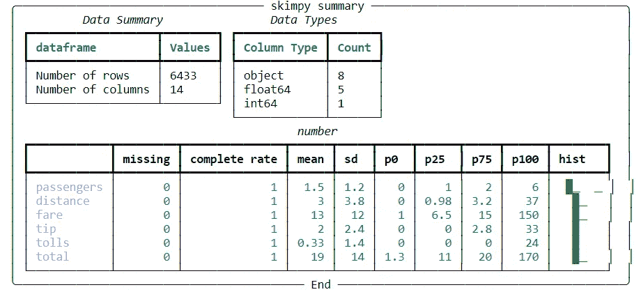
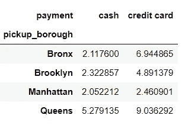
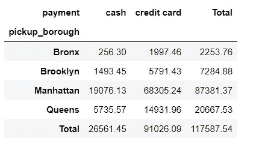
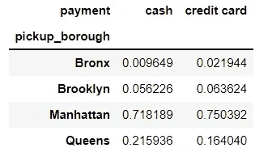

# 使用熊猫交叉表自定义您的数据框

> 原文：<https://towardsdatascience.com/customize-your-data-frame-with-pandas-crosstab-843b4ca8fb5b>

# 使用熊猫交叉表自定义您的数据框

## 只需用交叉表透视您的表数据


罗伯特·基恩在 [Unsplash](https://unsplash.com?utm_source=medium&utm_medium=referral) 上的照片

# 介绍

交叉表函数是帮助您在 Pandas 中重塑数据的众多方法之一。乍一看，它的用途似乎与 pivot 类似，您可以使用 Pandas Crosstab 执行许多与 Pandas Pivot Table 相同的操作。然而，有一些特殊的区别:

*   交叉表支持您规范化生成的数据框并返回百分比值。
*   函数的输入不一定是数据帧。对于它的行和列，它也可以接受类似数组的对象。

本文将为您提供一个获得大多数特性的简明摘要。

# 资料组

在本文中，我将使用一个名为“Taxis”的公开可用的`seaborn`数据集，可以通过以下方式轻松获得:

```
import seaborn as sns df = sns.load_dataset('taxis')
df.head()
```

以下是数据集的一瞥:


图 1:出租车数据集——作者提供的图片



图 2:数据信息—作者图片

现在，让我们开始看看我们有什么。

# 句法

我们可以把一些基本参数的细节解释如下。更多详细信息见 [***本文档***](https://pandas.pydata.org/docs/reference/api/pandas.crosstab.html) :

*   **index: V** 行中作为分组依据的值。
*   **列:**列中作为分组依据的值。
*   **值:**要聚合的数据
*   **aggfunc:** 要使用的聚合函数
*   **边距:**获取行或列的小计
*   **规格化:**将所有值除以值的总和

下面的例子将帮助你更好地理解这个概念。

# 分组

可以看出，该数据集包含关于取货地点和付款方式的信息。我想看看每种支付方式在每个地方使用了多少次。使用 Crosstab 可以简单地构建一个频率矩阵表，以不同地方每种支付方式的总计数作为值。

我将 ***取货地点(区)*** 传递给`index`参数，并将 ***付款方式*** 设置为`columns.`

结果显示为多索引交叉表:


图 3:不同地点付款方式的频率表—按作者分类的图片

# 使用 aggfunc

如果我想计算取货地点在皇后区和布朗克斯区的现金用户的平均距离，那么对备选聚合函数应用`aggfunc`。在这里，`aggfunc = "mean”`将被使用。



图 4:平均距离

因此，很容易观察到，顾客使用现金从皇后区旅行的平均距离约为 5.3 英里，这是从布朗克斯区(2.1 英里)开始的距离的两倍多。

# 小计

交叉表的一个便利特性是为行和列添加小计。例如，我很好奇不同取货地点的人用现金和信用卡支付的总费用。`margins`和`margins_name`在这种情况下应用如下代码。



图 5:不同行政区每个类别的总和——按作者分类的图片

# 规范化交叉表

以图 5 中的结果为例。对于每一行和每一列，我想找出每个值相对于小计的百分比。要查找行百分比值，`normalize = "index"`。同时，`normalize = "columns"`将帮助您找到基于列总数的百分比值。设置`normalize = "all"`意味着值以整个数据框的百分比计算。

下图 6 描述了不同地点每种支付方式的百分比。



图 6:按列总数的标准化—按作者的图像

# 为什么交叉表

其实有些任务也可以用 ***unstack*** 和 ***pivot_ table 来解决。然而，有时候，我发现交叉表是最容易使用的方法，因为它的语法容易记忆，转换也很快，而其他两种方法可能需要一些步骤才能得到最终答案。***

也就是说，根据不同的情况，使用让你最舒服的工作方法。

# 参考

## 数据集

*Waskom，m .等人，2017 年。mwaskom/seaborn:v 0 . 8 . 1(2017 年 9 月)，芝诺多。可在:*[*https://doi.org/10.5281/zenodo.883859.*](https://doi.org/10.5281/zenodo.883859.)以 BSD-3 许可证发布。

## 其他人

 [## pandas.crosstab - pandas 1.4.0 文档

### 编辑描述

pandas.pydata.org](https://pandas.pydata.org/docs/reference/api/pandas.crosstab.html) [](https://datagy.io/pandas-crosstab/) [## 熊猫交叉表-完整指南(带示例)*数据

### Pandas 交叉表功能是 Pandas 允许您定制数据的众多方式之一。从表面上看，它…

datagy.io](https://datagy.io/pandas-crosstab/)