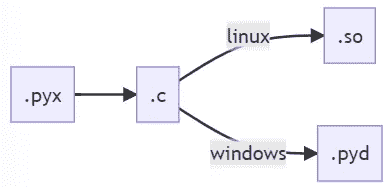
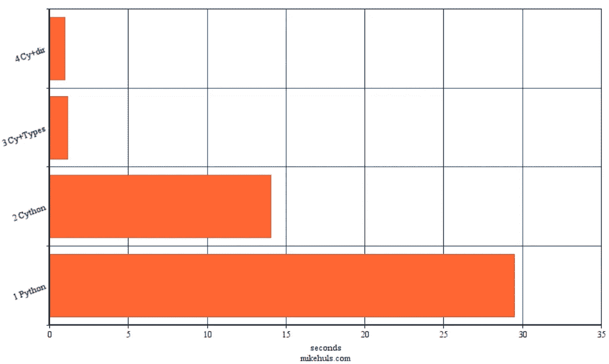

# 面向绝对初学者的 Cython:通过简单的两步将代码速度提高 30 倍

> 原文：<https://towardsdatascience.com/cython-for-absolute-beginners-30x-faster-code-in-two-simple-steps-bbb6c10d06ad>

## 为速度惊人的应用程序轻松编译 Python 代码


让我们加速我们的代码(图片由 [Abed Ismail](https://unsplash.com/@abedismail) 在 [Unsplash](https://unsplash.com/photos/pBUMdQ3Q_C8) 上提供)

Python 非常容易使用；清晰的语法、解释器和鸭式输入让你可以快速开发。但也有一些缺点:如果你不必遵守严格的语法，那么 Python 必须做一些额外的工作来让你的代码运行，导致一些函数执行非常慢，因为它必须一次又一次地做所有这些检查。

> 将 Python 开发的便捷性和速度与 C 语言的速度结合起来:两全其美

在本文中，我们将从一个普通的 Python 项目中提取一个“慢”函数，并使其速度提高 30 倍。我们通过使用一个名为 Cython 的包来做到这一点，该包会将我们的 Python 代码转换为一段经过编译的超高速 C 代码，我们可以再次直接将其导入到我们的项目中。

一个名为 **CythonBuilder** 的包**会在仅仅两步**中为我们**自动生成 Python 代码**。使用 CythonBuilder，我们将 Cythonize 下面定义的示例项目中的一个函数。我们来编码吧！

# 但是首先..

对于那些不熟悉 Cython 和 CythonBuilder 的人，我们将回答一些探索性的问题。然后我们将定义我们的示例项目。我们将使用命令行，如果您不熟悉，请仔细阅读:

[](/terminals-consoles-command-line-for-absolute-beginners-de7853c7f5e8) [## 面向绝对初学者的终端/控制台/命令行

### 命令行使用简介

towardsdatascience.com](/terminals-consoles-command-line-for-absolute-beginners-de7853c7f5e8) 

## 什么是 Cython /为什么使用 Cython？

Cython 将 Python 代码转换成包含 CPU 指令的文件。Python 解释器不再需要对这个文件进行任何检查；它可以运行它。这导致了性能的显著提高。查看下面的文章，了解关于 Python 如何工作以及它与 C 语言相比如何的更多详细信息:

[](/why-is-python-so-slow-and-how-to-speed-it-up-485b5a84154e) [## Python 为什么这么慢，如何加速

### 看看 Python 的瓶颈在哪里

towardsdatascience.com](/why-is-python-so-slow-and-how-to-speed-it-up-485b5a84154e) 

当你把一段代码变成 Cythonize 时，你就给你的代码添加了额外的信息；定义类型，例如，然后编译代码，这样 Python 就不必执行额外的检查。同样，查看上面的文章可以获得更深入的分析。

## Cython 是如何工作的

就像你在一个`.py`文件中写 Python 代码一样，你在一个`.pyx` 文件中写 Cython 代码。然后，Cython 会将这些文件转换为. so 文件或. pyd 文件(取决于您的操作系统)。这些文件可以再次直接导入到 python 项目中:



Cythonizing 一个 pyx 文件(作者图片)

## 所有代码都可以通过编译来优化吗？

并不是所有的代码都是编译好的。例如，在 C 包中等待 API 的响应并不会更快。简而言之:我们专注于需要大量计算的 CPU 密集型任务。在下面的文章中阅读更多，以获得更清晰的区别。

[](/multi-tasking-in-python-speed-up-your-program-10x-by-executing-things-simultaneously-4b4fc7ee71e) [## Python 中的多任务处理:通过同时执行，将程序速度提高 10 倍

### 应用线程和进程加速代码的分步指南

towardsdatascience.com](/multi-tasking-in-python-speed-up-your-program-10x-by-executing-things-simultaneously-4b4fc7ee71e) 

## CythonBuilder —自动化 Cythonizing

你是如何将你的`.pyx`文件有效化的？这个过程相当复杂；您必须创建一个`setup.py`，定义所有的包，然后运行一些命令(参见下面的文章)。相反，我们将使用[**CythonBuilder**](https://pypi.org/project/cythonbuilder/)**:**一个**为我们自动化一切的包**:在一个命令中构建你的`.pyx`文件！

[](/getting-started-with-cython-how-to-perform-1-7-billion-calculations-per-second-in-python-b83374cfcf77) [## Cython 入门:如何在 Python 中每秒执行超过 17 亿次计算

### 结合 Python 的易用性和 C 的速度

towardsdatascience.com](/getting-started-with-cython-how-to-perform-1-7-billion-calculations-per-second-in-python-b83374cfcf77) 

你的代码经过了两步(图片由 [Sammy Wong](https://unsplash.com/@vr2ysl) 上的 [Unsplash](https://unsplash.com/photos/lFMIQ6AiiW8)

# 示例项目

我们的项目包含一个函数，出于某种原因，计算一些素数。这个函数需要大量的计算，我们可以优化。
首先安装带有`pip install cythonbuilder`的 cythonbuilder，然后定义常规的质数计算函数

## 准备-普通 Python 质数计算函数

这个函数非常简单:我们将传递一个数给这个函数，它返回 0 和目标数之间的质数:

这个函数是纯 Python 的。它可以再优化一点，但目标是有一个执行大量计算的函数。让我们来看看这个函数需要多长时间来找到 0 到 100.000 之间的素数:

```
PurePython: 29.4883812 seconds
```

## 第一步。—糖化

在这一部分，我们将介绍 Cython。我们将复制我们函数的代码，并将其保存到一个名为`cy_count_primes.pyx`的文件中(注意`.pyx`)。

接下来我们`cd projectfolder`并调用`cythonbuilder build`。这将在 projectfolder 中找到所有的 pyx 文件并编译它们。结果是 Windows 上的一个`.pyd`文件或 Linux 上的一个`.so`文件。这个文件是我们的 Python 函数的编译版本，我们可以将它直接导入到我们的项目中:

```
from someplace.cy_count_primes import count_primes
print(count_primes(100_000))
```

让我们看看它的表现如何:

```
PurePython: 29.4883812 seconds
CyPython  : 14.0540504 seconds (2.0982 faster than PurePython
```

已经快了两倍多！请注意，我们实际上没有对 Python 代码做任何更改。让我们优化代码。

*接口:
您会注意到，即使是您的 IDE 也可以检查导入的文件。即使文件被编译，它也知道哪些函数存在，哪些参数是必需的。这是可能的，因为 CythonBuilder 也构建。pyi 文件；这些接口文件为 ide 提供了关于 pyd 文件的信息。*

## 步骤 2 —添加类型

在这一部分中，我们将类型添加到`cy_count_primes.pyx`文件中，然后再次构建它:

正如你所看到的，我们用`cpdef`(c 和 p(ython)都可以访问)定义了我们的函数，告诉它返回一个`int`(在`count_primes`之前)，并且它期望一个`limit`参数是一个`int`。

接下来，在第 2、3 和 4 行，我们为循环中使用的一些变量定义了类型；没什么特别的。

现在我们可以再次`cythonbuilder build`并再次计时我们的函数:

```
PurePython: 29.4883812 seconds
CyPython  : 14.0540504 seconds (2.0982 faster than PurePython
Cy+Types  :  1.1600970 seconds (25.419 faster than PurePython
```

这是一个非常令人印象深刻的加速！
速度如此之快的原因不在本文的讨论范围之内，但这与 Python 在内存中存储变量的方式有关。与 C 相比，它的效率相当低，所以我们的 C 编译代码可以运行得更快。查看本文 深入探究 Python 和 C 之间的不同之处(以及为什么 C 要快得多)。

## 附加—编译选项

我们已经将代码执行速度提高了 25 倍，但我认为我们还可以再提高一点。我们将用编译器指令来做这件事。这些需要一点解释:

因为 Python 是一种解释语言，所以它必须在运行时执行大量检查，例如，如果你的程序被零除。在编译语言 C 中，这些检查发生在编译时；编译时会发现这些错误。好处是你的程序可以更有效地运行，因为它不需要在运行时执行这些检查。

使用编译器指令，我们可以禁用所有这些检查，但前提是我们知道我们不需要它们。在下面的例子中，我们用 4 个装饰器升级了我们之前的代码:

*   阻止对 ZeroDivisionError 的检查
*   阻止对 IndexErrors 的检查(当列表只包含 3 个项目时调用 myList[5])
*   阻止对 isNone 的检查
*   防止绕回；防止调用相对于末尾的列表(如 mylist[-5])所需的额外检查

让我们再次重新构建我们的代码(`cythonbuilder build`)，看看跳过所有这些检查能节省多少时间

```
PurePython: 29.4883812 seconds
CyPython  : 14.0540504 seconds (2.0982 faster than PurePython
Cy+Types  :  1.1600970 seconds (25.419 faster than PurePython
Cy+Options:  0.9562186 seconds (30.838 faster than PurePython
```

我们又缩短了 0.2 秒！



最终结果(越低越好)(图片由作者提供)

## 甚至更快？

通过利用我们的多核处理器，我们有可能进一步加速我们的代码。查看下面的文章，了解如何在 Python 程序中应用多处理和线程。另请查看[**这篇文章**向您展示了如何对 Cython 代码](https://mikehuls.medium.com/getting-started-with-cython-how-to-perform-1-7-billion-calculations-per-second-in-python-b83374cfcf77)进行多进程处理，并解释了 Cython 的注释文件:图形化概述了您的代码的哪些部分可以进一步优化。非常方便！

[](/advanced-multi-tasking-in-python-applying-and-benchmarking-threadpools-and-processpools-90452e0f7d40) [## Python 中的高级多任务处理:应用和基准测试线程池和进程池在 6…

### 安全轻松地对您的代码应用多任务处理

towardsdatascience.com](/advanced-multi-tasking-in-python-applying-and-benchmarking-threadpools-and-processpools-90452e0f7d40) 

# 结论

CythonBuilder 使得使用 Cython 加速我们的 Python 代码变得很容易。
正如我们所看到的，复制我们的 Python 代码并构建会使执行速度翻倍！最大的速度提升是通过增加类型；相对于普通 Python，速度提高了 25 倍。

我希望一切都像我希望的那样清楚，但如果不是这样，请让我知道我能做些什么来进一步澄清。同时，请查看我的关于各种编程相关主题的其他文章:

*   [Python 为什么这么慢，如何加速](https://mikehuls.medium.com/why-is-python-so-slow-and-how-to-speed-it-up-485b5a84154e)
*   [Git 绝对初学者:借助视频游戏理解 Git](https://mikehuls.medium.com/git-for-absolute-beginners-understanding-git-with-the-help-of-a-video-game-88826054459a)
*   [Docker:图像和容器的区别](https://mikehuls.medium.com/docker-for-absolute-beginners-the-difference-between-an-image-and-a-container-7e07d4c0c01d)
*   [Docker 对于绝对初学者——什么是 Docker 以及如何使用它(+示例)](https://mikehuls.medium.com/docker-for-absolute-beginners-what-is-docker-and-how-to-use-it-examples-3d3b11efd830)
*   [绝对初学者的虚拟环境——什么是虚拟环境，如何创建虚拟环境(+示例](https://mikehuls.medium.com/virtual-environments-for-absolute-beginners-what-is-it-and-how-to-create-one-examples-a48da8982d4b))
*   [创建并发布自己的 Python 包](https://mikehuls.medium.com/create-and-publish-your-own-python-package-ea45bee41cdc)
*   [创建你定制的私有 Python 包，你可以从你的 Git 库 PIP 安装这个包](https://mikehuls.medium.com/create-your-custom-python-package-that-you-can-pip-install-from-your-git-repository-f90465867893)
*   [用 FastAPI 用 5 行代码创建一个快速自动记录、可维护且易于使用的 Python API](https://mikehuls.medium.com/create-a-fast-auto-documented-maintainable-and-easy-to-use-python-api-in-5-lines-of-code-with-4e574c00f70e)
*   [通过简单的升级大大提高您的数据库插入速度](https://mikehuls.medium.com/dramatically-improve-your-database-inserts-with-a-simple-upgrade-6dfa672f1424)

编码快乐！

—迈克

*又及:喜欢我正在做的事吗？* [*跟我来！*](https://mikehuls.medium.com/membership)

[](https://mikehuls.medium.com/membership) [## 通过我的推荐链接加入媒体-迈克·赫斯

### 作为一个媒体会员，你的会员费的一部分会给你阅读的作家，你可以完全接触到每一个故事…

mikehuls.medium.com](https://mikehuls.medium.com/membership)