# D-Tale:你见过的最好的 Python 库之一

> 原文：<https://towardsdatascience.com/d-tale-one-of-the-best-python-libraries-you-have-ever-seen-c2deecdfd2b>

## 大蟒

## 以下是我对这个必备 Python 库的看法，以及为什么你应该试一试


照片由[安娜·施韦茨](https://www.pexels.com/@shvetsa?utm_content=attributionCopyText&utm_medium=referral&utm_source=pexels)从[派克斯](https://www.pexels.com/photo/crop-bearded-businessman-browsing-portable-laptop-indoors-5325051/?utm_content=attributionCopyText&utm_medium=referral&utm_source=pexels)拍摄

Python 库为数据科学家提供了广泛的功能。它们允许数据科学家处理各种数据集并执行复杂的操作。Python 库还使学习新概念变得更加容易，这对刚开始涉足该领域的学生来说至关重要。然而，学习 Python 可能会让人不知所措，在开始时，一些对其他用户来说可能很容易的任务可能需要一段时间来学习如何做和如何使用它。这就是 D-Tale 的用武之地。

即使是经验丰富的 Python 用户，有些任务也可能是重复的，会浪费您宝贵的时间。因此，D-Tale 可以帮助您优化探索性数据分析和数据清理等任务。节省时间，您可以专注于更重要的任务，如精炼代码和调整机器学习模型。但是什么是 D-Tale 呢？下面是来自 [PyPI](https://pypi.org/project/dtale/) 的解释:

> D-Tale 是 Flask 后端和 React 前端的结合，为您提供了一种查看和分析 Pandas 数据结构的简单方法。它与 ipython 笔记本和 python/ipython 终端无缝集成。目前这个工具支持像 DataFrame、Series、MultiIndex、DatetimeIndex & RangeIndex 这样的 Pandas 对象。

我想提醒读者，我不写任何形式的赞助内容。我将根据我的印象表达我个人对图书馆的看法。现在，让我们找点乐子吧！

## 装置

我们可以安装 D-Tale 很简单。只需在你的终端键入`pip install dtale`。我没有得到任何安装它的错误。现在，我们需要一个数据集来探索 D-Tale。今天，我将使用 COVID 数据集(Mathieu，e .、Ritchie，h .、Ortiz-Ospina，e .等人[新冠肺炎疫苗接种的全球数据库。Nat Hum Behav (2021)](https://doi.org/10.1038/s41562-021-01122-8) 。这是一个有趣的数据集，足够复杂来测试 D-Tale 的一些功能，也足够容易理解正在发生的事情。

现在，让我们开始吧。首先，让我们将熊猫和 D-Tale 导入我们的 Jupyter 笔记本。然后，我们需要导入数据集，将其分配给一个变量，并使用 D-Tale 调用该变量。

```
**# Importing libraries**
import dtale
import pandas as pd**# Assigning dataset to variable** df = pd.read_csv('covid-data.csv')dtale.show(df)
```

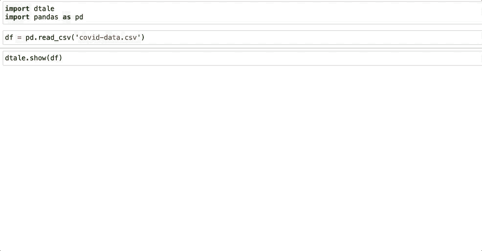

作者 GIF

耶！我们刚刚打开了 D-Tale GUI。与熊猫不同，我们可以与数据集和库进行交互，而无需键入代码。另一件很酷的事情是，D-Tale 在第一个屏幕上显示的信息比熊猫还多。


作者 GIF

首先，我们可以向下滚动到右侧查看更多数据。在熊猫身上，这不像 D-Tale 那么简单直观。然后，在左上角，您可以看到左上角的列数和行数，而无需键入任何代码。在顶部浏览，你会看到导航菜单。

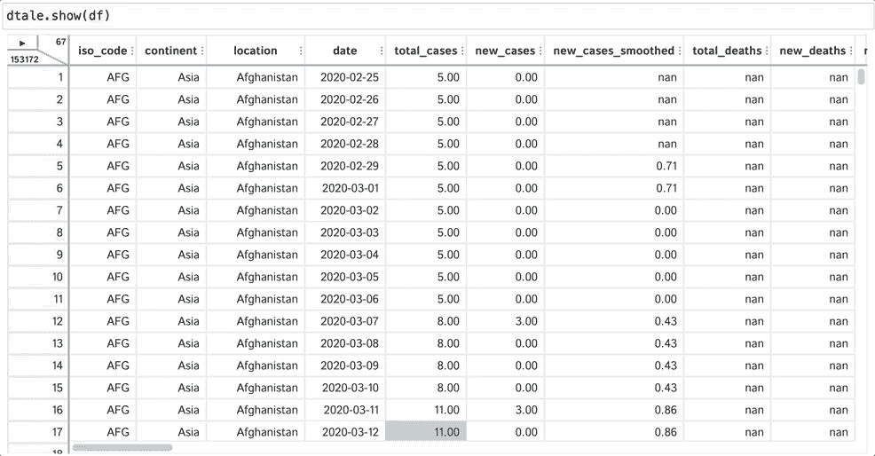

作者 GIF

现在我们已经熟悉了 D-Tale，我们将探索它的特性。关于 D-Tale 的另一点是，我们不需要在 Jupyter 笔记本上使用它。因此，出于演示目的，让我们在不同的选项卡中使用 D-Tale。不过，你想如何使用它取决于你自己。使用下面的代码。

```
dtale.show(df).open_browser()
```

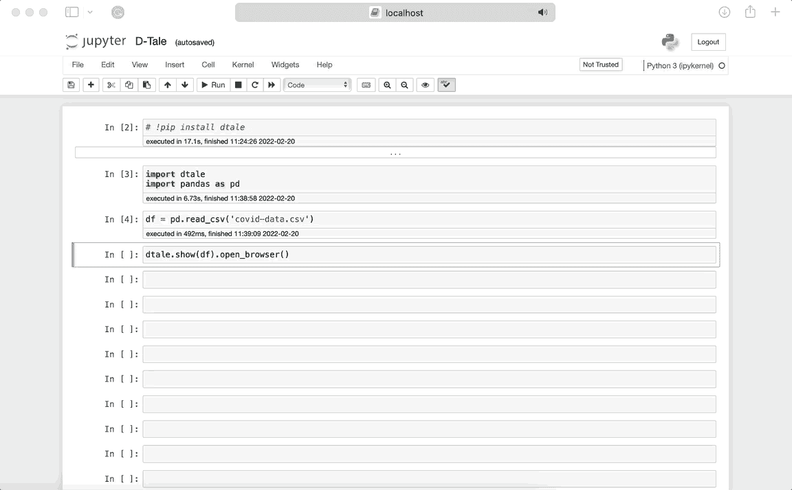

作者 GIF

# **数据准备**

## 一键更改数据类型

在 Pandas 上改变数据类型并不困难，即使对初学者来说也是如此，而且为了一两个特性而改变它们应该没有问题。但是，如果您需要更改 300 多个特性的数据类型，该怎么办呢？这在专业环境中并不少见，对于这样的任务，键入数百行代码并不是对我们时间的最佳利用。有了 D-Tale，我们只需点击几下鼠标就可以改变数据类型。

例如，在这个数据集中，我注意到日期列是一个字符串。我们不想那样。让我们把它改成日期时间。只需点击列名，并在列名的正下方点击`Type Conversion`，并选择是否要更改`inplace`或创建新列。选择数据类型，更改日期格式，然后单击应用。就是这样！


作者 GIF

有奖金。在应用更改之前，您可以看到将要使用的代码。如果你正在学习 Python，这是一个很棒的附加软件。还有更多。一旦数据类型是 DateTime，我们可以在单击列名时看到附加信息，比如偏斜度。很酷，对吧？

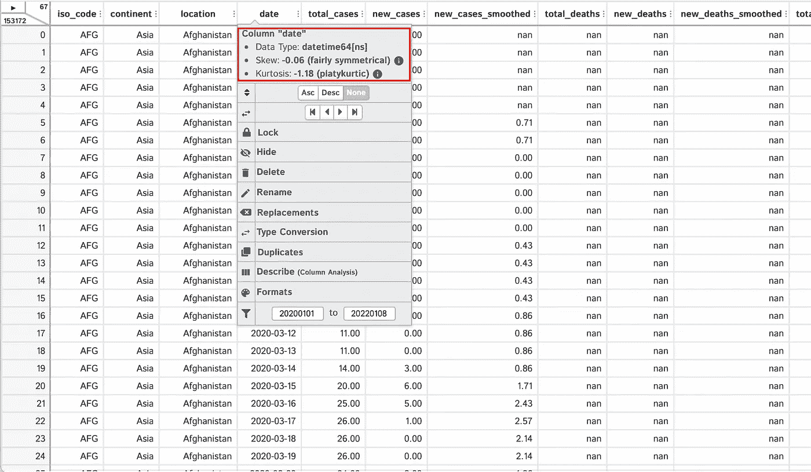

作者图片

## **创建一个不同格式的新列**

我们还可以创建一个不同格式的新列。出于演示目的，让我们将日期列转换为字符串。只需点击您想要转换的列名，然后点击`Type Conversion`，点击`New Column`，选择新的列名，并选择数据类型。搞定了。

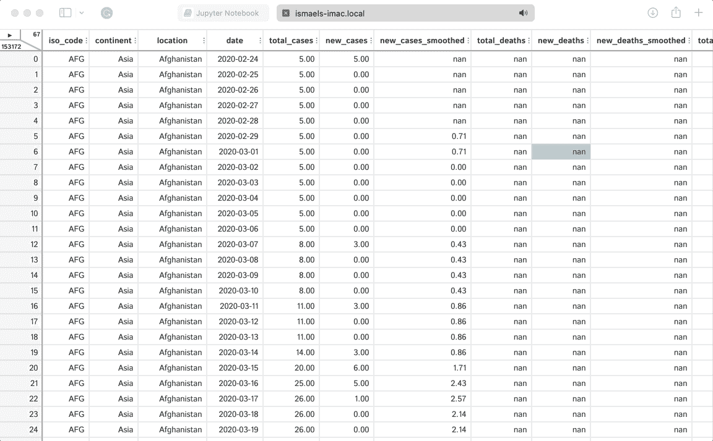

作者 GIF

## 删除列

删除列再简单不过了。选中要删除的栏目，点击`Delete`，在弹出的窗口中点击`Yes`，该栏目就没了。是的，输入删除列的代码也很简单，但没有这么简单。

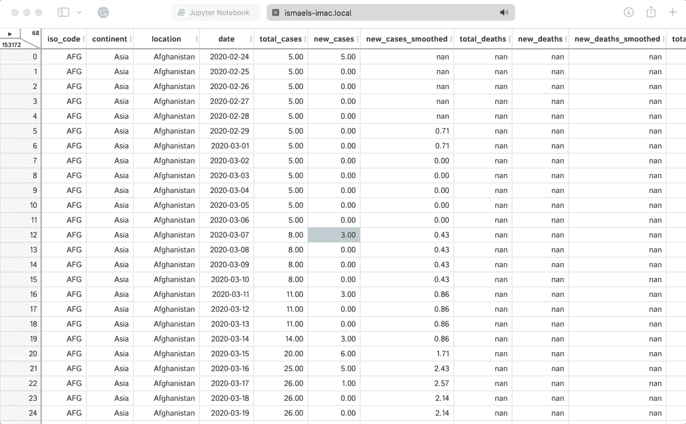

作者 GIF

## 更改列的名称

重命名列的过程:点击，重命名，保存。这么简单！只需点击列名，点击`Rename`，选择名称，并保存。结束了。如果您需要更改许多列的名称，这将非常方便。

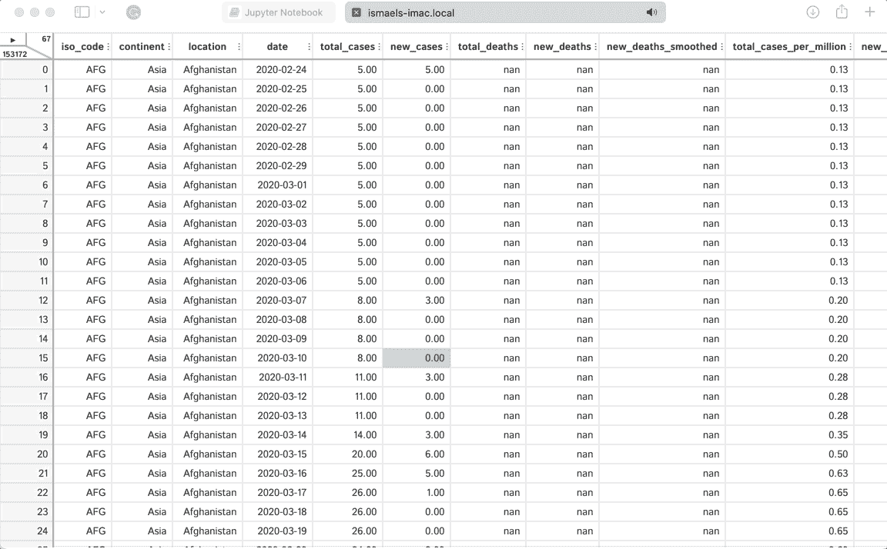

作者 GIF

# 数据转换

## 过滤数据

过滤数据非常容易。单击要过滤的列。在底部，你会看到过滤选项。您可以过滤任何数据类型。D-Tale 有过滤选项，如等于、大于/小于、不同于等。都在那了！

在下面的例子中，我过滤了各大洲，只显示了北美的数据。

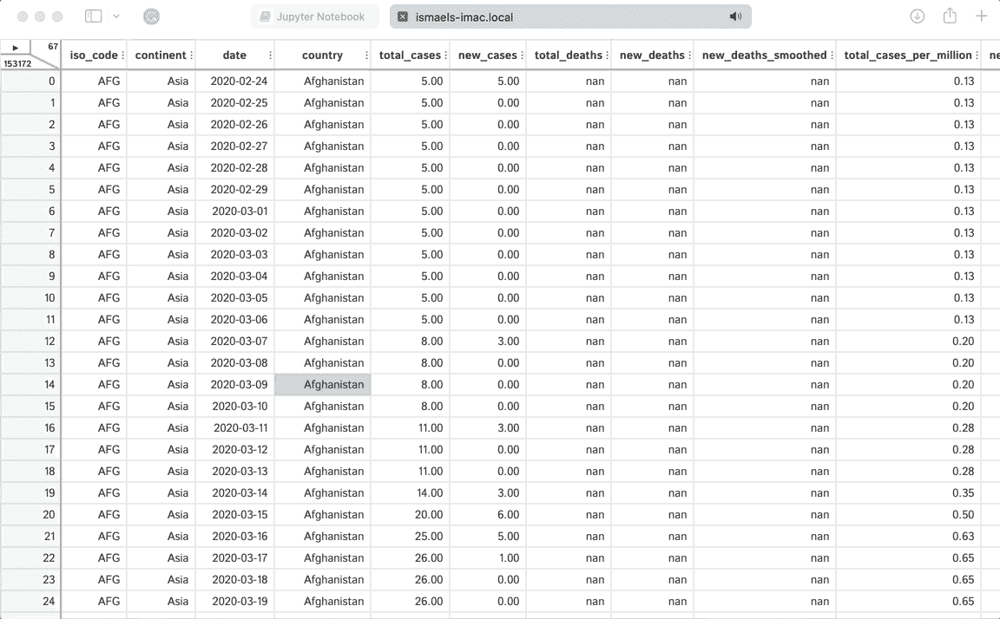

作者 GIF

## 合并数据

要合并两个数据框，单击左上角的图标，将会打开一个新的选项卡。您可以直接从用户界面上传数据集。选择数据集，你想如何连接它们，差不多就是这些了。如果您打算在另一个项目中使用它，您也可以在底部看到代码。


作者 GIF

## 分组依据

要分组，点击`Summarize Data`，选择你想要分组的列，函数(求和、计数、均值、中值等)，就完成了。您可以在同一个标签或不同的标签中打开它。

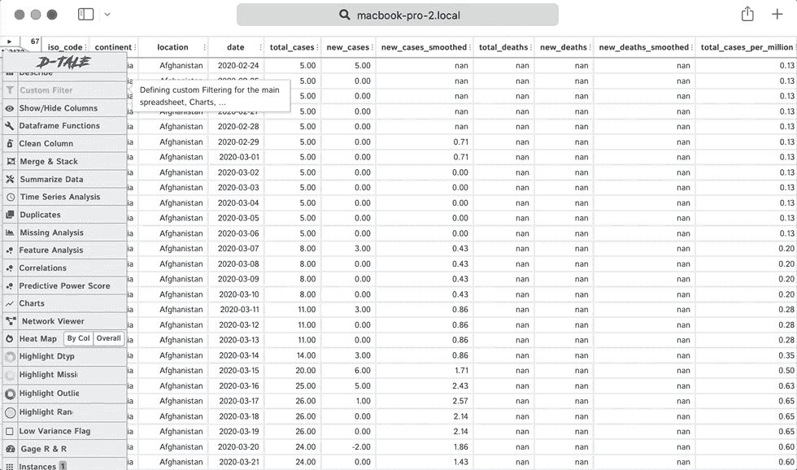

## 描述数据

需要一个功能的快速摘要？没问题。使用 D-Tale，您可以查看诸如值计数、缺失值、频率、统计汇总(如平均值、中值、百分位数、标准差、偏斜度、字数等)等信息。根据数据类型，它还会显示数据图，如直方图、时间序列、条形图等。

为此，只需点击栏目名称，然后点击`Describe (column analysis)`，你会看到很多很酷的信息。

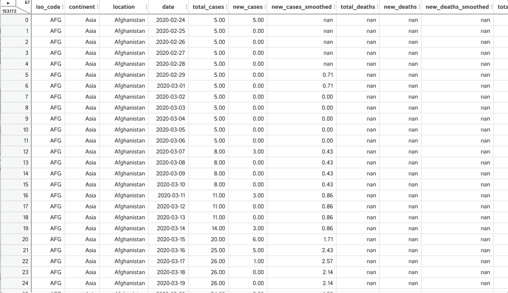

作者 GIF

如果您想快速浏览所有栏目，您可以单击右上角的符号，单击“summary”选项，然后您将能够通过单击逐个检查所有功能。

[需要另一张 GIF]


# 数据可视化

数据可视化是数据分析过程中最耗时的任务之一。对于初学者来说，让它们看起来很好可能是一场噩梦，但幸运的是，D-Tale 也可以在这方面提供帮助。您只需点击几下鼠标就可以创建可视化效果，最棒的是:您可以获得代码并了解正在发生的事情。

## 条形图

让我们开始创建一个条形图。要创建条形图，请单击右上方，转到图表，将会打开一个 GUI。在那里，您可以在十三个选项中选择一种类型的情节！从那里，选择 X 和 Y 变量，聚合类型，如果有的话，瞧，你就得到一个漂亮的图形。

在下面的示例中，我将洲放在 x 轴上，将按洲划分的 COVID 案例总数放在 y 轴上。

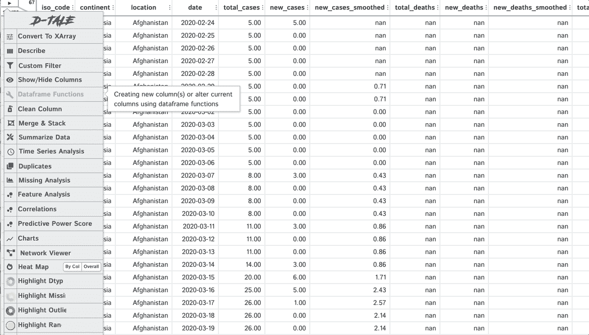

作者 GIF

如果你想将数据分组，写下你想分组的变量并做。在本例中，我将国家分组为洲组。


作者 GIF

## 绘图代码

正如我提到的，您可以很容易地获得代码来检查情节是如何创建的。这是学习甚至交付最终产品的好方法，因为图表很好看，可以用作最终版本。


作者 GIF

## 散点图

创建散点图和条形图一样简单。选择 x 轴和 y 轴，分组，如果你想，然后嘣。你得到了一个散点图。下面，我正在检查新病例数和接种新冠肺炎疫苗人数之间的关系。


作者 GIF

## 时间序列

D-Tale 将时间序列带到了另一个高度。只需一次点击，您就可以轻松地用它们创建时间序列图，并浏览不同的时间序列类型，如 Hodrick-Prescott 和 Bacter-King 过滤器。很酷吧。

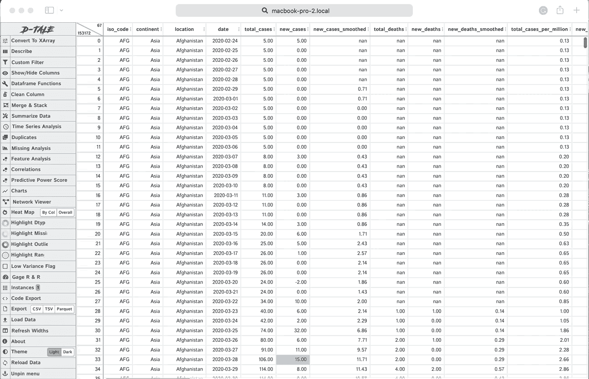

作者 GIF

## 描述数据集

我们已经讨论过这个主题，但我想提一下您可以使用摘要功能创建的一些令人兴奋的可视化效果，如直方图、探索类别和创建 QQ 图。

然而，最酷的部分是，您可以将选择的列与其他列进行交互，并创建即时图形。这是了解数据集的最佳方式，无需花费数小时键入代码来获得单击即可获得的结果。


作者 GIF

# 更多 D-Tale 功能

除了数据分析选项，D-Tale 还提供了一些附加设置，如选择语言和黑暗模式。

## 改变语言和黑暗模式

D-Tale 有一些更复杂的任务，可能会让非英语人士感到困惑，如果你的母语是中文或葡萄牙语，我有一个好消息，:D-Tale 除了支持英语外，还支持这两种语言来翻译他们的用户界面。

对于喜欢的人还支持黑暗模式。我不是黑暗模式的最大粉丝，因为我觉得它更难阅读，但如果你没有这个问题，你应该喜欢这个额外的功能。


## 突出显示列

D-Tale 允许我们根据几个选项突出显示数据。例如，您可以根据数据类型突出显示数据。我们还可以突出显示 NaN 值和异常值，以避免遗漏它们。您还可以基于参数(如大于或小于特定数字)突出显示数据。


作者 GIF

## 最后的想法

唷。这太多了。在这篇博客中，我们看到了 D-Tale 如何通过将繁琐的任务转化为直观的任务，使我们的生活变得更加轻松，即使对于那些经验丰富的专业人士来说也是如此。这个博客遗漏了许多很酷、更复杂的特性，所以我建议您尝试一下，探索一下，找到更多对您有用的特性。

我认为 D-Tale 适合所有人吗？不尽然，但是如果您是需要快速从数据集获得见解的专业人士，或者是不熟悉 Python 世界的学生，那么这是一个需要记住的很好的库。如果你是一个高级 Python 用户，你可以尝试一下，看看你能从它那里得到什么，这需要花一些时间来完成代码输入。如果你有，请在评论区告诉我。编码快乐！