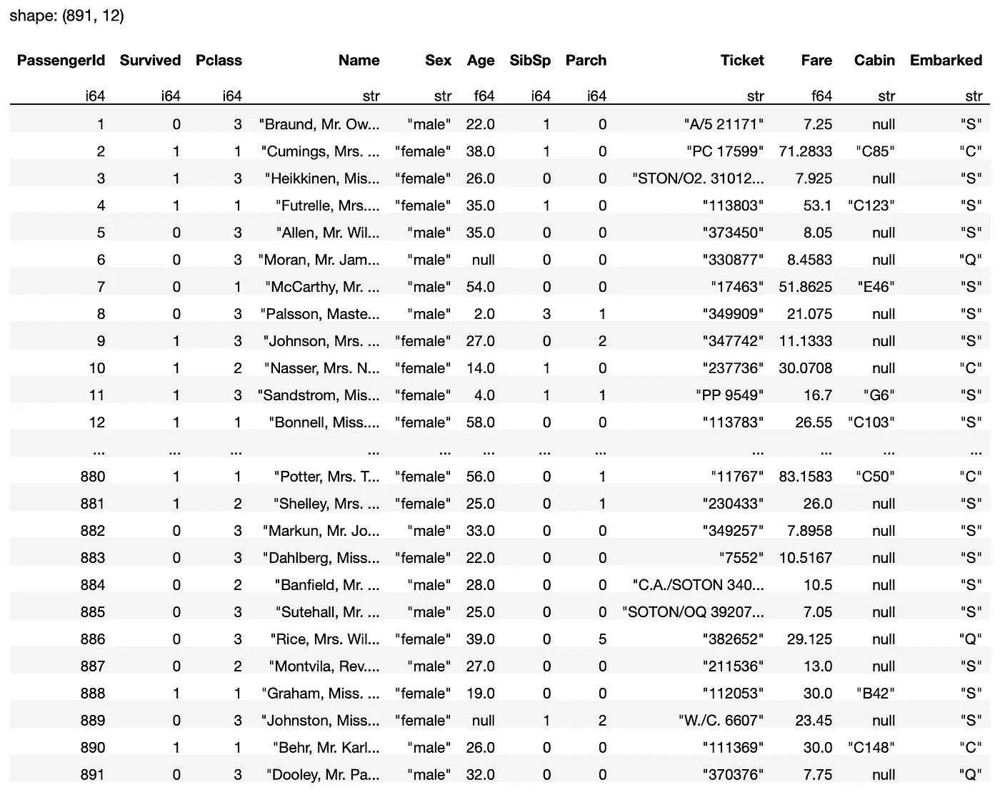
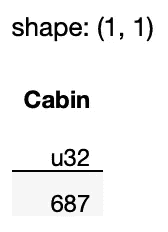
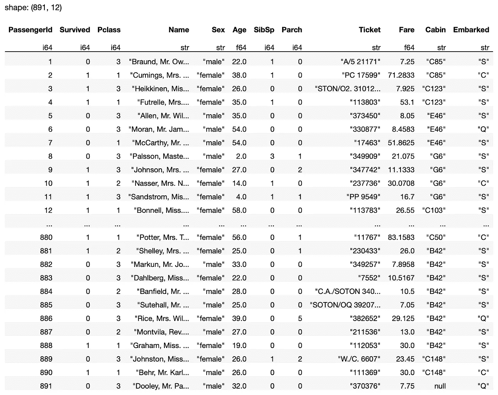
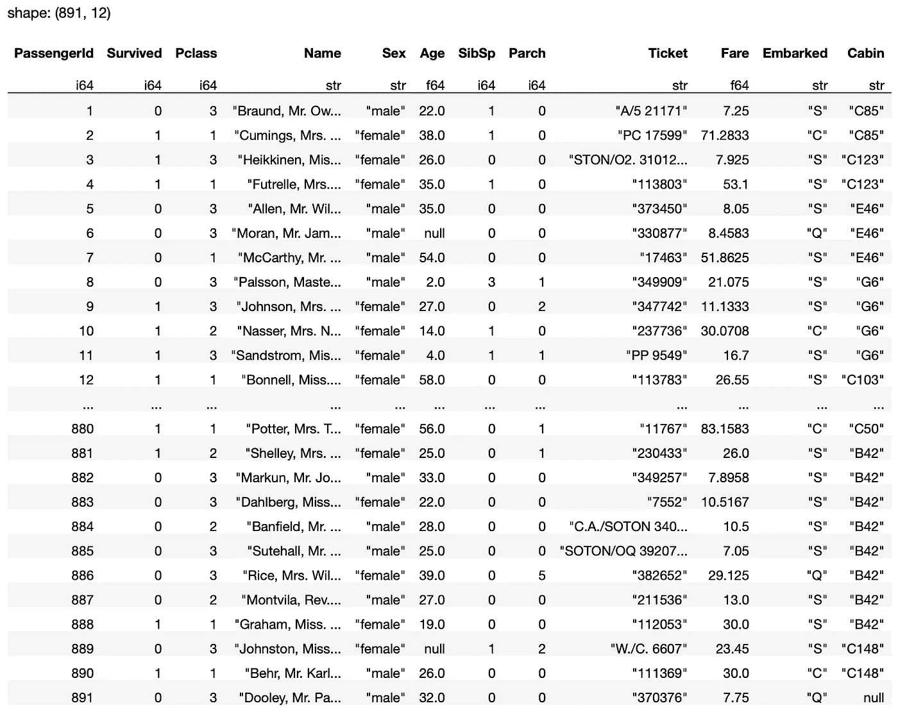
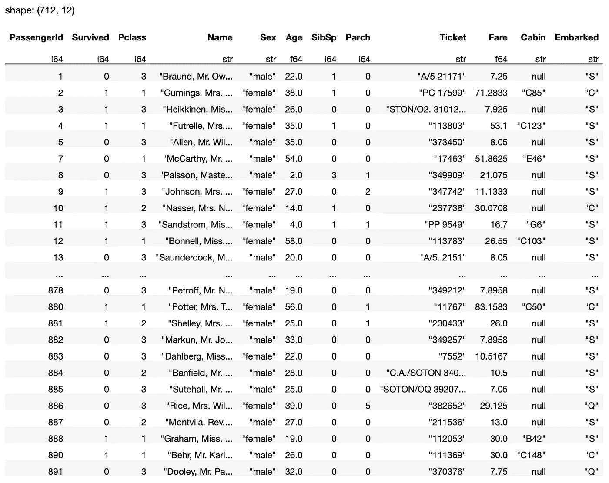
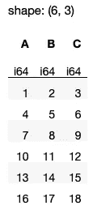
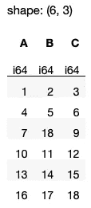
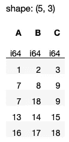
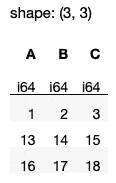

# Polars 中的数据清理

> 原文：<https://towardsdatascience.com/data-cleansing-in-polars-f9314ea04a8e>

## 了解如何在 Polars 数据框中执行数据清理


Hans-Jurgen Mager 在 [Unsplash](https://unsplash.com?utm_source=medium&utm_medium=referral) 上拍摄的照片

在本文中，我将继续探索 Polars DataFrame 库。这一次，我将关注数据科学家花费最多时间的事情— *数据清理*。数据清理是检测和更正数据集中损坏值的过程。在现实生活中，这个看似简单的过程需要花费大量时间，因为您遇到的大多数数据都可能包含缺失值、错误值或不相关的值。

# 加载数据帧

在这篇文章中，我将使用泰坦尼克号数据集。

> ***数据来源*** *:本文数据来源来自*[*https://www.kaggle.com/datasets/tedllh/titanic-train*](https://www.kaggle.com/datasets/tedllh/titanic-train)*。*
> 
> ***许可—*** *数据库内容许可(DbCL)v 1.0*[*https://opendatacommons.org/licenses/dbcl/1-0/*](https://opendatacommons.org/licenses/dbcl/1-0/)

首先，将 CSV 加载到 Polars 数据框中:

```
import polars as pl
q = (
    pl.scan_csv('titanic_train.csv')    
)
df = q.collect()
df
```

数据帧包含 891 行 12 列:



作者图片

> CSV 文件中所有缺失的值将作为`null` 加载到 Polars 数据框中。

# 寻找空值

要检查特定列中的空值，使用`select()`方法选择该列，然后调用`is_null()`方法:

```
df.select(
    pl.col('Cabin').is_null()  
)
```

`is_null()`方法将结果作为布尔值的数据帧返回:


作者图片

## 计算空值的数量

知道列中有多少行有空值比看到一个满是布尔值的数据帧更有用。因此，您可以使用`sum()`方法:

```
df.select(
    pl.col('Cabin').is_null()**.sum() ** 
)
```

从下面的结果可以看出，**舱**列有 687 个空值:



作者图片

> `sum()`与`count()`之间的差异—`sum()`方法只对那些为`true`的值求和；而`count()`方法对所有值求和，包括`false`。

如果您想知道*列中的任何*值是否包含 null，请使用`any()`方法:

```
df.select(
    pl.col('Cabin').is_null()**.any()   # returns true**
)
```

同样，要查看*列中的所有*值是否都为空，请使用`all()`方法:

```
df.select(
    pl.col('Cabin').is_null()**.all()  # returns false**
)
```

## 对数据帧中每一列的空值数量进行计数

通常，您希望快速浏览一下数据帧中的哪些列包含空值，而不是逐个检查每一列。因此，遍历列并打印结果会很有用。您可以通过调用`get_columns()`方法并遍历它来获取数据帧中的所有列:

```
for col in df.get_columns():
    print(f'{col.name} - {col.is_null().sum()}')
```

上面的代码片段打印出以下输出:

```
PassengerId - 0
Survived - 0
Pclass - 0
Name - 0
Sex - 0
**Age - 177**
SibSp - 0
Parch - 0
Ticket - 0
Fare - 0
**Cabin - 687**
**Embarked - 2**
```

您可以看到以下列包含空值:

*   **年龄**
*   **机舱**
*   **上船**

# 替换空值

一旦确定了哪些列包含空值，下一个逻辑步骤就是:

*   用其他值填充空值
*   删除包含空值的行

## 填充整个数据帧

您可以使用`fill_null()`方法填充整个数据帧中的空值:

```
df.**fill_null(strategy='backward')**
```

在上面的语句中，我使用了*向后填充*策略，其中所有的空值都用下一个非空值*填充:*



作者图片

> 请注意，最后一行的**舱室**列包含一个空值。这是因为它没有下一行来引用要填充的值。

您还可以使用*向前填充*策略，其中所有空值都用*之前的*非空值填充:

```
df.fill_null(strategy='**forward**')
```

上述语句的输出如下所示:


作者图片

> 现在您将意识到第一行的 Cabin 值是`null`,因为它没有前一行来引用要填充的值。

也可以用固定值填充空值，如 0:

```
df.fill_null(0)
```

上述语句的输出如下所示:


作者图片

## 填写特定的栏

根据列的数据类型，您通常会对不同的列采用不同的填充值。例如，您可以使用*向后填充*策略填充**舱**列:

```
df.select(
    pl.col('Cabin').**fill_null(fill_value='backward')**
)
```

> 注意，当您在表达式上调用`fill_null()`方法时，为策略设置的参数是`fill_value`而不是`strategy`。

注意，上面的语句返回的数据帧只包含**舱**列:


作者图片

如果要在数据帧中包含其他列，请添加以下粗体语句:

```
df.select(
    **[
        pl.exclude('Cabin'),      # select all columns except Cabin**
        pl.col('Cabin').fill_null(fill_value='backward')
 **]**
)
```

现在返回整个数据帧:



作者图片

您也可以用固定值替换特定列中的空值:

```
df.select(
    [
        pl.exclude('**Age**'),
 **       pl.col('Age').fill_null(fill_value=0)**
    ]
)
```

或者用该列的平均值替换它们:

```
df.select(
    [
        pl.exclude('**Age**'),
 **       pl.col('Age').fill_null(fill_value=pl.col('Age').mean())**
    ]
)
```

上述代码片段返回以下结果:


作者图片

如果您想用列中出现频率最高的值替换空值，该怎么办？例如，对于**登船**列，您希望用大多数乘客登船的港口替换空值。在这种情况下，您可以使用`mode()`方法:

```
df.select(
    [
        pl.exclude('Embarked'),
        pl.col('Embarked').fill_null(
            fill_value=**pl.col('Embarked').mode()**)
    ]
)
```

`mode()`方法返回一列中出现频率最高的值。

> 请注意，`mode()`不能在浮点列上工作。

## 删除行和列

有时，当数据帧中有空值时，删除行是有意义的，特别是当空值的行数相对于您拥有的总行数很小时。要删除整个数据帧中所有包含空值的行，请使用`drop_nulls()`方法:

```
df.drop_nulls()
```

注意，这样做之后，结果剩下 183 行:


作者图片

在我们的数据集中，这样做并不是一个好主意，因为 **Cabin** 列具有最多的空值。因此，您应该真正删除**舱**列，就像这样:

```
df.select(
 **pl.exclude('Cabin')**
)
```

您还可以使用`drop()`方法来删除一列或多列:

```
df.**drop**(['Cabin'])            # drop the Cabin column
df.**drop**(['Ticket','Fare'])    # drop the Ticket and Fare columns
```

注意，`drop()`方法并不修改原始数据帧——它只是返回删除了指定列的数据帧。如果你想修改原始数据帧，使用`drop_in_place()`方法:

```
df.**drop_in_place**('Ticket')
```

> 注意，`drop_in_place()`方法只能删除一列。它将删除的列作为 Polars 系列返回。

对于`drop_nulls()`方法，您还可以使用`subset`参数删除基于特定列的行:

```
df.drop_nulls(**subset**=['Age','Embarked'])
```

在这种情况下，只有在 **Age** 和**abowed**列中具有空值的行将被删除:



作者图片

您也可以在特定的列上直接调用`drop_nulls()`方法:

```
df.select(
 **pl.col(['Embarked']).drop_nulls()**
)
```

在这种情况下，结果将是一个数据帧，其中包含删除了空值的**装载的**列:


作者图片

# 删除重复值

我将在本文中讨论的最后一种数据清理技术是删除重复项。对于本例，我将手动创建一个 Polars 数据帧:

```
import polars as pldf = pl.DataFrame(
    {
        "A": [1,4,4,7,7,10,10,13,16],
        "B": [2,5,5,8,18,11,11,14,17],
        "C": [3,6,6,9,9,12,12,15,18]        
    }
)
df
```


作者图片

注意有一些重复的行，例如 4、5、6 以及 10、11、12。此外，有些行中 A 列和 C 列的值是重复的，例如 7，9。

## 使用 unique()方法

首先，让我们使用`unique()`方法删除重复项:

```
df.unique()
```

> 也可以用`distinct()`的方法。然而，在 Polars 0 . 13 . 13 版本中，它已经被弃用，因此不推荐使用它。


作者图片

从输出中可以观察到，如果您没有给`distinct()`方法提供任何参数，所有重复的行将被删除，只有一行将被保留。

您还可以使用`subset`参数删除基于特定列的重复项:

```
df.unique(**subset=['A','C']**, keep='first')
```



作者图片

在上面的结果中，观察到行 7，8，9 被保留，而下一行 7，18，9 被删除。这是因为对于这两行，它们的 A 列和 c 列有重复的值。`keep=’first’`参数(默认参数值)保留第一个重复的行并删除其余的。

如果您想保留最后一个重复行，请将`keep`设置为`‘last’`:

```
df.unique(subset=['A','C'], **keep='last'**)
```



作者图片

注意，现在将保留第 7、18、9 行。

## 删除所有重复的行

如何删除 Polars 中所有重复的行？不像在 Pandas 中，您可以将`drop_duplicates()`方法中的`keep`参数设置为`False`来删除*所有的*重复行:

```
**# Assuming df is a Pandas DataFrame**
df.drop_duplicates(**keep=False**)
```

Polars 中的`unique()`方法中的`keep`参数不接受`False`值。所以如果你想删除重复的值，你必须做一些不同的事情。

首先，您可以使用`is_duplicated()`方法获得一系列结果，表明数据帧中的哪些行是重复的:

```
df.is_duplicated()
```

您将得到如下结果:

```
shape: (9,)
Series: '' [bool]
[
	false
	true
	true
	false
	false
	true
	true
	false
	false
]
```

要获取所有不重复的行(实际上是删除所有重复的行)，可以使用*方括号索引*方法:

```
df[~df.is_duplicated()]
```



作者图片

但是因为在 Polars 中不推荐使用*方括号索引*方法，所以你应该使用一个更加极性友好的方法。您可以使用`filter()`和`pl.lit()`方法完成此操作:

```
df.**filter**(
    **pl.lit**(~df.is_duplicated())
)
```

结果将与之前的结果相同。

最后，如果您想要删除基于特定列的所有重复项，您可以简单地使用`pl.col()`方法并传入特定的列名:

```
df.filter(
    ~**pl.col(['A','C'])**.is_duplicated()
)
```

上述语句生成以下输出:



作者图片

[](https://weimenglee.medium.com/membership) [## 加入媒介与我的介绍链接-李伟孟

### 阅读李维孟(以及媒体上成千上万的其他作家)的每一个故事。您的会员费直接支持…

weimenglee.medium.com](https://weimenglee.medium.com/membership) 

> 我将在即将到来的新加坡 ML 会议(2022 年 11 月 22-24 日)上主持一个关于 Polars 的研讨会。如果你想在 Polars 数据框架上快速起步，请在[https://ml conference . ai/machine-learning-advanced-development/using-Polars-for-data-analytics-workshop/](https://mlconference.ai/machine-learning-advanced-development/using-polars-for-data-analytics-workshop/)注册我的研讨会。


# 摘要

在本文中，我向您展示了如何:

*   检查数据帧中的空值
*   计算空值的数量
*   使用不同的策略替换空值-固定值、向前填充和向后填充
*   删除包含空值的行
*   删除整列
*   删除重复的行

我唯一的愿望是 Polars 中的`unique()`方法中的`keep`参数接受`False`值，这样我就可以简单地删除重复的行，而不需要求助于使用`filter()`方法。如果你知道更有效的方法，请在评论中告诉我！