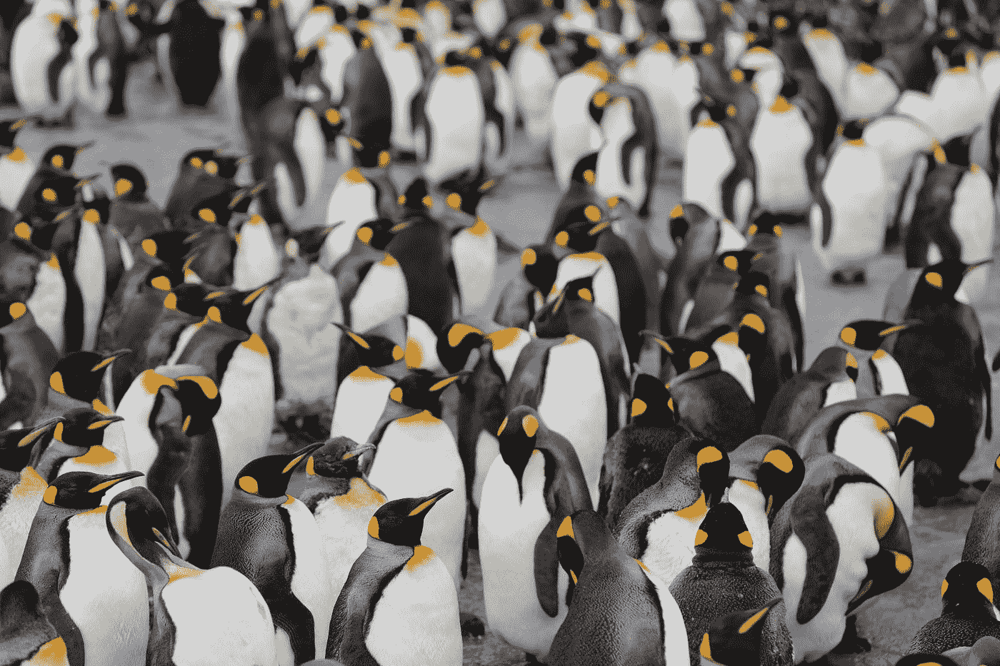
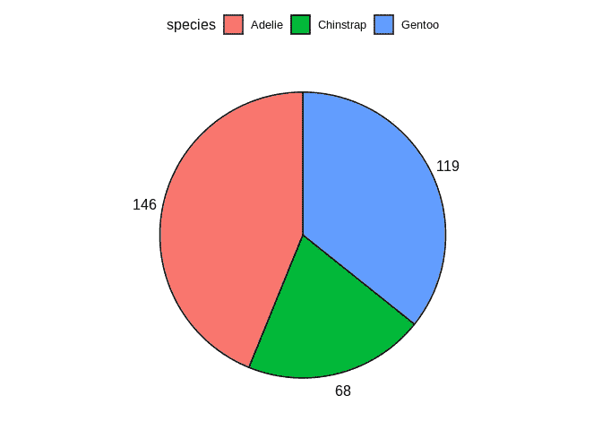
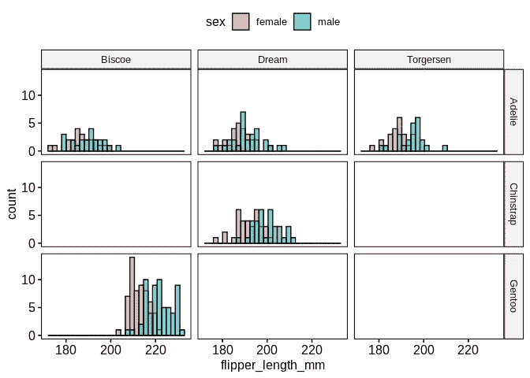
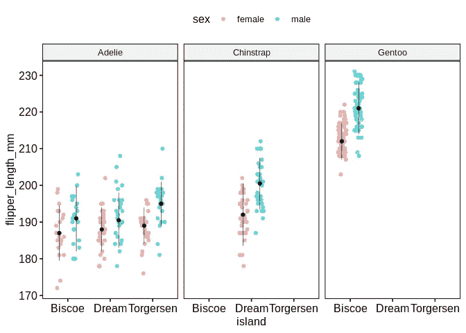
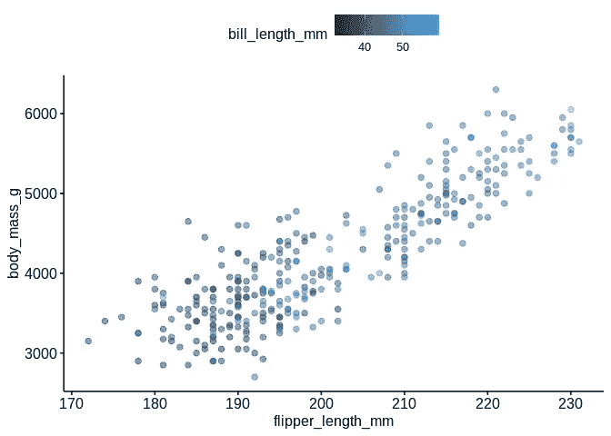
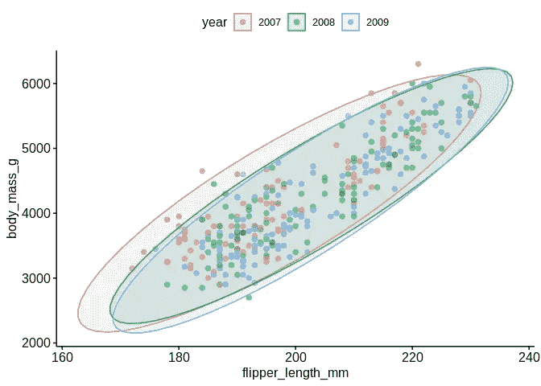
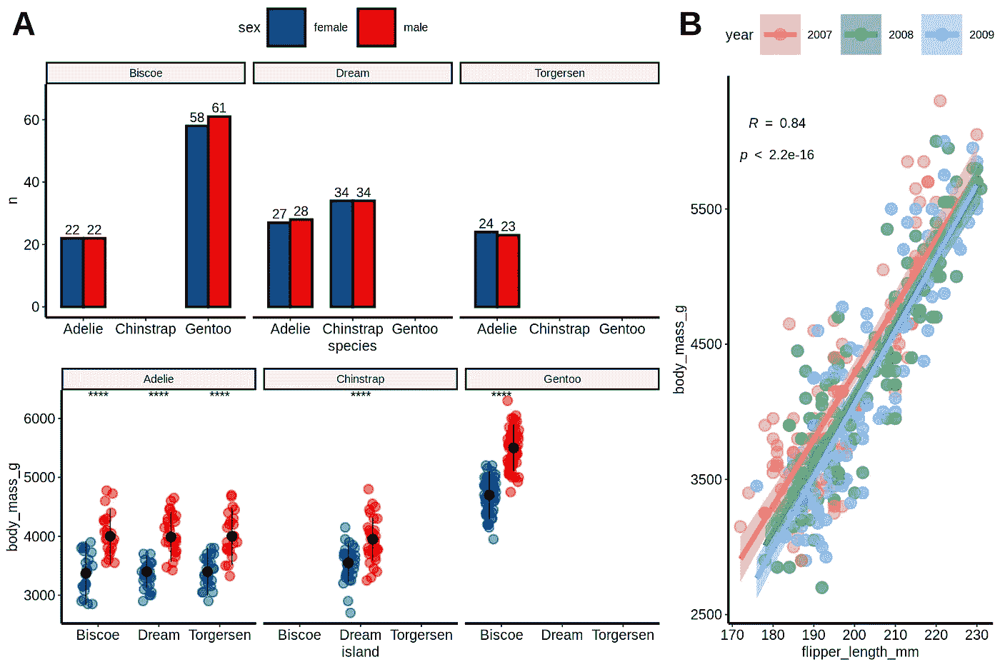

# 数据不会说话？开始提问！

> 原文：<https://towardsdatascience.com/data-does-not-speak-for-itself-start-asking-questions-4e152274d605>

# **数据不会说话？开始提问！**

## 通过 R 中的可视化快速探索数据的实用工具


杰森·罗斯韦尔在 [Unsplash](https://unsplash.com?utm_source=medium&utm_medium=referral) 上的照片

当开始一个新项目，设计新的数据分析方法，甚至准备一个新的出版物时，数据可视化对于探索新的假设，验证和交流我们的发现是必不可少的。

一年前，我在巴塞罗纳(CRG)的基因调控中心做了一次速成演讲——我目前正在那里攻读博士学位——题目是“[R](https://www.crg.eu/en/event/practical-tools-quick-data-visualization-r)中快速数据可视化的实用工具”，目的是宣传一系列软件包的存在，这些软件包使我在探索性数据分析(EDA)方面的生活变得更加容易。

在本文中，我将简要地向您介绍我接近 EDA 的方法。演讲的所有材料都可以在这个[网页](https://miqg.github.io/practical_tools_for_quick_data_visualization/README.html)上免费找到，源代码在相应的[资源库](https://github.com/MiqG/practical_tools_for_quick_data_visualization/tree/main)中。我想强调开源包在促进数据科学生活中的重要性。特别是，我个人认为由 Alboukadel Kassambara 开发的 R 库*gg pubr*——一个 *ggplot* 包装器——提供了从一行程序到完全定制的情节所需的所有功能。

# 开始前

我强烈建议安装以下软件包:

*   [此处](https://cran.r-project.org/web/packages/here/vignettes/here.html)
*   [潮汐](https://tidyverse.tidyverse.org/)
*   [ggplot2](https://ggplot2.tidyverse.org/) (包含在 tidyverse 中)
*   [ggpubr](https://cran.r-project.org/web/packages/ggpubr/readme/README.html)

前段时间，我写了一篇关于如何构建数据科学项目的文章。作为一个经验法则，我保存那些每次都很难得到的文件，从这些文件中我可以问很多问题。tidyverse 是一个允许你问这些问题的包，而 T2 ggpubr T3 允许你以一种最少的工作量来实现出版质量。最后， *here* 包让你确保可以在任何设备上自动找到你的项目的根。

# 想象你的问题的答案

## 我们的玩具数据集:palmerpenguins



由[马丁·韦特斯坦](https://unsplash.com/@ncx1701d?utm_source=medium&utm_medium=referral)在 [Unsplash](https://unsplash.com?utm_source=medium&utm_medium=referral) 上拍摄的照片

为了开始使用这些包中的函数，我们将使用 [palmerpenguins](https://allisonhorst.github.io/palmerpenguins/articles/intro.html) 数据集。这个简单的数据集既有连续变量又有分类变量，非常适合展示不同函数的工作原理。

```
require(tidyverse)penguins_url = 'https://raw.githubusercontent.com/allisonhorst/palmerpenguins/master/inst/extdata/penguins.csv'dat = read.csv(url(penguins_url), stringsAsFactors = TRUE)dat = dat %>% drop_na()head(dat)##   species    island bill_length_mm bill_depth_mm flipper_length_mm body_mass_g## 1  Adelie Torgersen           39.1          18.7               181        3750## 2  Adelie Torgersen           39.5          17.4               186        3800## 3  Adelie Torgersen           40.3          18.0               195        3250## 4  Adelie Torgersen           36.7          19.3               193        3450## 5  Adelie Torgersen           39.3          20.6               190        3650## 6  Adelie Torgersen           38.9          17.8               181        3625##      sex year## 1   male 2007## 2 female 2007## 3 female 2007## 4 female 2007## 5   male 2007## 6 female 2007
```

*ggpubr* 由于建立在 *ggplot2* 之上，允许快速制作有洞察力的情节，并有很大的定制空间。在策划的时候，我总是问自己“我想要看到什么类型的关系？”以及“我希望它如何呈现给我？”。

## 分类与分类

例如，我们可能有兴趣知道“每个物种总共观察到多少只企鹅？”。这转化为计算每个物种的企鹅数量，这是一个分类变量。为此，我们可以使用饼图:

```
ggpie(dat %>% count(species), x = 'n', fill = 'species')
```



图片作者[作者](https://medium.com/@miquelangladagirotto)。

或者我们可以更深入一点，结合多个分类变量，问“在不同的岛屿上，我们观察到了多少种不同性别的企鹅？”通过条形图:

```
ggbarplot(dat %>% count(species, sex, island), x = 'species', y = 'n', fill = 'sex', label = TRUE, position = position_dodge(0.7), facet.by = 'island', palette = 'lancet')
```


图片由[作者](https://medium.com/@miquelangladagirotto)提供。

关于 *ggpubr* 最酷的事情之一是它使用了来自软件包 [*ggsci*](https://cran.r-project.org/web/packages/ggsci/vignettes/ggsci.html) 的科学期刊的调色板。在这种情况下，我使用[柳叶刀](https://www.thelancet.com/)的调色板，只需设置*调色板= "柳叶刀"*。还要注意，结合 *x、*方面，人们可以很容易地获得对多变量问题的深刻答案。通过和*填充*论点。

## 分类与连续

现在，我们可以继续问一个连续变量在多个类别中是如何变化的，比如“企鹅种类、性别和原产地的鳍状肢长度分布是怎样的？”。在这种情况下，我们可以通过直方图可视化分布，但是我们需要为每个类别生成一个直方图。下面是如何在一行中使用多个方面来实现:

```
gghistogram(dat, x = 'flipper_length_mm', fill = 'sex', facet.by = c('species','island'))
```



图片由[作者](https://medium.com/@miquelangladagirotto)提供。

或者，如果我们不想得出这么大的数字，我们可以使用抖动图或带状图。此外，我们可以可视化分布设置 *add='median_iqr'* 的中位数和四分位数范围，并通过 *add.params* 指定其参数。

```
ggstripchart(dat, x = 'island', y = 'flipper_length_mm', color = 'sex', facet.by = 'species', alpha = 0.5, position = position_jitterdodge(), add = 'median_iqr', add.params = list(color='black', group='sex', size=0.2))
```



图片由[作者](https://medium.com/@miquelangladagirotto)提供。

事实上，不管是哪一种企鹅和哪一个岛屿，雄性企鹅的鳍状肢长度似乎总是比雌性企鹅长。但是，这些差异在体重上有统计学意义吗？幸运的是，我们只需要另一小段代码，即 *stat_compare_means* 函数来执行和可视化期望的统计测试的结果:

```
ggstripchart(dat, x = 'island', y = 'body_mass_g', color = 'sex', facet.by = 'species', alpha = 0.5, position = position_jitterdodge(), add = 'median_iqr', add.params = list(color='black', group='sex', size=0.2)) + stat_compare_means(aes(color = sex), label = "p.signif", method = 'wilcox.test')
```


图片由[作者](https://medium.com/@miquelangladagirotto)提供。

请注意，如果我们没有被起源岛和物种分开，比较雄性和雌性企鹅的体重可能是不公平的，因为巴布亚企鹅的平均体重大大高于其他企鹅。

## 连续与连续(与分类)

上面，你可能已经注意到企鹅的体重和鳍状肢长度的分布非常相似。但是，“多少钱？”以及“它们与钞票长度相比如何？”。这是一种连续与连续的问题，散点图在这种情况下非常方便:

```
ggscatter(dat, x = 'flipper_length_mm', y = 'body_mass_g', color = 'bill_length_mm', alpha = 0.5)
```



图片由[作者](https://medium.com/@miquelangladagirotto)提供。

通过设置 *color='bill_length_mm'* ,该变量被绘制为颜色渐变，并允许我们看到，除了鳍状肢长度和体重之间明显的线性关系之外，喙的长度也倾向于随着其他两者的增加而增加。

现在，就像以前发生的一样，你可能想知道是否有其他变量，也称为**混杂因素**，产生了一种虚假的关系:“我们能看到数据收集年份的抽样偏差或批量效应吗？”。我们可以很容易地使用*颜色*参数来检查:

```
ggscatter(dat %>% mutate(year=factor(year)), x = 'flipper_length_mm', y = 'body_mass_g', alpha = 0.5, color = 'year', ellipse = TRUE)
```



图片来自[作者](https://medium.com/@miquelangladagirotto)。

幸运的是，情况似乎并非如此。我们可以确认科学家在每个时间点收集了分布中的样本。

此时，你一定在想，“鳍状肢长度和身体质量之间有什么关联？”。我们可以通过 *cor.coef* 和*cor . coef . args*参数非常容易地添加它。

```
ggscatter(dat %>% mutate(year=factor(year)), x='flipper_length_mm', y = 'body_mass_g', alpha = 0.5, color = 'year', add = 'reg.line', conf.int = TRUE, cor.coef = TRUE, cor.coeff.args = list(method = 'spearman', label.sep = '\n')) + theme(aspect.ratio = 1)
```


图片由[作者](https://medium.com/@miquelangladagirotto)提供。

## 将图合并成一个图形

最后，当我们想在报告中包含不同的数字时，我们可以将它们保存为。pdf 文件和 edit 在像 [Inkscape](https://inkscape.org/es/) 这样的程序中组合它们。或者，我们也可以使用 *ggarrange* 对它们进行编程！这里有一个例子:

```
fontsize = 6labsize = 2# overview number of observations of every sex across islands and speciesp1 = ggbarplot(dat %>% count(species, sex, island), x = 'species', y = 'n', fill = 'sex', label = TRUE, lab.size = labsize, position = position_dodge(0.7), facet.by = 'island', palette = 'lancet') + ylim(NA, 68)# sex-related body mass distributions across islands and speciesp2 = ggstripchart(dat, x = 'island', y = 'body_mass_g', color = 'sex', facet.by = 'species', alpha = 0.5, position = position_jitterdodge(), add = 'median_iqr', add.params = list(color='black', group='sex', size=0.2), palette = 'lancet') + stat_compare_means(aes(color = sex), label = "p.signif", method = 'wilcox.test', size = labsize)# association of flipper length and body massp3 = ggscatter(dat %>% mutate(year=factor(year)), x = 'flipper_length_mm', y = 'body_mass_g', alpha = 0.5, color = 'year', add = 'reg.line', conf.int = TRUE, cor.coef = TRUE, cor.coeff.args = list(method = 'spearman', label.sep = '\n', size = labsize)) + theme(aspect.ratio = 1)p1p2 = ggarrange(p1 + theme_pubr(base_size = fontsize), p2 + theme_pubr(base_size = fontsize), ncol = 1, common.legend = TRUE)fig = ggarrange(p1p2, p3 + theme_pubr(base_size = fontsize), widths = c(2,1), heights = c(2, 1), labels = 'AUTO')# saveggsave('images/myfig.png', fig, width = 15, height = 10, unit = 'cm')
```



图片由[作者](https://medium.com/@miquelangladagirotto)提供。

# 结论

由于有了像 *ggpubr* 这样的开源包(以及它们所基于的框架)，访问和探索数据来回答我们的问题从未如此简单。对我来说，EDA 是数据科学中最重要的部分，因为它允许产生新的假设，更重要的是，发现并纠正不必要的混杂因素。这篇文章是一个更彻底的速成班的一个小尝试，在这个速成班中，我展示了探索基因组数据集的方法(这里有免费的)。如果你喜欢这篇文章，也许你有兴趣阅读其他文章:

*   [“构建您的数据科学项目！”](/structure-up-your-data-science-project-4ee934d9ce11)
*   [解剖 28 年欧洲制药发展](/dissecting-28-years-of-european-pharmaceutical-development-3affd8f87dc0)

如果你想知道更多或者有什么不清楚的地方，请不要犹豫！