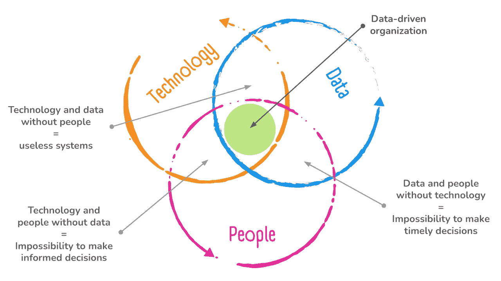

# 有经理参与的数据驱动型组织

> 原文：<https://towardsdatascience.com/data-driven-initiatives-unpacked-bringing-managers-to-the-table-2c3e8f8f0b0>

## 一种协调数据科学家和管理层共同目标的可能方法

由 [Unsplash](https://unsplash.com?utm_source=medium&utm_medium=referral) 上[车头](https://unsplash.com/@headwayio?utm_source=medium&utm_medium=referral)拍摄

数据团队面临的一个常见挑战是弥合将组织转变为数据驱动的实体的需求与成功将其传达给管理层之间的差距。我阅读了许多关于这个主题的论文，经历了不同的框架，并且参与了许多数据项目。对于非技术受众来说，这些模型或框架通常过于复杂，不能总是按原样呈现。我在这里的目的是提出一个共同点的方法，一个对双方都适用的故事，并希望能引起一些读者的共鸣。

# 整体情况

当谈到交流项目信息时，保持简单是最好的。与管理层交谈时尤其如此，他们不需要理解错综复杂的发动机来驾驶汽车。他们只需要知道，如果他们加满油箱，遵守速度限制，并做定期的技术修改，他们会走得很远！根据同样的类比，我认为数据计划只能用三个维度来描述和解释:数据、技术和人(“3D 数据故事”)。这是非技术观众很容易掌握的大局。以我的经验，这三个维度同等重要。

下面的文氏图总结了每个维度的作用:

3D 数据故事|图片由 Alexandre Allouin 提供

一旦理解了这种简化，就可以建立对当前情况的概述/评估:数据、技术和人员。在这一点上，两个受众都将看到需要改进什么以达到数据驱动的目标。自然，管理团队会明白，每个维度对于成为数据驱动的组织都至关重要。他们还会明白，随着文氏图中圆圈大小的增加，出现绿点(代表您想要评估的数据驱动型组织或数据计划)的可能性也会增加。因此，他们会看到哪里需要更多的努力。

图片作者:Alexandre Allouin

这是你的电梯推销！虽然这对于需要全局的高级经理来说可能足够了，但对于需要确保汽车能够被他们的经理实际驾驶的中级经理来说可能还不够。相同的简化方法将应用于每个维度:它们将通过三个轴进行评估，每个轴将得到一个分数，它们的总和将代表圆的大小。

# 维度评估

如何定义每个轴应该根据您组织的需求来定制。下面是一个可能对你有用的方法。

1.  **数据**

数据维度旨在从数据的角度理解组织的背景。它包括对战略和治理(正式和/或非正式)的评估。它还应涵盖整个数据生态系统的状态:缺失的数据源、分析功能、数据目录、问题和挑战。

作者图片

2.**科技**

技术维度应被视为数据维度的促成因素。必须包括对数据管道、基础设施、分析和人工智能平台以及数据访问的评估。

作者图片

3.**人**

人的因素很容易被忽视。然而，正如许多研究表明的那样，这通常是开发数据驱动型组织的障碍。必须考虑到许多因素，从高级别宣传/领导到工作人员技能和赋权。

作者图片

每个维度的得分是其关联轴得分总和的结果。每个维度的总和必须达到 33(或人员维度的 34…因为人员很重要！)然后，评估可以在全球范围内传达:三个维度的总和(100)，或者如果您想提出特定的挑战，可以通过特定的维度传达。例如: **D30 | T31 | P15** 显然，必须关注人的方面。另一种方法是对所有维度应用百分比: **D91% | T94% | P44%** 。

虽然本文的格式不适合详尽地回顾用于评估每个轴的变量，并且值得深入分析，但我在下面提供了一些提示，您可以在分配分数时考虑。需要注意的是成熟度水平(没有标准模型，已知的有[戴尔数据成熟度模型](https://www.cio.com/article/238210/the-four-stages-of-the-data-maturity-model.html)、 [Gartner 成熟度模型](https://www.oreilly.com/library/view/streaming-change-data/9781492032526/app01.html)、 [Snowplow 数据成熟度模型](https://snowplow.io/blog/the-snowplow-data-maturity-model/)等。)取决于你组织的战略目标；你想要达到的目标必须相应地调整。

## 数据

**数据策略&治理**

*   与战略目标一致:战略是否解决了特定的业务需求？
*   业务需求、角色和职责是否明确？
*   支持上述内容的数据源是否已经确定？
*   是否设计了灵活的数据架构？
*   是否确定了文化变革和人员技能/培训要求？
*   是否有实施战略的路线图？
*   是否定义了数据沿袭？

**流程**

*   是否解释了将数据转化为见解的流程？(例如分析平台)
*   是否指定了确保数据完整性的流程？
*   合适的人能够访问合适的数据吗？
*   数据管理流程如何与业务流程保持一致并集成在一起？

**数据成熟度**

*   是否仍然缺少数据源？
*   数据架构是否满足所有需求？
*   新的见解支持组织目标吗？
*   人们在数据使用方面改变了习惯吗？
*   有可用的数据目录吗？
*   是否定义了主数据管理？
*   数据是否用于预测？

虽然前两个轴更关心项目的计划方面和它将被治理的方式，但是数据成熟度轴旨在评估它们的实现状态。基于你想要达到的目标，你可能会更倾向于给最后一个轴更多的权重。

## 技术

**数据管理**

*   技术是否满足策略中指定的要求？特别是，技术是否与支持数据的不同阶段相关:提取、收集、转换、存储等。？
*   基础设施是否足够敏捷以支持该策略？
*   是否实施了主数据管理？

**数据使用**

*   工具和平台在分析和可视化方面满足业务需求了吗？
*   现有系统是否允许用户轻松分享见解？
*   有没有一些流程已经自动化了？或者有什么流程需要自动化？

**数据访问**

*   是否存在访问数据的 API？
*   该技术允许轻松嵌入图表吗？
*   是否存在孤立或难以访问的数据源？
*   是否存在这样一种文化，即任何人都可以访问所有数据源，除非它们包含个人或其他数据保护理由？

## 人

**领导和沟通**

*   管理层是否定期推广数据文化？
*   管理层是否在会议、报告或决策中使用数据？
*   是否为建立数据团队分配了相关资源？
*   管理层是否鼓励并授权员工采用数据驱动的思维和运营方式？
*   是否有时事通讯或其他内部通信来宣传成功案例、数据计划等。？

**数据扫盲和赋权**

*   员工的数据技能是否经过评估？
*   是否有评估员工技能的问卷？
*   员工有机会接受培训吗？
*   是否确定了任何数据冠军？
*   员工有机会参加论坛、导师、诊所等吗？在他们需要的时候得到帮助？
*   是否鼓励员工使用数据？
*   数据文化问题是否包含在招聘流程中？

**制度化和决策成熟**

*   有多少员工访问公司仪表盘，访问频率如何(每天/每周/每月)？
*   有多少员工创建仪表板，创建的频率如何(每周/每月)？
*   在过去的六个月/一年中，有多少团队接触过数据团队以开始新的数据项目)？
*   管理层有多少次利用数据做出明智的决策，并与员工进行沟通？
*   来自企业的数据相关查询(运营/支持)是否有所减少？
*   部署新的数据产品是否会节省成本？

最后一个轴可能很难监控，必须在流程的早期进行考虑，以确定收集正确信息的正确策略。

# 关键要点

1.  简化您想要讲述的故事，以便组织中的每个人都能理解并掌握这个概念。一个数据驱动的组织可以从三个维度来衡量:数据、技术和人员。
2.  评估每个维度的成熟度。为此，可以通过将它们分解为三个轴来进一步简化。中层管理人员可能需要这种级别的细节。
3.  确定将用于评估每个轴的指标。这应该与您的组织目标和您想要达到的数据成熟度级别相一致(您可以使用现有的许多模型来支持您的策略，或者从中受到启发)。
4.  使用 3D 维恩图，向你的利益相关者传达组织的当前状态，你想要达到的目标，以及达到目标需要什么:这是你的故事。

在项目的整个开发过程中，尽可能多地参考文氏图。组织中的每个人都应该熟悉它:所有员工都能够理解、采纳和推广的大图，以使您的组织转型成功。最后，为了以身作则地领导这个项目(鞋匠不应该是最差的)，不断地监控和评估你的进展是至关重要的:这将使你更加可信，并有助于你想要发展的数据驱动的文化。

[法语版本](https://dinae.fr/index.php/fr/2022/07/17/organisation-data-driven-comment-ne-pas-perdre-le-management/)