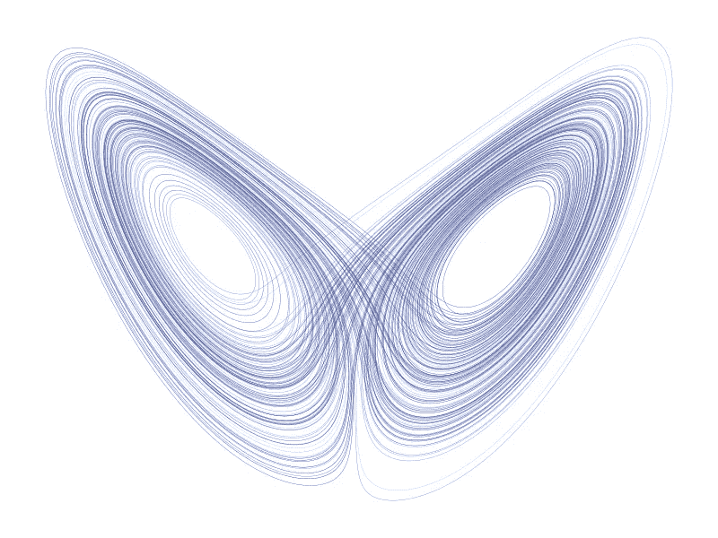
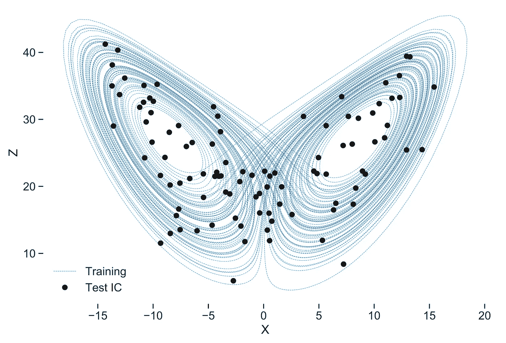
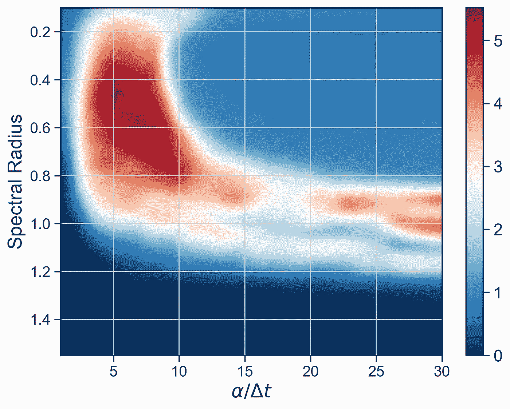

# 复杂系统的数据驱动建模:油藏计算教程

> 原文：<https://towardsdatascience.com/data-driven-modeling-of-complex-systems-8a96dc92abf9>

由 [Lenstravelier](https://unsplash.com/@lenstravelier?utm_source=medium&utm_medium=referral) 在 [Unsplash](https://unsplash.com?utm_source=medium&utm_medium=referral) 上拍摄的照片

确定性混沌这个几乎似是而非的概念描述了对初始条件如此敏感的系统，以至于不可能进行长期预测。因此，尽管动力学方程中没有随机性，但即使是计算中最微小的误差——例如计算机中的数值精度误差——也会导致未来的预测完全错误。

混沌系统的应用范围从天气预报，流体湍流，等离子体动力学，化学反应，人口动力学，天体运动，股票市场，等等。虽然当前的技术倾向于使用噪声和部分测量信息来约束物理模型(【https://en.wikipedia.org/wiki/Kalman_filter】)，但是控制这些系统的方程通常是未知的。因此，能够使用机器学习(ML)等数据驱动方法来预测此类系统非常重要。

# 洛伦兹“蝴蝶”吸引子

爱德华·洛伦茨在 1963 年开创了理解和洞察混沌动力学的新时代。洛伦茨对地球低层大气中对流的简化将确定性的非周期行为以及“蝴蝶效应”的概念引入了流行文化，蝴蝶扇动翅膀可以改变天气。他的典型例子被称为“洛伦兹吸引子”该系统是三维的(3D ),并且涉及从下面均匀加热和上面冷却的薄流体的特性。下面绘制的是与对流速度和垂直温度变化相关的两个变量。Lorenz 吸引子是动力系统预测中的一个标准问题。

这里的几何对象称为具有分数维的“奇怪吸引子”。准确地说，吸引子的维数是 2.06。图片作者。

这里我们的 3D 数据 **u** (t)来自一组常微分方程，一个动力系统。为了在这里深入一点动力系统理论，“蝴蝶效应”可以用一组称为李亚普诺夫指数(le)的量来表征。LEs 是描述动力系统中扰动平均增长率的基本特征

LEs 描述了两个点 x₁和 x₂，最初相隔δx₀ = |x₁− x₂|的距离，如何相对于彼此在时间上演变。更具体地说，

λ₁是最大的 LE。因此，如果λ₁是正的，随着时间的推移，两个初始条件，起初只有很小的差异，将在线性化的范围内以指数速度彼此远离——混沌的定义和预测困难的原因。

由正李亚普诺夫指数引起的扰动增长的图解。作者:亚帕丽娜——自己的作品，CC0，[https://commons.wikimedia.org/w/index.php?curid=42399467](https://commons.wikimedia.org/w/index.php?curid=42399467)

LEs 可以与吸引子的维度和几何形状直接相关，吸引子是数据驻留在变量空间(称为相空间)中的几何对象。λ₁也是误差指数增长的逆时间常数，因此李雅普诺夫时间λ₁*t 给出了一个无量纲时间，可用于判断预测的质量。

# 油藏计算

在最大似然法中有许多预测复杂系统的方法，但最近有一种方法在性能、理解和训练的简单性以及潜在动力学的再现方面脱颖而出；这种方法就是储层计算(RC)。RC 是递归神经网络(RNN)的简化形式，这是一种具有反馈连接的网络，能够实现自激励。RNN 的内部状态明确地取决于先前的内部或“隐藏”状态和外部驱动信号。因此，数据有一个自然的顺序——称之为时间——这明确地允许将 RNN 视为一个动力系统。相比之下，其他形式的人工神经网络，如多层感知器，不对数据进行排序，因此它们的自然数学描述是一个函数。

RC 的优点是我们避免了直接在容器内训练权重。它们是根据控制连通性图的属性的少量参数来设置的。这些总体参数是 RC 方法的美妙之处。设置这些参数可以被视为指定类似于气体的整体温度或压力的东西，不需要跟踪每个单独粒子的位置和速度，从而大大降低了问题的复杂性。因此，训练仅限于解决输出的线性回归问题，大大减少了训练时间。

RC 中的信息流。我们有一个输入 u(t ),它通过输入层输入，输入层将信号投射到高维储层中，使我们能够用线性读出层近似非线性动力学。然后读数预测 u(t+1)。我们将 u(t+1)反馈到输入中，给出我们的预测。图片作者。

## 钢筋混凝土结构

RC 的结构由一个固定的(未训练的)高维“库”和一个训练过的输出层组成。储层的固定性质减少了训练参数空间的大小，以设置控制全局属性的少数参数，然后求解线性回归问题。可搜索参数空间大小的这种减小允许人们容易地绕过由于使用反向传播方案而出现的爆炸/消失梯度问题，并且将 RNN 的训练时间加快了几个数量级。

表 1:控制储层整体特性的参数以及 RNN 方程的更新。

RC 由三层组成:输入层 **Win** ，储层本身，以及输出层 **Wout** 。储层由 N 个节点组成，这些节点通常由简单的非线性元件*作用，例如*，tanh 激活函数。网络中的节点通过 N × N 邻接矩阵 **A** 连接，随机选择具有连接密度ρA 和在[1，1]之间均匀选择的非零元素，缩放使得 **A** 的最大特征值是表示为谱半径(ρSR)的数。

让我们看看如何在 Julia 中初始化一个 RC，实现为一个对象，并将表 1 中的输入参数作为初始化参数。函数“get_connection_matrix”创建 N×N 储层并缩放最大特征值。

rc 接受表 1 所示的参数。我们看到 RC 邻接矩阵 A 被实现为稀疏矩阵，因为已经表明非常低连通性的储层实际上在预测方面是最好的(ρA ~ 0.02)。此外，稀疏矩阵向量乘法非常有效。然后，a 按其最大特征值重新调整。Win 在[-，σ]之间随机产生。Wout 的存储器在初始化时被分配，但是 rc 还没有被训练。

输入层 **Win** 是一个 N × D 维矩阵，将输入信号 **u** (t)从 D 维映射到 N 维储层空间。 **Win** 的元素在[-，σ]之间均匀选择。

## 培训 RC

调用 RNN/水库的隐藏状态 **r** (t)。更新规则是

其中我们看到下一个 RC 隐藏状态 **r** (t+1)取决于前一个状态 **r** (t)和输入数据 **u** (t)。α是“泄漏率”,它决定了在下一个状态中有多少来自前一个状态的直接混合。节点处的非线性元素由双曲正切函数给出，该函数在这种情况下工作良好，因为它以 0 为中心。

现在的训练包括用数据 **u** (t)驱动 RC，并生成一系列与数据匹配的储层状态 **r** (t)。然后我们通过优化损失来确定 **u** (t)和 **r** (t)之间的线性映射 **Wout**

其中 **r** 是包含 **r** (t)的矩阵， **u** 是包含训练数据集中所有 t 的 **u** (t)的矩阵，β是 Tikhonov-Miller 正则化超参数。这也称为岭回归。解决方法是

其中 I 是 N × N 单位矩阵。因此，训练是一个简单的矩阵乘法问题。我们可以在代码中看到这一点。

训练 rc 需要输入数据序列 u(t)。我们生成对应于输入 u(t)的隐藏状态 r(t)。从那里我们可以计算出输出矩阵。

RC 还需要一些步骤来与数据同步。我们称之为旋转。

## 预测

现在来预测一下。我们将 **u** (t)替换为 **Wout** * **r** (t)，将从动 RC 变成一个自主(仅取决于 **r** (t))系统

这给了我们“预测机器”,因为只要我们愿意，我们可以简单地向前迭代。代码如下所示，注意“auto_rc”功能与“driven_rc”相同，但带有**u**->**Wout*****r**。

预测可以由一小部分数据 uspin 或储层状态 r(0)开始。然后这个函数预测 nsteps ahead。

# 洛伦兹吸引子示例

在这里，我们从 Lorenz 系统创建一些训练和测试数据。BasicReservoirComputing 就是上面 RC 代码的模块。系统的大小是 D=3，而水库有 N=200 个节点。参数如下σ= 0.084；α=0.6;SR = 0.8ρA = 0.02；β= 8.5e-8；σb=1.6，这是通过下一节所述的优化程序得到的。我没有定义 make_lor63 和 plot_prediction，但它们可以在 github repo 中找到。整个过程只需要几秒钟。

在下面的例子中，我们看到了 RC 的主要优势之一。不仅预测结果非常棒，这里高达约 9 次李亚普诺夫时间，而且当预测最终发散时(由于“蝴蝶效应”必然会发散)，RC 停留在吸引子上，给出“物理预测”——预测具有与实际数据相同的统计特征。

可以计算 RC 的 D 个最大 LEs，并将其与输入数据的 LEs 进行比较。当两者相匹配时，我们得到了未来预测与数据“气候学上相似”的特征。这意味着预测具有相同的统计特性(平均值、标准差、相关性、误差增长，..)作为输入数据。

再现正确的误差增长统计(LEs)的特性不仅对于预测的稳定性很重要，而且对于将 RNNs 结合到当前技术水平的预测方法中也很重要，例如[集合卡尔曼滤波器](https://en.wikipedia.org/wiki/Kalman_filter)或其他形式的数据同化。这些方法使用贝叶斯推理将稀疏和有噪声的观察结果合并到系统的模型中(数据驱动的或物理的)。推论要求模式的扰动系综再现物理上真实的扰动预报，因此这个性质是重要的。

从 t=0 预测 X、Y 和 Z。请注意良好的短期预测以及长期统计数据的再现。图片作者。

# 测试 RC

时间序列预测的常见 ML 基准是一步预测均方误差。事实上，这正是我们训练 **Wout** 获得从**u**(t)→**r**(t)→**u**(t+1)的线性地图的方法。然而，作为一种测试方法，一步预测并不是一个合适的度量；它过分强调数据中的高频模式，而牺牲了 RC 预测的长期稳定性。

我们预测时间的标准度量是有效预测时间(VPT)。VPT 是预测的准确度超过给定阈值的时间 t。举个例子，

其中 d 是系统维数，σ是时间序列的长期标准差，ε是任意阈值，uᶠ是 RC 预测。

通过下面的直方图，我们可以看出在不同初始条件下观察预测的统计集合的重要性。这个集合是通过训练 RC，然后在 Lorenz 吸引子上的不同点测试大量初始条件而生成的。预测时间的变化部分是由于动力系统运动不稳定性的变化。Lorenz 吸引子在中间有一个不稳定的鞍点，在这个鞍点上很难预测状态将在哪个波瓣上结束，而两个波瓣的中心是相当稳定的。

测试 RC 进行预测的初始条件。这些预测的有效预测时间显示在下面的直方图中。当从吸引子的中心开始而不是在波瓣中开始时，预测未来的行为要困难得多。图片作者。

直方图显示了上述 100 个初始条件下的预测时间分布。图片作者。

# 如何找到正确的参数

找到 RC 的正确参数是使用该技术的主要挑战之一。正如我们在下面看到的，预测能力对我们选择的参数值非常敏感，使得这成为一个有点困难的多维非线性优化问题。谢天谢地，有许多算法专门研究这类问题，例如 CMAES[https://en.wikipedia.org/wiki/CMA-ES](https://en.wikipedia.org/wiki/CMA-ES)，但是任何全局优化算法都可以。

预测对 RC 参数变化的敏感性。红色表示高平均 VPT 的区域，而蓝色表示低 VPT 的区域。搜索整个参数空间是一个不小的问题。图片作者。

我将采用三步优化方法。程序是:

1.  修正参数
2.  通过线性回归训练 Wout
3.  通过一系列长期预测评估损失函数

我们将用于评估数据拟合度的损失函数为

其中 M 是用于比较的预测数量。uᶠ是预测，u 是数据。指数项是为了抵消误差在时间上的预期指数增长。

增加 M 使损失函数变得平滑，并且能够更好地收敛到全局最小值。然而，折衷是必要的，因为增加 M 将显著增加计算复杂度。我们根据经验发现，对于简单的模型来说，使用 15-20 个左右的预测通常就足够了，前提是这些预测是在统计上独立的点上做出的(彼此相距几个李亚普诺夫时间尺度以上)。理想情况下，数据将很好地采样输入系统吸引子，但实际上不可能总是这样。

下面我们将看到最小化的目标函数的定义和单一未来预测的损失函数。代码依赖于包含非优化参数以及训练数据的对象 f(这里未示出)。然后，我们使用全局优化程序来优化不同的参数。

# 结论

我们已经简要介绍了 RC 以及训练、预测和优化 RC 以预测复杂系统所需的代码。讨论了优化以找到正确参数的重要性，以及 RC 再现输入数据的长期统计数据的能力。虽然我们仅使用 Lorenz 系统作为例子，但是 RC 还有许多更复杂的应用。

代码和例子可以在 https://github.com/japlatt/BasicReservoirComputing 的[找到。](https://github.com/japlatt/BasicReservoirComputing)

有关 RC 背后的理论的更多信息以及对设计选择的更深入的讨论可以在以下论文中找到。如果您发现这些信息有用，请引用它们。

1.  **Jason A. Platt** 等人，“在油藏计算中使用预测广义同步进行稳健预测”。载:*(2021 年)第 31 期，第 123118 页。网址:【https://doi.org/10.1063/5.0066013 *
2.  *普拉特、J. A .、彭妮、S. G .、史密斯、T. A .、陈、t-c .、&h . d . I .(2022)。预测复杂时空动态的储层计算的系统探索。*arXiv*http://arxiv.org/abs/2201.08910*

*还可以找到关于将 RNNs 集成到数据同化算法中以处理稀疏/噪声/不完整数据的信息*

*彭妮，S. G .，史密斯，T. A .，陈，t-c .，**普拉特，j . A .**。林海燕，古德利夫，硕士，大学博士(2021)。结合递归神经网络和数据同化进行可扩展的数据驱动状态估计。*arXiv【cs。LG]* 。运货车[http://arxiv.org/abs/2109.12269](http://arxiv.org/abs/2109.12269)*

*本作品的原始灵感来自陆等人，2018:*

*陆志新、布莱恩·亨特和爱德华·奥特。“机器学习的吸引子重构”。载于:混沌:一个
跨学科的非线性科学杂志 28.6 (2018)，第 061104 页。一美元兑换:.*