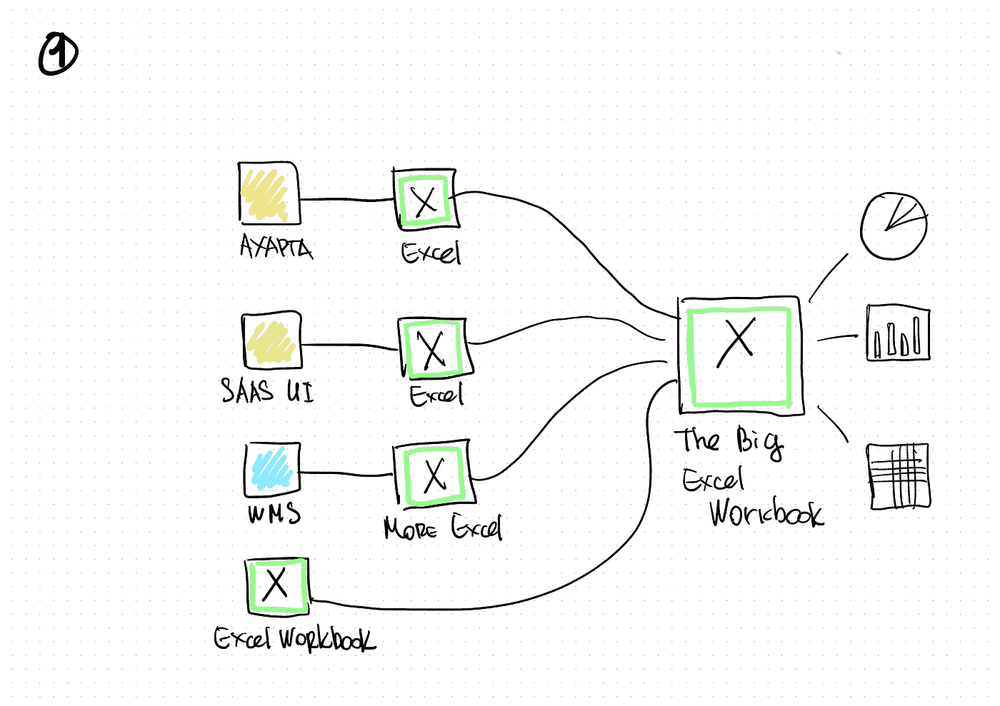
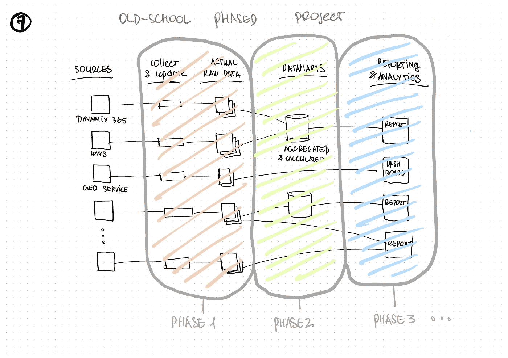
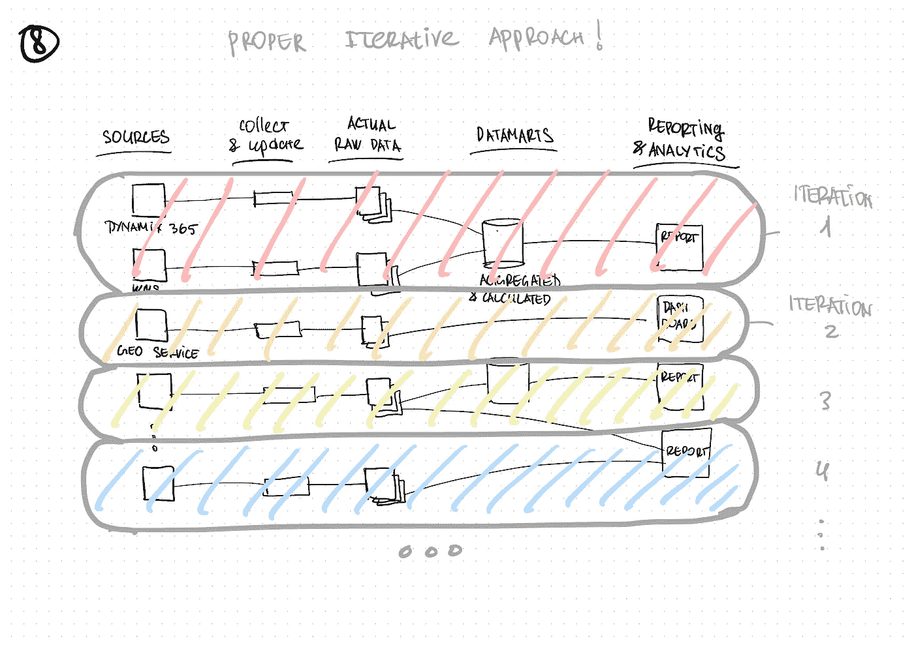
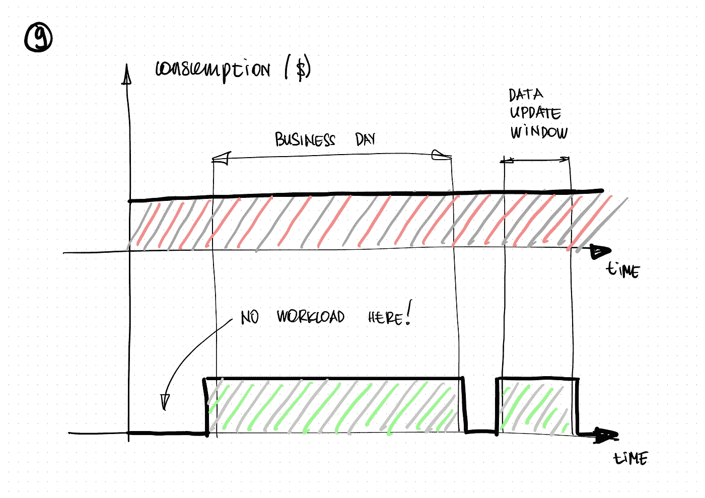
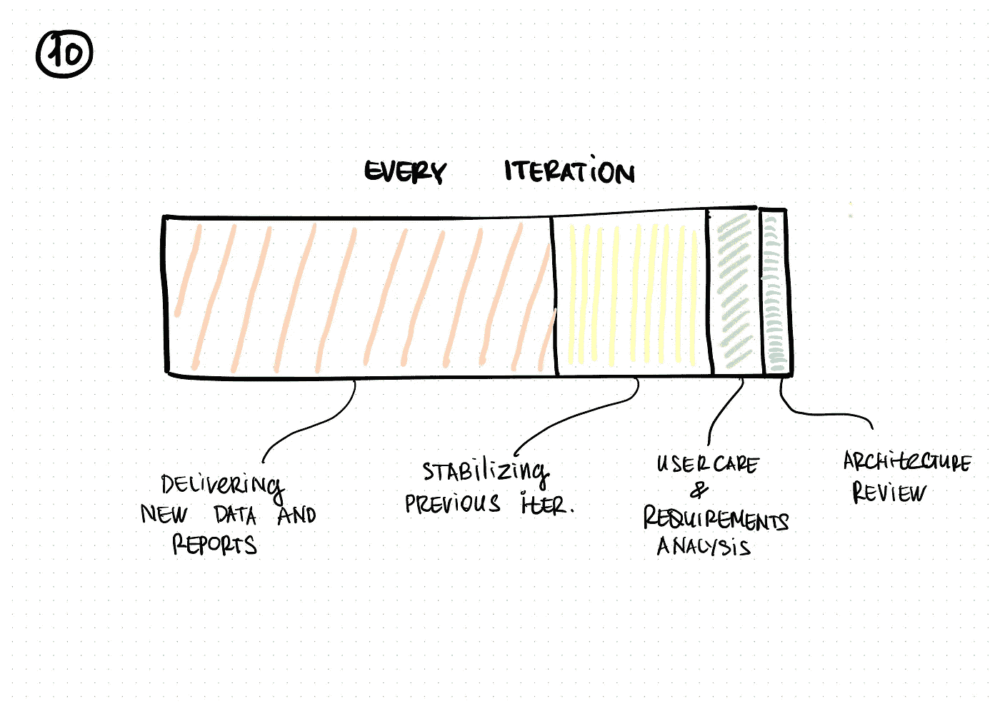

# 数据湖架构:如何将您的业务提升到数据驱动的世界

> 原文：<https://towardsdatascience.com/data-lake-architecture-for-a-heavy-machinery-dealer-how-to-level-up-your-business-to-the-b41145e86b15>

## 迟做比不做好

在当今世界，所有现代企业都有数字化的一面。也许一些小型手工业企业仍然没有受到数字的影响，但这是例外。每个组织都经历了数字化的几个阶段，从现金流的基本会计到高级分析、预测建模和基于数据的数字服务的开发。

今天，让我分享我的一个客户案例，在这个案例中，我和我的团队致力于数据湖实施，以实现自动化分析来帮助加快决策过程。

显然，这一切都是从 Excel 工作簿开始的。但是，企业中的数据源数量会随着企业的发展而增加。通常，许多业务应用程序都在使用中，如 CRM、ERP 和 WMS。但是，用 Excel 做报表和分析数据的习惯从来没有消失过！

迟早会出现这样的情况:从过多的系统中导出的数据图表过多。每天都需要花费时间来手动准备报告数据，而且从不同系统汇集信息也是一项挑战。如果你需要更新过去时期的信息，那真的是一场噩梦。如果手动处理用于报告和分析的数据，发现错误几乎是不可能的。重新开始可能更容易！

简而言之就是所谓的“Excel 地狱”:)

幸运的是，我们的客户，一家重型建筑机械和设备的主要经销商，在为时已晚之前看到了这些趋势，并要求我们提供帮助。任务是让他们的员工摆脱手动数据准备，并为他们提供一个选项，用于对来自所有系统的数据进行多功能分析，而不需要额外的开发人员。如果可能的话，我们还将为公司的客户提供一种访问数据的方法。时间刚刚好！

## 即使是 Excel 也比没有好

似乎我们必须自动化部分数据准备过程，并从头开始创建其余部分。这需要对现状进行分析。

首先，我们采访了所有报告系统的用户，并收到了报告的样本。令我们惊讶的是，我们发现员工使用工作簿的一部分作为在 Power BI 中创建的报告的来源。他们只是将手动准备的工作簿作为一个源，并将数据可视化！

这无疑是次优的，因为在大多数情况下，有可能直接连接到业务系统数据，并在报告编辑器中设置限制、添加计算和链接。考虑到 Power BI 对于操作来说是多么简单，因此责怪分析师是没有用的。

在收到当前报告的概述后，我们将其与来源进行了比较。原来，这些不仅仅是应用程序，还有其他 Excel 文件——包含来自外部云 SaaS 的规划数据和报告的文件。甚至还使用了从 GPS 跟踪提供商那里导出的 PDF 文件，其中包含他们自己车队的活动报告。出乎意料的是，我们知道一种为这种系统安排数据收集过程的方法。

因此，我们有一个相当大的 Excel 文件，其中指定了所有源及其属性(访问方法、粒度、刷新率、更改历史等。).这些实际上是元数据，为此开发了一种独特的软件——数据目录。然而，要在业务中灌输数据文化，我们必须从小处着手。Excel 文件是未来目录的第一步。

## 体系结构

因此，所有这些数据都必须定期从其来源中提取出来并保持更新。数据还必须在最详细的级别上可供分析师使用，他们永远不会提前知道他们想要创建什么样的报告，或者他们想要分析什么样的新指标和业务属性。

根据我们到目前为止所学到的一切，我们故意拒绝了开发企业数据仓库的经典方法。我们选择不创建包含事实、测量和预定义公式的统一数据模型来计算显示。在这种情况下，最合适的架构类型是“数据湖”。

当然，数据湖架构也有其优点和缺点，但是我们将在另一个时间讨论这种方法的适用性。可以说，数据以最详细和“原始”的形式存储，用户可以访问它们或预先安排的数据集市。没有它们也是可能的，尽管有时在复杂计算的情况下使用它们来提高报告的响应速度是值得的。

数据湖架构可以在各种软件的帮助下实现，比如使用 Apache 组件的开源栈。然而，我们的客户已经订阅了微软 Azure，并且部分业务应用程序通过云服务使用，如 MS Dynamix 365。应该注意的是，在过去的几年里，Azure 女士经历了一些重大的改进，现在包括了开发企业分析和大数据系统的所有必要工具。所以，我们决定和 Azure 女士一起建立这个系统。

我们使用无服务器 SQL 池来存储详细数据，专用 SQL 池用于数据集市，Synapse 管道被用作提取、转换和加载数据(ETL)的工具。Power BI 可以在数据导入模式和实时查询模式下连接到数据存储层，这意味着用户在进一步的数据处理中不会受到限制，例如，通过使用 DAX。

## 一点一点地吃蛋糕

没有人喜欢撰写冗长的技术需求。当然，每个人都想要快速的结果！

因此，在与我们的客户协商之后，我们决定不走冗长的批准和任务评审的道路，而是使用敏捷开发风格在短时间内实现项目。

有几种方法可以在短时间内完成构建 BI 系统的项目。您可以从处理所有数据源开始，并在每次迭代中添加一个新的处理阶段。例如，一个 sprint 用于初始加载到操作数据存储中，一个 sprint 用于加载到数据仓库中，并且可以分配更多的 sprint 来准备数据集市中的报告。

在我们的例子中，我们使用了数据湖架构。实际上只有两层，但是有几十个数据源。这意味着将工作分成 sprint 是合乎逻辑的，将几个源放入每个 sprint 中，并为它们执行整个开发过程——从组装到现成的数据集市。

此外，这对于用户来说非常方便，因为通常情况下，2-3 个源包含一个报告的数据。因此，每次迭代的结果为分析师提供了数据，他们可以用这些数据将一个或多个现有的报告转移到数据湖中。这允许逐渐转变到使用数据仓库，并避免由于在短时间内验证大量数据而分散他们的工作注意力！

最后，每次迭代包括:

*   开发用于数据提取的适配器
*   初始装载
*   配置数据更新流程
*   计算数据集市
*   由用户(分析师)验证数据集市中的数据
*   将报告从 Excel 切换到 Azure Synapse

我们总共连接了 37 个数据源系统！在这里一一列举是没有用的，因为每个公司都有自己独特的系统。只要说有 Excel 图表、关系数据库、API 外部服务等等就够了。

## 从错误中学习

自然，没有一个敏捷开发过程没有错误、失误和稳定性。我们选择了深度分析而不是直接结果。

很明显，将数据湖中的所有数据放入专用的 SQL 池是一件成本高昂的事情。此外，池本身在一天中所做的一切就是等待新的连接并响应偶尔的用户查询。

我们建议将 Power BI 报告转换为数据导入模式，而不是直接查询模式，以节省我们客户的资金。然后，预先准备好的数据将存储在 Power BI 数据集中，不会消耗任何存储资源，并且无论池是否可用，这些数据都是可用的。

除此之外，我们还配置了更新所有报告数据集的设置，包括数据刷新(在 Synapse 管道的帮助下)。剩下的工作就是按照计划设置专用 SQL 服务的激活和停用，以更新数据和数据集。服务成本几乎降低了四倍！

第二个错误是使用外部 SaaS 来提取公司自己车队的移动数据。通常情况下，该服务通过 JSON 中的 API 提供数据。只是这个 JSON 的形式不完全规范，并且不包含逻辑迭代数据处理所必需的父容器。在微不足道的量，这不是一个问题。但是当我们的客户要求为每次旅行加载详细的 GPS 坐标时，我们明白 Azure Pipelines 的标准工具不能用于处理格式不正确的 JSON。变通的解决方案是一个很好的旧 SQL 和 JSON 文本的批量加载。我们花了几个小时集思广益，编写了一个非常复杂的脚本，快速分析来自服务的文本响应，并将其转换为无服务器数据存储中的文件。没有人保证这将是一个无代码开发！:)

我们遇到的另一个问题是另一个外部服务。由于某种内部原因，它已经撤销了所有的授权密钥，当然，我们的 ETL 过程开始接收错误消息(HTTP 403-Forbidden ),而不是通常的数据。这没什么大不了的，但是考虑到一些 API 的不稳定性，我们遵循了常见的配置实践——每隔一分钟重复几次数据请求。重试次数设置为 30 次。

不幸的是，就在圣诞节假期之前，这些密钥被撤销了，所以在接下来的几天里，这个错误又出现了很多次。令我们非常惊讶的是，我们发现根据 MS Azure 的费率，在下一次尝试接收数据之前的超时也是要收费的。当然，应该由微软来定义哪些功能需要付费以及为什么要付费，但是从客户的角度来看(我们同意这一点)，为空闲时间付费是没有意义的。我们收到了一个新的授权密钥，但紧接着，当数据请求尝试失败三次时，我们为开发团队和客户的网络管理员设置了一个通知程序。安全总比后悔好！

## 结论

让我们从技术实现细节回到项目目标和它的预期任务。

这个系统最明显的好处是从手工数据处理中节省了人工月甚至人工年的劳动成本。当然，对企业来说，这可能会花费一大笔钱，但主要的好处是别的东西。

从业主或上级经理提出数据分析请求到分析员提交报告之间的时间大大减少。现在，几乎可以在一个工作日内满足任何分析需求！很难低估这种加速对公司决策的好处。

当然，当数据湖中没有足够的数据来响应分析请求或准备报告时，也会有例外。幸运的是，Power BI 提供了一个机会，只需点击几下鼠标就可以将新的数据源直接连接到报告编辑器。然后，在确定其价值之后，将这个数据源连接到数据湖比传统的 BI 系统要便宜得多，也快得多。

因此，数据湖分析系统已经成为数字化的一个新的步骤。现在，分析师通过在工作中更接近自助服务的原则来履行职责，上层管理人员总是能够获得最新信息，以便快速准确地做出决策！

除非另有说明，所有图片均为作者所有。