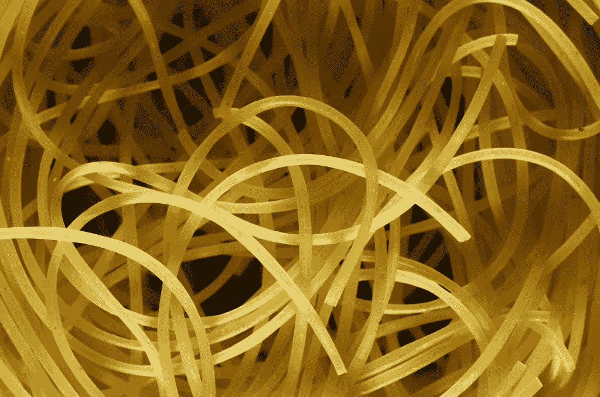
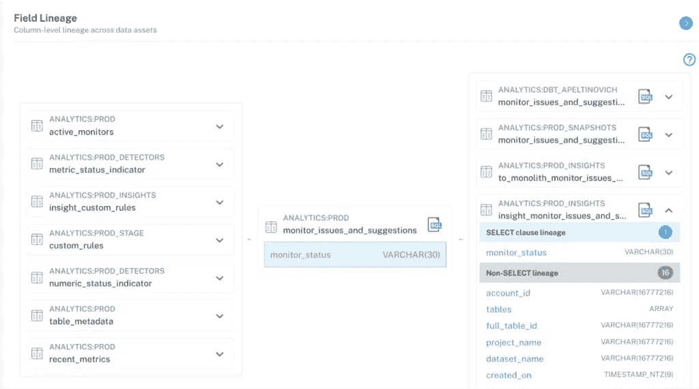

# 数据传承被破坏——以下是 5 种修复方法

> 原文：<https://towardsdatascience.com/data-lineage-is-broken-here-are-5-ways-to-fix-it-3f3e16fb21b>

## 数据谱系应该不像藏宝图，而更像谷歌地图

图片由 Mick Haupt 在 [Unsplash](https://unsplash.com/photos/tJefy_Vu7Po) 上提供。

数据血统并不新鲜，但是自动化最终使它变得可访问和可伸缩——在一定程度上。

在过去(早在 2010 年代中期)，血统是通过大量手工工作实现的。这包括识别数据资产，跟踪它们到它们的摄取源，记录这些源，绘制数据通过各种管道和转换阶段时的路径，以及查明数据在仪表板和报告中的位置。这种记录血统的传统方法非常耗时，而且几乎无法维护。

今天，自动化和 ML 使得供应商开始大规模提供数据沿袭解决方案成为可能。数据沿袭绝对应该是现代数据堆栈的一部分——但是如果沿袭做得不好，这些新版本可能只不过是养眼而已。

所以是时候深入探索了。让我们来探索当前围绕数据血统的对话是如何被打破的，以及寻求有意义的商业价值的公司可以如何修复它。

# 什么是数据血统？为什么这很重要？

首先，快速复习一下。数据沿袭是一种元数据，用于跟踪数据管道中上游和下游依赖关系之间的关系。沿袭是关于映射的:你的数据来自哪里，当它在你的管道中移动时如何改变，以及它在哪里出现在你的终端消费者面前。

随着数据栈变得越来越复杂，映射沿袭变得越来越具有挑战性。但是如果处理得当，数据血统是非常有用的。沿袭帮助数据团队:

*   理解特定资产的变更将如何影响下游的依赖关系，这样他们就不必盲目地工作，并冒着给未知的涉众带来不受欢迎的惊喜的风险。
*   当数据问题发生时，通过快速查看可能导致报告中断的上游错误，更快地解决问题的根本原因。
*   向依赖下游报告和表格的消费者传达损坏数据的影响—当数据可能不准确时，主动让他们了解情况，并在任何问题得到解决时通知他们。

不幸的是，一些新的数据谱系方法更关注吸引人的图表，而不是编制丰富、有用的地图。与通过[数据可观察性](https://www.montecarlodata.com/blog-what-is-data-observability/)实现的端到端沿袭不同，这些表层方法不提供交付沿袭所能提供的全部价值所需的强大功能和全面的现场级覆盖。

当您的数据谱系类似于一盘意大利面条时，您就有麻烦了。图片由 Unsplash 上的 [Immo Wegmann](https://unsplash.com/photos/qnrJoo2_4EQ) 提供。

让我们探索血统可能被打破的信号，以及数据团队可以找到更好的方法的方式。

1.  通过传承关注质量而非数量

现代公司渴望成为数据驱动型企业，但收集更多数据并不总是对企业最有利的。与分析无关或对分析无用的数据可能会变成噪音。积累最大的数据宝库不会自动转化为更多的价值，但它确实保证了更高的存储和维护成本。

这就是大数据变小的原因。 [Gartner 预测，70%的组织](https://www.gartner.com/en/newsroom/press-releases/2021-05-19-gartner-says-70-percent-of-organizations-will-shift-their-focus-from-big-to-small-and-wide-data-by-2025)将在未来几年内将他们的重点从大数据转移到小而广的数据，采用一种减少依赖性的方法，同时促进更强大的分析和人工智能。

血统应该在这些决定中发挥关键作用。沿袭解决方案应该包括相关的信息，比如哪些资产正在被使用，由谁使用，而不是简单地使用自动化来捕获和生成数据的表面图形。有了这个更全面的数据使用情况，团队可以开始更好地了解什么数据对他们的组织最有价值。不再使用的过时表或资产可以弃用，以避免潜在的问题和下游的混乱，并帮助企业关注数据质量而不是数量。

1.  通过字段级数据沿袭揭示什么是重要的

彼得·扬达最近发表了一篇文章，讲述了数据团队如何需要[像对待地图一样对待血统](https://petrjanda.substack.com/p/untapped-potential-of-data-lineage?s=w)——具体来说，像对待谷歌地图一样。他认为，lineage 应该能够方便查询来找到你要找的东西，而不是依赖于难以浏览的复杂视觉效果。例如，当你需要一家杂货店时，你应该能够找到一家杂货店，而不会被你实际上不关心的周围的咖啡店和加油站所扰乱。“在今天的工具中，数据血统的潜力还没有被开发，”Petr 写道。“除了几个过滤器，血统体验不是为了*找东西*而设计的；它们被设计用来*展示事物*。这是一个很大的区别。”

我们完全同意。数据团队不需要看到关于他们数据的一切，他们需要能够找到解决问题或回答问题的关键。

这就是为什么[字段级沿袭是必不可少的](https://www.infoq.com/articles/field-level-lineage-modern-data-systems/)。虽然表级沿袭已经成为规范好几年了，但是当数据工程师想要确切地了解他们的管道为什么或如何中断时，他们需要更多的粒度。字段级沿袭帮助团队关注特定代码、操作和数据变更对下游字段和报告的影响。

当数据中断时，字段级沿袭可以显示受影响的最关键和最广泛使用的下游报告。同样的传统通过允许数据团队快速追溯到数据问题的根本原因，缩短了解决问题的时间。

1.  组织数据谱系以便更清晰地解释

数据谱系可以以另一种方式追随谷歌地图的脚步:通过使谱系中使用的结构和符号的解释变得简单明了。

正如谷歌地图使用一致的图标和颜色来指示企业类型(如加油站和杂货店)，lineage 应该为其描述的数据应用清晰的命名约定和颜色，直到构成我们数据管道的不同工具所使用的徽标。

随着数据系统变得越来越复杂，为清晰的解释而组织谱系将帮助团队尽快从他们的谱系中获得最大的价值。

1.  在数据沿袭中包含正确的上下文

虽然为了数据而积累更多的数据可能无助于满足您的业务需求，但是收集和组织更多的[元数据](https://www.montecarlodata.com/blog-data-teams-your-metadata-is-useless/)——具有正确的业务上下文——可能是一个好主意。包含丰富的上下文元数据的数据沿袭非常有用，因为它可以帮助团队更快地排除故障，并理解潜在的模式更改将如何影响下游报告和利益相关者。

利用谱系本身中包含的给定数据资产的正确元数据，您可以获得做出明智决策所需的答案:

*   谁拥有该数据资产？
*   该资产位于何处？
*   它包含哪些数据？
*   对利益相关者是否相关和重要？
*   当我对该资产进行更改时，谁在依赖它？

当这种关于数据资产在您的企业中如何使用的上下文信息浮出水面，并且可以通过强大的数据谱系进行搜索时，事件管理就变得更加容易了。您可以更快地解决数据宕机问题，并将受影响数据资产的状态传达给组织中的相关利益相关方。

1.  扩展数据谱系以满足业务需求

最终，数据血统必须丰富、有用、可伸缩，才能有价值。否则，它只是管理层演示中看起来不错的视觉糖果，但实际上并不能帮助团队防止数据事件或在数据事件发生时更快地解决它们。

我们前面提到过，由于自动化，沿袭已经成为数据堆栈中热门的新层。自动化确实解决了这个问题的一半:它可以帮助沿袭扩展以适应新的数据源、新的管道和更复杂的转换。

另一半呢？通过将关于所有数据资产和管道的元数据集成到一个内聚的视图中，使沿袭变得有用。

再次考虑地图。如果地图只显示了现实世界的一部分，那它就没有用。没有全面的覆盖，你就不能依靠一张地图找到你需要的一切，或者从 A 点导航到 b 点，数据血统也是如此。

沿袭必须通过自动化进行扩展，而不减少覆盖面。每一个入口、每一个管道、堆栈的每一层以及每一份报告都必须考虑在内，一直到现场级别，同时要丰富和可发现，以便团队可以准确地找到他们正在寻找的东西，有一个清晰的组织结构，使信息易于解释，并有正确的上下文元数据来帮助团队快速做出决策。

就像我们说的:血统具有挑战性。但是如果做对了，它也是非常强大的。

# 底线:如果数据血统没有用，那也没关系

当事件发生时，或者如果您只是想更好地了解数据中的关系，字段级沿袭可以使您轻松地发现数据中真正重要的内容。图片由作者提供。

尽管现在数据谱系似乎无处不在，但请记住，我们还处于自动化谱系的早期。解决方案将会继续改进和完善，只要你知道高质量的血统应该是什么样子，看到行业的发展方向将会是令人兴奋的。

我们的希望？沿袭将不再是吸引人的图形，而是更强大的功能，就像下一代谷歌地图一样。

***你怎么看？伸手到*** [***巴尔摩西***](https://www.linkedin.com/in/barrmoses/) ***或*** [***格伦威利斯***](https://www.linkedin.com/in/glencwillis?miniProfileUrn=urn%3Ali%3Afs_miniProfile%3AACoAAA91BH0BVWywpAkvje7eISwSCzvrvWM_h6Q&lipi=urn%3Ali%3Apage%3Ad_flagship3_search_srp_all%3BiJ7VP53qRcSHDkqNVWP%2Frg%3D%3D) ***上*** [***蒙特卡洛***](http://www.montecarlodata.com) ***队。我们洗耳恭听。***