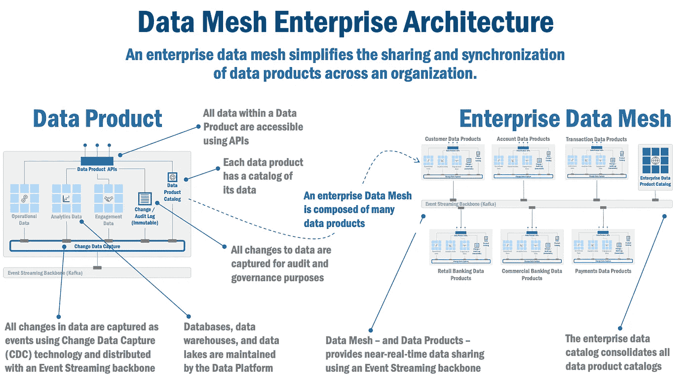
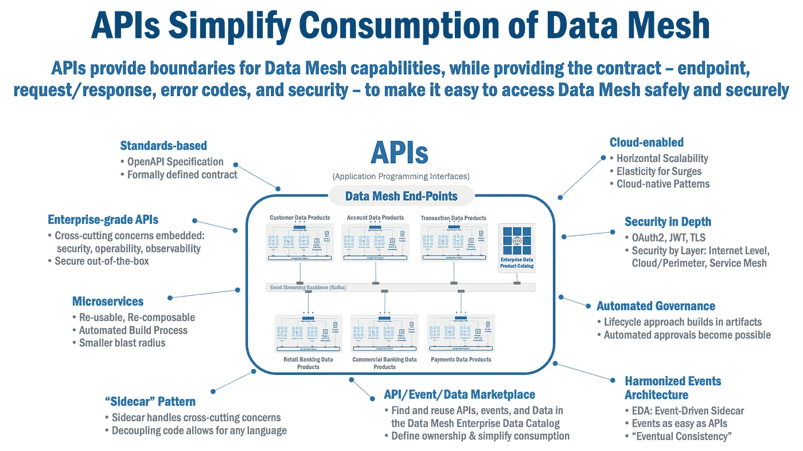
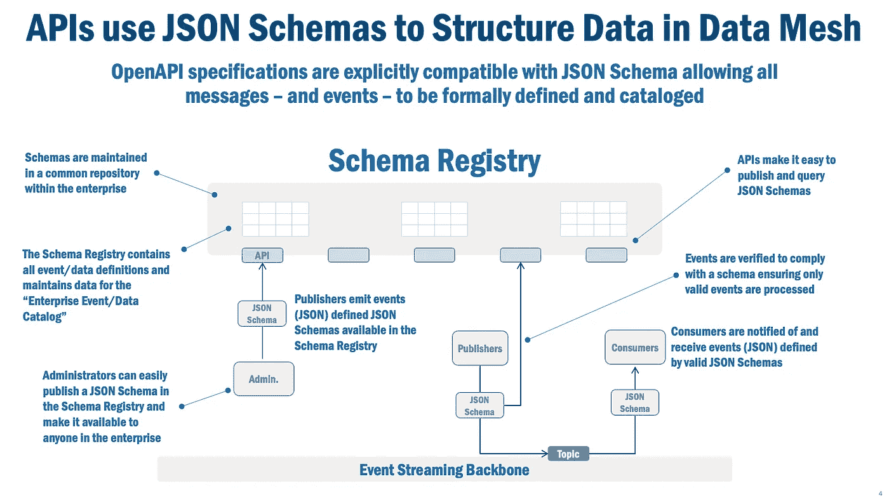
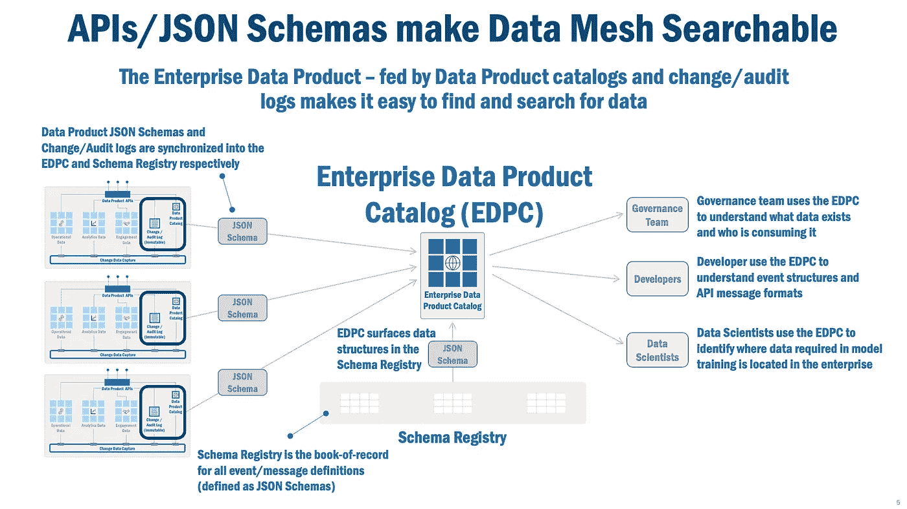

# 数据网格架构以及 API 和 JSON 模式的作用

> 原文：<https://towardsdatascience.com/data-mesh-architecture-and-the-role-of-apis-json-schemas-3dc616650960>

## 如何使用 JSON 模式来协调 API、数据网格和事件定义

数据网格和 API 的关系比您可能意识到的要密切得多。事实上，API 和它们的近亲 JSON 模式是数据网格的基础组件。这个架构讨论解释了为什么。

杰米·哈姆森在 [Unsplash](https://unsplash.com/s/photos/passport?utm_source=unsplash&utm_medium=referral&utm_content=creditCopyText) 上拍摄的照片

# API 和 JSON 模式是企业数据网格的基础元素

API，或称[应用编程接口](https://medium.com/geekculture/rethinking-enterprise-grade-apis-8af3d5f2bfbd)，以及它们的近亲 [JSON 模式](https://json-schema.org/)，通过提供一种指定数据结构、访问方法和安全构造的一致方法，实现了扎马克·德赫加尼的[数据网格](https://martinfowler.com/articles/data-mesh-principles.html)的每一项原则/功能。通过这样做，API 和 JSON 模式使得在企业的数据网格中查找、使用和管理数据变得更加容易。

本文将通过回答几个简单的问题来解释数据网格、API 和 JSON 模式之间的关系:

*   API 在数据网格中的作用是什么？
*   如何使用 API，尤其是 OpenAPI 这样的规范来形式化数据结构和访问模式？
*   如何使用 JSON 模式来协调 API、数据网格和事件定义？

# 数据网格架构概述

企业数据网格(图 1)由许多组件组成。数据产品是数据网格中的主要原子构建块(更多细节请点击[这里](/an-architecture-for-the-data-mesh-32ff4a15f16f))。数据产品包含使用变更数据捕获和事件流主干同步的运营、分析和/或参与数据。API 用于访问数据产品中的数据。为了支持联合治理，每个数据产品都包含一个审计日志，记录数据变更和它管理的数据目录。

*图 1，企业数据网格架构*

企业的数据网格有许多数据产品。数据产品订阅彼此的数据，使得当一个数据产品改变其数据时，该改变被传达给其他数据产品(订阅该改变)。

一个[事件流主干](https://www.confluent.io/)用于将事件(或任何 API 调用)分发到任何“实体”——一个应用程序，或企业数据网格中的另一个数据产品。事件流 Bankbone 管理实体订阅的“主题”。发布者——企业数据网格中的任何参与者——将事件发布到“主题”。事件的消费者——同样，企业数据网格中的任何参与者都会订阅“主题”,并在事件发布到该主题时收到通知。

例如，数据科学家使用的分析数据产品可能会订阅两种数据产品——“客户”和“交易历史”数据产品，以确保它拥有最新的信息来训练 AI/机器学习模型。当对“客户”数据产品中的数据进行修改时，分析数据产品订户将会收到一个通知，其中包含描述所发生的更改的事件。在这一点上，分析数据产品可以用事件信息更新其训练储存库，确保最新的数据用于训练 AI/ML 模型。

最后，企业数据目录——所有数据产品目录的同步聚合——用于使任何用户或开发人员都可以轻松地找到和使用整个企业中的任何数据(当然，假设它们是被允许的)。

# API 使得在数据网格中消费数据变得简单

为什么 API 对数据网格至关重要？根据 Dehghani 的[原则](https://martinfowler.com/articles/data-mesh-principles.html)，API 是访问企业数据网格的工具。 [OpenAPI](https://www.openapis.org/) ，一个使用 REST(互联网最常用的协议)的 API 标准，定义了数据网格 API 的契约:

*   **端点**:可以访问数据网格服务的 URL
*   **请求**:对数据网格端点的传入请求的格式和结构
*   **响应**:数据网格响应请求的格式和结构
*   **错误**:对请求的数据网格错误响应的格式和结构，以及当使用 HTTP(或 HTTPS)时，错误代码的语义和含义
*   **安全模式**:访问数据网格服务端点所需的“角色”的标识

*图 2，API 简化了企业数据网格的使用*

那么 API 到底是如何实现数据网格[原理](https://martinfowler.com/articles/data-mesh-principles.html)的呢？简而言之，API 支持:

*   **数据平台**:API 契约提供了围绕数据网格能力的定义边界，因此提供了数据平台定义、所有权和责任的基础；API 端点提供了访问企业数据网格的入口点。
*   **自助式**:由于任何人都可以使用 API(假设他们有必要的权限)，API 允许数据网格是“自助式”的，任何应用程序、用户或开发人员都可以使用。
*   **分散所有权和简化消费**:API 市场相当成熟大多数数据网格 API 规范位于所谓的“API 市场”(API 规范的开发者门户和目录)；这些 API Marketplaces 定义了数据所有权，同时也使开发人员或用户能够轻松地在企业的数据网格中搜索/查找和理解数据。
*   **联合治理**:由于 API 规范是在 API 市场中定义的，数据网格治理团队(以及那些由团队治理的团队)有一个已建立的“记录簿”来管理和治理对数据网格的访问，并传达策略或方向的变化。

# API 提供数据网格护栏和安全性

企业的数据网格存储着任务关键型数据，到目前为止，我们都知道保护这些数据的必要性。那么，API 如何提供保护企业数据网格所需的“护栏”呢？

首先，成熟的 API 框架实现了“护栏”,以确保所有数据网格交互安全可靠，而且可操作、可观察、可追踪。典型企业数据网格部署中需要的常见 API 框架功能包括:

*   **异常处理**确保数据网格通信的弹性和可靠性
*   **日志记录**确保捕获数据网格警报、通知和事件，用于审计或调试目的
*   数据网格中的**警报**会自动传播到企业控制台
*   **消息屏蔽**确保敏感数据网格消息和日志被屏蔽，以确保符合行业标准(PII、HIPPA 等)
*   **数据网格的健康状态**是可见的，并与企业系统管理工具集成
*   **指标**捕获数据网格统计信息，并使其对企业控制台可见
*   消息的跟踪确保相关的数据网格事件可以被跟踪和关联
*   **数据网格中的安全性**使用行业标准 OAUTH2、JWT 和 TLS 来确保数据网格的安全
*   **消息验证**确保所有数据网格交互符合已发布的合同
*   **Sidecar 架构**允许以任何语言安全地编写数据网格业务和事件管理逻辑

*图 3，API 提供了数据网格安全和护栏*

第二，通过使用 OpenAPI 规范，每个端点可以定义其加密首选项。HTTPS 是 HTTP 协议的安全版本，它可以确保所有端点以及企业数据网格之间发送和接收的数据都是加密的。

最后，OpenAPI 规范定义了一个类似“角色”的安全模式。这个“角色”用于使用行业标准 OAUTH2 协议来管理对 API 的访问，从而管理数据网格。当以这种方式使用时，API 的安全模式将 API 访问权限链接到组织的基于角色的访问控制(“RBAC”)能力，从而提供管理对企业数据网格的访问的统一方法。

# JSON 模式协调数据网格事件和 API

让我们看看图 4 所示的场景。有几个交互组件允许 JSON 模式成为数据网格的基本元素:

*   **模式注册中心**，它是所有事件和交互定义的存储库，因为事件和 API 请求和响应都是由 JSON 模式定义的；管理员(在联邦治理团队的帮助下)在注册中心发布和管理 JSON 模式，确保模式注册中心被建立为定义数据网格事件和交互机制的“记录簿”。
*   **发布者**是创建事件并将它们发布到事件流骨干网上众所周知的“主题”的实体；因为发布者将事件作为 JSON 消息发布，所以它们可以由模式注册中心中的 JSON 模式定义；特别重要的是，发布的每条消息都根据模式注册中心的 JSON 模式进行验证，这确保了发布者发布的无效消息会被立即拒绝，只有有效的格式良好的事件/消息才会在企业数据网格中传播。
*   消费者订阅“主题”,并在事件发布到该主题时得到通知；由于事件是由一个 JSON 模式定义的，并且事件与一个特定的 JSON 模式相关联，因此消费者可以得到一个易于理解和使用的有效结构化消息。

*图 4:API 使用 JSON 模式来构建数据网格中的数据*

那么，API 适合在哪里呢？OpenAPI 规范被定义为与 JSON 模式显式兼容。这是一个基本和关键的好处，但它没有得到很好的理解，所以让我来解释为什么这是如此重要。

首先，OpenAPI 规范的组件——请求、响应(包括错误响应)和参数——被定义为 JSON 模式。这确保了所有基于 Dehghani 原则的与企业数据网格的交互都是通过 API 进行的，都是在一个易于理解的、健壮的标准结构中定义的。

其次，由于每个 API 请求都是由一个 JSON 模式定义的，所以将 API 消息转换成由同一个模式定义的 JSON 事件是很容易的。现在，我们可以使用 JSON 模式为企业数据网格中的所有传入消息创建结构和语义。

第三，因为所有事件都是由 JSON 模式定义的，所以我们可以将所有事件定义保存在一个事件注册表中。这个事件注册表可以使用“企业事件目录”来呈现，这样可以很容易地找到事件。

第四，由于所有数据网格事件都在注册表/目录中，并且由于与数据网格的所有通信都是通过由注册表/目录中的事件定义的 API 进行的，因此 API 为开发人员提供了“自助”能力的基础，以方便使用 API。

# API 和 JSON 模式使得数据网格可以搜索

由于所有事件和数据都是在企业模式注册中心中定义和维护的，因此数据网格的治理变得更加容易。毕竟，治理数据的第一步是了解您拥有什么，并使您能够轻松地治理什么。

但是还有更多。在图 5 中，我们强调了数据产品(联合在不同的组或业务线中)及其本地目录，以及它们的更改/审核日志，如何通过使数据网格“可搜索”来显著简化数据网格治理:

*   **企业数据产品目录(EDPC)是企业数据定义和传承的“记录簿”**；所有数据产品目录的更改都会被捕获并同步到模式注册中心和 EDPC(使用事件流主干以接近实时的方式)，从而确保 EDPC 始终是最新的，并作为企业数据定义的记录簿；类似地，自动捕获的数据产品变更/审计日志(更多详细信息，请参见此处的)也近乎实时地同步到 EDPC，这将成为数据变更的“记录簿”,从而成为整个企业的数据沿袭。
*   **治理团队成员**使用 EDPC 来搜索和了解企业中存在哪些数据以及谁在使用这些数据。
*   **开发人员**使用 EDPC 来搜索和理解事件结构和 API 消息格式(回想一下，这些都是 JSON 模式)。
*   **数据科学家**使用 EDPC 来识别 AI/ML 模型训练数据在企业中的位置。

*图 5:API 和 JSON 模式使得数据网格可搜索*

# 总结想法

Data Mesh 及其 API 和 JSON 模式基础使正确的数据在正确的时间可用，使企业能够自由地推动当今市场所需的创新、速度和敏捷性。API 和 JSON 模式简化了企业数据网格的使用，同时支持不受官僚流程约束的联合数据访问、交付和管理模型，而是允许任何企业团队在任何时候以自动化的方式使用他们的项目、团队或业务线所需的数据。

在实现企业的数据网格时，不要忘记 API 和 JSON 模式扮演的重要角色！

***

*除非另有说明，本文中的所有图片均由 Eric Broda(本文作者)创作。图像中使用的所有图标都是普通的 PowerPoint 图标，不受版权保护。*