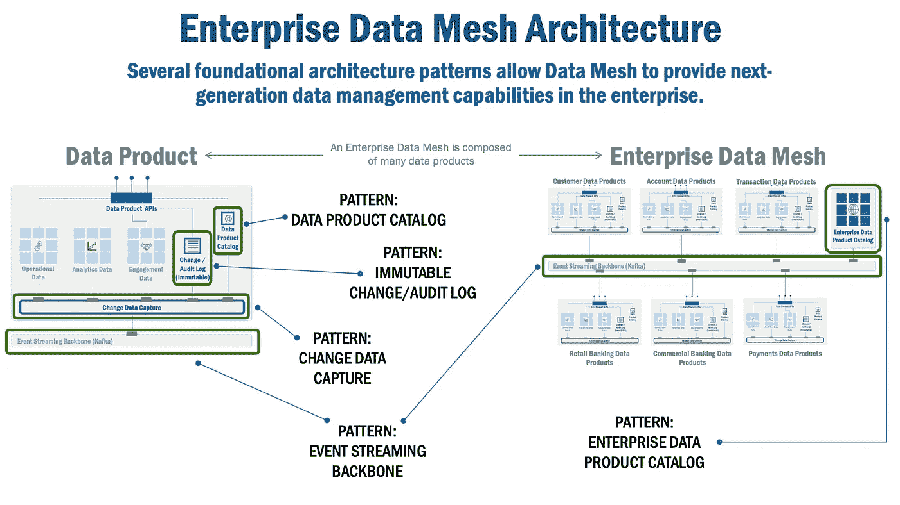
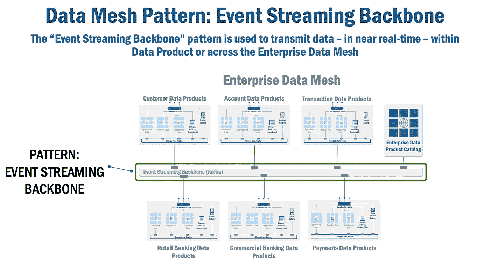
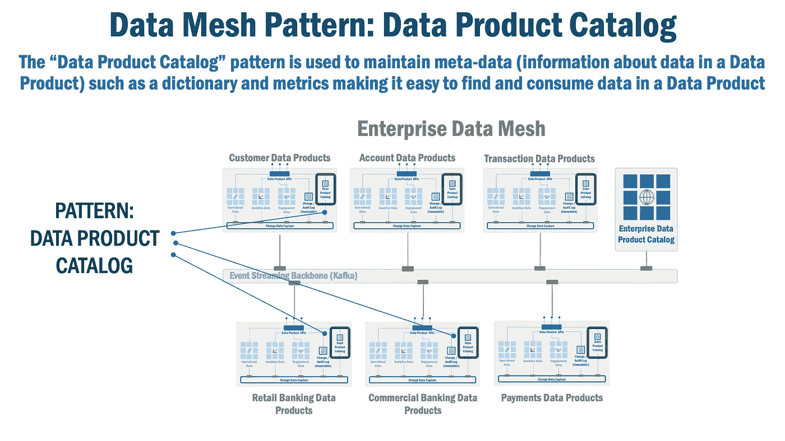
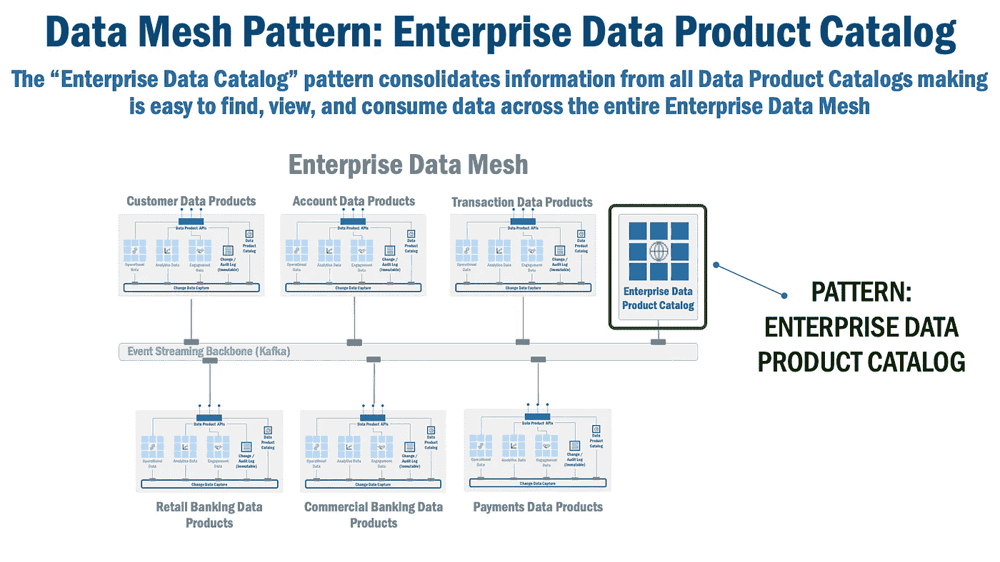
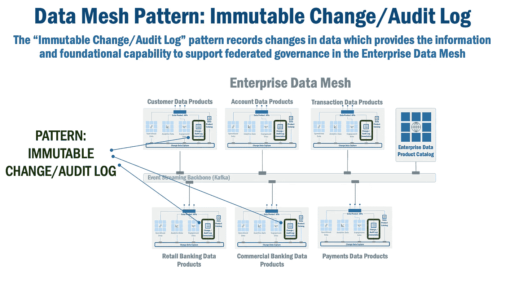

# 数据网格架构模式

> 原文：<https://towardsdatascience.com/data-mesh-architecture-patterns-98cc1014f251>

# 数据网格架构模式

## 企业数据网格正在彻底改变企业管理数据的方式。什么是基本的数据网格模式？

[KOBU 机构](https://unsplash.com/@kobuagency?utm_source=unsplash&utm_medium=referral&utm_content=creditCopyText)在 [Unsplash](https://unsplash.com/s/photos/drawing?utm_source=unsplash&utm_medium=referral&utm_content=creditCopyText) 上拍摄的照片

# 数据网格模式

企业数据网格正在成为管理企业内部数据的一种独特而引人注目的方式。它将“产品思维”引入企业数据管理，同时在企业中实现更高水平的敏捷性和数据治理。它创造了一种“自助”能力，数据近乎实时同步，从而为实时数字企业奠定了基础。

但是，唉，没有一种产品能给你带来数据网格。更确切地说，企业的数据网格是由许多普遍可用的组件组成的(参见下一节的数据网格架构概述)。

然而，成功的关键是理解这些组件是如何相互作用的。在本文中，我将使用架构模式来描述这些交互。

# 数据网格架构概述

一个企业数据网由许多组件组成(这里有更多细节、这里有，这里有)。数据产品是数据网格中的主要构建块，包含使用企业数据网格在整个组织中同步的操作、分析和/或参与数据。API 用于访问数据产品中的数据。为了支持联合治理，每个数据产品都包含一个审计日志，记录数据变更和它管理的数据目录。

企业的数据网格有许多数据产品。数据产品订阅彼此的数据，以便当一个数据产品更改其数据时，使用[更改数据捕获](https://medium.com/@ericbroda/data-mesh-pattern-deep-dive-change-data-capture-eb3090178c34)和[事件流骨干](https://www.confluent.io/)将此更改传达给其他数据产品。

最后，企业数据目录——所有数据产品目录和数据变更的同步聚合——用于使任何用户或开发人员都可以轻松地查找、使用和管理整个企业中的任何数据，同时还为了解整个企业中的数据谱系提供了基础。

*图 1，企业数据网格架构*

我们将在本文中描述以下架构模式:

*   [**改变数据捕捉**](https://medium.com/@ericbroda/data-mesh-pattern-deep-dive-change-data-capture-eb3090178c34)
*   [**事件分流骨干**](/data-mesh-pattern-deep-dive-event-streaming-backbone-99a5bb2a7cbf)
*   **数据产品目录**
*   **企业数据产品目录**
*   **不可变的变更/审计日志**

# 数据网格模式:更改数据捕获

如今，很难在服务和应用程序边界之间安全、可靠且一致地交付数据。有两种方法可以应对这一挑战。首先，可以使用诸如“两阶段提交”(2PC)之类的协议跨多个数据库同步更新数据，但是这种方法通常很复杂且成本很高，并且通常只在保持多个数据源同步至关重要的情况下使用。

第二种方法是立即更新主数据库，同时在将来更新辅助数据库(但不在事务范围内)。当主数据库和辅助数据库更新的时间间隔比预期的长时，就会出现问题。

[**变更数据捕获**](https://medium.com/@ericbroda/data-mesh-pattern-deep-dive-change-data-capture-eb3090178c34) (CDC)是企业数据网格用来应对这一挑战的基础组件。CDC 通过在数据库的事务日志中捕获和发布条目来工作，但最重要的是，它是在原始事务之外不引人注目地完成这些工作的。这意味着 CDC 透明地捕获运营(或分析)数据的变化，而不会影响原始应用程序或事务流。

(注意:这里有更多详细信息[供那些想了解 CDC 在企业中如何工作的人使用)](https://medium.com/@ericbroda/data-mesh-pattern-deep-dive-change-data-capture-eb3090178c34)

*图 2，数据网格模式:更改数据捕获*

但是 CDC 对捕获的“事件”做什么。在企业数据网格中，它将事件发布到事件流主干(下一个模式),以便在整个企业中分发。

# 数据网格模式:事件流主干

一个[**事件流骨干**](/data-mesh-pattern-deep-dive-event-streaming-backbone-99a5bb2a7cbf) 在企业数据网格中分发事件。事件通常源于应用程序、API，在我们的例子中，也源于 [CDC](https://medium.com/@ericbroda/data-mesh-pattern-deep-dive-change-data-capture-eb3090178c34) 。然而，特别重要的是，任何发布的事件都可以被任何其他订阅实体安全、可靠并且近实时地消费。

*图 3，数据网格模式:事件流主干*

事件流主干中有几个核心受管实体:

*   由 JSON 模式定义的**事件**分布在企业数据网格中。
*   **主题**用于在整个企业中排队和分发事件；企业数据网格使用众所周知的主题，这些主题通过允许许多实体发布和消费事件来充当队列。
*   **制作人**发布事件到话题；企业数据网中的生产者可能是 API、应用程序或 [CDC](https://medium.com/@ericbroda/data-mesh-pattern-deep-dive-change-data-capture-eb3090178c34) 。
*   **消费者**从话题中消费事件。企业数据网格中的消费者可以是订阅主题并在事件可供处理时得到通知的任何实体或应用程序。
*   **事件流处理器**以事件为单位或以时间窗口为基础聚合处理事件，从而在企业数据网格中实现非常复杂和强大的分析技术。
*   **代理**管理上述组件，以确保整个企业数据网中安全可靠的事件通信。

# 数据网格模式:数据产品目录

他们说，数据是新的金矿，挖掘它将带来巨大的洞察力和财富。但是在今天的大多数企业中，数据分散在组织的许多小组中。销售拥有客户数据，分销拥有供应链，财务拥有交易和账户。

不幸的是，这使得查找数据变得非常困难，并且一旦找到数据，将它汇集起来以做出整体的业务决策就更加困难。其结果是:决策过程缓慢、成本高昂且缺乏信息。

**数据产品目录** (DPC)包含关于数据产品的数据(“元数据”)的信息。DPC 提供的信息使得任何授权人员或应用程序都可以轻松地在企业数据网格中查找、查看和使用数据产品。DPC 有几个好处:

*   **易于管理**，支持本地所有权和问责制。
*   **易于改变和发展**，允许决策本地化和更快。
*   **轻松查找、查看和消费数据**，让任何(授权)实体都能轻松查找、查看和消费数据(即“自助服务”)。

*图 4，数据网格模式:数据产品目录*

# 数据网格模式:企业数据产品目录

**企业数据产品目录** (EDPC)是一个存储库，汇集了来自所有本地数据产品目录(DPC)的元数据。企业数据目录用于存储企业数据网格中维护的所有数据的信息和统计数据(元数据),以便于查找、查看、使用和管理数据:

*   **数据科学家**使用 EDPC 找到数据在企业中的位置，他们可以用这些数据来训练他们的模型。
*   **商业用户**使用 EDPC 查找商业决策所需的信息。
*   **开发人员**使用 EDPC 来理解他们的应用程序所需的数据结构。
*   **治理专家**使用 EDPC 来理解和监控整个企业的数据，在企业数据网格中实现联合计算治理。

*图 5，数据网状模式:企业数据产品目录*

# 数据网格模式:不可变的变更/审计日志

理解数据的谱系(定义为数据经历的变化的汇总列表)对于治理和监管目的至关重要。为什么这很重要？考虑今天的一个常见情况:AI/机器学习的出现现在是一种强制性的企业能力。数据科学家使用复杂的模型来实现和做出关键的业务决策。

然而，在许多企业中，尤其是那些医疗保健和金融领域的企业，这些模型的实际可行性取决于满足监管机构对可再现性和可追溯性要求的能力(更多信息请参见[这里](/rethinking-ai-machine-learning-model-management-8afeaa31d8f8)和[这里](/ai-and-machine-learning-governance-692b245bb6d7))。不幸的是，大多数企业没有能力按照审计员或监管者要求的方式跟踪数据沿袭。

企业数据网格的**不可变变更/审计日志**通过保留企业数据网格内的历史数据变更来满足这一需求，以用于未来的审计和治理目的。本地数据产品变更/审计日志会根据数据中的任何数据变更自动更新。然后，这些日志被传播到企业数据产品目录(EDPC ),以便整合企业中的数据更改历史。

换句话说，EDPC 包含企业数据网格中所有元素的数据沿袭。EDPC 使用这些数据来提供可搜索的元数据索引，该索引明确包括对每个数据产品的不可变更改/审核日志的引用，从而可以轻松找到并确认数据沿袭。

*图 6，数据网格模式:不可变变更/审计日志*

# 总结想法

企业数据网格正在成为实时数字企业的基础促成因素。架构模式提供了一种描述数据网格交互的既定方法。虽然没有现成的工具可用，但构建您自己的组织数据网格的第一步是理解支持数据网格的基本模式。

希望这篇文章给你必要的洞察力来启动你自己的企业数据网格！

***

*除非另有说明，本文中的所有图片均由 Eric Broda(本文作者)创作。图像中使用的所有图标都是普通的 PowerPoint 图标，不受版权保护。*