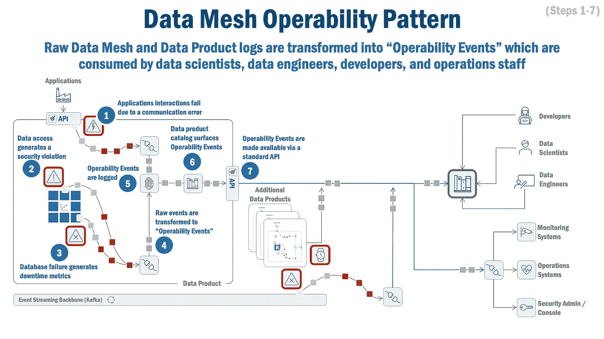

# 数据网格可操作性模式

> 原文：<https://towardsdatascience.com/data-mesh-operability-pattern-8e52a1955e54>

数据网格可操作性模式帮助我们理解企业数据网格的操作特征。下面是这种模式的工作原理，以及它对企业数据网格的稳定性、弹性和性能如此重要的原因。

亚历山大·安德鲁斯在 [Unsplash](https://unsplash.com/s/photos/watch?utm_source=unsplash&utm_medium=referral&utm_content=creditCopyText) 上拍摄的照片

# 数据产品可操作性模式

生产环境的不稳定会影响企业的客户、开发人员的生产力，在极端的情况下，甚至会[损害](https://thenewstack.io/the-atlassian-outage-just-keeps-going-and-going-and/)公司的声誉。由于数据网格仍处于发展的早期阶段，因此将稳定性和弹性直接设计到企业数据网格的基础中是一个很好的机会。

**数据网格可操作性模式**通过检测核心数据产品功能来应对这一挑战，提供对企业数据网格更细粒度和实时操作特征的可见性。

该模式捕获数据产品内以及企业数据网格中数据产品之间的“**可操作性事件**”—数据错误、安全违规、异常情况。它展示了原始的可操作性事件以及允许操作人员、开发人员和治理专业人员提高企业数据网格的稳定性和弹性所必需的聚合可操作性指标。最后，它向企业控制台发出可操作性事件和警报，以便直接集成到企业标准操作环境中。

在本文中，我将探索这种模式是如何工作的，原始数据是如何被捕获的，它是如何被转换成有用的“可操作性事件”的，以及这些可操作性事件是如何被运营、治理和数据专业人员使用的。

本文假设您对数据网格有很高的理解。如果您需要一些关于数据网格的背景信息，这里有许多很棒的文章可供参考:这里的(模式)、这里的(架构)、这里的(原则)和这里的(经验教训)。对于感兴趣的读者，全套数据网格模式可在此处[和](/data-mesh-solution-and-accelerator-patterns-acffbf6e350)[处](/data-mesh-architecture-patterns-98cc1014f251)获得。

# 模式摘要

**数据网格可操作性模式**捕获并显示数据网格操作特征和统计数据、性能指标以及异常/错误情况。它将这些数据建模为**可操作性事件**，对其进行过滤和汇总，以支持不同消费者的需求。

**数据网格可操作性模式**被多种消费者使用:

*   **开发人员**使用可操作性事件来调试和优化应用程序。
*   **数据科学家**使用可操作性事件来理解消耗数据网格资源的模型的操作特征和性能。
*   **运营人员**使用可操作性事件展现核心运营特征，帮助企业数据网格以安全、稳定和高效的方式运行。

# 背景和业务问题

企业数据网格的稳定性和可靠性建立在易于访问的运营指标的基础之上。虽然技术已经使技术操作有了巨大的改进，但是数据工程师、开发人员和操作人员仍然缺乏关于他们的数据网格操作特征的基本信息:

*   为什么，我的模型、应用程序或数据管道在哪里中断了？
*   诊断生产信息所需的信息在哪里？

从运营管理和治理的角度来看，还会出现其他问题:

*   特定数据产品或我的企业数据网格的性能如何？
*   特定数据产品或我的企业数据网格有多稳定？
*   在上一个报告期内，我的企业数据网格的停机时间有多长？哪些组件故障最多？

**数据网格可操作性模式**回答了这些问题。

# 解决办法

**数据网格可操作性模式**捕获、过滤、聚集并提供跨几个维度的可操作性事件的可见性:

*   **数据网格错误**在每个数据产品的日志中被捕获。
*   **数据产品错误**在数据网格消息和通信组件(如 Kafka)的日志中被捕获
*   **与性能、容量和可操作性相关的操作指标**被捕获并汇总到“可操作性事件”中。
*   **稳定性模式和停机趋势**从低级数据网格和数据产品日志中汇总，以提供有用的基于时间的可操作性特征。

通过这种模式可以获得几种形式的数据:

*   **原始日志**，可能有助于理解粒度可操作性模式和操作特性。
*   **错误和异常日志**，帮助诊断和调试生产问题。
*   **可操作性事件**，提供各种日志的标准化视图，以便于搜索、排序、过滤和使用。
*   **汇总数据**，其将相关的可操作性事件和日志分组，以提供数据网格操作特性的汇总和管理视图。

# 它是如何工作的

**数据网格可操作性模式**在企业数据网格中检测数据产品，以捕获和发出关键事件。这些原始事件被转换为“可操作性事件”，即提供一组一致的操作特征的标准化事件，可供数据科学家、工程师、开发人员和企业运营人员使用。

数据网格可操作性模式中的关键活动分为三个部分:

*   步骤 1-7 描述了数据产品中的可操作性流程(图 1)
*   步骤 8-10 描述了数据网格中数据产品之间的可操作性流程(图 2)
*   步骤 10–13 描述了数据网格可操作性模式的使用(图 3)

*图 1，数据网格可操作性模式，步骤 1–7*

数据产品中的可操作性流程(步骤 1-7)包括:

1.  应用程序与数据产品的交互会导致错误。
2.  数据访问会产生安全违规。
3.  数据库故障会产生停机时间指标。
4.  原始捕获事件被规范化并转换成“可操作性事件”，这是用于提供数据网格可操作性的基本构件。
5.  可操作性事件被过滤并记录在不可变的改变/审核日志中，提供对数据产品可操作性事件的历史访问。
6.  数据产品目录使用简单的用户界面呈现可操作性事件，使数据消费者能够了解特定数据产品的数据生命周期和使用模式。
7.  API 还使用正式的 OpenAPI 规范公开可观察性事件，并定义安全的端点，以允许应用程序使用。

*图 2，数据网格可操作性模式，步骤 8–11*

所有数据产品都会在企业数据网格中的数据产品之间发出可操作性事件、警报、性能和可操作性特征(步骤 8-11):

8.数据网格内的数据产品之间出现通信错误

9.通信或互操作性错误被捕获并转化为可操作性事件。

10.每个数据产品的性能统计数据都会定期捕获。

11.使用企业数据产品目录可以访问和搜索所有数据产品的可操作性事件。

*图 3，数据网格可操作性模式，步骤 12–14*

企业数据产品目录展示了数据产品和企业数据网格的运营指标和特征(步骤 12-14):

12.可操作性事件被发送到标准企业控制台(监控、运营管理和安全应用程序)。

13.数据科学家、业务用户、开发人员和治理专业人员使用企业数据产品目录来搜索、查看和消费可操作性事件。该目录为企业数据网格中的所有数据产品提供了可操作性信息的单一统一视图。

14.所有数据产品都会发出可操作性事件，使它们在整个企业内都可以搜索、查看和使用。

现在，让我们重温一下前面提出的挑战和问题，看看数据网格可操作性模式如何解决它们:

*   **为什么，我的模型、应用程序或数据管道在哪里中断了？**数据网格可操作性捕获并显示原始错误、异常和警报数据，以及标准化和聚合的可观察性事件，可以查明模型、应用程序或数据管道出现故障的位置。
*   **诊断生产信息所需的信息在哪里？**数据网格可操作性模式捕获可观察性事件，并通过数据产品目录以原始和汇总形式提供这些数据。

现在是管理和治理问题:

*   **特定数据产品或我的企业数据网格的性能如何？**数据网格可操作性模式为每个数据产品提供工具，以捕获和发出性能指标作为可操作性事件。这些事件以时间窗口为基础进行聚合，提供了在不同时间段和窗口对单个数据产品或整个企业数据网格的性能指标的可见性。
*   **特定数据产品或我的企业数据网格的稳定性如何？**数据网格可操作性模式捕获数据产品和企业数据网格中关键组件的停机时间。
*   **在上一个报告期内，我的企业数据网格的停机时间有多长？哪些组件故障最多？**对上述停机时间数据进行过滤和汇总，以提供企业数据网格中数据产品在选定时间窗口和报告期内的停机时间指标的可见性。

# 总结想法

一个不稳定的数据网格会带来灾难性的后果。通过捕获企业数据网格的操作特征，我们可以了解提高其性能、稳定性和弹性所需的信息。

希望本文为您提供了优化您自己的企业数据网格所需的洞察力，并提供了满足您的数据科学家、开发人员和操作人员需求所需的可见性

***

*除非另有说明，本文中的所有图片均由 Eric Broda(本文作者)创作。图像中使用的所有图标都是普通的 PowerPoint 图标，不受版权保护。*

*本文表达的观点仅代表我个人，并不代表我的客户的观点。*