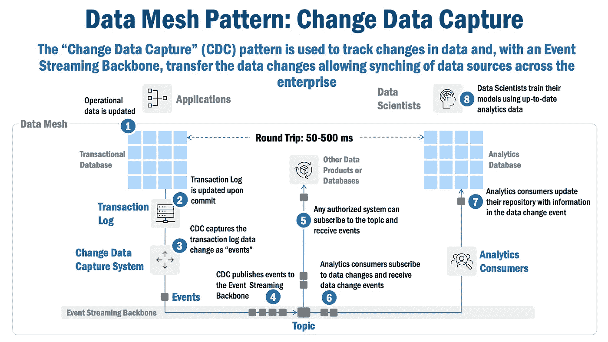
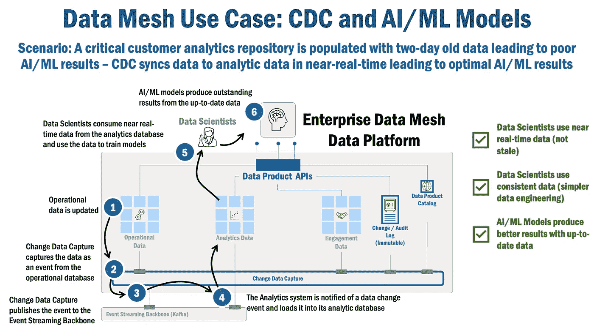

# 数据网格模式:更改数据捕获

> 原文：<https://towardsdatascience.com/data-mesh-pattern-deep-dive-change-data-capture-eb3090178c34>

# 数据网格模式:更改数据捕获

## 探索疾病控制中心模式的来龙去脉

Data Mesh 使用变更数据捕获模式在企业内安全可靠地移动数据。让我们深入研究一下这个模式，看看它在企业数据网中是如何工作的。

照片由 [Unsplash](https://unsplash.com/s/photos/writing?utm_source=unsplash&utm_medium=referral&utm_content=creditCopyText) 上的 [Dariusz Sankowski](https://unsplash.com/@dariuszsankowski?utm_source=unsplash&utm_medium=referral&utm_content=creditCopyText) 拍摄

# 变更数据捕获:基础数据网格模式

[Zhamak Dehghani 最近的【Data Mesh 文章介绍了一种全新的企业数据管理方式。域所有权、将数据视为产品、数据自助服务和联合数据治理方法的结合有望彻底改变企业数据管理。](https://martinfowler.com/articles/data-mesh-principles.html)

但是实现企业数据网格还需要新的方法来处理企业数据管理的技术基础。因此，理解企业数据网格使用的支持这一功能的关键模式非常重要:

*   **变更数据捕获**，企业数据网格使用它来跟踪数据库中的数据何时发生变更；这些变化被捕获为“事件”。
*   **事件流骨干**，用于将 CDC 事件和其他值得注意的事件(例如，对数据网格的 API 调用)传达给企业数据网格中感兴趣的消费者(数据产品内部和之间)。(深潜可用[此处](/data-mesh-pattern-deep-dive-event-streaming-backbone-99a5bb2a7cbf))。
*   **企业数据产品目录**，一个允许开发者和用户在企业数据网格中查看关于数据产品的元数据的存储库。
*   **不可变的变更/审计日志**，它保留了企业数据网格中的数据变更，用于将来的审计和治理目的。

在本文中，我将**深入**第一个企业数据网格模式**变更数据捕获**。将讨论几个主题:

*   模式总结，
*   模式问题域和上下文，
*   企业数据网格中的模式执行，
*   实施 CDC 以支持企业数据网格模式的候选供应商。

本文是系列文章的第一篇。后续文章将讨论其他企业数据网格模式。

但是，在我们开始深入探讨之前，您可能希望回顾一下企业数据网格架构(此处提供)以及基础数据网格模式(此处提供)的概要。

# 模式摘要

**变更数据捕获** (CDC)捕获数据库事务日志中的条目，并将它们(通过事件流主干)发布给企业中的任何相关方(应用程序、人员等)。这是在原始事务之外进行的，这意味着 CDC 可以捕获运营(或分析)数据的变化，而不会对原始应用或事务流产生任何影响。

# 背景和业务问题

即使在最好的情况下，在企业中安全、可靠且一致地移动数据也是一项挑战。企业使用几种方法来应对这一挑战，但有两种方法是最常见的。

首先，在跨多个数据库同步更新数据的情况下，可以使用“两阶段提交”(2PC)。不幸的是，这种方法既复杂又昂贵，通常只适用于保持多个数据源同步至关重要的情况。

第二种方法是使用 ETL (Extract-Transform-Load)技术首先更新主数据库，然后在一段时间后，更新第二个数据库。但是这种通常使用批处理实现的[方法](/an-architecture-for-the-data-mesh-32ff4a15f16f)会导致数据陈旧、不同步和不一致。

# 解决办法

现代 CDC 产品通过提供用于捕获数据更改的可重复模式来解决这一问题，并且通过事件流主干等支持模式，提供了一种在企业内安全、可靠、快速且一致地移动数据的方法。

CDC 解决方案(尤其是与事件流主干相结合时)有许多优势:

*   **更简单的架构**:在事务提交到本地数据源后，CDC 从数据库事务日志中捕获数据，从而消除了 2PC 挑战。
*   **非侵入式**:通过在数据提交后捕获数据变更事件，CDC 不需要在源数据系统中进行代码变更；当从旧的遗留系统迁移数据时，这是一个关键因素，因为在许多情况下不允许更改代码。
*   **更简单的消费** : CDC 以 JSON 等易于使用的格式提供了每条数据变更记录的通用格式(通常是“之前”和“之后”的列数据加上相关元数据)。
*   **生产级集成**:它们拥有生产级内置连接器，可连接到 Kafka 等常见事件平台，以安全可靠地传递数据变更。
*   **近乎实时的数据传输**:使用 CDC 传输的数据近乎实时可用，从传统数据提交到收到 CDC 事件的时间通常在半秒(500 毫秒)或更短时间内。

# 它是如何工作的

图 1(如下)展示了变更数据捕获是如何工作的。

*图 1:数据网格模式:变更数据捕获*

1.  数据库中的数据被更新(插入、更新、删除)。在许多情况下，这些更新发生在事务性或遗留数据库中，尽管我见过分析数据作为 CDC 来源的场景。
2.  每个操作都在数据库的[事务日志](https://en.wikipedia.org/wiki/Transaction_log)中提交。这是几乎所有数据库(事务数据库或分析数据库)的共性，构成了要捕获的数据的基本前/后映像。
3.  变更数据捕获(CDC)系统捕获数据库事务日志中的每个条目，将事务日志条目格式化为具有众所周知的格式(通常是 JSON，由 JSON 模式定义)的“事件”。这些事件包含下游系统所需的所有信息，不仅包括数据的“之后”副本(即在提交发生之后)以及可用于审计/治理目的的数据的“之前”拷贝。
4.  CDC 将事件发布到由事件流主干(通常是 Kafka)管理的主题。事件流主干模式提供了多种抽象，使得跨企业发送数据变得容易:**事件**，由 JSON 模式定义，分布在企业数据网格中；**主题**用于在整个企业中排队和分发事件——企业数据网格使用众所周知的主题，这些主题通过允许许多实体发布和消费事件来充当队列；**生产者**将事件发布到主题——企业数据网中的生产者可能是 API、应用程序或 CDC**消费者**消费来自主题的事件——企业数据网格中的消费者可以是订阅主题并在事件可用于处理时得到通知的任何实体或应用程序；**事件流处理器**基于单个事件或基于时间窗口聚合来处理事件，从而在企业数据网格中实现非常复杂和强大的分析技术；**代理**管理上述组件，以确保整个企业数据网中安全可靠的事件通信。
5.  主题的任何订阅者都会收到消息，并根据需要进行处理；订户可能会提前订阅主题。
6.  在常见情况下，来自遗留系统的 CDC 事件由分析事件“消费者”接收。
7.  分析消费者使用数据更改事件中的信息更新他们的分析数据库。
8.  任何分析用户都可以使用近实时数据来使用同步分析库；例如，数据科学家可以使用近实时同步(50-500 毫秒往返)的分析存储库，使用最新数据训练他们的模型。

# 数据网格的模式使用场景

企业数据网格将 CDC(带有事件流主干)用于多种目的:

*   **将更改传播到下游订户和组织中的系统**:数据网格使用它来同步数据产品内以及数据产品之间的数据；在企业数据网格中，AI/机器学习训练系统的模型由这种模式提供是很常见的。
*   **实现实时企业** : Data Mesh 利用近乎实时的数据捕获和传输来实现下一代分析和参与系统，这些系统依靠最新数据发展壮大。数据科学家认识到，接近实时的数据可以带来更好的结果。
*   **出于审计目的跟踪数据变更** : Data Mesh 捕获 CDC 事件，这些事件可以存储在不可变的变更/审计日志中，以支持审计和治理需求(这在任务关键型 AI/ML 应用程序中尤其重要)。

考虑下面的例子:一个客户分析知识库被用来训练关键的 AI/机器学习模型。但是，数据是使用隔夜批处理过程填充的。因此，数据科学家意识到这些数据是不一致的，需要大量的数据工程工作来清理。他们还意识到数据是 24-48 小时前的，这种陈旧的数据会导致较差的 AI/ML 模型结果和预测。

*图 2:数据网格用例:CDC 和 AI/ML 模型*

在企业数据网格中使用 CDC(和事件流主干),情况如下(图 5):

1.  操作数据被更新。
2.  变更数据捕获(CDC)从操作数据库中捕获数据，并将其转换为事件。
3.  CDC 将事件(包含有关最近数据更改的所有信息)发布到事件流主干。
4.  分析系统(近乎实时地)收到数据更改事件的通知，并将其加载到其分析数据库中。
5.  数据科学家从分析数据库中获取近乎实时的数据，并使用这些数据来训练他们的模型。
6.  AI/ML 模型产生杰出的结果，因为它们使用最新的模型！

# 供应商前景

我合作过的 CDC 产品中有两种非常受欢迎且功能强大。我很乐意推荐在企业数据网格中使用它们中的任何一种，尽管对于您的特定情况，我所概述的差异可能会使一种比另一种更好:

*   Debezium :这可能是最流行的开源解决方案，理由很充分。首先，它与 Kafka 的源连接器一起开箱即用，因此与最流行的事件流主干产品一起工作时只需最少的配置和设置。第二，它集成了许多流行的数据库产品，包括 Postgres、MongoDB、Oracle 等；第三，它有一个非常活跃的贡献者社区，这预示着它的长远未来。如果您正在将现代的基于 SQL 的数据库或 NoSQL 数据库集成到您的企业数据网格中，这是“首选”解决方案。
*   [Connect](https://www.precisely.com/product/precisely-connect/connect)from precise:该产品提供了出色的 CDC 功能(类似于 Debezium)，但也集成了大型机数据源，包括旧的 IMS 和 VSAM 数据库(Debezium 尚未提供)。这使得它成为旨在加速“大型机现代化”计划的大型企业数据网格实现的主要考虑因素。

*完全披露:我在推荐上述任何产品方面没有任何经济利益***——我之所以强调这些产品，是因为我有一些使用它们的经验，它们对我来说效果很好。**

# *总结想法*

*企业数据网格使数据在企业内安全、可靠、快速、一致地移动变得容易，从而支持实时数字企业。CDC 是用来提供这种能力的几种基本模式之一。*

*希望本文能为您提供构建 CDC 功能和启动企业数据网格所需的洞察力！*

*****

**除非另有说明，本文中的所有图片均由 Eric Broda(本文作者)创作。图像中使用的所有图标都是普通的 PowerPoint 图标，不受版权保护。**