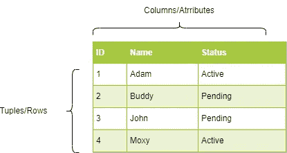
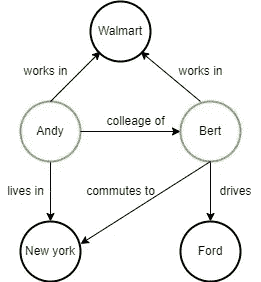

# 揭示的数据模型

> 原文：<https://towardsdatascience.com/data-models-revealed-how-to-choose-the-right-model-647f19469b89>

## 如何选择合适的型号


洛伦佐·埃雷拉在 [Unsplash](https://unsplash.com/s/photos/tech?utm_source=unsplash&utm_medium=referral&utm_content=creditCopyText) 上的照片

自本世纪初网络泡沫以来，软件一直主宰着世界。在过去的 20 年里，技术变得更加容易接近，更加个人化，更加便携。

这些年来，软件和应用程序发展迅速，驱动它们的数据模型也是如此。不可否认，好的数据模型对软件开发是有影响的。

简单来说，

> 数据模型很大程度上决定了在其上运行的软件的特性和局限性。

好软件上的错误数据模型很可能等同于糟糕的软件体验..因此，为您的应用选择正确的模型非常重要。

自从 Edgar Codd 在 1970 年提出第一个可以想象的关系模型以来，在过去的 50 年中，数据建模的概念已经经历了一段时间。

下面的数据模型在改变我们今天开发软件的方式上起了很大的作用。

*   关系模型
*   文档模型
*   图形模型

在下面的章节中，我们将介绍这些数据模型、查询语言支持和一些关键指标，以帮助您找到正确的方向。

没有经过验证的原则来选择正确的模式。在接下来的部分中，您可以在数据中找到需要注意的模式，以确定自然适合您的用例的模型。

# 什么是关系模型？

可能是最著名的数据模型，其中数据以由*行*和*列*组成的*关系(表*)的形式组织。列也称为属性，是关系的属性，元组是包含单个记录的表中的单行。

创建关系模型背后的想法是将数据如何存储、结构化和检索的复杂性隐藏在一个干净的界面后面。这也被称为 ***声明式*** 模型，在这种模型中，用户只需要指定他们需要从系统中得到什么，而不用担心系统是如何完成的。

历史数据被表示为一棵大树，但它不适合表示多对多的关系，因此发明了关系模型，数据以表格的形式存储。这种在表中存储数据的格式对于最终用户和数据库系统来说都是非常直观的，这不足为奇。



图 1:关系表(作者图片)

除了能够直观地存储数据之外，关系模型还提供了诸如原子性、一致性、隔离性和持久性等好处，这些都是现代关系数据库的基本特征之一。

## 查询语言和 DBMS 选项

猜这个没分。SQL 几乎是关系模型的同义词。作为世界上最流行的查询语言之一，SQL 非常适合运行关系查询。

SQL 允许标准的关系操作

*   创建(插入)
*   检索(选择)
*   更新
*   删除

大多数数据库供应商都提供某种形式的关系数据库产品。以下是基于市场份额的最受欢迎的数据库系统。

*   神谕
*   关系型数据库
*   Microsoft SQL Server
*   精力

随着云的出现，现在很多都在转向可扩展的云数据库，比如 Azure SQL 数据库、Amazon RDS、Google Cloud SQL 等等。

## 何时考虑关系模型？

大多数情况下，关系模型几乎适用于任何用例，因为它简单而直观。在以下情况下使用关系模型

*   你熟悉 SQL。掌握一个数据模型需要付出很多努力，而 SQL 有一个强大的技术社区，提供有良好文档记录的解决方案，您很可能不会遇到无法解决的问题。
*   您的数据是高度结构化的，并且您期望模式中的变化最小。
*   您的数据很简单，本质上是高度事务性的。例如:商店中的交易或客户的银行取款和存款。
*   您有多对多的关系，并且严重依赖连接来构建复杂的查询和报告。

# 什么是文档模型？

2010 年以后，数据的数量、种类和速度超出想象，这在很大程度上推动了采用新模型的迫切需求。

需要不受限制地表达数据*。于是 NoSQL 模型的诞生被解释为 ***而不仅仅是 SQL*** *。**

*今天的大多数应用程序使用面向对象的编程范式，这使得关系模型的一个巨大缺点变得非常突出。由于数据存储在关系表中，通常需要一个转换层来将应用程序代码中的对象映射到分布在数据库中几个表中的对象。您可能对术语对象关系映射器(ORM)很熟悉，SQL Alchemy 就是其中之一。*

*支持文档模型的主要论据是数据局部性和模式灵活性。在关系模型中，单个对象可以跨多个表存储，而在面向文档的模型中，给定对象的所有信息都存储在数据库的单个实例中。这总是消除了对 ORM 层的需求。*

*让我们以用文档模型的形式表示简历为例。您可以将这种数据结构编码为 XML 或 JSON，两者都是文档模型的子类。作为一个例子，JSON 更简单。*

*上面的表示更适合这种数据结构，因为它具有更好的数据局部性。如果必须在关系模型中表示相同的内容，则必须将数据拆分并存储在多个表中。数据的检索需要杂乱的连接。在 JSON 格式中，所有相关信息都在一个地方，一个查询就足够了。*

*与关系数据库不同，文档数据库还提供了模式灵活性*。没有模式意味着新的键和值可以添加到文档中。例如，在上面的文档中，在简历中引入一个名为*证书*的新部分作为一个新的字段是非常容易的。**

**这也被称为 ***读取模式*** ，应用程序仅在数据被读取时解释数据的结构。另一方面，大多数关系数据库执行一种模式，也称为 ***写模式*** ，其中数据库确保所有写入的数据都符合特定的模式。**

**当您希望数据之间有大量的互连性时，文档模型就变得不那么吸引人了。文档模型中对连接的需求越多，应用程序就越需要尽力实现良好的性能。对于高度互联的数据，关系模型是可以接受的，但是 ***图模型*** 更自然。下一节将详细介绍这一点。**

## **查询语言和 DBMS 选项**

*   **MongoDB——一个开源的面向文档的数据库系统，它有自己的语言，称为 MongoDB 查询语言。**
*   **azure Cosmos DB——微软提供的一个多模型数据库，它甚至允许你使用 SQL 查询 JSON 条目。**
*   **Amazon Dynamo DB —使用 PartiQL(一种 SQL 兼容的查询语言)查询 NoSQL 数据库。**

## **何时考虑文档模型？**

*   **如果您的数据是异构的:文档模型允许将不同类型和格式的数据存储在一起，而不需要预先定义模式。**
*   **模式灵活性。您的数据在不断发展，无法强制符合特定的模式。**
*   **应用程序严重依赖于对象，ORM 很慢。**
*   **数据局部性。如果您希望将数据放在同一位置以获得更快的读取性能。**

**针对数据局部性的优化不仅适用于文档模型，还有其他 NoSQL 模型也支持这种属性。 ***列族***Cassandra 和 Bigtable 等数据库提供了一种针对数据局部性进行优化的混合模型。这种类型的模型适用于数据仓库、商业智能报表，因为它们在聚合方面提供了高性能。**

# **什么是图模型？**

**关系使我们成为人类。如果是关系造就了你的数据呢？随着数据点之间的互联变得复杂，需要一个新的英雄。**

**图形数据模型通常属于 NoSQL 的范畴。一个图由两个对象组成- ***顶点*** 和 ***边*** ，例如在一个社交网络图中，人是顶点，边代表哪些人相互跟随。**

**以图表的形式实现、构造和查询数据的方法有很多种。 ***属性图模型*** 就是其中之一，由构建现代图形数据库的先驱之一 Neo4j 实现。**

**在属性图模型中，顶点具有唯一的 ID、输出边、输入边和一组属性。边由唯一 ID、起始顶点、结束顶点、描述关系的标签和一组属性组成。**

**让我们以两个人安迪和伯特的社交图为例。**

****

**图 2:社交图(作者图片)**

**上面的图表是自我描述的，不需要更多的解释。该模型的重要方面包括:**

*   **任何顶点都可以使用边连接到另一个顶点。没有底层模式强制规定什么可以连接，什么不可以连接。只有关系才能定义它。**
*   **从任意一个顶点开始，你可以很容易地沿着顶点链遍历图形。**
*   **使用标签来适当地定义关系，几种不同类型的信息可以存储在同一个图中。**

**这样一个模型的好处是，你可以很容易地将这两个人的更多事实无缝地结合在一起。例如，您可以通过添加一个音乐类型的顶点和一条连接人们各自兴趣的边来表示每个人喜欢什么类型的音乐。**

**图形模型与应用程序发展的速度相匹配，并且易于适应应用程序的变化。**

## **查询语言和 DBMS 选项**

**尽管没有一种通用的查询语言适用于图模型，但是市场上有许多产品通常与一个供应商相关联。**

****Cypher** 是用于 Neo4j 数据库的声明式查询语言。下面的例子显示了为上面的图形例子插入部分数据的 cypher 查询。**

```
**CREATE
(Andy:Person {name:'Andy'}),
(Bert:Person {name:'Bert'}),
(Newyork:Location {name:'Newyork'}),
(Walmart:Company {name:'Walmart'}),
(Andy) -[:works_in] -> (Walmart),
(Bert) -[:works_in] -> (Walmart),
(Andy) -[:lives_in] -> (Newyork)**
```

**查找所有在沃尔玛工作的人。**

```
**MATCH
(person) -[:works_in] -> (Walmart)
RETURN person.name**
```

## **什么时候考虑图模型？**

*   **你的数据是高度关联的。关系是数据的一等公民。**
*   **您的数据通常具有多对多的关系，关系模型需要复杂的连接，因此变得低效。**
*   **社交网络、欺诈检测、物流等使用案例。**

**图形模型比其他模型更受用例和目的的驱动。上面的数据可以很容易地在关系数据库中建模，但是高效查询关系的需求允许图模型获得荣誉。**

# **摘要**

**从历史上看，数据最初是以树的形式表示的，这种形式不适合多对多的关系，因此出现了关系模型。然后，开发人员发现需要一个模型来反映他们的应用程序的面向对象的范例，这导致了 NoSQL 模型的发明。**

**如今，每种模型设计都有自己的用途，没有放之四海而皆准的解决方案。模型的决定应该总是基于应用。**

**关系模型的统治地位已经持续了 30 多年，这在计算的历史上是一个伟大的壮举。**

**还有一些模型没有在本文中详细提及，如 ***列-家族模型、基因组数据库模型、全文搜索*** 等。**

**随着我们的进步，关系模型和 NoSQL 之间似乎有一些交叉。这是一件好事，因为这些模型相互补充，这是数据库在不久的将来要走的一条好道路。**

## **参考**

1.  **[设计数据密集型应用](https://www.oreilly.com/library/view/designing-data-intensive-applications/9781491903063/) —马丁·克莱曼**
2.  **[NoSQL 数据库的类型](https://www.guru99.com/nosql-tutorial.html) — Guru99**
3.  **[何时使用 SQL](https://integrant.com/blog/when-to-use-sql-vs-nosql/) — Integrant**