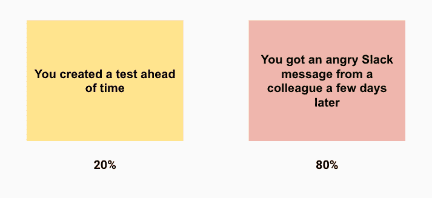

# 数据可观察性与数据测试:您需要知道的一切

> 原文：<https://towardsdatascience.com/data-observability-vs-data-testing-everything-you-need-to-know-6f3d7193b388>

## 您已经测试了您的数据。你也需要数据的可观察性吗？

图片由来自[Shutterstock.com](http://www.shutterstock.com)的 ESB Professional 提供，通过标准许可购买

在过去的十年里，针对不良数据的第一道也是唯一一道防线就是测试。

类似于软件工程师在将代码推向生产之前使用单元测试来识别有问题的代码，数据工程师将利用测试来检测和防止潜在的数据质量问题进一步向下游发展。这种方法(大部分)很好——直到[现代数据工作流程](https://www.montecarlodata.com/how-to-conduct-incident-management-on-your-data-pipelines/)发展到公司开始接收如此多的数据，以至于单点故障不可行。

在软件工程的世界里，没有一个程序员会在没有测试的情况下将代码部署到产品中。类似地，如果没有持续的监控和可观察性，没有工程师会运行生产代码。

鉴于分析数据为这些软件应用提供了动力——更不用说更广泛业务的决策和战略了——我们为什么不将同样的勤奋应用于我们的数据管道呢？

数据是不断变化的，使用不可靠数据的后果远比不准确的仪表板或报告更为严重。即使是数据质量上看似最微不足道的错误，也可能滚雪球般演变成更大的问题。

最近，一位金融科技客户(我们称她为 Maria)解释了她的团队直到几天后才发现的货币转换错误是如何导致收入和工程时间的重大损失的。

Maria 和她的团队以为他们已经进行了所有适当的测试来防止数据停机，但事实并非如此。发生了什么事？

在任何数据系统中，[都有两种类型的数据质量问题](https://www.montecarlodata.com/the-new-rules-of-data-quality/#:~:text=The%20two%20types%20of%20data%20quality%20issues):你能预测的(*已知的未知*)和你不能预测的(*未知的未知*)。虽然 Maria 和她的团队进行了数百次测试来捕捉一组离散的已知未知，但他们没有明确的方法来解释未知的未知，或者随着公司数据生态系统的发展，添加新的测试来解释已知的未知。

玛丽亚解决问题时，损害已经造成。

事实是，已知的未知和未知的未知需要两种不同的方法来[测试](https://www.getdbt.com/product/data-testing/)和[数据可观测性](https://www.montecarlodata.com/what-is-data-observability/)。以下是它们之间的区别，以及一些最佳团队为大规模解决数据质量问题所做的工作:

# 我应该什么时候测试我的数据？

在数据进入生产数据管道之前发现数据质量问题的最常见方法之一是测试数据。通过测试，数据工程师可以验证其组织对数据的假设，并编写逻辑来防止问题向下游发展。

[数据测试](https://www.montecarlodata.com/what-is-data-testing/)是一个必备工具，有助于捕捉数据管道中出现的特定已知问题，并在新数据或代码打破您最初的假设时向您发出警告。

一些最常见的数据质量测试包括:

*   **空值** —是否有不应该存在的未知值(空值)？
*   **卷** —你的数据到了吗？如果是的话，你得到的是太多还是太少？
*   **分布** —数值是否在预期/要求的范围内？
*   **唯一性** —您的唯一 ID 字段中是否有重复值？
*   **已知不变量** —利润永远是收入和成本的差额吗？

数据测试非常类似于软件工程师如何使用测试来提醒他们对他们的应用程序可能发生的问题的理解。

但是，数据测试足以控制破损的数据管道吗？

与软件类似，数据是企业成功的基础。因此，它需要在任何时候都是可靠和值得信赖的。与[站点可靠性工程师(SREs)](https://sre.google/) 管理应用停机时间的方式相同，数据工程师需要专注于[减少数据停机时间。](https://www.montecarlodata.com/how-to-calculate-the-cost-of-data-downtime/)

就像单元和集成测试不足以确保软件的可靠性一样，数据测试本身也不能解决数据可靠性的问题。

需要有一种方法来提醒你可能没有预料到的问题(未知的未知)，以及随着你的公司吸收更多的数据，如果你能够神奇地克隆自己，你*可以*测试的问题。尽管如此，即使你可以克隆你自己——加倍你写测试的能力——这是对你时间的一个好的利用吗？

大概不会。需要有一种方法来覆盖你所有的基础，即使是在运动中。

# 什么时候应该使用数据可观察性？

即使是最全面的测试套件也无法解决整个堆栈中可能出现的所有问题——不仅仅是特定测试覆盖的部分。为了考虑未知的未知，并跟上数据管道中不断增长的已知未知量，您还需要在可观察性上投资。

为了保证高[数据可靠性](https://www.montecarlodata.com/what-is-data-reliability/)，您的数据质量方法必须对您的数据管道具有端到端的可见性。与 DevOps 可观察性解决方案(即 [Datadog](https://www.datadoghq.com/) 和 [New Relic](https://newrelic.com/) )一样，[数据可观察性](https://www.montecarlodata.com/what-is-data-observability/)使用自动化监控、警报和分类来识别和评估数据质量问题。

可观察性涵盖的数据质量问题包括:

*   一个不更新的 Looker 仪表盘或报告，陈旧的数据几个月都不会被注意到，直到一位业务主管在季度末访问它并注意到数据是错误的。
*   对您的组织的代码库的一个小更改，导致 API 停止收集为 Tableau 仪表板中的关键字段提供动力的数据。
*   对 JSON 模式的一次意外更改使 50，000 行在一夜之间变成了 500，000 行。
*   您的 ETL(或 ELT)发生了意想不到的变化，导致一些测试无法运行，从而导致几天内未被注意到的数据质量问题。
*   这个测试已经成为您的管道的一部分很多年了，但是最近没有更新来反映当前的业务逻辑。

*在与数百个数据团队交谈后，根据经验，我发现大约 80%的数据问题无法通过单独的测试来解决。图片由蒙特卡洛提供。*

如果测试您的数据发现了 20%的数据质量问题，那么另外 80%是由数据可观察性引起的。数据可观察性也有助于您的团队确定“为什么？”破损的数据管道背后——即使问题与数据本身无关。

# 数据可观察性不同于数据测试的四个方面

[数据可观察性](https://www.montecarlodata.com/data-observability-101-everything-you-need-to-know-to-get-started/)和数据测试帮助您实现相同的目标——可靠的数据。测试和可观察性都很重要，这两种方法是齐头并进的，但是每种方法保证数据质量的方式不同。

以下是可观察性不同于测试数据的四个重要方面:

## 1)端到端覆盖

现代数据环境非常复杂，对于大多数数据团队来说，创建和维护高覆盖率的健壮测试套件在许多情况下是不可能的，也是不可取的。

由于数据的复杂性，数据工程师不可能预测开发过程中的所有可能性。在测试不足的地方，可观察性填补了空白，为您的整个数据堆栈提供了额外的可见性。

## 2)可扩展性

编写、维护和删除测试以适应业务需求可能是具有挑战性的，特别是随着数据团队的增长和公司跨多个领域分布数据。我们从数据工程师那里听到的一个常见主题是在他们的数据生态系统中扩展数据测试的复杂性。

如果您经常回到您的数据管道，并为现有管道增加测试覆盖，这可能是对您的数据团队成员的巨大投资。

此外，当关于数据管道的关键知识掌握在数据团队的少数成员手中时，追溯性地解决测试债务将成为一件麻烦的事情——并导致资源和精力的转移，而这些资源和精力本可以用在移动指针的项目上。

可观察性有助于缓解跨管道扩展数据可靠性带来的一些挑战。通过使用基于 ML 的方法从过去的数据中学习并监控新的输入数据，数据团队可以在很少甚至没有投资的情况下获得对现有数据管道的可见性。由于能够设置自定义显示器，您的团队还可以确保涵盖独特的业务案例和重要资产。

## 3)根本原因和影响分析

测试有助于在数据进入生产之前发现问题。但是，即使是最强大的测试也无法捕捉到所有可能出现的问题——数据宕机仍然会发生。当它发生时，可观察性使得团队更快更容易地解决发生在数据生命周期每个阶段的问题。

由于数据可观察性包括端到端的沿袭，当数据中断时，数据工程师可以快速识别上游和下游的依赖关系。这使得[根本原因分析](/root-cause-analysis-for-data-engineers-782c02351697)更快，并帮助团队成员主动通知受影响的业务用户，并在他们解决问题时让他们了解情况。

## 4)节省时间和资源

数据工程师面临的最突出的挑战之一是速度，他们经常牺牲质量来实现速度。你的数据团队已经在时间和资源上受到限制，而你的首席营销官已经烦了你好几个星期了，你不能再等了。当然，在转换数据之前，你*应该*设置许多测试，但是时间不够。

数据可观察性充当了针对坏数据的保险政策，并加快了您的团队部署新管道的速度。它不仅涵盖了那些未知的未知，还帮助您捕捉与您的数据相关的已知问题。

# 那么，你两者都需要吗？

无论您的测试套件有多好，除非您的数据是静态的，否则指望测试本身就能避免数据停机是不可行的。随着数据栈的发展，编写新的测试、更新现有的测试和阈值以及废弃旧的测试所需的升级是乏味的，即使对于人员最充足的团队也是如此。

虽然数据测试可以用于较小的管道，但它不能很好地跨分布式数据系统扩展*。*为了满足这种新常态的需求，数据团队必须依靠测试和端到端的可观察性。

有了这种双管齐下的数据质量方法，您对停机时间的防御变得更加强大。

*有兴趣了解更多关于数据可观察性如何补充您的测试吗？伸手* [*利奥*](https://www.linkedin.com/in/lgavish/)*[*斯科特*](https://www.linkedin.com/in/scott-o-leary-78000a43)*和* [*其余的蒙特卡洛团队*](https://www.montecarlodata.com/request-a-demo/) *。**

*[*斯科特·奥利里*](https://www.linkedin.com/in/scott-o-leary-78000a43) *对本文有贡献。**