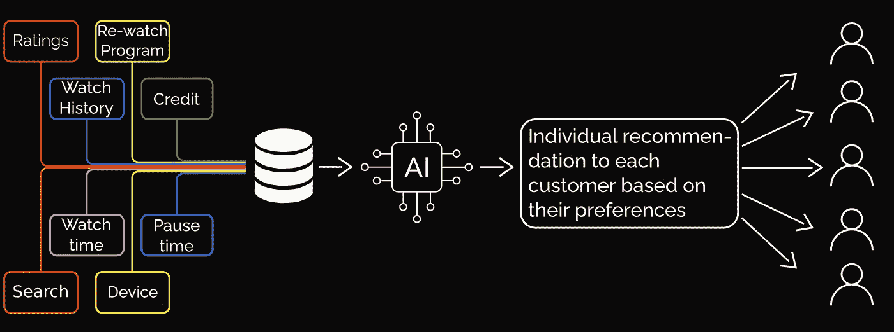
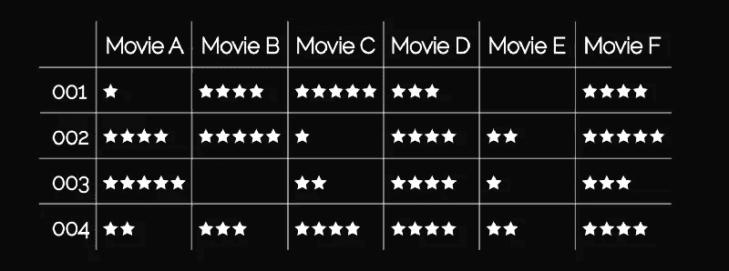
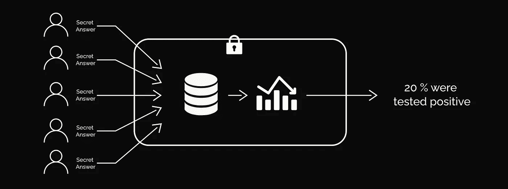
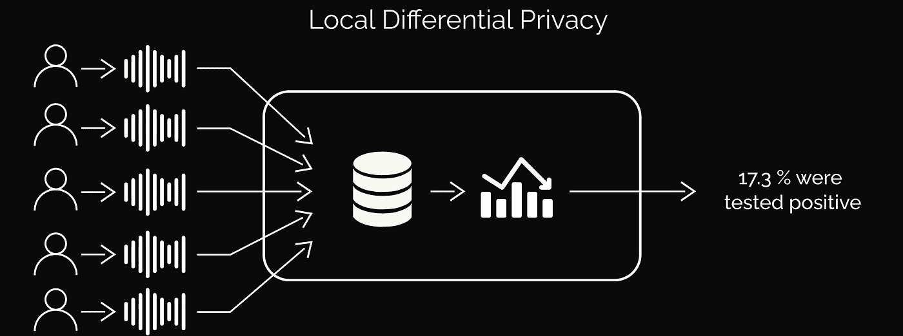
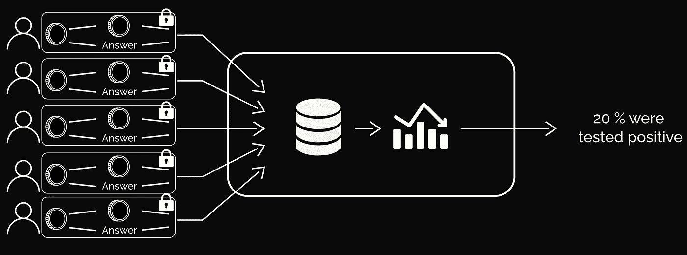

# 数据隐私:用我们看不见的数据回答问题

> 原文：<https://towardsdatascience.com/data-privacy-answering-questions-using-data-we-cannot-see-98381ed2eec>

## 差分隐私概念介绍

菲利普·卡岑伯格在 [Unsplash](https://unsplash.com?utm_source=medium&utm_medium=referral) 上拍摄的照片

## **公司为什么收集数据**

在过去的十年里，人工智能(AI)和机器学习(ML)发展非常迅速，现在已经成为我们日常生活的一部分。例如，ML 算法通过识别不适当的内容来防止我们被垃圾邮件淹没，它们引导我们以最快的可能路线穿过城市，或者推荐我们可能喜欢的流媒体平台上的内容。

与经典的由软件工程师硬编码规则的算法相反，ML 自动从现有数据中学习这些规则。可用的数据越多，它们的性能就越好。因此，公司已经成为数据驱动的环境，专门从事数据收集、存储和提取过程，以开发出色的基于 ML 的服务。

作者图片

例如，流媒体平台收集关于我们的偏好和行为的数据，以训练 ML 算法。这些算法可以向每个客户提供他们可能喜欢的内容。这是一种双赢的局面:作为客户，我可以从改进的服务中受益，因为我不必手动搜索庞大的电影和电视剧集来找到我喜欢的内容。另一方面，公司不会失去我这个客户，因为总有新的内容可以消费。然而，也有不利的一面。我必须向公司披露我的流媒体习惯。当这些与个人相关的数据公之于众时，可能会对我产生不利或其他方面的影响。因此，我必须相信公司会安全地存储我的数据。

## 为什么数据应该匿名

如果可能的话，安全存储这些个人相关数据的努力是相当巨大的。但是，不仅存储困难，使用也困难。假设一家公司雇佣数据科学家，根据这些数据来改进他们的服务。在这种情况下，每个数据科学家都需要访问个人相关数据。因此，必须确保这些人可靠地工作，并且不滥用他们对数据的洞察力。

为了规避这些问题，数据匿名化的想法似乎是显而易见的:只要不存储允许直接识别个人身份的数据(如姓名、地址等)即可。然而在现实中，事情并没有那么简单。

## 不匿名的匿名数据

由 [Unsplash](https://unsplash.com?utm_source=medium&utm_medium=referral) 上的 [Venti Views](https://unsplash.com/@ventiviews?utm_source=medium&utm_medium=referral) 拍摄的照片

2006 年，网飞发起了一场公开竞赛，让人们提出更好的推荐系统。为此，他们公布了来自 50 万客户的 1000 万份电影排名。为了保护这些客户的隐私，个人信息被删除，姓名被替换为随机数字。乍一看，人们会将这样的数据集归类为匿名数据集。

作者图片

奥斯汀德克萨斯大学的研究人员认识到，每个顾客的总体评价几乎是独一无二的。例如，在上图中，电影 A 的一星、电影 B 的四星和电影 C 的五星的评级组合对于用户 001 是唯一的。因此，即使个人信息已经被移除，评级的唯一性潜在地允许用户的重新识别。

Arvind Narayanan 和 Vitaly Shmatikov [1]正是这么做的:他们证明了通过将网飞的数据集与从[互联网电影数据库](http://www.imdb.com) (IMDb)搜集的公开信息相结合，有可能消除大部分顾客的匿名性。事实证明，用户不仅可能在网飞应用程序中给出类似的评级，在 IMDb 也是如此。

这表明，当数据通过简单地删除姓名等直接标识符而被“匿名化”时，存在固有的安全问题。:**去匿名化的成功取决于攻击者的背景知识**。然而，攻击者拥有的背景知识量是无法猜测的。更重要的是，背景知识将随着时间不断增加，因为可用数据的数量在不断增加。今天无法识别的数据集，十年后可能会变得很容易。

这就引出了一个问题:不看数据就用数据来回答问题是不是很优雅？在电影推荐算法的情况下，这将意味着我们根据以前的用户数据来改进算法，而不需要查看这些数据。

## 更好的方法:用我们看不见的数据来回答问题

为了更好地理解如何利用我们看不见的数据来回答问题，让我们考虑一个非常简单的随机选择的例子:假设我们想知道我们有多少同事吸食可卡因。由于这是一个敏感的问题，我们想保护每个参与者，使他们的答案不会被公开。为此，我们创建了一个安全的数据库，并确保当参与者输入数据时，其身份是未知的。此外，没有与参与者相关的数据(如姓名等。)存储在这个数据库中。

在我们的每个参与者都回答了问题并将他们的数据输入数据库后，我们对数据库进行了一些统计分析，发现 20%的参与者消费可卡因，并公布了这些发现。

作者图片

这种方法的一个大问题是，即使数据库不包含任何与参与者相关的信息，也不能保证他们的匿名性。例如，如果我想知道我的同事中谁吸毒，我必须找出 n-1 个参与者的答案。在这个例子中，我可以问每个参与者他们是否吸食可卡因。当然，每个参与者都可以自由地与我分享他们的答案，因为这是他们的数据，他们可以对他们的数据做任何他们想做的事情。

有了 n-1 个参与者的答案，结合这些发现和公布的 20%的可卡因消费者来推断最后一个参与者的答案是一件很容易的事情，这个人不想和我分享他们的答案。

类似于网飞数据的例子，去匿名化的成功取决于攻击者的背景知识。

一种更好的完全保护每个参与者隐私的方法是一种叫做差分隐私的技术。差异隐私是 Cynthia Dwork 在 2006 年定义的一个框架[2],它指出，无论有什么其他研究、数据集或信息源可用，数据主体都不会受到不利或其他影响。这意味着，通过应用差分隐私，即使在无限计算能力的情况下，并且当所有其他参与者的答案都是已知的时，每个个体的隐私也得到保护。这听起来可能是一个困难的任务，但基本概念很简单:**我们只需要包含一点随机性。**因此，无论何时，只要对手想出了关于特定数据主体的特定属性，人们总是可以争辩说该属性不是真实的，而是随机生成的。这个概念叫做似是而非的可否认性。

根据何时包含这种随机性，差分隐私分为两类。全局差分隐私假设有一个可信任的管理员或数据库所有者。因此，每当不可信的第三方查询一些数据时，随机性就包含在内。

全球差分隐私草图:原始(私人)数据被添加到一个具有 tursted 管理器的数据库中。每当第三方用户查询数据库时，答案中都会包含一些随机噪声。形象受到作者的启发[4]

相反，本地差异隐私假设没有可信任的数据库所有者。因此，在收集/生成数据时直接增加了随机性。

局部差分隐私草图:在添加到数据库之前，将随机噪声添加到原始(私有)数据中。因此，不需要可信的数据库管理员。形象受到作者的启发[4]

回到可卡因调查，当地差别隐私的实施是直接的:每个参与者在回答之前扔两次硬币。当第一次掷硬币结果是正面时，参与者给出正确答案。另一方面，当是反面时，参与者回答第二次投掷(正面=是，反面=否)。在我们的数据库中，我们然后存储每个参与者的答案，而不知道它是参与者的真实答案，还是只是一个投掷硬币的随机答案。现在，即使攻击者知道除了一个参与者之外的所有参与者的真实答案，这个参与者仍然受到保护，因为有可能貌似合理地否认攻击者的推断答案是真实的。这是差分隐私的一个重要性质:**每个参与者的隐私都得到了保护，与攻击者的背景知识无关。**

作者图片

当然，在原始数据中加入噪声会影响我们调查的结果。然而，这种噪声的分布是已知的，并且当数据集足够大时，在数据分析过程中补偿这种噪声是容易的任务。例如，在我们的调查中，我们知道 50%的所有参与者随机给出了 50%是和 50%否的答案。在我们的评估中，我们会发现(而不是 20%)，35%的所有参与者回答是(35%是真实答案 20%和 50%随机答案的组合)。通过补偿随机答案，我们仍然发现 20%的参与者消费可卡因。

## 结论

总之，我们能够在不查看原始数据的情况下回答有多少员工吸食可卡因的问题。因此，在数据集中重新识别一个人的答案(几乎)是不可能的。更重要的是，再识别的成功不取决于背景知识，也不取决于计算能力。

如果你喜欢差分隐私的概念，我推荐以下安德鲁·特拉斯克举办的伟大演讲: [**隐私保护 AI(安德鲁·特拉斯克)| MIT 深度学习系列**](https://www.youtube.com/watch?v=4zrU54VIK6k&t=870s) **。**

感谢阅读！

## 参考

[1]大型稀疏数据集的鲁棒去匿名化— Arvind Narayanan 和 Vitaly Shmatikov
[2]差分隐私:结果调查—辛西娅·德沃克
[3]【https://www.openmined.org/
【4】[https://blog . open mined . org/basics-local-Differential-Privacy-vs-global-Differential-Privacy/](https://blog.openmined.org/basics-local-differential-privacy-vs-global-differential-privacy/)
[5】[**隐私保护 AI(安德鲁·特拉斯克)|麻省理工深度学习系列**](https://www.youtube.com/watch?v=4zrU54VIK6k&t=870s)