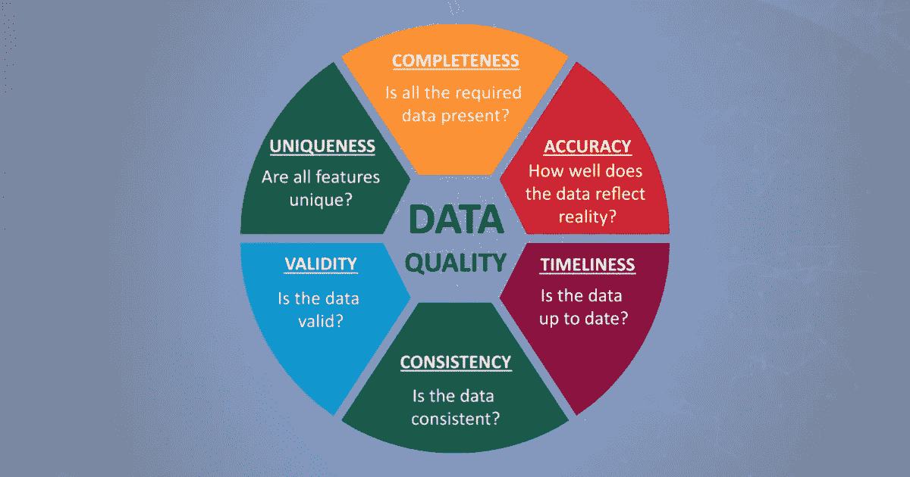
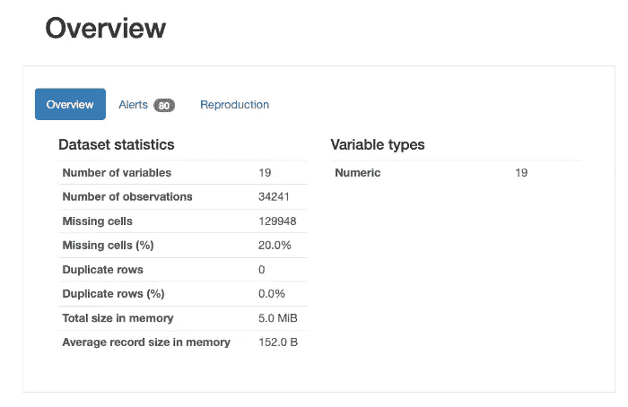
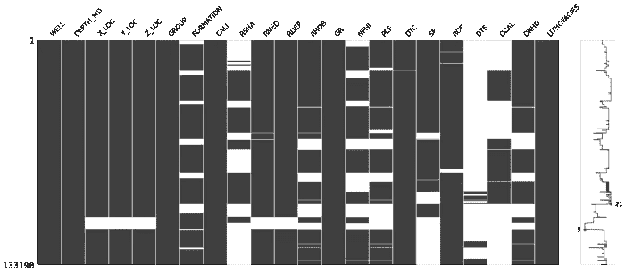
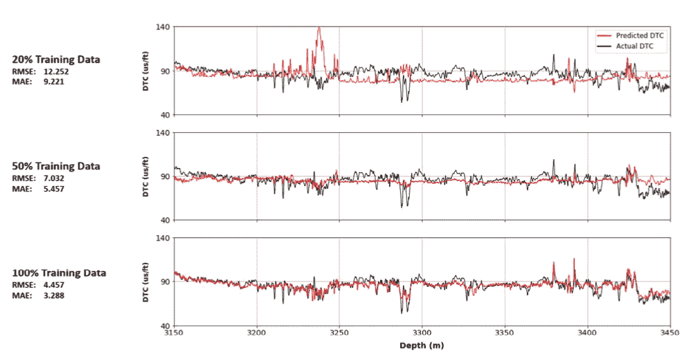
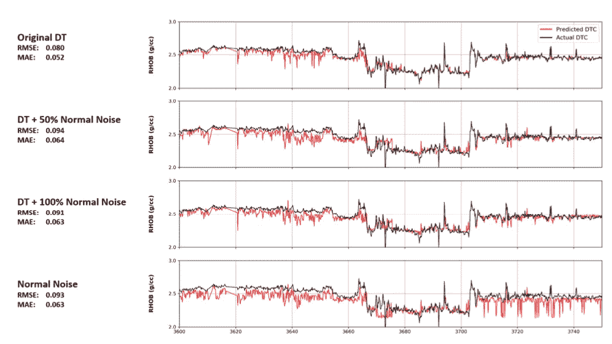
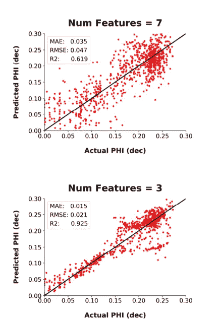

# 机器学习模型的数据质量考虑

> 原文：<https://towardsdatascience.com/data-quality-considerations-for-machine-learning-models-dcbe9cab34cb>

## 降低“垃圾输出中的垃圾”对机器学习模型的影响

[图片来自 Pixabay](https://pixabay.com/illustrations/digitization-transformation-earth-5231610/)

在运行机器学习算法之前，确保您拥有良好的数据质量是整个数据科学和机器学习工作流程中至关重要的一步。使用质量差的数据会导致结果严重恶化，并在根据这些结果做出决定时产生进一步的后果。

当开始进入数据科学和机器学习的世界时，我们在培训课程中经常遇到的数据集已经被清理和设置为提供一个好的答案。然而，在现实世界中，这是完全不同的。

真实世界的数据通常包含许多问题，从缺失值到错误值。如果在将数据输入机器学习模型之前没有处理好这一点，可能会导致严重的后果。这些后果可能会产生连锁反应，如财务影响，甚至健康和安全问题。

俗话说，垃圾进来，垃圾出去。如果我们将低质量的数据或错误选择的数据输入到我们的模型中，我们可以预期结果也将是低质量的。

# 什么是数据质量？

关于数据质量到底是什么，互联网上和文章中有许多定义。

最常用的定义是“适合用于特定目的”。这可能包括确保数据适合实现业务目标、做出明智而有效的决策，以及优化未来的运营。

以下是文献中关于这一主题的一些定义。

来自 Mahanti (2019) —数据质量:维度、测量、战略、管理和治理:

> “数据质量是数据满足企业规定的业务、系统和技术要求的能力。数据质量是对数据在特定环境下是否适合其用途的洞察或评估”

[来自斯坎纳皮科&卡塔奇(2002)](https://www.researchgate.net/profile/Tiziana-Catarci/publication/228597426_Data_quality_under_a_computer_science_perspective/links/0fcfd51169a156b61a000000/Data-quality-under-a-computer-science-perspective.pdf)

> “数据质量”一词是指数据应具备的一系列特征，如准确性，即正确程度，或通用性，即更新程度。”

来自[豪格、扎卡里亚森和利恩普德(2013)](https://www.econstor.eu/bitstream/10419/188448/1/v04-i02-p168_232-1425-1-PB.pdf)

> “数据质量通常被定义为‘适合使用’，即评估一些数据在多大程度上服务于用户的目的”

数据质量也由许多只关注质量的管理机构和组织来定义。

例如，在***【2015】****中，质量被定义为“一个对象的一组固有特性满足要求的程度”，其中固有指的是存在于一个对象内部而不是被赋予的属性。*

***挪威标准 NS 5801** 将数据质量定义为“符合规定的要求”*

*应当指出，这些定义将数据质量评估视为数据的相对属性，而不是绝对属性。*

# *数据质量差的代价*

*在企业中使用质量差的数据并做出决策的影响不仅仅是丢失行、错误值和不一致。*

*它会影响生产力。根据 Friedman 和 Smith 的研究，数据质量差会导致劳动生产率下降 20%。*

*这也被认为是 40%的新业务计划失败的主要原因。*

*根据 Gartner Quality Market Survey 的一项[调查，从货币角度来看，数据质量差可能会使组织每年损失高达 1500 万美元](https://www.gartner.com/smarterwithgartner/how-to-create-a-business-case-for-data-quality-improvement)。另外，据 IBM 称，这可能会使美国经济每年损失 3.1 万亿美元。*

*其他影响包括:*

*   *品牌和声誉受损*
*   *无能*
*   *错过的机会*
*   *收入损失*

# *数据质量的维度*

*如上所述，许多定义指的是定义相对数据质量的维度或特征。*

*大多数出版物都遵循 6 个关键维度。让我们仔细看看它们。*

**

*6 数据质量的共同特征。作者创造的形象(麦克唐纳，2021)。*

***完整性:**这是一个度量标准，用来衡量所有需要的数据是否都存在于数据集中，以及它是否满足正在进行的项目的目标。如果存在缺失数据，那么应该清楚如何处理这些数据。*

*此外，还应该检查数据中的默认值，因为它们可能会造成完整性的假象。*

*如果数据在我们的数据集中丢失，它会产生误导趋势，扭曲我们的分析结果。*

***准确性:**这是一个衡量数据准确反映被描述对象程度的指标。*

*换句话说，数据在多大程度上反映了现实？*

***及时性:**这是对决策所需数据可用性的衡量。正在处理的最新版本的数据是否可用于做出适当的解释？*

*我们不断更换电话号码、家庭住址和电子邮件地址。因此，确保我们掌握最新信息至关重要。*

*如果数据过时，那么对该数据做出的任何决策都可能是不正确的。*

***一致性:**这是对数据一致性的度量。相同的数据在不同的存储位置、软件包和文件格式之间应该保持一致。*

***有效性:**这是对数据在预定义的限制、期望和标准范围内符合程度的衡量。这可以应用于日期格式、电话号码、传感器测量等等。*

*例如，如果您期望值为 1、2 和 3，但查看的数据包含值 1.5、7 和 42，则这些值无效。*

*唯一性:特征或对象应该只在一个特定的数据集中出现一次，否则会发生混淆。*

*重复数据不仅会扭曲结果，还会增加计算处理时间和存储空间。*

*如果同一要素在一个数据集中多次出现，则需要识别或合并最后一个要素以形成复合要素。*

# *使用 Python 识别不良数据*

*Python 中有许多库可以帮助进行探索性的数据分析和识别数据中的问题。我以前在 Medium 上已经讨论过很多这样的问题。*

*以下是一些有帮助的方法和库:*

*这是一个很棒的小库，可以帮助你生成一个非常详细的数据统计报告。您可以在下面看到一个结果示例，它标识了丢失的数据、重复的行等等。*

*你可以在这里找到更多关于[熊猫的资料。](/pandas-profiling-easy-exploratory-data-analysis-in-python-65d6d0e23650)*

**

*熊猫概况报告的概述部分。图片由作者提供。*

***Missingno:** 一个非常简单易用的库，可以生成易于理解的数据完整性可视化。*

*你可以在这里找到更多关于它的信息*

**

*缺少显示所有 dataframe 列的数据稀疏性的矩阵图。图片由作者提供。*

***检测异常值:**无效数据点的检测可以通过使用箱线图、散点图和直方图的标准绘图技术来实现。但是，离群值也可以用[无监督机器学习技术来识别，比如隔离森林。](/isolation-forest-auto-anomaly-detection-with-python-e7a8559d4562)*

# *数据质量差对机器学习模型的影响*

*当使用质量差的数据或错误选择的好数据时，对机器学习模型有许多影响。作为调查数据质量问题对测井测量的影响的研究的一部分，我进行了大量的案例研究来说明这些影响。*

*以下是一些结果。*

## *缺失数据的影响*

*为了模拟丢失的数据，设置了一个实验，其中可用于人工神经网络的训练数据以 10%的增量减少。测试数据保持不变，以确保公平的比较。*

*如下所示，当全部数据(100%的训练数据)用于预测声波压缩慢度(DTC)时，我们产生了与目标特征的非常好的匹配。*

*然而，当训练数据减少到 50%时，模型开始退化，但仍然遵循整体趋势。并且当模型减少到只有原始训练数据的 20%时，与目标特征相比，结果非常差。*

**

*减少训练数据对简单人工神经网络性能的影响。作者图片(麦克唐纳，2021)*

## *噪声数据的影响*

*在第二个案例研究中，对将噪声引入训练特征之一的影响进行了评估。这是为了模拟可能导致错误记录的传感器噪声。*

*本案例研究的算法是随机森林，这是一种受监督的机器学习算法，由多个决策树组成。*

*从下面的结果可以看出，当噪声加入 DT 特性时，RHOB 的预测会变得更加嘈杂。然而，它在预测整体趋势方面仍然做得很好，这可能要归功于随机森林的工作方式。*

**

*训练数据中不同数量的噪声输入对堆积密度(RHOB)最终模型预测的影响。作者图片(麦克唐纳，2021)*

## ***错误选择特征对训练的影响***

*特征选择是机器学习工作流程中的关键步骤。它允许我们确定哪些特征与预测目标特征最相关。它还允许我们减少训练数据集的大小，这反过来有助于计算处理时间。*

*在下面的例子中，当在这个特定的案例研究中使用 7 个特征时，在比较真实测量值和实际测量值时，结果是分散的。然而，在将特征减少到 3 之后，在较低的孔隙率下拟合好得多，并且在较高的孔隙率下略有改善。*

**

*使用皮尔逊相关特征选择方法，不同数量输入的实际孔隙度和预测孔隙度散点图。图片由作者提供。(麦当劳 2022)*

## *关于示例的更多细节*

*如果你想了解这些例子的更多细节，你可以在下面找到我的研究论文:*

*[McDonald，A. (2021)岩石物理机器学习模型的数据质量考虑。岩石物理学](https://www.researchgate.net/publication/357867454_Data_Quality_Considerations_for_Petrophysical_Machine-Learning_Models)*

# *摘要*

*在运行机器学习模型之前，确保数据质量良好至关重要。如果使用了质量差的数据或错误地选择了输入，可能会导致严重的后果，这反过来又会产生进一步的连锁影响。*

**感谢阅读。在你走之前，你一定要订阅我的内容，把我的文章放到你的收件箱里。* [***你可以在这里做！***](https://andymcdonaldgeo.medium.com/subscribe)**或者，您可以* [***注册我的简讯***](https://fabulous-founder-2965.ck.page/2ca286e572) *免费获取更多内容直接发送到您的收件箱。***

**其次，通过注册会员，你可以获得完整的媒介体验，并支持我和其他成千上万的作家。每月只需花费你 5 美元，你就可以接触到所有精彩的媒体文章，也有机会通过写作赚钱。如果你用 [***我的链接***](https://andymcdonaldgeo.medium.com/membership)**报名，你直接用你的一部分费用支持我，不会多花你多少钱。如果你这样做了，非常感谢你的支持！****

# **参考**

**[McDonald，A. (2021)岩石物理机器学习模型的数据质量考虑。岩石物理学](https://www.researchgate.net/publication/357867454_Data_Quality_Considerations_for_Petrophysical_Machine-Learning_Models)**