# PySpark 中使用 Great Expectations 的数据质量单元测试

> 原文：<https://towardsdatascience.com/data-quality-unit-tests-in-pyspark-using-great-expectations-e2e2c0a2c102>

## 数据工程—数据质量—远大前程系列

## 将远大期望与无处不在的大数据工程平台相结合

由 [Unsplash](https://unsplash.com?utm_source=medium&utm_medium=referral) 上的[路径数码](https://unsplash.com/@pathdigital?utm_source=medium&utm_medium=referral)拍摄

It 数据以多快的速度进入你的电子表格或仪表盘并不重要，如果数据不正确，那么它就是无用的。此外，它可能导致错误的决定，并可能导致不可逆转的影响。强大的数据质量工具是任何数据工作负载不可或缺的一部分，以防止灾难。在本文中，我将带您了解我是如何在 Pyspark 中使用 Great Expectations 来通过数据转换执行测试的。

## PySpark 作为数据处理工具

Apache Spark 是一个著名的工具，通过在分布式环境中实现并行计算来优化 ETL 工作负载。它通常用于批量处理大数据，以减少处理大量数据所需的时间，同时最大限度地降低成本。

PySpark 公开 Python API 与 Apache Spark 接口。通过 PySparkSQL 库，开发者可以使用 SQL 处理结构化或半结构化数据。你所需要的就是 Python + SQL 来让事情运转起来。

参见下面一个简单的用例，其中文件从云存储中读取并加载到数据帧中。使用 SQL 对原始数据进行转换，并将结果物化回云存储。

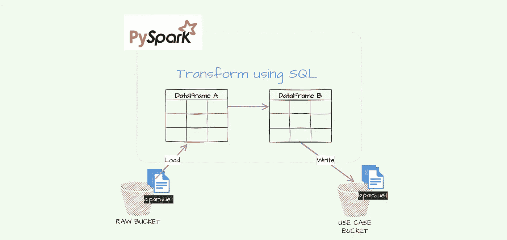

作者图片

## 处理数据质量

虽然 PySpark 是一种高效的转换工具，但数据工程的最终目标不仅仅是将数据从原始形式转换为可消费的形式，而是确保最终产品符合预期的质量标准。数据应该符合主题专家同意的业务规则。

以下是我们就数据提问的一些例子:

*   该列是强制的吗？
*   这些值有效吗？
*   格式是否正确？
*   我们如何确定一个账户在特定时期是活跃的？
*   如果列的格式是数字，它是否在某个范围内？

这些问题的答案被转换成业务规则，并根据数据进行验证。

## 远大前程的作用

不幸的是，Pyspark 并没有提供数据质量测试功能。这就是像《远大前程》这样的工具发挥作用的地方。

[远大前程](https://greatexpectations.io/)是一个用于单元和集成测试的开源工具。它附带了一个预定义的期望列表来验证数据，并允许您根据需要创建自定义测试。除此之外还有更多，但是为了这篇文章，这些是我希望首先探索的特性。

如果你渴望了解更多关于 Great Expectations 的其他特性，你可以跳转到我的另一篇[帖子](https://medium.com/towards-data-science/great-expectations-the-data-testing-tool-is-this-the-answer-to-our-data-quality-needs-f6d07e63f485)，在那里我根据一个业务需求评估了它的一些有用特性。

# 项目练习

## 目标

1.  探索从 [Kaggle](https://www.kaggle.com/kerneler/starter-kickstarter-campaigns-9f7d98d1-9/data) 下载的 Kickstarter 活动数据集。
2.  制定一个指标，计算每个评估年度每个定义类别的成功活动数量
3.  使用巨大的期望来执行单元和集成测试

## 怎么做

1.  数据集经历了从原始形式到最终指标输出的几层转换

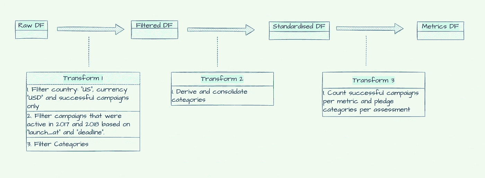

转换-作者的图像

模式更改-按作者分类的图像

2.对于每次转换，都要验证数据是否符合对数据的预期

对每个数据帧执行的测试—按作者排列的图像

## 先决条件

*   Kickstarter 数据集(在本练习中，文件仅存储在本地)
*   安装了 Great Expectations 库的 PySpark 环境
*   Jupyter 接口

> 注意:我没有分享如何在本地设置这个环境的说明。如果你有兴趣知道我是如何设置的，请在评论中告诉我。我可以写一篇关于它的文章。

# 开始吧！

> 注意:下面显示的代码是截图，但是 Jupyter 笔记本是在 [Github](https://github.com/karenbajador/pyspark_greatexpectations/blob/main/notebooks/Great%20Expectations%20-%20%20SPARK%20DataFrame.ipynb) 中共享的。

## 原始数据探索

1.  **首先，让我们导入库并启动 Spark 会话。**

**2。加载文件并创建一个名为“活动”的视图**

**3。探索数据集**

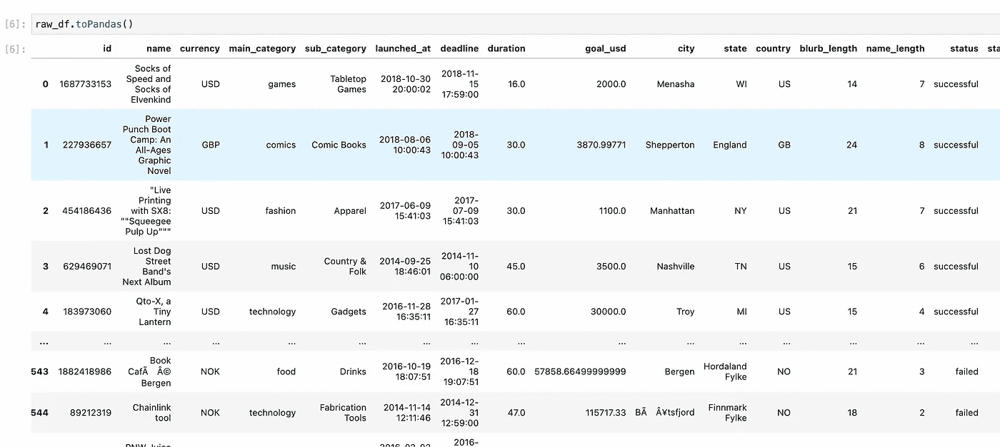

**4。进行数据分析**

这可以通过使用 Great Expectations 的内置函数来验证数据来实现。

> SparkDFDataset 继承了 PySpark 数据框架，并允许您根据它来验证期望值。

**5。为 raw_df 创建一个 SparkDFDataset 实例**

## 对原始数据的单元测试

1.  **检查强制列**

下面是用于确定最终指标范围的相关列。

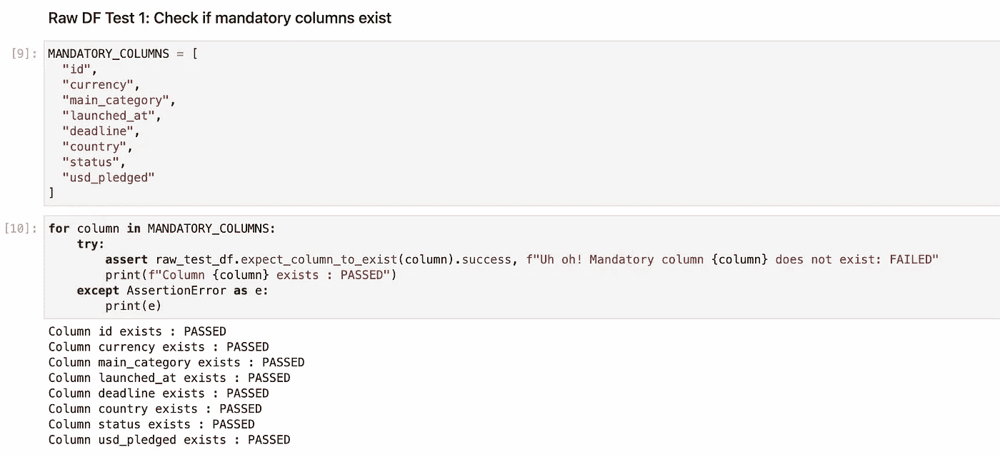

**2。强制列不应为空**

似乎我们有一个异常值！

**3。检查有效的日期格式**

我们在这里没有得到 100%的遵从。

**4。检查唯一性**

啊哦！这个数据集被填充了很多副本！

似乎我们的原始数据并不像我们希望的那样干净。但是在这一点上应该没问题，因为我们仍然需要过滤我们的数据，并最终针对范围内的数据集子集计算指标。

## 过滤数据

1.  **定义哪些活动在范围内**

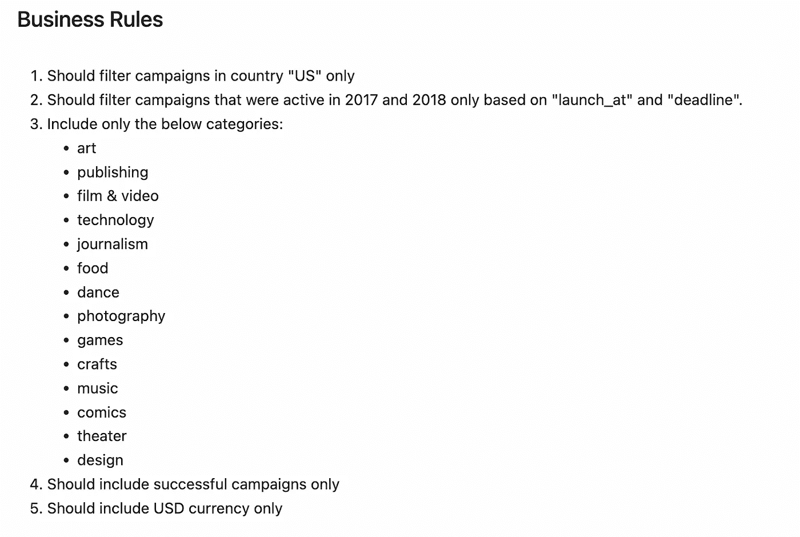

**2。声明一些变量**

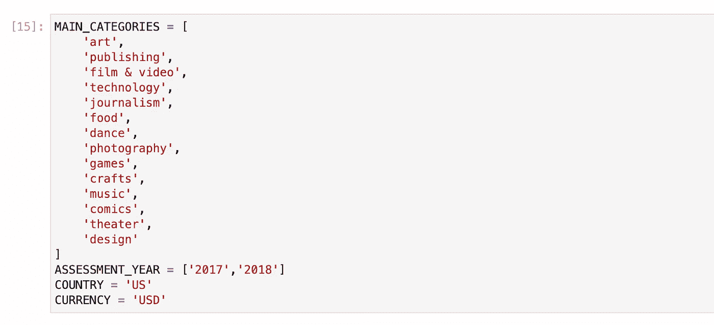

**3。生成评估年度的参考数据**

为什么我们需要一个参考数据来推算评税年度？在本例中，评估年度从 7 月的第一天开始，到 6 月 30 日结束。下表显示了每个评估年度的起止时间。

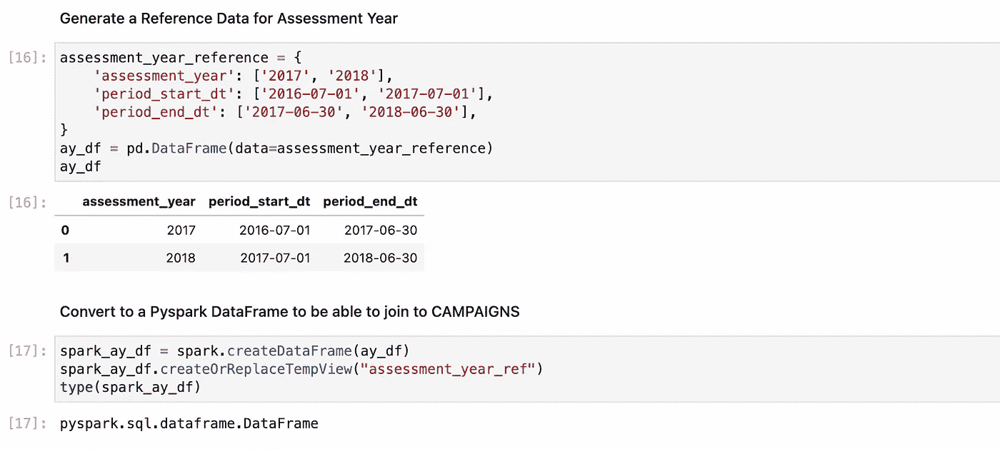

请参见下面的示例场景:

*   如果该活动开始于 2017 年 1 月 5 日，结束于 2017 年 6 月 30 日，则认为它在 2017 评估年度处于活动状态。
*   如果该活动开始于 2017 年 7 月 5 日，结束于 2018 年 1 月 5 日，则认为它在 2018 评估年度处于活动状态。
*   如果活动开始于 2017 年 1 月 5 日，结束于 2017 年 12 月 5 日，则认为它在 2017 年和 2018 年都处于活动状态。

**4。应用转换**

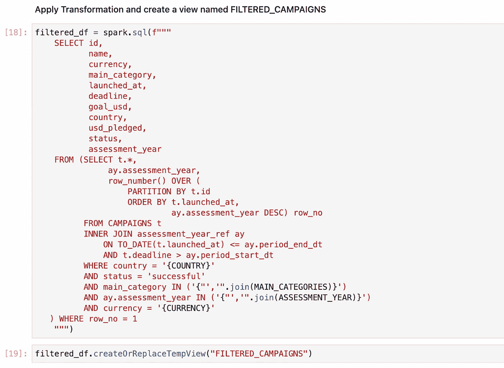

我预计数据集仍将包含一些重复，所以我做了一点小把戏。如果有重复的活动 id，查询将选择最新的记录。

**5。浏览过滤后的数据集**

**6。为 filtered_df 创建一个 SparkDFDataset 实例**

## 对筛选数据的单元测试

1.  **检查 main_category 是否在范围内**

**2。检查活动是否在“美国”国家内，货币是否为“美元”，是否仅包括成功的活动**

**3。检查强制栏是否存在**

**4。检查唯一性**

**5。检查有效的日期时间格式**

我们的数据现在看起来很整洁！现在我们可以进行下一步了。这些指标将根据派生的类别进行计算。我们将在转型的下一阶段生产这些类别。

## 标准化数据

1.  **定义在最终指标中使用的类别**

**2。转换数据**

**3。探索数据**

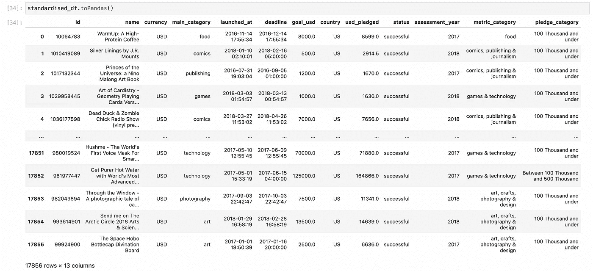

**4。为 standardized _ df**创建一个 SparkDFDataset 实例

## 标准化数据的单元测试

1.  **检查指标和质押类别是否有效**

**2。检查人口是否等于先前的数据集**

由于我们从未进一步筛选过数据集，因此预计行数保持不变。

进入最后一步！

## 生成最终指标

1.  **定义指标**

**2。应用变换**

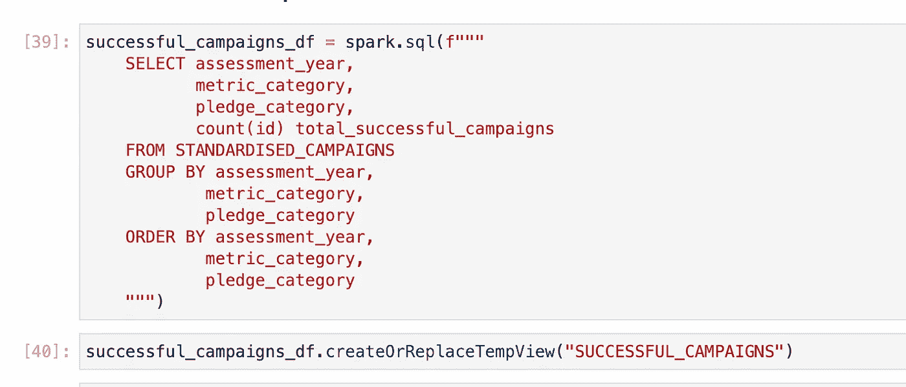

**3。探索数据**

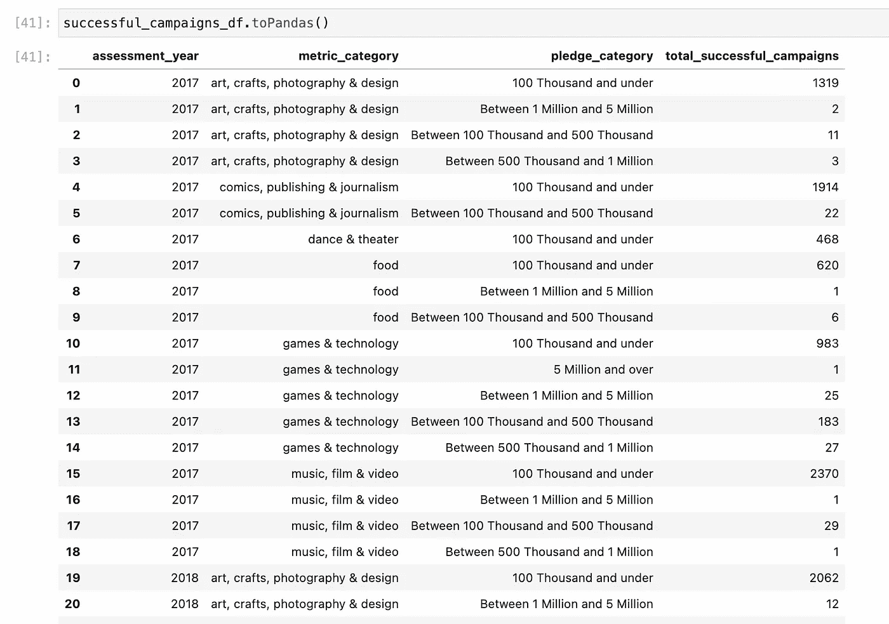

**4。为 successful_campaigns_df** 创建一个 SparkDFDataset 实例

## 最终度量的单元测试

1.  **检查列组合的唯一性**

2.**检查最终指标数据集中的活动总数是否符合预期**

最终指标数据集中的活动总数不应多于或少于汇总前的记录总数。

## 验证摘要

对 Great Expectations 数据集(SparkDFDataSet)调用 validate()函数将返回对该特定数据集执行的所有预期的汇总结果。

## 自定义测试

我还想进行一些测试，但是我找不到任何合适的函数。例如，我想根据 ***launch_at*** 和 ***deadline*** 来验证得出的评估年度是否正确。大期望可以扩展到允许使用自定义函数。我会就此写一个单独的帖子，但如果你想检查代码，请参见笔记本的最后一部分。

# 结论

我展示了如何利用[高期望值](https://greatexpectations.io/)来检查数据转换每个阶段的数据质量。我使用了许多内置的期望来验证 Pyspark 数据帧。在他们的[文档](https://greatexpectations.io/expectations)中可以看到完整的列表。我发现在笔记本上使用这个工具进行数据探索很方便。单元测试也需要整合到数据管道中，以确保每次数据发生变化时的可信度。这是我接下来要探索的。敬请期待！