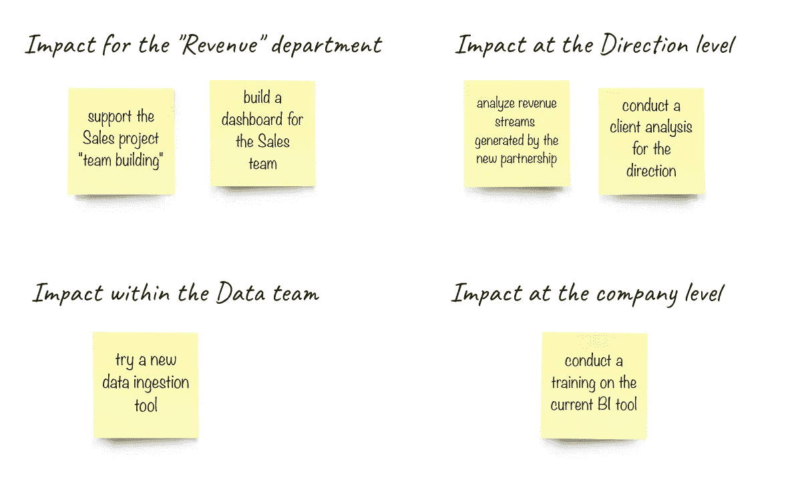

# 数据路线图:你应该包括还是不包括这个主题？

> 原文：<https://towardsdatascience.com/data-roadmapping-should-you-include-that-topic-or-leave-it-out-d4c19df7c0c3>

## 数据策略

## 决定数据路线图内容的四步方法

在 [Unsplash](https://unsplash.com/?utm_source=unsplash&utm_medium=referral&utm_content=creditCopyText) 上[空中聚焦](https://unsplash.com/@airfocus?utm_source=unsplash&utm_medium=referral&utm_content=creditCopyText)拍摄的照片

当我第一次听到“路线图”这个词时，我想象着任何一家公司的管理层成员在一个高度安全的房间里开会，闭门决定公司的未来。经验告诉我，**制定路线图实际上是一个更加开放和复杂的过程。**

在一个公司的数据部门——甚至是一个小型数据团队——构建路线图是一项重要的工作。路线图的目标是**决定团队将研究哪些主题，为什么，以及用什么资源**。在这篇文章中，我将重点关注团队工作主题的选择。

> "路线图是战略计划的可视化."(来源: [aha.io](https://www.aha.io/roadmapping/guide/roadmap/ultimate-guide) )

无论您是为公司的数据路线图做出贡献，还是负责完整地构建它，花时间从战略角度而不是从操作角度思考都会给您带来很多好处。它允许您从运营工作中退一步，并为您提供更清晰的未来视图。

> 下一季度的数据路线图应该包括什么？您希望您的数据团队在未来几个月内实现什么目标？

为了回答这些问题，我想介绍一下我自己构建路线图的方法。我在目前的公司经历过几次这个过程，所以把它当成一套指导方针，而不是严格的“一刀切”的方法来应用。

# 第一步:写下每个想法

最好的开始方式是…开始。如果你不知道从哪里开始，不要担心:只要写下你想到的任何想法。这里有一些你可以问自己的问题:

*   在我最近进行的分析中，我是否多次遇到相同的主题？
*   根据与同事的交流，我可以确定哪些与数据相关的需求？
*   我是否注意到一个高影响力的问题可以通过使用数据来解决？

这种反思可以自己进行，但是你也可以和同事一起组织一次头脑风暴会议，这样他们可以挑战你的想法。通过大声说出你的一些书面想法，一个人会更好地形成想法并提出新的想法。

另一个想出点子的好方法是全年定期查看这个问题列表。当你在一个主题上工作时，收集你的想法。如果你注意到一个相关的想法可能值得追求，把它写在你的“路线图待办事项”中。当详细阐述你的路线图的时候，你只需要看看它就能得到建立在其上的想法。

步骤 1 的示例— Marie Lefevre

# 第二步:将你的想法分成共同的主题

写下每一个想法后，你应该对所有可能成为你下一个路线图一部分的主题有一个全面但相当混乱的概述。

为了获得更清晰的图像，第二步是**将想法分成普通的组**。群体可以从以下方面的共性中产生:

*   几个思路解决的问题
*   企业部门关注的几个想法
*   实施几个想法的时间范围

围绕共同的挑战将想法分组将让你**对你在下一个路线图中可能解决的主题类型有一个初步的感觉**。在这一步中讨论过的一些话题甚至会显得无关紧要。举个例子，你可能会对某个主题有一些想法…但是这个主题最近已经被正式从公司的全球路线图中删除了。在这种情况下，你可以降低相关主题的优先级(这次甚至是放弃)。

步骤 2 的示例— Marie Lefevre

# 第三步:找到合适的主题组合

有了更清晰的组，你就可以开始下一步了:用它们来做一个漂亮的拼图。第三步的目标是**结合不同的主题类别，使它们符合路线图**。想法可能是无限的，但资源是有限的。这就是为什么这一步是最难的部分:选择什么将被包括在路线图中…什么不会。

为了找到正确的组合，我将每个主题分为以下三类:

1.  这个主题是否为公司的**结构项目服务？它可以与公司的长期愿景、季度 OKR(目标和关键结果)相关，也可以是数据团队参与的跨团队项目。**
2.  该主题是否有助于数据团队的**结构项目？它可以是技术迁移项目、与数据基础设施相关的改进、数据模型的变化等。**
3.  该主题是否回答了其他团队的**特殊需求？它可以对应于包含在另一个团队路线图中的项目，其中需要来自数据团队的专业知识(例如，数据摄取、建模、可视化)，或者您可以根据其他团队的路线图预测的主题**

现在的目标是**在这三种类型的数据主题之间找到平衡**。如果您选择了过多的“特定需求”主题，对结构项目不利，您就有积累技术债务的风险。相反，如果你在内部结构项目上投入太多的资源，你可能会忽略更多的公司范围内的主题:这可能会导致与其他团队的合作不那么密切，以及对公司正在处理的热点主题的操作性较差。

步骤 3 的示例— Marie Lefevre

# 第 4 步:与利益相关者确认…并提交

您的路线图现在离最终版本更近了。真的吗？现在是时候**与其他利益相关者分享你的工作了**。无论是对你的老板，对其他团队，还是在你的团队内部，路线图一旦被所有参与其中的人认可，就真正成为了现实。

在构建和巩固路线图的初始版本时，您可能会面临困难的选择:我们应该在下一季度处理主题 A 还是主题 B？在我看来，**为你的路线图**提供一到三个场景并没有错，如果你对选择的主题仍有疑问的话。只要确保清楚地介绍每一种选择及其利弊。向利益相关者提出一个明确的问题，这样你们可以共同决定路线图中应该包括什么，应该省略什么。

与利益相关者的讨论应该代表你通向伟大路线图的最后一英里。正如介绍中提到的，讨论还应该包括你的资源限制问题。当每个人都在你下个季度路线图的内容和时间上达成一致时，就是这样:剩下的就是平静地开始这个季度！

步骤 4 的示例— Marie Lefevre

# 结论:现在怎么办？

现在，您的季度路线图已经确定，您的团队已经准备好就选定的主题开展工作。现在发生了什么？

在本季度，确保**定期回到您的路线图**来检查正在进行的工作是否仍然符合路线图。如果不是，找出原因并做出决定:我们应该坚持原来的路线图还是应该做出调整？

至于**在步骤 1 和 2 中列出但未能包含在本季度路线图中的主题**，请将其保存在安全的地方。当构建下一个路线图时，你可以将它们包含在你的初始反思中——就像我们在步骤 1 中所做的那样！

*想免费获得我的数据路线图清单***？* [*你可以在这里下载*](https://marielefevre.gumroad.com/l/data-roadmapping-checklist) *。希望你会觉得这有用！**

*你喜欢读这篇文章吗？ [*成为*](https://marie-lefevre.medium.com/membership) *的一员，加入一个不断成长的充满好奇心的社区吧！**

* [## 通过我的推荐链接加入媒体-玛丽·勒菲弗尔

### 阅读玛丽·勒费夫尔(以及媒体上成千上万的其他作家)的每一个故事。每月 5 美元(或每年 50 美元),直接向…

marie-lefevre.medium.com](https://marie-lefevre.medium.com/membership)*