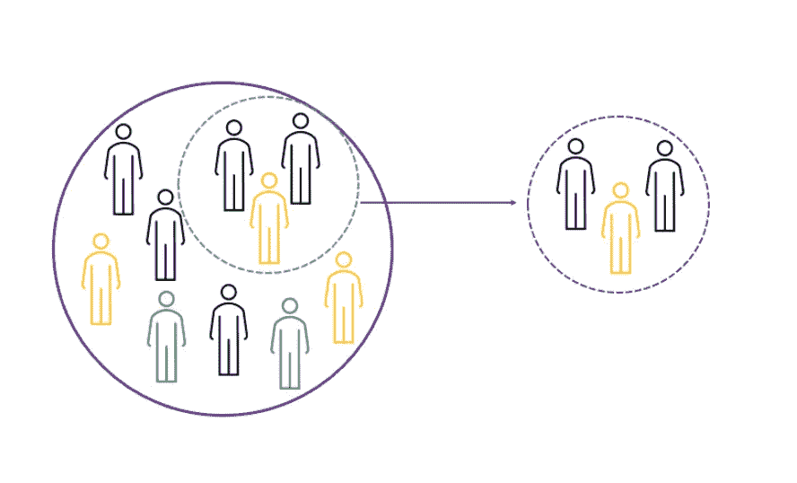
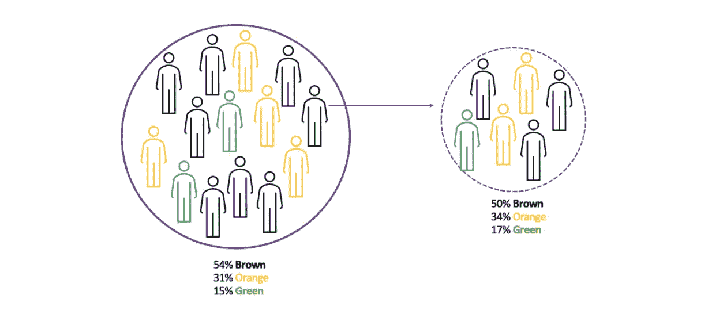
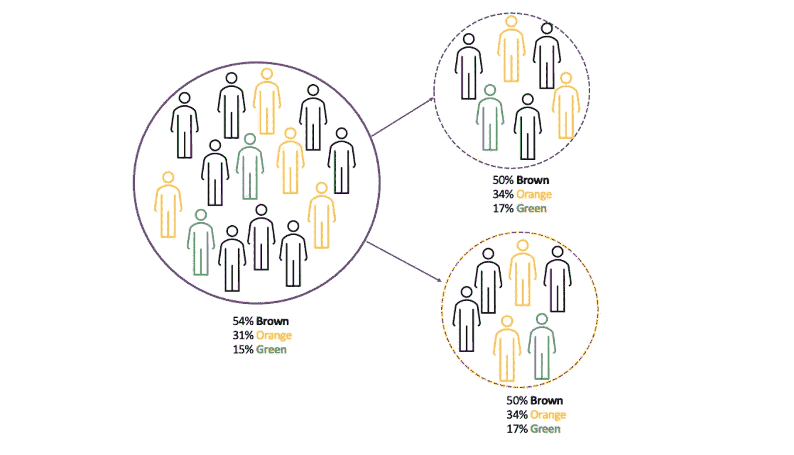

# Python 中的数据采样方法

> 原文：<https://towardsdatascience.com/data-sampling-methods-in-python-a4400628ea1b>

## 一个现成的代码，使用不同的数据采样技术在 Python 中创建一个随机的、有代表性的样本


图片来源:Pexels/christian-diokno

数据采样是大多数研究、科学和数据实验的重要组成部分。这是决定你的研究或调查结果准确性的最重要的因素之一。如果您的样品取样不准确，这可能会对最终结果和结论产生重大影响。根据需要和情况，有许多采样技术可用于收集数据样本。在这篇博文中，我将介绍以下数据采样技术:

```
**- Terminology: Population and Sampling 
- Random Sampling
- Systematic Sampling
- Cluster Sampling
- Weighted Sampling
- Stratified Sampling**
```

# 总体和样本介绍

首先，让我们来看看一些基本术语。学习 ***群体******样本*的概念很重要。*****总体*是所有观察值(个人、对象、事件或程序)的集合，通常非常大且多样化，而*样本*是总体中观察值的子集，理想情况下是总体的真实代表。**

****

**图片来源:作者**

**鉴于对整个人群进行实验要么是不可能的，要么就是太昂贵，研究人员或分析师在他们的实验或试验中使用样本而不是整个人群。为了确保实验结果可靠并适用于整个群体，样本需要真实地代表总体。也就是说，样本需要是无偏的。**

# **随意采样**

**从原始群体中创建随机样本的最简单的数据采样技术是随机采样。在这种方法中，在样本生成过程中，每个采样的观测值都有相同的被选中概率。当我们没有任何关于目标人群的先验信息时，通常使用随机抽样。**

**例如从 10 个人的群体中随机选择 3 个人。在这里，每个人都有均等的机会以 1/10 的选择概率被选入样本。**

****

**图片来源:作者**

## **随机采样:Python 实现**

**首先，我们生成随机数据作为人口数据。因此，我们将从正态分布中随机抽取 10K 数据点，平均值μ= 10，标准差 std = 2。在此之后，我们创建一个名为 **random_sampling** ()的 Python 函数，它获取人口数据和所需的样本大小，并生成一个随机样本作为输出。**

# **系统抽样**

**系统抽样被定义为一种概率抽样方法，其中从随机起点并在固定的*抽样间隔*后选择目标人群中的元素。**

**换句话说，系统抽样是概率抽样技术的一种扩展形式，在这种技术中，每隔一段时间就选择一个群体中的每个成员来构成一个样本。我们通过将总体规模除以期望的样本规模来计算抽样间隔。**

**请注意，系统抽样通常会产生随机样本，但不会解决创建的样本中的偏差。**

****

**图片来源:作者**

## **系统采样:Python 实现**

**我们生成的数据作为人口数据，就像前面的例子一样。然后，我们创建一个名为 **systematic_sample** ()的 Python 函数，它获取人口数据和采样间隔，并生成一个系统样本作为输出。**

> **请注意，系统抽样通常会产生随机样本，但不会解决创建的样本中的偏差。**

# **巢式抽样法**

**整群抽样是一种概率抽样技术，在这种技术中，我们根据特定的聚类标准将人群分成多个簇(组)。然后，我们用简单的随机或系统抽样技术选择一个随机群。因此，在整群抽样中，整个人口被分成群或段，然后随机选择群。**

**例如，如果你想在整个欧洲进行一次评估商业教育二年级学生表现的体验。不可能在欧盟的每所大学进行一项涉及学生的实验。相反，通过使用聚类抽样，我们可以将每个国家的大学归为一类。这些聚类定义了欧盟所有的大二学生群体。接下来，您可以使用简单的随机抽样或系统抽样，并随机选择用于您的调查研究的群组。**

**请注意，系统抽样通常会产生随机样本，但不会解决创建的样本中的偏差。**

****

**图片来源:作者**

## **集群采样:Python 实现**

**首先，我们生成的数据将作为 10K 观测的人口数据，该数据由以下 4 个变量组成:**

*   *****价格*** *:* 使用均匀分布生成，**
*   *****Id*****
*   *****event _ type****:一个分类变量，有 3 个可能值{type1，type2，type3}***
*   *****点击*** :二进制变量取值{0:不点击，1:点击}**

```
 id     price event_type  click
0        0  1.767794      type2      0
1        1  2.974360      type2      0
2        2  2.903518      type2      0
3        3  3.699454      type2      1
4        4  1.416739      type1      0
...    ...       ...        ...    ...
9995  9995  3.689656      type2      1
9996  9996  1.929186      type3      0
9997  9997  2.393509      type3      1
9998  9998  1.276473      type2      1
9999  9999  3.959585      type2      1[10000 rows x 4 columns]
```

**然后，函数 **get_clustered_Sample** ()将原始数据、每个聚类的观察值以及您想要选择的多个聚类作为输入，并生成一个聚类样本作为输出。**

```
 id     price   event_type  click  cluster
4847  4847  3.813680      type3      0       17
567    567  1.642347      type2      0       17
8982  8982  3.741744      type3      1       17
2321  2321  2.192724      type3      0       17
5045  5045  3.645671      type2      0       17
...    ...       ...        ...    ...      ...
5681  5681  3.175308      type1      0       90
882    882  2.676477      type2      1       90
2090  2090  3.861775      type3      1       90
907    907  1.947100      type3      0       90
2723  2723  2.557626      type1      0       90[200 rows x 5 columns]
```

> **请注意，整群抽样通常会产生一个随机样本，但不会解决所创建样本中的偏差。**

# **加权抽样**

**在一些实验中，你可能需要项目的抽样概率是根据与每一个项目相关的权重，这时就应该考虑观察类型的比例。例如，您可能需要一个搜索引擎中的查询样本，其权重为这些查询被执行的次数，以便可以分析该样本对用户体验的总体影响。在这种情况下，与随机抽样或系统抽样相比，加权抽样更为可取。**

**加权抽样是一种带有权重的数据抽样方法，旨在补偿具有不相等概率(过采样)、无覆盖、无响应和其他类型偏差的特定观察值的选择。如果不调整有偏差的数据集，而是使用简单的随机抽样类型的方法，那么人口描述符(例如，平均值、中间值)将会是偏斜的，并且它们将不能正确地表示人口与人口的比例。**

**加权抽样通过创建一个考虑总体中观察类型比例的样本来解决样本中的偏差。因此，加权抽样通常产生一个随机和无偏的样本。**

****

**图片来源:作者**

**然后，函数 **get_clustered_Sample** ()将原始数据、每个聚类的观察值以及您想要选择的多个聚类作为输入，并生成一个聚类样本作为输出。**

## **加权采样:Python 实现**

**函数 **get_weighted_sample** ()将原始数据和期望的样本大小作为输入，并产生加权样本作为输出。请注意，在这种情况下，比例是基于单击事件定义的。也就是说，我们计算点击事件为 1(假设 X%)和 0 (Y%，其中 Y% = 100-X%)的数据点的比例，然后我们生成一个随机样本，使得该样本也将包含点击= 1 时的 X%观察值和点击= 0 时的 Y%观察值。**

```
 id     price    event_type  click
event_type                                     
type1      0   6780  1.200188      type1      1
           1   8830  2.990630      type1      1
           2   8997  3.483728      type1      0
           3   7541  2.402993      type1      1
           4   4460  2.959203      type1      0
...             ...       ...        ...    ...
type3      29  5058  3.426289      type3      1
           30  5855  3.852197      type3      0
           31  6295  2.679898      type3      0
           32  8978  1.115072      type3      1
           33  7730  1.208441      type3      1[100 rows x 4 columns]
```

> **加权抽样通常产生一个随机的无偏样本。**

# **分层抽样**

****分层抽样**是一种数据抽样方法，我们根据具体特征(如年龄、种族、性别身份、地点、事件类型等)将一个群体分成称为*阶层*的同质子群体。).**

**被研究人群中的每一个成员都应该属于同一个阶层。然后，使用聚类抽样对每个阶层进行抽样，允许数据科学家估计每个子群体的统计测量值。当人口特征多样化时，我们依赖分层抽样，我们希望确保每个特征在样本中都有适当的代表。**

**所以，分层抽样，简单来说，就是整群抽样和加权抽样的结合。**

****

**图片来源:作者**

## **分层抽样:Python 实现**

**函数**get _ layered _ sample**()将原始数据、期望的样本大小、所需的聚类数作为输入，并产生分层样本作为输出。注意，该函数首先使用 **click** 事件进行加权采样。其次，它使用**事件类型执行聚类采样。****

```
 id     price event_type  click  cluster
0    5131  2.707995      type1      0       45
1    5102  1.677190      type1      0       45
2    7370  1.893061      type1      0       45
3    4207  2.491246      type1      0       45
4    8909  3.252655      type1      1       45
..    ...       ...        ...    ...      ...
96   3254  2.637625      type3      0       85
97   1555  1.196040      type3      1       85
98   7627  3.240507      type3      1       85
99   6405  1.607379      type3      0       85
100  1075  2.471806      type3      0       85[202 rows x 5 columns]
```

> **分层抽样，基本上是整群抽样和加权抽样的结合。**

# **如果你喜欢这篇文章，这里有一些你可能喜欢的其他文章:**

**</how-to-crack-spotify-data-science-technical-screen-interview-23f0f7205928>  </fundamentals-of-statistics-for-data-scientists-and-data-analysts-69d93a05aae7>  </simple-and-complet-guide-to-a-b-testing-c34154d0ce5a>  </monte-carlo-simulation-and-variants-with-python-43e3e7c59e1f>  <https://tatev-aslanyan.medium.com/bias-variance-trade-off-in-machine-learning-7f885355e847>  <https://tatev-aslanyan.medium.com/data-sampling-methods-in-python-a4400628ea1b>  <https://medium.com/analytics-vidhya/pyspark-cheat-sheet-big-data-analytics-161a8e1f6185>  

***感谢阅读***

*我鼓励你* [***加入 Medium today***](https://tatev-aslanyan.medium.com/membership) *拥有* *完整访问所有跨媒体发布的精彩锁定内容，并在我的 feed 上发布关于各种数据科学、机器学习和深度学习主题的内容。*

*关注我* [***中型***](https://medium.com/@tatev-aslanyan)**阅读更多关于各种数据科学和数据分析主题的文章。更多机器学习的动手应用，数学和统计概念查看我的*[***Github***](https://github.com/TatevKaren)**账号。
我欢迎反馈，可以联系*[***LinkedIn***](https://www.linkedin.com/in/tatev-karen-aslanyan/)*。***

*****快乐学习！*******