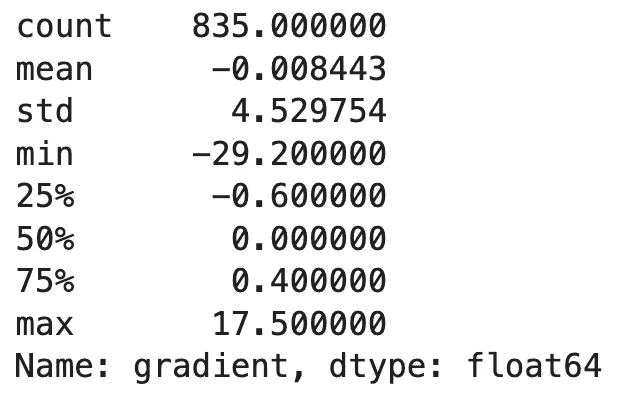
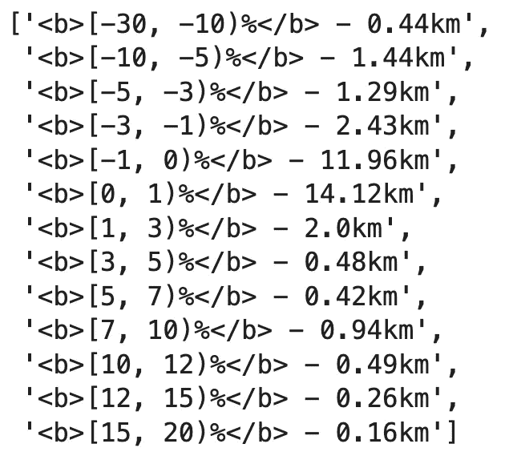
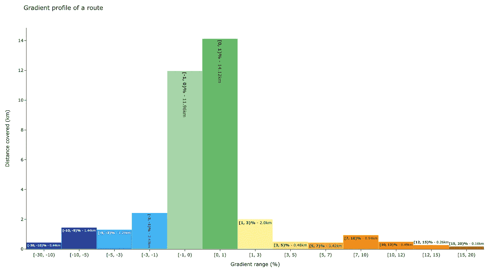

# 自行车运动的数据科学-如何可视化 GPX 路线的坡度范围

> 原文：<https://towardsdatascience.com/data-science-for-cycling-how-to-visualize-gradient-ranges-of-a-gpx-route-d709af02944d>

## [自行车数据科学](https://towardsdatascience.com/tagged/data-science-for-cycling)

## **第 5/6 部分——用 Python 和 Plotly 可视化 Strava 路线的坡度范围**


照片由 [Dmitrii Vaccinium](https://unsplash.com/@vaccinium?utm_source=medium&utm_medium=referral) 在 [Unsplash](https://unsplash.com?utm_source=medium&utm_medium=referral) 上拍摄

据我所知，距离自行车系列的最后一篇文章[已经有一段时间了。好消息是——这个故事今天还在继续。我们将从中断的地方继续，那就是梯度分析和可视化。现在你知道了什么是自行车运动中的坡度，以及如何将坡度计算为两点之间的高差。](/data-science-for-cycling-how-to-calculate-route-gradients-from-a-strava-gpx-file-2fc559980186)

今天，我们将可视化梯度范围，这意味着显示在特定梯度范围内，例如，在 3%和 5%之间，所用的时间和距离。在接下来的文章中，我们将在一个交互式 Python 仪表板中包括这种可视化(以及其他)。

不想看书？请观看我的视频:

你可以在 [GitHub](https://github.com/better-data-science/data-science-for-cycling) 上下载源代码。

# 如何读取 Strava 路径数据集

我们今天不会为 GPX 路线文件而烦恼，因为我们已经有了一个包含数据点、高程、距离和坡度数据的 CSV 文件。首先，我们将导入 Numpy、Pandas 和 Plotly，然后我们将读取数据集:

```
import numpy as np
import pandas as pd
import plotly.graph_objects as go
import plotly.offline as pyo

route_df = pd.read_csv('../data/route_df_gradient.csv')
route_df.head()
```

它看起来是这样的:


图片 1-包含距离、高程和坡度数据的 Strava 路径数据集(图片由作者提供)

我们对`gradient`栏特别感兴趣。为了开始分析，让我们调用它的`describe()`方法:

```
route_df['gradient'].describe()
```



图 2-梯度统计(图片由作者提供)

路线看起来大多平坦(平均值和中间值)，最小坡度为-29.2%，最大坡度为 17.5%。这些是我们下一步需要的关键信息—为梯度范围创建区间(箱)。

# 如何创造与熊猫的时间间隔

我们现在将梯度值分组到箱中。这样，我们可以计算每个梯度范围的统计数据，例如，在 3–5%梯度上捕获的所有数据点。为此，我们将使用熊猫的`IntervalIndex`类。它允许我们从元组中创建二进制文件。

以下区间指数中使用的值完全是随机的。您可以自由使用不同的文件来容纳您的路由文件。容器也是左闭合的，这意味着左边的值被包括在内，但右边的值不包括在内:

```
bins = pd.IntervalIndex.from_tuples([
    (-30, -10),
    (-10, -5), 
    (-5, -3), 
    (-3, -1), 
    (-1, 0),
    (0, 1), 
    (1, 3), 
    (3, 5), 
    (5, 7), 
    (7, 10), 
    (10, 12), 
    (12, 15), 
    (15, 20)
], closed='left')
bins
```


图 3-渐变范围的条块(作者图片)

现在让我们使用 Pandas 的`cut()`方法将这些条块添加到数据集:

```
route_df['gradient_range'] = pd.cut(route_df['gradient'], bins=bins) 
route_df.head()
```


图 4 —添加了渐变范围的数据帧(图片由作者提供)

我们现在在`gradient_range`列中存储了 13 个不同的组。下一步，我们将从中计算一些对可视化有用的统计数据。

# 从梯度范围计算统计数据

现在的目标是创建一个新的数据框架，其中包含每个梯度的统计数据，包括:

*   行驶距离
*   在此坡度范围内花费的游乐设备百分比
*   获得的高度
*   高程丢失

我们将通过迭代每个唯一的梯度范围并对数据集进行子集化来创建它，并从那里计算统计数据:

```
gradient_details = []

# For each unique gradient range
for gr_range in route_df['gradient_range'].unique():
    # Keep that subset only
    subset = route_df[route_df['gradient_range'] == gr_range]

    # Statistics
    total_distance = subset['distance'].sum()
    pct_of_total_ride = (subset['distance'].sum() / route_df['distance'].sum()) * 100
    elevation_gain = subset[subset['elevation_diff'] > 0]['elevation_diff'].sum()
    elevation_lost = subset[subset['elevation_diff'] < 0]['elevation_diff'].sum()

    # Save results
    gradient_details.append({
        'gradient_range': gr_range,
        'total_distance': np.round(total_distance, 2),
        'pct_of_total_ride': np.round(pct_of_total_ride, 2),
        'elevation_gain': np.round(elevation_gain, 2),
        'elevation_lost': np.round(np.abs(elevation_lost), 2)
    })
```

完成后，将列表转换为数据帧，并按渐变范围排序。这是一个`IntervalIndex`，意思是分类工作非常有效:

```
gradient_details_df = pd.DataFrame(gradient_details).sort_values(by='gradient_range').reset_index(drop=True)
gradient_details_df
```


图 5-每个渐变范围的统计数据(作者提供的图片)

这里有几个解释:

*   我已经在[-30%，-10%的坡度范围内走完了 442.96 米，一路上损失了 68.58 米的海拔。
*   大部分骑行是平的[-1%，1) —路线的 71，56%或 26 公里。
*   我只在 10%以上的坡度骑过 911 米。

现在让我们将这些数据可视化。

# 用 Plotly 可视化 Strava 梯度范围

我决定使用 Plotly 来可视化数据，因为默认情况下它会生成交互式图表。您可以继续使用 Matplotlib 或任何其他库。

首先，让我们为每个渐变范围声明一个颜色列表—从蓝色到红色(下降到上升):

```
colors = [
    '#0d46a0', '#2f3e9e', '#2195f2', '#4fc2f7',
    '#a5d6a7', '#66bb6a', '#fff59d', '#ffee58',
    '#ffca28', '#ffa000', '#ff6f00', '#f4511e', '#bf360c'
]
```

我们将制作一个条形图，每个条形图将显示一个梯度范围和以公里为单位的行驶距离。每个条形还将显示范围和行驶的距离。如果您使用英制系统，请随意将值转换为英里:

```
custom_text = [f'''<b>{gr}%</b> - {dst}km''' for gr, dst in zip(
    gradient_details_df['gradient_range'].astype('str'),
    gradient_details_df['total_distance'].apply(lambda x: round(x / 1000, 2))
)]
```



图 6 —单个栏的文本(作者提供的图片)

最后，我们将创建图形:

```
fig = go.Figure(
    data=[go.Bar(
        x=gradient_details_df['gradient_range'].astype(str),
        y=gradient_details_df['total_distance'].apply(lambda x: round(x / 1000, 2)),
        marker_color=colors,
        text=custom_text
    )],
    layout=go.Layout(
        bargap=0,
        title='Gradient profile of a route',
        xaxis_title='Gradient range (%)',
        yaxis_title='Distance covered (km)',
        autosize=False,
        width=1440,
        height=800,
        template='simple_white'
    )
)
fig.show()
```



图 7 —渐变范围的条形图(图片由作者提供)

我们可以看到，大部分乘坐是绿色的，这表明一个平坦的表面。5%及以上的坡度只有 2.3 公里的爬坡。听起来不多，但我的腿和肺当时不同意。

# 结论

这就是你要做的——如何可视化斯特拉发 GPX 路线文件的渐变范围。我不认为最终目标从一开始就是明确的，因为术语“渐变范围”可以意味着几乎任何东西。我希望你能在阅读后理解我对这个术语的看法，并希望你在分析你的 Strava 训练时会发现它很有用。

在接下来的文章中，我们将在一个交互式 Python 仪表板上组合到目前为止本系列中涉及的所有内容以及更多内容，敬请关注。

以下是整个系列的链接——我会在发布文章时添加网址:

*   [第 1 篇:从 Strava 加载并分析 GPX 文件](/data-science-for-cycling-how-to-read-gpx-strava-routes-with-python-e45714d5da23)
*   [第二条:用圆形标记和多边形线可视化来自 Strava 的 GPX 文件](/data-science-for-cycling-how-to-visualize-gpx-strava-routes-with-python-and-folium-21b96ade73c7)
*   [第三条:计算点与点之间的高差和距离，可视化路线的高程剖面图](/data-science-for-cycling-how-to-calculate-elevation-difference-and-distance-from-strava-gpx-route-cff147033c16)
*   [第四条:根据点与点之间的高差和距离计算路线坡度](/data-science-for-cycling-how-to-calculate-route-gradients-from-a-strava-gpx-file-2fc559980186)
*   文章 5:计算和可视化梯度剖面——在梯度范围内循环的距离
*   文章 6:创建一个 web 应用程序，分析并可视化用户从 Strava 上传的 GPX 文件

*喜欢这篇文章吗？成为* [*中等会员*](https://medium.com/@radecicdario/membership) *继续无限制学习。如果你使用下面的链接，我会收到你的一部分会员费，不需要你额外付费。*

<https://medium.com/@radecicdario/membership>  

*原载于 2022 年 3 月 2 日*[*https://betterdatascience.com*](https://betterdatascience.com/data-science-for-cycling-gradient-ranges/)*。*