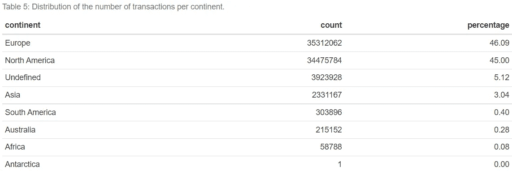
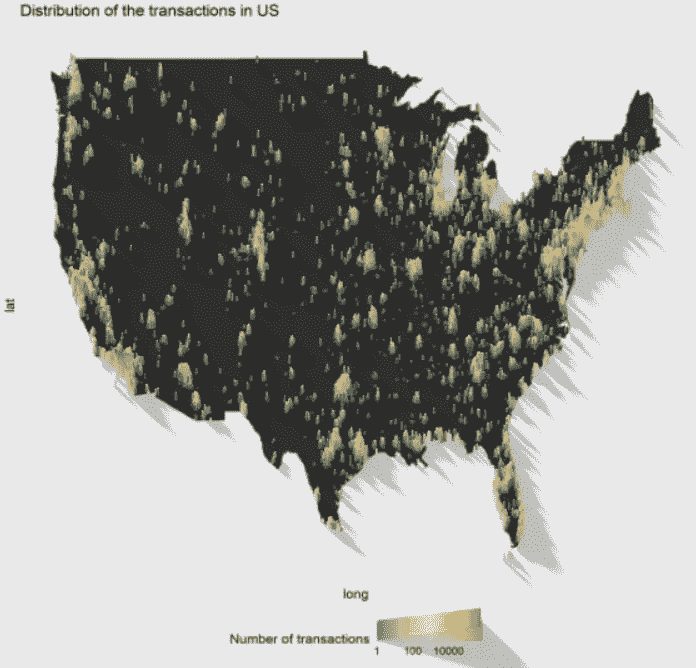

# 区块链上的数据科学，第三部分:基于氦的物联网正在接管世界

> 原文：<https://towardsdatascience.com/data-science-on-blockchain-with-r-part-iii-helium-based-iot-is-taking-the-world-d2bfe22deebc>

## 人民网有多大？

氦，人民网。照片来自 [Unsplash](https://unsplash.com/photos/4eFyWGPhvoo) 上的[尼玛 Mot](https://unsplash.com/@nimamot) 。

*作者托马斯·德·马尔钦和米拉娜·菲拉滕科娃*

*Thomas 是 Pharmalex 的高级数据科学家。他对区块链技术让世界变得更美好的不可思议的可能性充满热情。你可以在*[*Linkedin*](https://www.linkedin.com/in/tdemarchin/)*或者*[*Twitter*](https://twitter.com/tdemarchin)*上联系他。*

Milana 是 Pharmalex 的数据科学家。她对分析工具发现我们周围世界的真相和指导决策的力量充满热情。你可以在[*Linkedin*](https://www.linkedin.com/in/mfilatenkova/)*上联系她。*

**此处** **提供这篇文章的 HTML 版本，并附有高分辨率的图表。用来生成它的代码在我的**[**Github**](https://github.com/tdemarchin/DataScienceOnBlockchainWithR-PartIII)**上有。**

# 1.介绍

***什么是区块链:*** 区块链是一个不断增长的记录列表，称为块，它们使用加密技术链接在一起。它用于记录交易、跟踪资产以及在参与方之间建立信任。区块链主要以比特币和加密货币应用而闻名，现已用于几乎所有领域，包括供应链、医疗保健、物流、身份管理……一些区块链是公共的，任何人都可以访问，而一些是私有的。数以百计的区块链都有自己的规范和应用:比特币、以太坊、Tezos……

***什么是氦:*** 氦是一种分散的无线基础设施。这是一个利用分散的全球热点网络的区块链。热点是一种带有天线的调制解调器，用于提供远程连接(它可以达到传统 Wi-Fi 的 200 倍远！)之间的无线“物联网”(IoT)设备。这些设备可以是监测空气质量的环境传感器或用于农业目的的定位传感器，用于跟踪自行车车队…探索生态系统[这里](https://www.helium.com/ecosystem)。人们通过赚取氦代币来激励安装热点并成为网络的一部分，氦代币可以像任何其他加密货币一样买卖。要了解更多关于氦的知识，请阅读这篇优秀的[文章](https://www.nytimes.com/2022/02/06/technology/helium-cryptocurrency-uses.html)。

***什么是 R:*** R 语言在统计学家和数据挖掘者中被广泛用于开发数据分析软件。

这是关于使用 r 与区块链进行交互的系列文章的第三篇。第一部分重点介绍与区块链相关的一些基本概念，包括如何读取区块链数据。第二部分关注如何跟踪 NFTs 数据事务并使之可视化。如果您还没有阅读这些文章，我强烈建议您阅读一下，以便熟悉我们在第三篇文章中使用的工具和术语:[第一部分](/data-science-on-blockchain-with-r-afaf09f7578c)和[第二部分](/data-science-on-blockchain-with-r-part-ii-tracking-the-nfts-c054eaa93fa)。

氦是一个了不起的项目。与传统的区块链相关项目不同，它不仅仅与金融有关，还具有现实应用。它旨在帮助解决密码世界之外的问题，这太棒了！过去，只有大公司才有可能部署通信基础设施。由于有了区块链，现在个人集体都可以使用它了。

虽然有很多关于氦的覆盖方面以及如何正确放置天线以最大化收益的内容，但关于连接设备对网络的实际使用却很少，这就是我们想要在这里解决的问题。在本文中，我们试图通过回答以下问题来检查氦区块链的当前快照:

*   氦网有多大？
*   热点在哪里？
*   它们是否得到积极利用，即它们是否用于与连接的设备传输数据？

我们将分析从区块链的第一个区块到最近的所有历史数据。我们将生成一些统计数据，并强调可视化。我相信没有什么比一张好的图表更能传达信息了

要获取数据，有几种可能性:

*   设置 ETL:这是获取数据最灵活的方式，因为您可以选择如何管理数据库。不过，这可能很棘手，就这一点而言，您需要(1)设置一台服务器，(2)硬盘上有大量空间(几 TB 用于加载和运行数据库)，以及(3)硬盘速度足够快，能够赶上区块链(数据块不断快速增加)。题目上看[这个](https://github.com/helium/blockchain-etl)、[这个](https://gist.github.com/dansku/62491247a07b6b9127b6650d8aa29751)和[这个](https://www.disk91.com/2021/technology/internet-of-things-technology/deploying-helium-etl-instance-with-api/)。
*   使用 API: Easy，但是您可以下载的行数有限。考虑到区块链的面积，这只能代表几天的时间。见[这个](https://docs.helium.com/api/)。
*   从 Dewi ETL 项目下载数据:多亏了 Dewi，有了一个专用的 ETL 服务器。还提供了一个界面(元数据库)来导航和操作数据。可以从接口提取数据，但仅限于 10⁶行。或者，该团队以 10k/50k 数据块为增量放置 CSV 提取，这就是我们在这里要使用的！数据可在[这里](https://dewi-etl-data-dumps.herokuapp.com)获得。

当你处理大数据集时，它会变得非常慢。这里有两个技巧可以加快速度:

1.  使用适合处理大型数据集包/函数。为了读取数据，我们在这里使用来自*数据表*包的 *fread* 。它比 *read.table* 快得多，并且会自动处理解压缩文件。对于数据管理操作， *data.table* 也比 *tidyverse* 快得多，但是我发现用后者写的代码更容易阅读。这就是为什么我使用*整齐的*方法，除非它挣扎，在这种情况下，我们切换到*数据。*
2.  尽量只保留您需要的数据以节省内存。丢弃任何您不会使用的数据，如具有不重要属性的列，并删除您不再需要的重对象。

# 2.热点

## 数据

下面的代码旨在读取关于热点的链数据，并执行一些数据管理。我们使用 *H3* 包将优步的 H3 指数转换成纬度/经度。H3 是一个地理空间索引系统，使用分层六边形网格。H3 支持 16 种分辨率，每种较高分辨率的像元面积是较低分辨率的七分之一。氦使用分辨率 8。给你一个概念，在这个分辨率下，地球被 691，776，122 个六边形覆盖(见[这里](https://h3geo.org/docs/core-library/restable/))。

这是热点数据集的样子。我们有热点的地址、拥有者的地址(拥有者是一个可以链接几个热点的氦钱包)、在网络上第一次看到热点的日期以及它在地球上的位置。

表 1 显示了热点数据集的一些描述性统计数据。

## 统计和可视化

我们计算的第一个统计数据旨在描述人们可能有多少热点。因为拥有者很多，所以不可能显示所有的组合。绘制分布直方图也不是一个选项，因为它是超级倾斜的(有一个拥有大约 2000 个热点的所有者！).因此，我们在这里选择将热点的数量分类(表 2)。我们看到大多数所有者(约 80%)只拥有一个热点，但有些人拥有数百个热点。

世界上有 50 多万个热点，这是很多的。这些热点不是一天出现的。在图 1 中，我们使用累积图，根据一段时间内添加到网络中的热点数量来直观显示网络的增长。我们看到了三个阶段:(1)缓慢的线性增长，(2)2021 年中期的指数增长，然后是(3)快速的线性增长。在我看来，指数阶段可以继续下去，但由于有限的热点供应已经饱和，这是因为在科维德疫情之后世界芯片短缺。给你一个想法，在我的 hotspot 订单和交付之间有 6 个月的延迟。

图 1:根据添加到网络中的热点数量，网络基础设施增长的累积图。

因为我们有了氦热点的地理信息，我们可以可视化它们的位置。我们首先创建一个空白的世界地图，在上面覆盖热点数据。在一张地图上标出所有单独的热点会太多(有超过 500，000 个热点)——数据汇总后会更容易解释。这里，我们选择使用网络上的一个函数(这里是[函数](https://stackoverflow.com/questions/39296198/operation-between-stat-summary-hex-plots-made-in-ggplot2/39300644))将热点聚集成六边形，然后使用 *geom_hex* ggplot2 函数绘制它们(图 2)。

我们可以看到，大部分热点位于北美、欧洲和亚洲，大多在大城市。在非洲、俄罗斯几乎没有热点，在南美也很少。令人惊讶的是，我们在海洋中间看到一些热点。这可能是数据问题，也可能只是欺骗:可悲的是，人们找到了通过欺骗热点位置来增加奖励的方法。

图 2:世界热点本地化。**这里有一个高分辨率的图可用**<https://tdemarchin.github.io/DataScienceOnBlockchainWithR-PartIII/DataScienceOnBlockchainWithR-PartIII.html>****。****

**除了形象化，提供一些数字总是有用的。下面我们总结了各大洲热点的比例。为此，我们利用带有自定义函数的 *rworldmap* 包，该函数来自 [here](https://stackoverflow.com/questions/21708488/get-country-and-continent-from-longitude-and-latitude-point-in-r) ，它将经度/纬度对映射到它所属的洲/国家的名称。表 [3](#tab:tHotspotContinent) 显示，近一半的热点位于北美，其次是欧洲，占 30%，然后是亚洲，占 16%。请注意未定义的一组，它可能指的是位于海洋中部或大陆边缘的热点。还要注意南极洲的四个热点。**

****

# **3.网络使用**

## **数据**

**现在我们已经了解了现有热点在地球上和所有者之间的分布情况，接下来我们将有兴趣了解它们是否被联网设备积极使用以及使用频率。为了回答这个问题，让我们下载所有数据传输的历史。这是一个巨大的数据集(3GB)。**

**在氦原子上，你只需为你使用的数据付费。在上行链路或下行链路分组中发送的每 24 字节花费 1 个数据信用(DC) = $0.00001。要了解网络的使用情况，我们可以从两个角度来看:(1)检查交换的数据量；(2)检查热点与连接的设备进行数据传输的频率。**

**这就是事务数据集的样子。对于每个事务，我们都有块号、热点地址、传输的字节数、日期和热点位置。**

****

**表 4 显示了一些关于事务数据集的描述性统计数据，以及到目前为止交换的数据量。显然，热点和连接设备之间交换的数据量很小，这大约相当于我的智能手机近年来创建的数据量。这个度量似乎不是氦使用的良好指示。事实上，网络的目的不是传输大量的数据，而是以低廉的价格远距离传输数据。下面，我们将看看第二个指标，它更适合量化氦的使用。**

**另一个有趣的事实是，第一笔交易发生在 2020 年 5 月 15 日，而第一个热点出现在 2019 年 7 月 31 日。这意味着在第一个热点出现和第一笔交易完成之间有大约 14 个月的延迟。有两个原因:(1)我最初的猜测——这是因为需要足够数量的热点来说服联网设备制造商与网络合作,( 2)数据传输在开始时是免费的，DC 交易直到 2020 年 4 月才被激活(更多信息请点击[此处](https://blog.helium.com/and-were-live-with-data-credits-b022ba8ae8d9))。**

****

## **统计和可视化**

**为了确定热点与连接设备之间数据传输的频率，我们还可以分析事务总数。这是氦气使用的另一个指标。热点和连接设备之间的每次数据传输都对应于区块链上的一个事务和数据集中的一行。**

**为了总结这一指标的演变，我们计算了每天交易数量的累计总和，然后按洲进行分层。从全球来看，图 3 与上面的图 1 非常相似:先是缓慢的线性增长，然后是指数增长，最后是快速的线性增长。唯一的区别是 2021 年 11 月的小故障，这是由于区块链([这里](https://status.helium.com/))的一次大停电。令人惊讶的是，我们发现尽管有大约 15%的热点，但与北美和欧洲相比，亚洲在数据传输方面似乎并不活跃。**

****

**图 3:热点和设备之间交易数量的增长，按洲分层。**

**各大洲交易总数的分布证实了这一点，我们看到亚洲仅占总数的 3%。**

****

**我们还可以看看前 10 个最活跃的热点在哪里。注意，我们将使用*数据表*语法，而不是 *dplyr* 。如上所述， *dplyr* 语法因其可读性而更受青睐，在这种情况下， *data.table* 只需 2 秒，而 *dplyr* 则要慢得多。我们看到最活跃的热点位于法国、美国和加拿大。**

****

**我们还可以计算热点在交易中所占的比例，以及每个热点的交易数的中位数。**

**每个热点的交易数量中位数(不包括未参与任何交易的热点)为 42，40.48%的热点迄今未参与任何交易。我们不能真的说所有的热点都被利用了…还没有！该网络仍处于初级阶段，有很多闲置容量。**

**让我们再次想象一下世界地图上的交易数量。我们使用相同的 *makeHexData* 函数绑定数据，并用数据事务的数量覆盖地图。这一次，我们使用 *gganimate* 包创建一个纵向动画(图 4)。虽然很难与图 3 进行直接比较，因为这里有一个额外的维度(颜色指的是事务的数量)，但是消息是相似的。我们看到，在 2020 年中期之前，交易主要发生在北美，然后是欧洲和亚洲的强劲浪潮。在南美和非洲几乎没有交易发生。**

****

**图 4:全球交易数量的演变。**此处** 有一个高分辨率的图 [**。**](https://tdemarchin.github.io/DataScienceOnBlockchainWithR-PartIII/DataScienceOnBlockchainWithR-PartIII.html)**

**为了增加一点视觉透视，我们还可以使用令人敬畏的 *rayshader* 软件包来将情节转为 3D。我们将关注两个国家:(1)美国，因为它是热点和交易数量最多的国家；(2)比利时，我的祖国。由于这一次我们打算生成一个静态图，而不是一个动画，我们将数据重新组合成六边形。请注意，这是可能的动画三维绘图，但它需要大量的计算时间和微调(见[这](https://ghanadatastuff.com/post/3d_population_density/))。**

**图 5 显示了美国地图。我们看到交易在全国均匀分布，尽管活动的峰值(注意图例是对数的！)位于大城市周围(纽约、洛杉矶、旧金山、迈阿密)。**

****

**图 5:美国的交易分布。可以用鼠标操纵视图。**交互式高分辨率图可用** [**此处**](https://tdemarchin.github.io/DataScienceOnBlockchainWithR-PartIII/DataScienceOnBlockchainWithR-PartIII.html) **。****

**图 6 显示了比利时的地图。这里的模式是不同的，因为我们看到交易不是均匀分布在全国各地。大多数交易发生在该国的上半部，这与该国人口稀少的下半部(阿登地区)相一致。**

****

**图 6:比利时的交易分布。可以用鼠标操纵视图。**此处** **有** [**的交互式高分辨率图。**](https://tdemarchin.github.io/DataScienceOnBlockchainWithR-PartIII/DataScienceOnBlockchainWithR-PartIII.html)**

# **4.结论**

**我希望你喜欢阅读这篇文章，并且现在对什么是氦网络及其在过去几年的发展有了更好的理解。在这里，我们展示了一些关于如何从基础设施(热点)和数据使用(交易)方面总结和可视化网络增长的技术。我们分析了时空数据，并使用专用的 R 包绘制了它们。**

**我们期待着收到您的反馈和想法，关于值得在我们的下一篇帖子中涉及的区块链主题。如果你想继续学习使用 R 的链式数据分析，请在 [Medium](https://tdemarchin.medium.com/) 、 [Linkedin](https://www.linkedin.com/in/tdemarchin/) 和/或 [Twitter](https://twitter.com/tdemarchin) 上关注我，这样你就能得到新文章发布的提示。感谢您的阅读，如果您有任何问题或意见，请随时联系我们。**

**这篇文章的 HTML 版本带有高分辨率的图表，请点击[此处](https://tdemarchin.github.io/DataScienceOnBlockchainWithR-PartIII/DataScienceOnBlockchainWithR-PartIII.html)。用来生成它的代码可以在我的 [Github](https://github.com/tdemarchin/DataScienceOnBlockchainWithR-PartIII) 上找到。**

**我要感谢 Dewi 团队和 Helium Discord 社区(@ediewald、@bigdavekers、@jamiedubs、#data-analysis)的支持和提供的数据。**

**如果您希望帮助我们继续研究和撰写关于区块链的数据科学，请不要犹豫向我们的以太坊(0 xf 5 fc 137 e 7428519969 a52c 710d 64406038319169)、Tezos(tz 1 ffzlhbu 9 adcobxmd 411 ufbdcvgrw 14 mbd)或 Helium(13 wfinfc 7 nrx HR 8 wznbu 8 cycjdztsntiq 8 zwyw 8 vscntzjjj**

**敬请期待！**

# **参考**

**[https://datavizpyr . com/how-to-make-world-map-with-gg plot 2-in-r/](https://datavizpyr.com/how-to-make-world-map-with-ggplot2-in-r/)**

**https://docs.helium.com/**

**【https://www.rayshader.com/ **

**[https://explorer.helium.com/](https://explorer.helium.com/)**

**除非另有说明，所有数字均来自作者。**