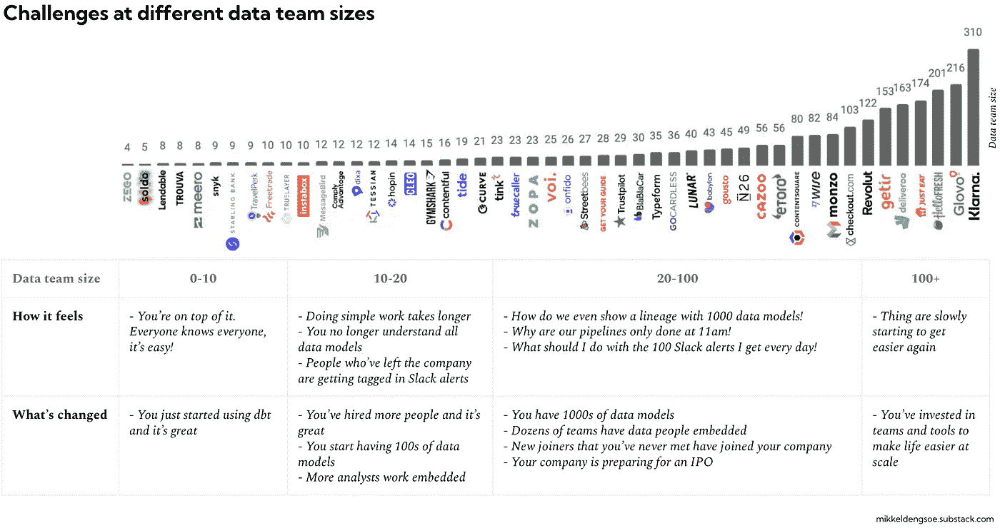

# 数据团队规模越来越大，速度越来越快

> 原文：<https://towardsdatascience.com/data-teams-are-getting-larger-faster-dec2af9d17ff>

## 数据团队规模与复杂性的关系

高增长公司的数据团队正在变得越来越大，一些最好的科技公司正在接近 1:2 的数据与工程师比率。

更多的数据人意味着更多的分析、更多的见解、更多的机器学习模型和更多基于数据的决策。但是更多的数据人员也意味着更多的复杂性、更多的数据模型、更多的依赖性、更多的警告和更高的期望。

当一个数据团队很小的时候，你可能会受到资源的限制，但是事情感觉很简单。每个人都认识每个人，你对数据堆栈了如指掌，如果有任何问题，你可以立即解决。

**但是当一个数据团队超过 10 人时，就会发生一些事情。您不再知道您使用的数据是否可靠，谱系太大而难以理解，最终用户每隔一天就开始抱怨数据问题。**

从那以后就不会变得容易了。当数据团队达到 50 人时，你开始有你从未见过的新成员，已经离开公司的人仍然被标记在关键警报中，每天的管道只在上午 11 点完成，让利益相关者抱怨数据从来没有按时准备好。

这是怎么发生的？

**随着规模的扩大，数据变得更加困难。**

作者图片

数据谱系变得难以管理。将数据谱系可视化仍然是获得所有依赖关系和数据流动方式的最佳方式。但是当您超过数百个数据模型时，这个谱系就失去了它的用途。在这种规模下，你可能有数百个依赖关系的模型，感觉更像是一团意大利面条，而不是有用的东西。随着可视化依赖关系变得越来越困难，推理所有东西如何组合在一起以及知道瓶颈在哪里也变得越来越困难。

管道一天比一天慢。你有太多的依赖，以至于你不再知道什么依赖于什么。在你意识到之前，你会发现自己陷入了一个很难摆脱的困境。某个人在不知道后果的情况下做了一个奇怪的连接，使得具有数百个下游依赖项的上游数据模型慢了 30 分钟。您的数据管道逐渐退化，直到利益相关者开始抱怨数据在中午之前永远不会准备好。在那种情况下，你不得不放下一切去修复它，花上几个月的时间在一些本可以避免的事情上。

**数据警报变得越来越难以管理**。如果你运气不好，被数百个警报所困，人们会将#data-alerts 频道静音，或者分析师会完全停止编写测试([小心破碎的窗户](https://mikkeldengsoe.substack.com/p/broken-windows))。如果您更幸运，您会收到更少的警报，但仍然发现很难管理数据问题。不清楚谁在看哪个问题。您经常会浪费时间查看已经标记给上游工程团队的数据问题，他们将在下周修复根本原因。

[**最大的数据挑战是组织**](https://locallyoptimistic.com/post/the-next-big-challenge-for-data-is-organizational/) 。有了规模，你就有了集中运营[，嵌入式和混合运营](https://mikkeldengsoe.substack.com/p/data-team-structure-embedded-or-centralised)的团队。你不再认识团队中的每个人，在每次全体会议中，都有许多你从未听说过的新成员，你从未见过的人依赖于你一年前创建的数据模型，并不断带着问题来找你。随着新人的加入，他们发现越来越难以理解所有的东西是如何组合在一起的。你最终会依赖同样的几个数据英雄，他们是唯一了解所有东西如何组合在一起的人。如果你失去了其中一个，你甚至不知道从哪里开始。

作者图片

以上都是越来越多的数据团队面临的挑战。许多接近 IPO 阶段的成长型公司的数据团队已经超过了 100 人。

# 如何处理规模

如何处理大规模的数据团队是每个人都在努力解决的问题。以下是我在一个接近 100 人的数据团队中的一些观察。

**拥抱它。**第一部分是接受这样一个事实:随着规模的扩大，事情会变得越来越困难，不会像你只有五个人时那么容易。你的业务要复杂得多，依赖性成倍增加，你可能会因为准备 IPO 而受到监管机构的审查，而这是你以前没有的。

如果事情感觉很难，那没关系，他们可能应该这样做。

像一群小团队一样工作。当团队扩展时，最大的问题是数据堆栈仍然被视为每个人的责任。

根据经验，新加入者应该能够清楚地看到对他们重要的数据模型和系统，但更重要的是知道他们不需要注意什么。应该清楚你依赖于其他团队的哪些数据模型。一些数据团队已经开始在只向他们团队以外的人公开某些精心制作的数据模型方面取得进展。

**不要让所有数据成为每个人的问题。**有些人从复杂的类似建筑的工作中茁壮成长，例如改善管道运行时间。但一些最优秀的数据分析师更像夏洛克·福尔摩斯，当他们能够在数据堆中挖掘见解时，会大放异彩。

避免混合太多。如果您的数据分析师花费 50%的时间调试数据问题或整理管道性能，您可能应该投资更多，将这一职责分配给擅长(并喜欢)这类工作的数据工程师或分析工程师。

不断增长的数据团队将会持续存在，而我们仅仅触及了我们应该如何实现这一目标的皮毛。如果你对此有任何想法，[让我知道](https://uk.linkedin.com/in/mikkeldengsoe)！