# 数据可视化理论:导论

> 原文：<https://towardsdatascience.com/data-visualization-theory-an-introduction-a077c0d80498>

## 数据科学理论

## 数据科学需要的关键数据可视化理论

作者图片

讲述故事是任何数据科学家工作中非常重要的一部分。在本文中，我将介绍数据可视化的关键理论。

# 介绍

作为一名数据科学家，知道如何高效地讲述故事是最难掌握的技能之一。尽管数据可视化理论没有机器学习等其他数据科学领域那么有吸引力，但它可以说是数据科学家角色中最重要的部分。我看到各地的数据科学家通过使用本文中的一些理论，可以显著改善可视化效果。

在本文中，我想讨论数据可视化的一些关键方面。我将谈论视觉编码信息的方法，以及心理学家在这个领域的历史中发展的一些关键原则。最后，我用一些著名的可视化方法来帮助塑造这个领域。

在整篇文章中，我将给出可视化数据的好的和坏的方法的例子，我希望读完这篇文章后，你也可以避免像这篇文章上面的怪物一样进行可视化。

# 什么是数据可视化？

数据可视化的最终目的是讲述一个故事。我们正试图尽可能高效地传递有关数据的信息。可视化意味着以图形化的方式对数据信息进行编码。做好这一点可以让读者能够*快速*和*准确*理解我们试图传递的信息。

# 视觉编码

有许多方法可以对信息进行编码。在数据可视化中，我们使用可视编码。我将快速浏览一些:

## 视网膜视觉编码

最常见的信息编码方式是通过视网膜编码。这些编码很快被我们的视网膜接收到，是向读者传递信息的一种方式。

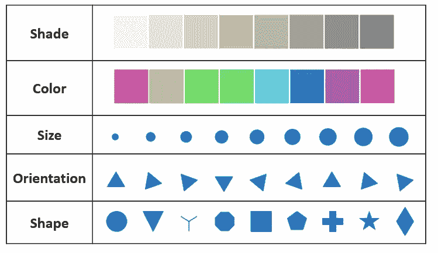

图一。视网膜编码(作者图片)

以上是 5 种视网膜编码，包括阴影、颜色、大小、方向和形状。你可以在一个图表中使用它们，但是读者很难快速掌握所有的信息。每个图表 1 或 2 个视网膜编码是最佳的。

想想什么样的编码最适合什么样的变量。例如，颜色对于一个连续的变量(例如:年龄或体重)来说效果很差，但是对于一个离散的变量(例如:性别或国籍)来说效果很好。稍后我将更详细地讨论这一点。

## 其他视觉编码

除了视网膜编码，还有其他视觉编码可用于可视化数据。例如，“空间”编码利用大脑皮层的空间意识来编码信息。这种编码可以通过尺度、长度、面积和体积中的位置来实现。

## 最好的编码是什么？

但是编码数据的最好方法是什么呢？简单的答案是，这取决于你想要实现什么。请看下面的图表，它显示了连续变量编码的有效性:

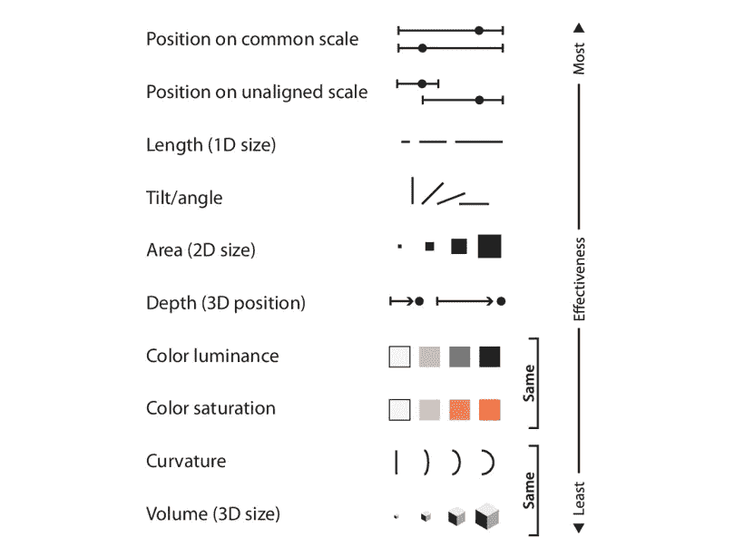

图 2:连续变量的视觉编码效果。图片由 t . Munzner 提供

上图显示了连续变量编码(体重、身高等)的有效性。).最好的是普通规模的仓位，最差的是成交量。想一想本文开头的 3D 饼状图，单纯根据体积来知道每个类别中的数值有多难。

T.Munzner 建议用视觉编码对最重要的变量进行编码，这样效率最高，如上图所示。请记住，这是针对连续变量的，虽然颜色可能不是连续变量的最佳代表，但它肯定适用于离散变量:

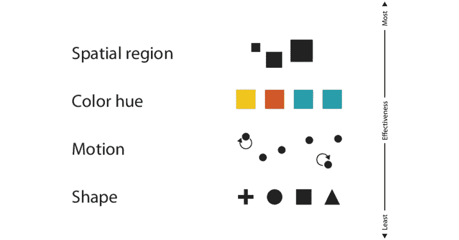

图 3:离散变量的视觉编码效果。图片由 [T. Munzner](https://www.semanticscholar.org/author/T.-Munzner/1732016) [1]

对于离散变量(性别、种族等。)，空间区域编码是最有效的，颜色是第二好的视觉编码。

让我们看一个例子:

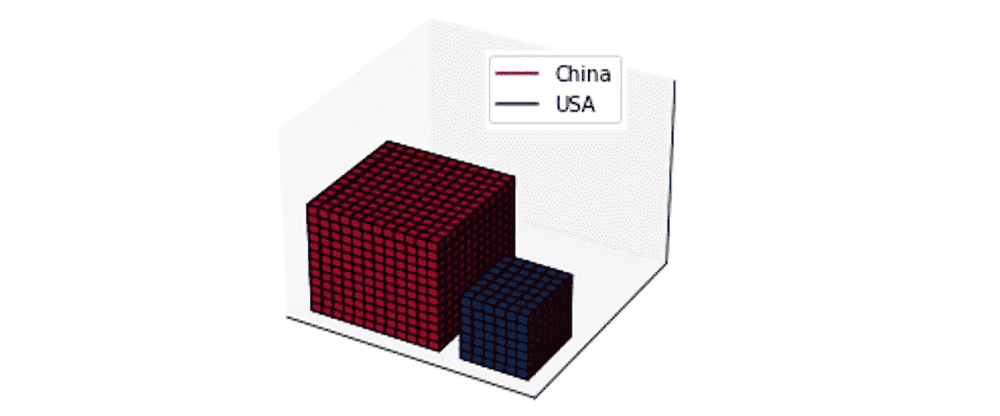

图 4 中国和美国人口的立方体积(图片由作者提供)

上图显示了中国和美国的人口。种群用体积编码，而类别用颜色编码。颜色在这里对离散变量非常有用，然而，体积是一个可怕的选择，因为读者很难确切知道每个国家有多少人口。

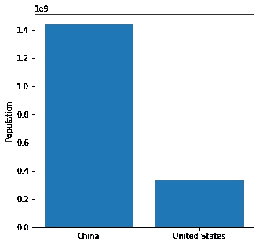

图 5:中国和美国人口的柱状图(图片由作者提供)

现在我们来看一个条形图。这里我们对连续变量使用 2 种编码，对离散变量使用 1 种编码。对于连续变量(总体)，所使用的编码是普通标度中的位置和长度。对于离散变量(类成员)，我们使用空间区域代替颜色，这样效果最好。

## 堆积条形图和饼图

有证据证明这一切都是真的吗？还是这都是主观的？

William S. Cleaveland 和 Robert McGill 进行了一系列实验，试图量化不同数据可视化编码方式的效率[2]。

图 6:[威廉·s·克里弗兰和罗伯特·麦吉尔](http://euclid.psych.yorku.ca/www/psy6135/papers/ClevelandMcGill1984.pdf)实验中的视觉化类型【2】

在 William S. Cleaveland 和 Robert McGill 的实验中，给了 55 名受试者 20 张上述类型的图表，并要求他们回答两个问题:

*   哪个酒吧比较大
*   较大条形中较小条形占多大百分比

在饼图和条形图上也进行了类似的实验:

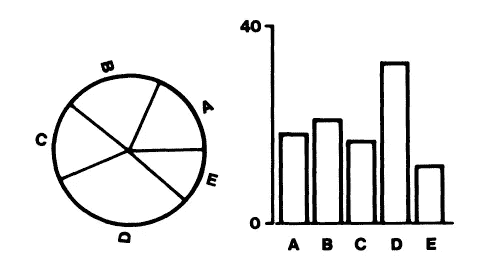

图 7:[威廉·s·克里弗兰和罗伯特·麦吉尔](http://euclid.psych.yorku.ca/www/psy6135/papers/ClevelandMcGill1984.pdf)实验的角度与长度可视化类型[2]

结果如下:

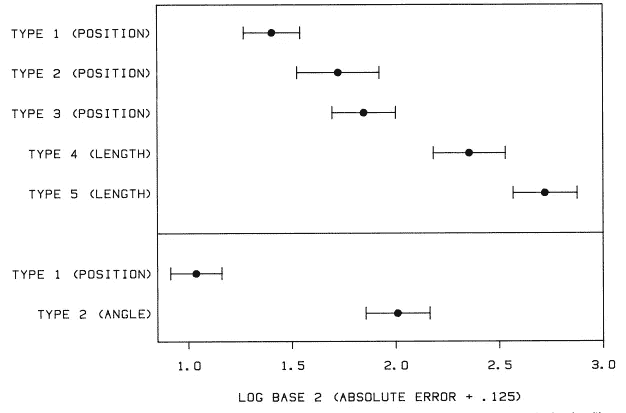

图 8[威廉·s·克里弗兰和罗伯特·麦吉尔](http://euclid.psych.yorku.ca/www/psy6135/papers/ClevelandMcGill1984.pdf)【2】的可视化类型的错误率

产生最小误差的可视化是比例条形图。请注意，堆积条形图比较起来要困难得多，误差也大得多。回头看看编码，非对齐刻度上的位置不如对齐刻度上的位置有效。

图 8 的第二部分显示，条形图的平均误差是饼图的一半(2⁰'⁹⁶ ≈ 2)。这再次在图 2 中示出，在图 2 中，角度在对信息进行编码时远不如普通尺度上的位置有效。

回到本文开头的 3D 饼图，您可以开始明白为什么角度并不是编码数据的最佳方式，而音量也毫无意义。条形图能达到同样的效果，但效果更好。

# 格式塔理论

格式塔原理(德语中的形状)是由 20 世纪的心理学家开发的，用来理解人类视觉感知的模式。我不会谈论所有的格式塔原则，但是，我想提几个。

为了展示格式塔理论，我将画一个蓝色圆圈的网格，然后我将每个原则添加到网格中。想想这些原则是如何相互作用的。

## 类似

格式塔相似性突出了大脑对事物进行分组的能力。相似性可能由于任何视觉编码而发生，如位置、形状、颜色、大小等。

图 9:格式塔相似性(作者图片)

看上面的图片，你会看到不同的群体。这是你的大脑将形状联系在一起。

## 非相似性

图 10:格式塔非相似性(作者图片)

在这里，大多数人的眼睛会立刻跳到左边的点上。非相似性是强大的，但也是危险的。把那个点放在网格外面，你几乎看不出我把其他形状留在了网格里面。

## 连通性

图 11:完形连接(作者图片)

连通性甚至更强大，你的眼睛会立刻瞄准那条线。事实上，由线连接的 6 个点具有不同的形状，但我们仍然将它们视为一组。连通性可以压倒相似性和非相似性。

所以在进行可视化时，格式塔原理和它们的相互作用是很重要的。

# 塔夫特信息与墨水比率

这是数据可视化理论中我最喜欢的部分。爱德华·塔夫特是美国统计学家，也是数据可视化的先驱。塔夫特的一些原则很有争议。Tufte 对于可视化的好处有一个非常激进的观点。

等式 1: Tufte 的数据与油墨比率

Tufte 认为，在设计图表时，应该最大化数据与油墨的比例。我们应该只用墨水来表示数据，并且尽可能少用墨水。

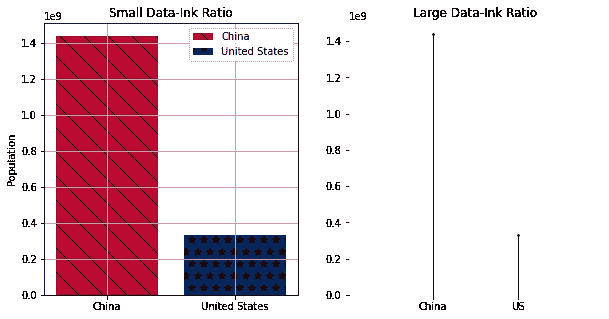

图 12:可视化的 Tufte 数据-油墨比(作者提供的图像)

Tufte 严格相信这个数据的比例，所有不需要可视化数据的墨水都应该完全避免。在上图中，我明显夸大了一点，但是你明白了。左边的图杂乱无章，分散了读者对我们真正想看的东西的注意力。右边的图更好，显示了没有添加噪声的数据。

# 著名的可视化

我想以几个著名的形象化例子来结束我的演讲。

第一个代表了 1812 年至 1813 年拿破仑对俄罗斯的革新中“大陆军”的规模。军队带着大约 60 万人出发了，其中一小部分成功了。

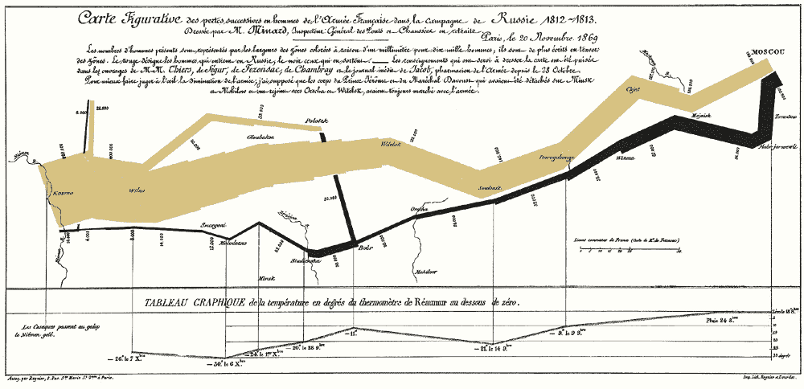

图 13:拿破仑向莫斯科进军。图片由查尔斯·约瑟夫·密纳德拍摄

这种可视化令人印象深刻的是，它捕捉了 6 个方面的数据:部队人数，距离，温度，地理位置，旅行方向，以及位置与时间。

第二个我想展示的是佛罗伦萨·南丁格尔的作品，她是英国的社会改革家，也是 19 世纪的统计学家。图表显示了东部军队的死亡原因。

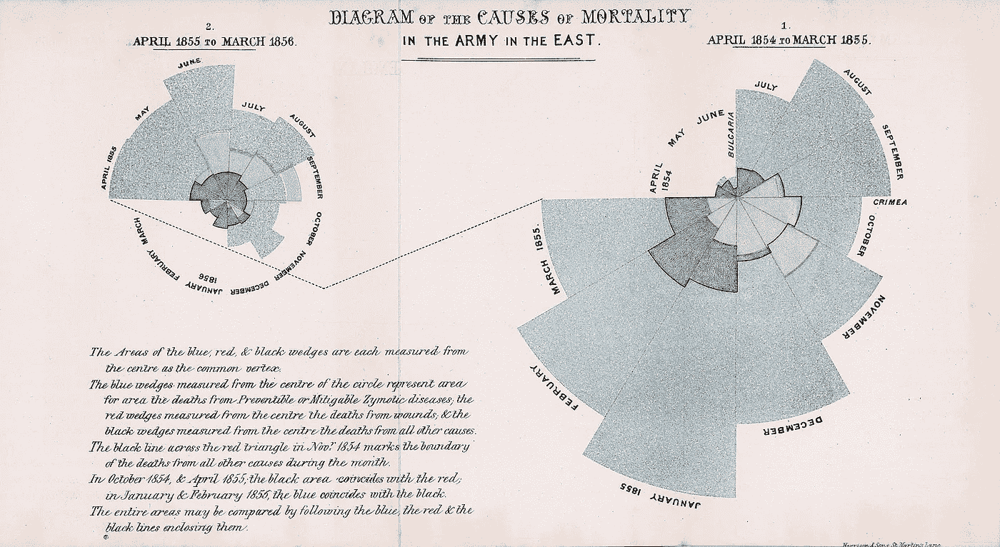

图 14:东部士兵的死亡原因——南丁格尔玫瑰——图片由[佛罗伦萨·南丁格尔](https://en.wikipedia.org/wiki/Florence_Nightingale) [4]拍摄

这张图显示了东部军队中的大多数死亡是可以避免的(蓝色部分)。她的目标是展示军队医院卫生的重要性。她的运动奏效了，经过 10 年的卫生改革，印度军队的死亡率下降了 3 倍多。

你对这些可视化有什么看法？你会用不同的方式可视化数据吗？

# 什么使可视化变得好？

我认为记住 Tufte 的数据-墨水比率是很重要的，但在一定程度上。有效地使用图表上的墨水量以不分散读者的注意力是很重要的，但是它不应该损害图表的可读性。想象一下 3D 饼图中数据与油墨的比例。想想所使用的视觉编码的种类(音量、角度、颜色)。条形图能达到同样的效果，但效率更高。

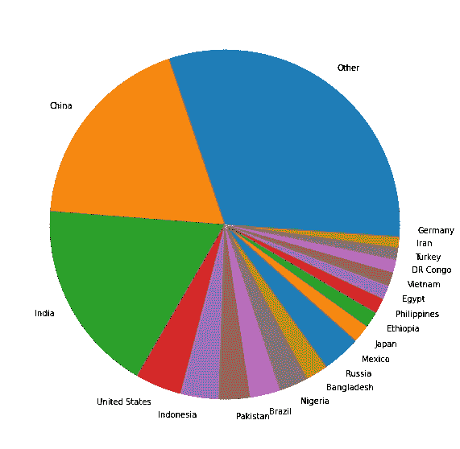

图 15:条形图与饼图(作者图片)

在某些情况下，用效率来创造印象是有意义的。nightingale rose 使用角度和面积作为视觉编码，这两者都是低效的。在她的案例中，这种方法效果很好，因为可预防的死亡数量是巨大的。她的图表强调了这一点，但没有透露准确的数字，这有助于形成公众舆论。

# 结论

在本文中，我首先讨论在进行可视化时使用的各种视觉编码，甚至没有意识到这一点。我谈论它们的有效性，以及哪些是你应该避免的。然后我会多谈一些理论，包括格式塔理论和塔夫特。最后，我向大家展示了一些著名的可视化技术，它们帮助塑造了数据可视化领域。

## 支持我👏

希望这对你有所帮助，如果你喜欢，你可以 [**关注我！**](https://medium.com/@diegounzuetaruedas)

你也可以成为 [**中级会员**](https://diegounzuetaruedas.medium.com/membership) 使用我的推荐链接，获得我所有的文章和更多:[https://diegounzuetaruedas.medium.com/membership](https://diegounzuetaruedas.medium.com/membership)

## 你可能喜欢的其他文章

[信息论应用于 Wordle](/information-theory-applied-to-wordle-b63b34a6538e)

[利用人工智能检测欺诈](https://medium.com/p/d1d5bad79e72)

# 参考

[1] T. Munzner，语义学者，2015。可在:[https://www . semantic scholar . org/paper/Visualization-analysis-% 26-design-munz ner/5521849729 AAA 387 cfeef 0d 12 3c 91170 D7 bbfd 0](https://www.semanticscholar.org/paper/Visualization-analysis-%26-design-Munzner/5521849729aaa387cfeef0d12d3c91170d7bbfd0)

[2] William S. Cleaveland 和 Robert McGill,《图形感知:图形方法的理论、实验和应用》, 2004 年。美国统计协会杂志。可用:[http://Euclid . psy . yorku . ca/www/psy 6135/papers/clevelandmcgill 1984 . pdf](http://euclid.psych.yorku.ca/www/psy6135/papers/ClevelandMcGill1984.pdf)

[3]拿破仑俄国战役地图，维基百科。可用:[查尔斯·约瑟夫·密纳德——维基百科](https://en.wikipedia.org/wiki/Charles_Joseph_Minard)

[4]统计和卫生改革，东部军队死亡原因图表，维基百科:可用:[佛罗伦萨·南丁格尔—维基百科](https://en.wikipedia.org/wiki/Florence_Nightingale)