# 万圣节糖果数据集的数据可视化

> 原文：<https://towardsdatascience.com/data-visualizations-with-a-halloween-candy-dataset-b6361d5d29f8>

## 没有诡计，只是款待！了解如何使用万圣节糖果数据集创建酷而有用的数据可视化

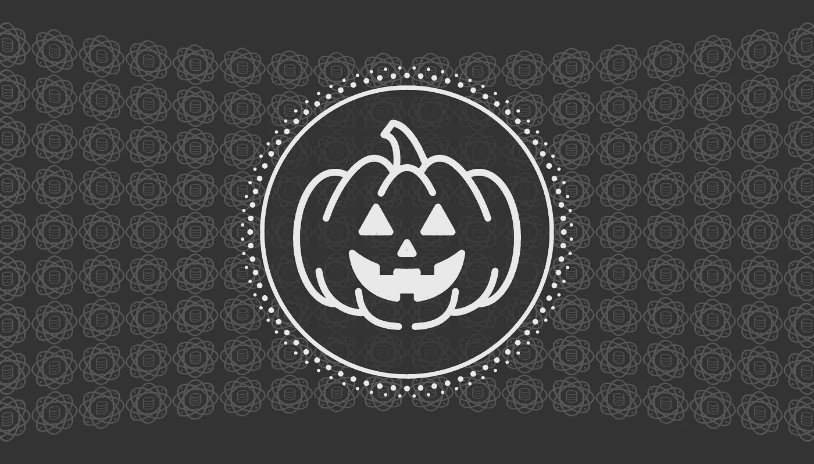

作者创作的标题卡

万圣节快乐，朋友们！本着这个季节的精神，我认为利用这个时间来分享我们如何使用万圣节糖果数据集创建一些非常整洁和有用的数据可视化会很有趣。在整篇文章中，我们将利用 **Python** **和支持库，包括 Pandas、Matplotlib 和 Seaborn** ，涵盖各种不同类型的可视化。如果你想在一个无缝的位置看到所有代码，我邀请你去[看看 GitHub](https://github.com/dkhundley/halloween-candy-visualizations/blob/main/notebooks/halloween-candy-visualizations.ipynb) 上的这个 Jupyter 笔记本。这是我用来制作你将在这篇文章中看到的每一个可视化效果的同一个 Jupyter 笔记本，所以你可以确定你在那里得到了每一点代码！

我们将在这篇文章中使用的数据集是由 FiveThirtyEight 的好人们策划的，存放在 Kaggle 上。如果你想了解更多关于这个数据集的信息，或者下载它供你自己使用，[这个 Kaggle](https://www.kaggle.com/datasets/fivethirtyeight/the-ultimate-halloween-candy-power-ranking) 的链接将为你提供你所需要的一切。(此数据集包含在 [FiveThirtyEight 的麻省理工学院许可证中，此处链接。非常感谢 FiveThirtyEight 整理了这个数据集；非常感谢！😃](https://github.com/fivethirtyeight/data/blob/master/LICENSE)

在这篇文章中，我们有很多内容要讲，所以让我们简单介绍一下。在下一个简短的部分，我们将谈一谈我们将如何使用自定义颜色对数据可视化进行主题化，然后我们将进入文章的大部分，涵盖所有类型的数据可视化。我们走吧！🦇

# 万圣节主题的颜色

除了是一名机器学习工程师和数据科学爱好者之外，我还涉足了一点平面设计。在图形设计社区中，我们真的用一个叫做**十六进制值**的计算机值来琢磨一种特定的色调。是的，这就像你可能已经熟悉的十六进制系统；然而，你可能不知道这些十六进制值对图形设计师有多重要！图形设计者试图得到一个十六进制值的完整的**调色板**，它本质上是一些颜色的组合，在一起看起来很有美感。事实上，有许多网站纯粹致力于分享这些策划的调色板。[我特别使用这个网站来得到我的万圣节十六进制调色板](https://www.color-hex.com/color-palette/3399)。(是的，我现在才明白称它为“万圣节妖术颜色”的讽刺意味。😂)这是我创建的一个小图像，显示了我将在数据可视化中使用的颜色及其相关的十六进制值。

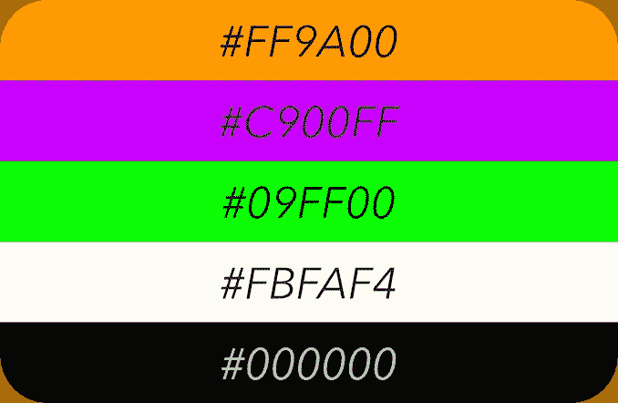

作者创作的图形

除了像这样调整颜色，我们还可以使用 Seaborn 来设置每个数据可视化的主题，以突出更暗的背景。默认情况下，我们所有即将到来的可视化将继承这个设计方案。我们在代码中实现所有这些的方法是使用下面的代码片段:

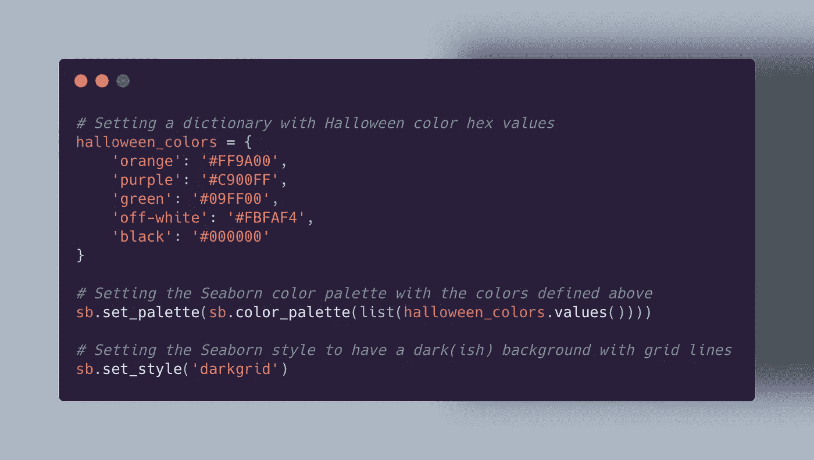

由作者编写并以可视化形式生成的代码，带有[碳](https://carbon.now.sh)

# 这篇文章是如何组织的

现在我们已经有了万圣节主题，让我们为你在文章的剩余部分所能期待的打下基础。本文的其余部分分为四个主要部分，每个部分代表一组可视化类型:

*   分类可视化
*   分布可视化
*   关系可视化
*   聚类可视化

现在，非常清楚的是，这是**而不是**一个包含所有单个数据可视化分组的列表。我只是想给你一些最常见的可视化的例子，因为这个帖子已经够长了！

在每个分组中，我将介绍一些特定的数据可视化，对于每个可视化，我将执行以下操作:

*   我们将研究**什么是可视化**以及为什么它在高层次上是有价值的。
*   然后我们将进入**假设一个现实生活中的例子**，在这个例子中我们可能使用万圣节糖果数据集的特定可视化。
*   接下来，我们将使用 Python 和像 Pandas、Matplotlib 和 Seaborn 这样的库，用代码创建可视化。
*   回到我们假设的场景，我们将使用可视化现在可以帮助我们更好地直觉的东西对数据进行**后分析**。

很简单，对吧？让我们进入第一组数据可视化:分类可视化！

# 分类可视化

好吧，如果我完全诚实的话…当我选择这个数据集时，我显然没有密切关注数据的性质，特别是考虑到有许多具有二进制值的要素。不管了！这可以给我们一些很好的实践，在下面的可视化中显示这些分类特征。

## 计数图

顾名思义，**计数图**是对特定值的数量进行计数的可视化。Seaborn 的`countplot`功能相对简单，所以我想通过向您展示如何以单一、整体、可视化的方式显示多个计数图来稍微改变一下。

**现实生活中的例子**:我们有一大堆这样的二元特征，准确地说是九个。这些二元特征用 0 表示“否”，用 1 表示“是”。在一个简单易读的可视化界面中查看所有这些二进制特性的对比，不是很有趣吗？我们首先要做一点数据预处理，然后我们会用这 9 个计数图分析我们的发现。

下面是创建这种可视化效果的代码:

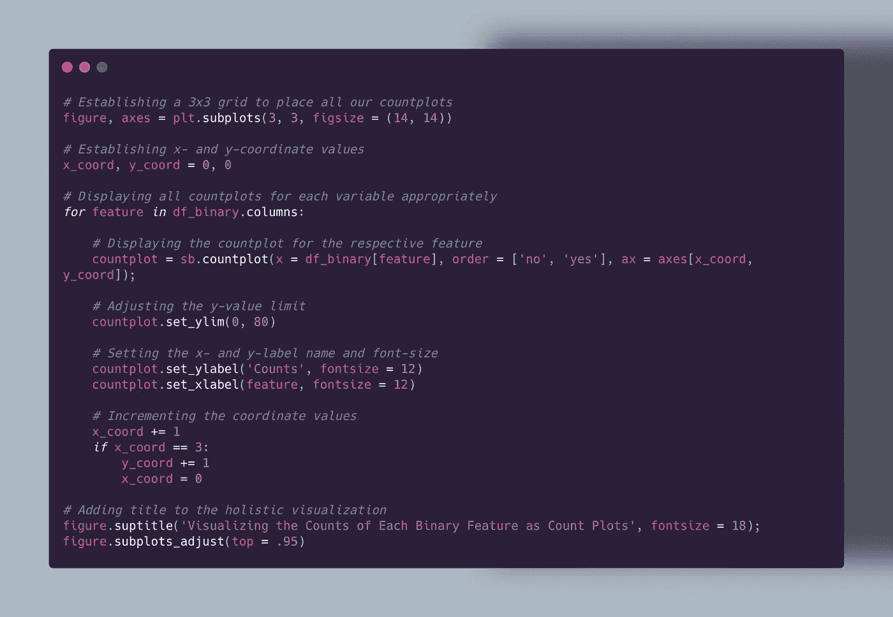

由作者编写的代码，使用 [Carbon](https://carbon.now.sh) 生成可视化代码

这是可视化本身的样子:

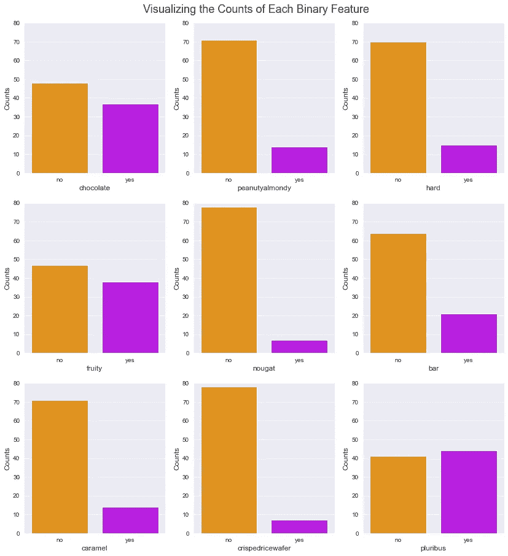

作者用 Seaborn / Matplotlib 创建的数据可视化

**后分析**:好吧，如果我完全诚实的话，这个可视化并不是非常有用的。😂我想有趣的是，水果糖果和巧克力糖果似乎有某种关联，这是有道理的，因为我想不出任何糖果一定是水果和巧克力的。有趣的是，pluribus 是唯一一个糖果种类比其他种类多的种类。我不得不提醒自己在这种情况下 pluribus 是什么意思。就上下文而言，pluribus 指的是一个盒子里的糖果本质上是多个还是一个整体。也就是说，一颗复数阳性的糖果就像 M & Ms，而一颗复数阴性的糖果就像士力架巧克力棒。因此，即使我们没有从这种特定的可视化中获得很多价值，我希望您可以在可视化这样的多个计数图中找到价值！

## 饼图

在这篇文章中，我们将涉及的所有可视化，这可能是你最熟悉的一个。这个场景中的**饼状图**向我们展示了每个二进制特性占整个特性的多少。从视觉角度来看，它告诉我们一个价值是否比另一个更占优势。这也是一个实际上没有对应的`seaborn`的可视化，所以为了生成这些饼图，我们将不得不使用准系统`matplotlib`。

**现实生活中的例子**:在带有计数图的例子中，我们看了一下二进制特征，以便从纯计数的角度理解它们是如何分布的。我们将在这里再次进行同样的操作，只是这次我们将使用各自的饼图来可视化这些功能。

下面是实现这种可视化的代码:

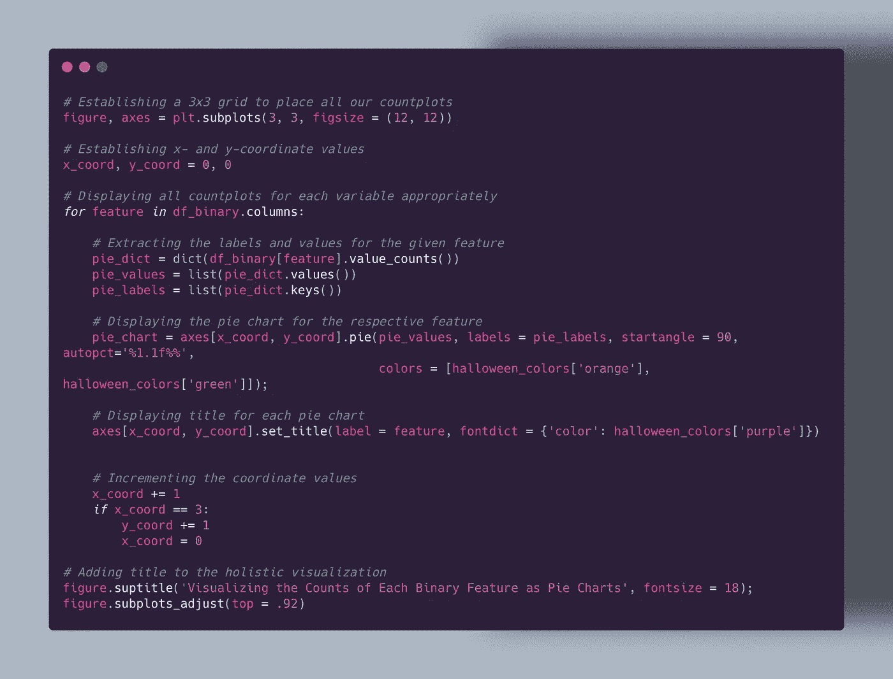

由作者编写并以可视化形式生成的代码，带有[碳](https://carbon.now.sh)

这是可视化本身的样子:

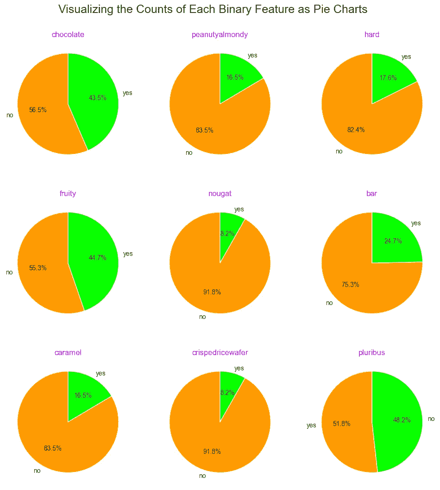

作者用 Seaborn / Matplotlib 创建的数据可视化

**后分析**:和上面的计数图分析一样，这些可视化并没有给我们提供太多的价值。有趣的是，我们可以凭直觉知道像`bar`这样的特征或多或少有 1:3 的比例，但除此之外，我们显然不能从这些特定的可视化中获得太多的价值。尽管如此，我还是希望你能看到我们在其他情况下如何使用饼图和计数图的价值！

# 分布可视化

虽然该数据集的大部分由二元要素组成，但也有少数要素具有连续值。自然，对于数据科学家来说，想要了解这些类型的特征的分布是非常常见的，因此本节将介绍几种类型的分布可视化。

## 箱形图/小提琴图

**箱线图**是一种可视化图，用于在较高层次上理解一个特征的主要分位数。更具体地说，它将突出显示中位数、四分位数范围(IQR)以及外围最小值和最大值。IQR 由中间的方框表示，而方框两侧的“胡须”表示外围的最小值和最大值。 **violin 图**类似于 box 图，除了它试图提供更多关于数据精确分布的可视化。根据您确切想要了解的数据，您可能会选择其中一个。或者你可以做我们将要做的事情，将两者并排展示！

**现实生活中的例子**:基于百分比的数据有三个不同的特征:糖的百分比、价格的百分比以及每种糖果在与另一种糖果比赛时获胜的百分比。我们本质上要回答的问题是，*在数据中是否有广泛的分布，或者它们在各自的特性上是否都差不多？*一探究竟吧！

下面是实现这种可视化的代码:

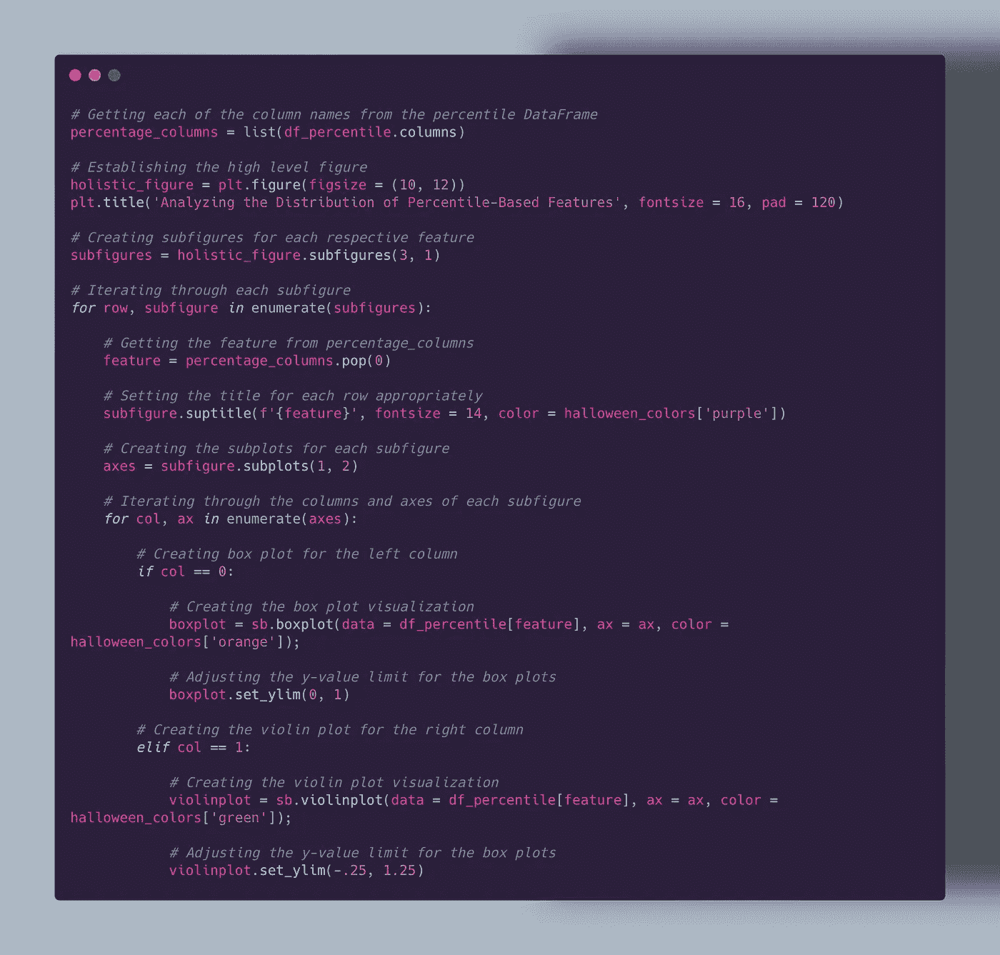

由作者编写并以可视化形式生成的代码，带有[碳](https://carbon.now.sh)

这是可视化本身的样子:

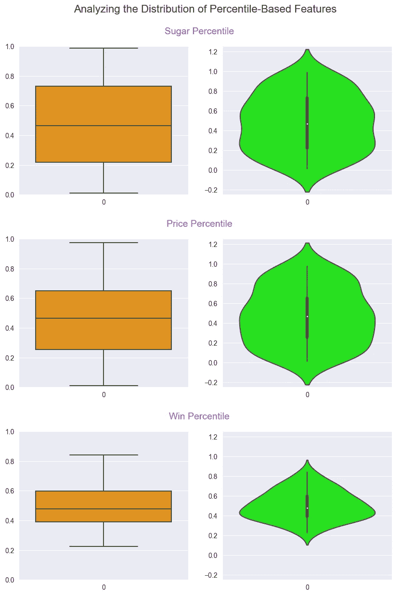

作者用 Seaborn / Matplotlib 创建的数据可视化

**后期分析:**有趣的是，小提琴情节的绿色让每一个视觉效果看起来都像树叶，但除此之外，小提琴情节似乎没有提供太多价值，因为它们更难解读。另一方面，箱线图更容易解释。在糖和价格百分位数的情况下，看到胡须跨越整个范围而 IQR 位于中间就不足为奇了。有趣的是，赢百分位数的胡须在更紧的 IQR 范围内更紧。在我看来，赢百分位数的方框图是所有图表中信息最丰富的，因为它本质上告诉我们，大多数糖果在受欢迎程度方面处于中间位置。回想一下，这个特征代表了它与另一种糖果直接匹配时获得的获胜百分比，这里的 IQR 基本上是在告诉我们，一种糖果与另一种糖果势均力敌的情况更为常见。当然，胡须代表确实有异常值，但快速浏览一下，这个盒状图告诉我们一个关于数据的快速故事，我们不能通过直接分析数字来快速收集数据。

## 直方图/ KDE 图

我在上面提到过，小提琴图并没有给我们提供太多的价值，因为它很难解释，盒子图本身也停留在一个相当高的水平。如果我们想在更精细的层次上理解数据的分布？这就是直方图/ KDE 图更有帮助的地方。一个**直方图**可视化了特定仓中数据的频率，有点类似于计数图。在直方图的顶部，我们可以覆盖一个**核密度估计(KDE)** ，它在直方图上绘制一条曲线来表示每个相应仓的“连续概率”。(如果你好奇的话，小提琴的情节本身实际上是一条 KDE 曲线，本质上是向一侧翻转，并沿着对称轴对折。)

**现实生活中的例子**:在箱线图/小提琴图的例子中，我们想从高层次上看看基于百分位数的特征在分布广度方面表现如何。*如果我们想更精细地了解数据分布的均匀程度，该怎么办？*这就是我们要用直方图和叠加 KDE 曲线评估的！

下面是实现这种可视化的代码:

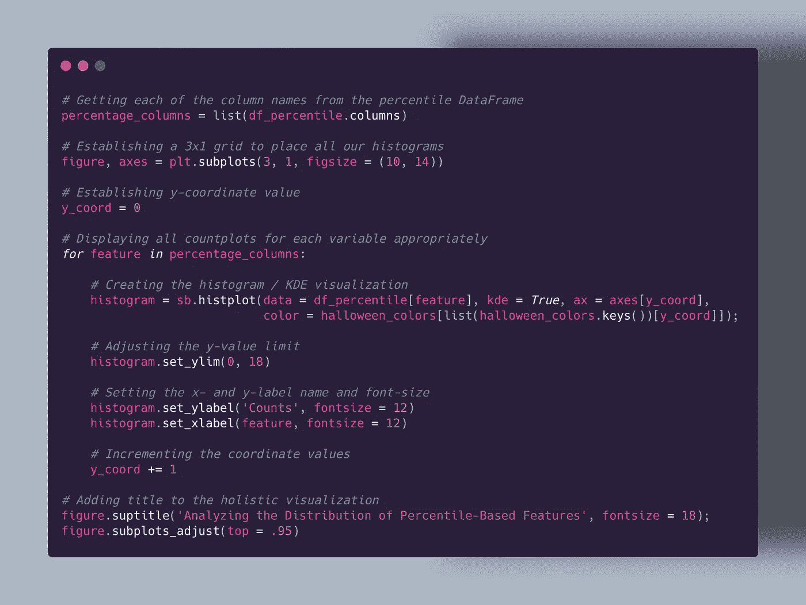

由作者编写并以可视化形式生成的代码，带有[碳](https://carbon.now.sh)

这是可视化本身的样子:

作者用 Seaborn / Matplotlib 创建的数据可视化

**后期分析**:现在这个其实挺有意思的！与我们之前分析的盒子和小提琴图相比，这些可视化效果讲述了一个截然不同的故事。特别是对于糖和价格百分位数特性，我们在上面注意到 IQR 似乎表明数据是集中聚类的。这些可视化结果表明情况并非如此，特别是价格百分位数特性，我们实际上看到在光谱的两端有更多的糖果。这就是为什么对相同的数据执行多种可视化很重要，因为您可以从每种可视化类型中获得不同的重要信息！

# 关系可视化

当开始一个新的数据领域的工作时，数据科学家首先要寻找的事情之一是各种数据特征之间的相关性。在本节中，我们将介绍一些相关可视化，以及我们如何建立一种直觉，让这些可视化更好地讲述数据的故事！

## 回归/散点图

**回归图**是一种可视化，通常比较 x 轴和 y 轴之间的两个数字特征，每个数据点由一个点表示。我们还可以用一个额外的**色调**特征来增强回归图，该特征直观地指示了第三个特征如何影响我们正在比较的两个初始特征。在下面的例子中，我们将特别使用 Seaborn 的`lmplot`功能，它本质上是将标准回归图与添加色调的能力相结合，以便对数据进行更深入的分析。

**现实生活中的例子:**我们的`sugarpercent`特性告诉我们一种特定糖果与其他糖果相比含糖量的百分比，而`pricepercent`特性告诉我们一种糖果与其他糖果相比价格的百分比。我们还有第三个特征，`chocolate`，告诉我们糖果是否是巧克力。一个`lmplot`可以帮助我们回答这个问题，*巧克力糖是否比非巧克力的 bretherin 糖与价格有更强或更高的相关性？*

下面是实现这种可视化的代码:

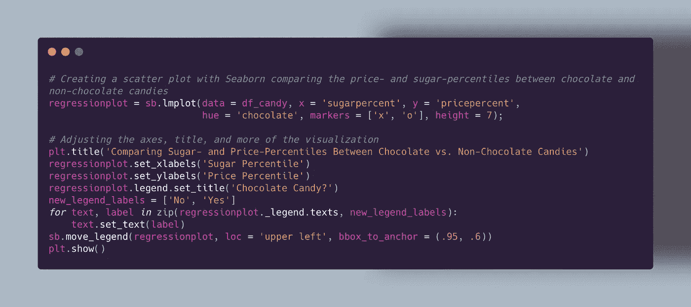

由作者编写的代码，使用 [Carbon](https://carbon.now.sh) 生成可视化代码

这是可视化本身的样子:

作者用 Seaborn / Matplotlib 创建的数据可视化

**后期分析**:这个可视化在一个小小的情节中为我们提供了大量的信息！对于巧克力和非巧克力糖果来说，糖的百分位数和价格的百分位数之间有轻微的正相关，但是这个数据集中的数据太少了，所以我非常谨慎地做出这样一个广泛的概括。另一方面，很明显巧克力糖含糖量更高，价格也更高。这并不令人惊讶，因为根据我的经验，巧克力糖似乎比非巧克力糖价格更高。从这个图中我们可以收集到更多的信息，但是我希望主要的收获是你可以看到你可以从一个单独的图中挤出多少信息！

## 联合地块

到目前为止，我们已经介绍了直方图、KDE 曲线和散点图。你可能会想，如果有一种方法可以将这些东西结合在一个单一的可视化中呢？我们将通过 Seaborn 的联合情节可视化来实现这一点。一个**联合情节**试图以一种超越更简单的方式来分析两个特征之间的关系。你实际上可以用 Seaborn 的`jointplot`做很多事情，所以在下面的可视化中，我将使用 KDE 曲线创建一个特殊类型的可视化，看起来几乎像一个地形高程图。

**现实生活中的例子**:在前面的例子中，我们研究了巧克力和非巧克力糖果的糖与价格的关系。现在，*我想探究一下巧克力和非巧克力糖果的性价比*。我们可以生成与上面的`lmplot`相同的可视化效果，但是这一次，我想向您展示使用基于 KDE 的`jointplot`的价值。让我们看看结果！

下面是实现这种可视化的代码:

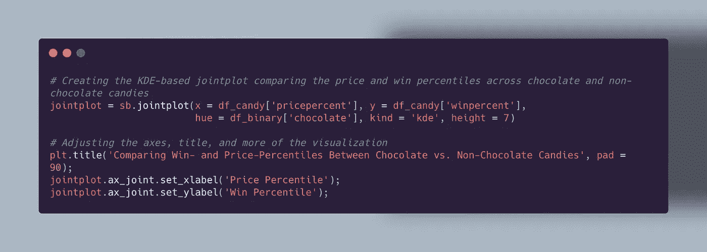

由作者编写并以可视化形式生成的代码，带有[碳](https://carbon.now.sh)

这是可视化本身的样子:

作者用 Seaborn / Matplotlib 创建的数据可视化

**后分析**:这种可视化的有趣之处在于，它有助于真正找到数据最常聚集的地方。例如，我们可以看到，对于巧克力糖果，最大的相关性是糖果在大约 65 个价格百分点和大约 70 个利润百分点处。此外，我们可以看到每个特征的纯 KDE 曲线呈现在每个通道的外侧。例如，我们可以看到，非巧克力糖果往往价格较低，而巧克力糖果往往价格稍高。正如我在之前的分析中指出的，这并不太令人惊讶，因为我的轶事经验是，在目标走道上的那些大袋巧克力糖确实更贵！

# 聚类可视化

在下一节中，我们将使用一些无监督聚类来将数据聚类到算法认为合适的组中。接下来，我们将创建一些可视化工具来帮助我们直观地了解为什么聚类算法会对数据进行聚类。当我们进入下一部分时，我不确定这是否是尝试这样做的最佳数据集。是的，我们将会看到一些结果，但是数据太小，特征太具体，我不敢说这些结果是可靠的。也就是说，这篇文章的重点是*如何*在你自己的环境中创建这些可视化效果，所以我不太担心这些结果的可靠性。如果你想看到无监督聚类被合法使用的完整用例，我会建议你[看看我的星巴克客户聚类中的帖子](https://dkhundley.medium.com/starbucks-reward-program-project-cfdad91d4779)。

## 折线图

当确定我们应该尝试将数据组织到多少个集群时，通常在图表上表示聚类算法的**误差平方和(SSE)** ，并在可视化中寻找**肘**作为我们应该保持的理想集群数量。我们将在下面演示如何计算 SSE 分数并将其可视化为**折线图**。

现实生活中的例子:我们的例子非常简单:我们希望对数据集进行聚类，以便对这些聚类进行更深入的分析，看看我们是否可以通过这种方式获得任何见解。我们不确定我们应该瞄准多少个集群，所以*这个可视化将允许我们使用肘方法来确定我们应该瞄准多少个集群*。让我们测试 1 到 14 个集群，看看我们的结果如何。

下面是实现这种可视化的代码:

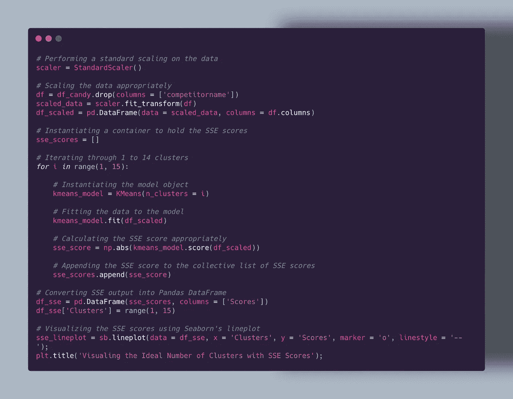

由作者编写并以可视化形式生成的代码，带有[碳](https://carbon.now.sh)

这是可视化本身的样子:

作者用 Seaborn / Matplotlib 创建的数据可视化

**后分析**:不出所料，单个聚类总是产生最高的 SSE 得分，然后在几个聚类之后急剧下降。在 5-6 个集群之后，你可以看到上证综指或多或少有收益递减，所以你现在可能明白为什么我们称之为肘方法了。理想的集群数量是在这个可视化的“肘”处，我们可以争论是 2 个还是 3 个集群。

## 散点图

虽然我们在分析`lmplot`时已经接触了散点图，但我认为在这个新的背景下再次回顾是值得的。我们将使用 Seaborn 更普通的`scatterplot`来创建这些可视化效果，而不是使用`lmplot`。我们还会将每种糖果的标签直接添加到这些最终数据图表的顶部。

**现实生活中的例子**:当我们通过肘方法确定我们应该创建多少个聚类时，我们注意到我们可以为我们的数据集创建 2 或 3 个聚类。没有正确或错误的答案，但我个人对回答以下问题很感兴趣:*当在 2 个或 3 个聚类之间进行聚类时，K-Means 算法如何根据赢价比来区分数据*？

下面是实现这种可视化的代码:

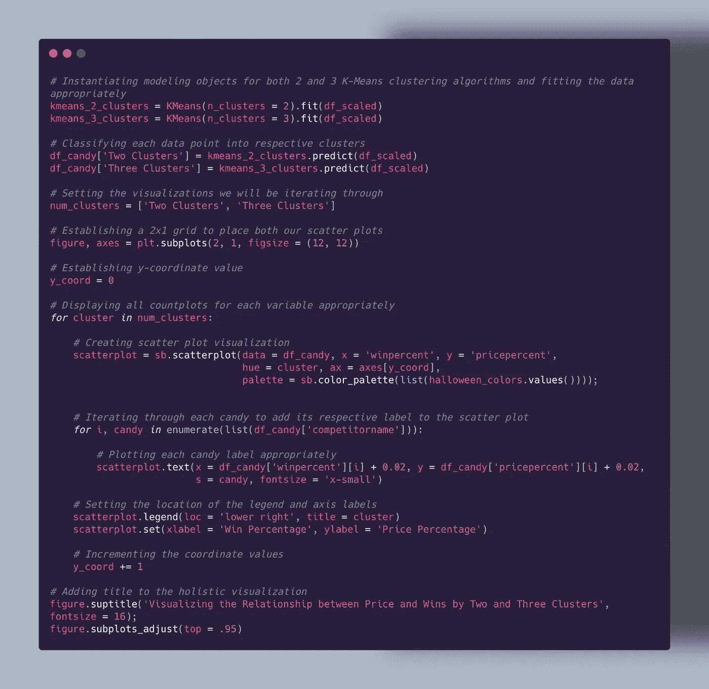

作者编写的代码，用[碳](https://carbon.now.sh)生成可视化

这是可视化本身的样子:

作者用 Seaborn / Matplotlib 创建的数据可视化

**后期分析**:我个人认为这些视觉效果是我们迄今为止制作的最有趣的。通过将糖果标签直接添加到可视化的顶部，我们可以更精确地分析为什么聚类是这样产生的。查看只有两个集群的第一个可视化，似乎可以在集群之间划出一条非常清晰的线:第一个集群包含非巧克力糖果，在价格和获胜百分比方面比另一个集群差。另一组似乎由更多的“优质”巧克力糖果组成。当我们观察三个集群的可视化时，事情开始变得更加有趣。最初的“非巧克力”集群基本上保持完整，但是巧克力集群被进一步分成两组。有趣的是，绿色星团中的点似乎都有相似之处。如果阅读这种视觉效果有挑战性，绿色集群中的一些糖果包括 Twix、Kit Kat、Nestle Crunch 和 Snickers Crisper。根据我的经验，所有这些糖果都有点脆脆的味道。确实非常有趣！

# 包扎

这就是我们这篇文章的结论！我希望你发现所有这些可视化既有趣又好玩。同样，这篇文章并不代表我们可以创造的每一种可视化，但我希望它为你提供了一个很好的想法样本，你可以在自己的环境中产生这些想法。感谢你阅读这篇文章，并希望你们都有一个伟大的，安全的万圣节！🎃