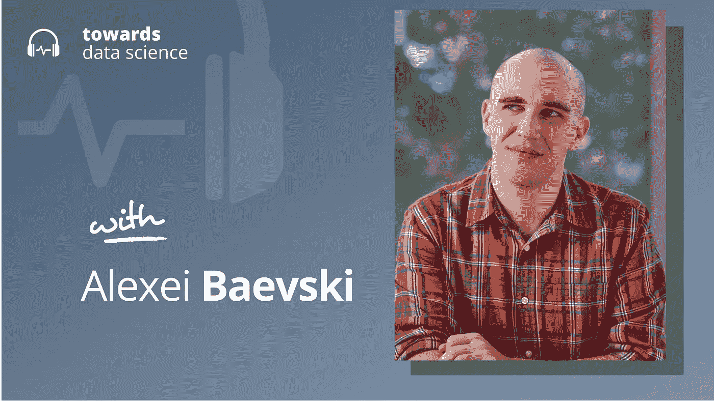

# data2vec 和多模态学习的未来

> 原文：<https://towardsdatascience.com/data2vec-and-the-future-of-multimodal-learning-f33f9c781f48>

## [播客](https://towardsdatascience.com/tagged/tds-podcast)

## Alexei Baevski 谈适用于文本、图像、语音、视频等的人工智能架构

[苹果](https://podcasts.apple.com/ca/podcast/towards-data-science/id1470952338?mt=2) | [谷歌](https://www.google.com/podcasts?feed=aHR0cHM6Ly9hbmNob3IuZm0vcy8zNmI0ODQ0L3BvZGNhc3QvcnNz) | [SPOTIFY](https://open.spotify.com/show/63diy2DtpHzQfeNVxAPZgU) | [其他](https://anchor.fm/towardsdatascience)

*编者按:TDS 播客由杰雷米·哈里斯主持，他是人工智能安全初创公司墨丘利的联合创始人。每周，Jeremie 都会与该领域前沿的研究人员和商业领袖聊天，以解开围绕数据科学、机器学习和人工智能的最紧迫问题。*

如果 data2vec 这个名字听起来很熟悉，那可能是因为它在大约两个月前问世时在社交媒体甚至传统媒体上引起了不小的轰动。这是一个重要的条目，现在越来越多的策略专注于创建单独的机器学习架构，处理许多不同的数据类型，如文本、图像和语音。

大多数自我监督学习技术涉及让模型获取一些输入数据(例如，一幅图像或一段文本)并屏蔽掉这些输入的某些成分(例如，通过遮蔽像素或单词)，以便让模型预测那些被屏蔽掉的成分。

“填空”任务很难迫使人工智能学习关于其数据的事实，这些事实可以很好地概括，但这也意味着训练模型来执行根据输入数据类型而有很大不同的任务。例如，填充涂黑的像素与填充句子中的空白非常不同。

那么，如果有一种方法可以提出一个我们可以用来在任何类型的数据上训练机器学习模型的任务呢？这就是 data2vec 的用武之地。

在这一集的播客中，我和 data2vec 的创造者之一 Meta AI 的研究员 Alexei Baevski 在一起。除了 data2vec，Alexei 还参与了相当多的文本和语音模型的开创性工作，包括脸书广泛宣传的无监督语音模型 [wav2vec](https://ai.facebook.com/blog/wav2vec-20-learning-the-structure-of-speech-from-raw-audio/) 。Alexei 和我一起讨论了 data2vec 的工作原理和该研究方向的下一步，以及多模态学习的未来。

以下是我在对话中最喜欢的一些观点:

*   自回归模型通常被训练来填充部分涂黑的句子或图像。但这种策略有一个固有的限制:因为填充空白对于文本和图像来说是一个非常不同的任务，所以使用这些任务来训练一个可以同时处理文本和图像的单一架构要困难得多。为了解决这个问题，data2vec 被训练成不是在图像或句子中填空，而是在一个教师网络生成的图像和文本数据的潜在表示中填空。这创建了一个无论输入数据类型如何都可以使用的通用任务。
*   正如 Alexei 指出的，data2vec 仍然使用专门的预处理技术，根据输入数据类型的不同而不同。因此，它不完全是一个通用的架构，它需要特定目的的输入信息。然而，阿列克谢认为这可能会改变:谷歌人工智能最近发表了他们在一个名为感知者的架构上所做的工作，该架构对所有输入数据类型使用单一的预处理技术。通过将感知者的输入不可知预处理与 data2vec 的输入不可知训练任务相结合，他看到了新一波鲁棒多模态模型的巨大潜力。
*   越来越多的多模态模型带来的挑战之一是互操作性:当深度网络只处理图像数据时，很难理解深度网络如何处理图像数据，但如果处理视觉的同一网络也处理文本和音频数据会怎么样？我们可能需要新一代的可解释性技术来跟上多模态系统的发展。
*   阿列克谢和他的团队没有尝试过，但阿列克谢很好奇的一个问题是:data2vec 为单词“dog”生成的潜在表征看起来与它为狗图像提出的潜在表征相似或相关吗？天真地说，这似乎会告诉我们一些关于系统学习概念的健壮性的事情。
*   人们常说，机器学习——尤其是规模化人工智能——正在成为软件工程。阿列克谢有软件工程背景，虽然他认为这个想法有一些优点，但这并没有转化为软件工程师在人工智能研究中的明显优势。

你可以[在 Twitter 上关注阿列克谢](https://twitter.com/ZloiAlexei)，或者[我在这里](https://twitter.com/jeremiecharris)。

## 章节:

*   0:00 介绍
*   2 点阿列克谢的背景
*   10:00 软件工程知识
*   14:10 data 2 vec 在进展中的作用
*   30:00 学生和教师之间的时间差
*   38:30 丧失口译能力
*   41:45 更强能力的影响
*   49:15 总结