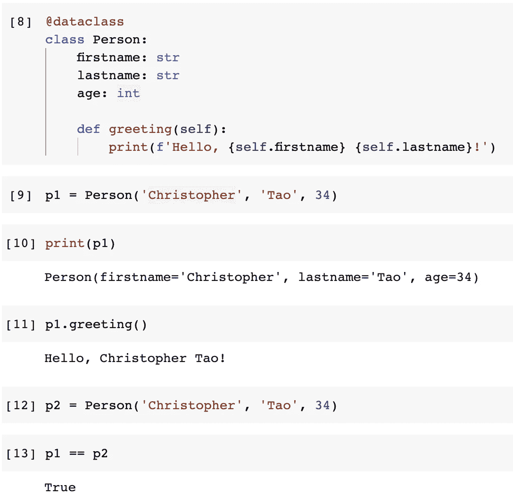
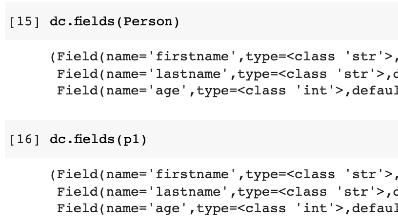
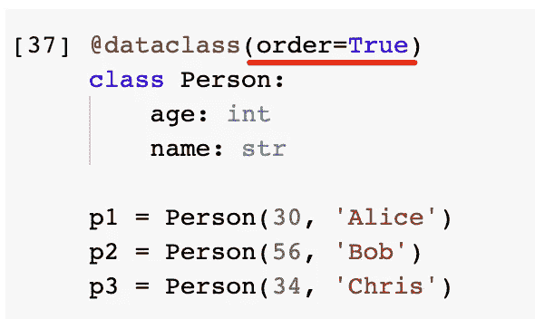
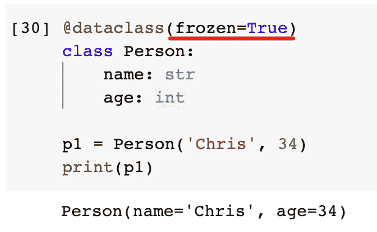
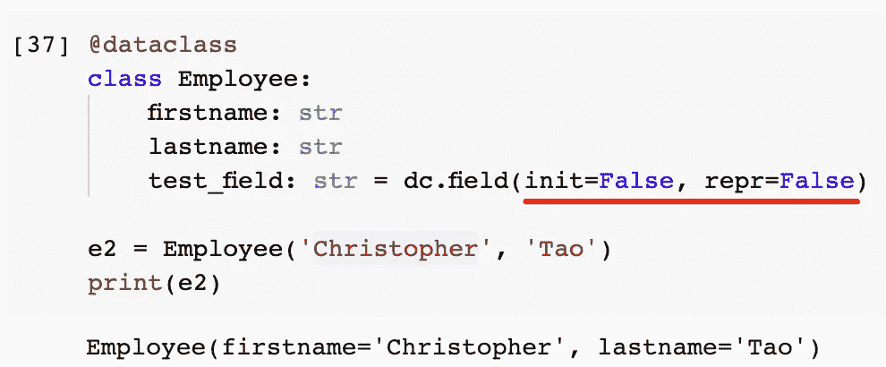
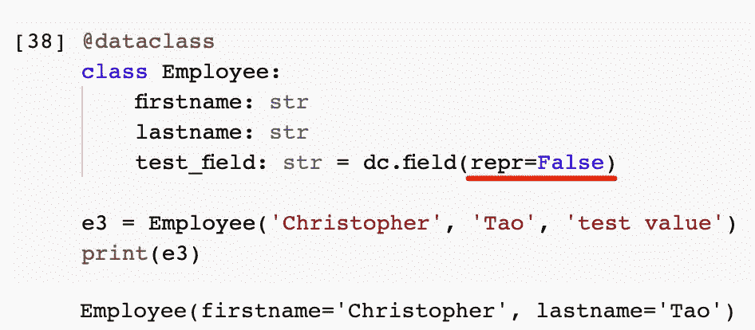

# data class——Python 中最简单的面向对象编程

> 原文：<https://towardsdatascience.com/dataclass-easiest-ever-object-oriented-programming-in-python-ffd37cd2a5bf>


图片由 [wal_172619](https://pixabay.com/users/wal_172619-12138562/?utm_source=link-attribution&utm_medium=referral&utm_campaign=image&utm_content=6957870) 发自 [Pixabay](https://pixabay.com/?utm_source=link-attribution&utm_medium=referral&utm_campaign=image&utm_content=6957870)

## Python 内置的装饰器降低了代码的复杂性和长度

Python 中的面向对象编程(OOP)一直是热门话题之一。这是因为 Python 之所以出名，是因为它的灵活性和开箱即用的特性可以在很大程度上减少开发工作，这对于 OOP 来说也是如此。

我写过几篇关于在面向对象的场景中使用 Python 的文章。以下是其中的一些，供大家参考。

*   [可能是面向对象 Python 的最佳实践— Attr](/probably-the-best-practice-of-object-oriented-python-attr-d8c26c0e8a4)
*   [最优雅的 Python 面向对象编程](/the-most-elegant-python-object-oriented-programming-b38d75f4ae7b)

他们都需要利用第三方库，这仍然是很好的解决方案。

在本文中，我将介绍一个 Python 内置模块——data class。它是在 Python 3.7 中引入的，这使得开发人员能够在没有任何第三方库的情况下以面向对象的方式进行编码。

# 1.为什么选择数据类


来自 [Pixabay](https://pixabay.com/?utm_source=link-attribution&utm_medium=referral&utm_campaign=image&utm_content=1147815) 的 [ElasticComputeFarm](https://pixabay.com/users/elasticcomputefarm-1865639/?utm_source=link-attribution&utm_medium=referral&utm_campaign=image&utm_content=1147815) 的图像

我需要回答的第一个问题可能是为什么我们需要使用 Dataclass？普通的 Python 类有什么问题？让我们考虑这样的场景。

我们将使用 Python 实现一个应用程序。假设我们需要编写一个“Person”类来保存对象中某个人的一些属性。我们可以写一个如下的类。

这已经简化为只有 3 个属性。所以，我们可以如下实例化一个人。

```
p1 = Person('Christopher', 'Tao', 34)
```

我们必须实现`__repr__()`方法，因为我们希望出于调试目的方便地打印对象。


我们还想实现`__eq__()`方法，因为我们想比较对象以确定它们是否是同一个“人”。

```
p2 = Person('Christopher', 'Tao', 34)
p1 == p2 # compare the two persons
```


此外，我们需要在个人类中的一些定制功能，如`greeting()`方法。


与大多数其他编程语言相比，它已经足够好了。这已经很简洁了。不过我们当时做的一些事情还是比较有规律的，可以在 Python 的“禅”的指引下跳过。

现在，让我们看看 Dataclass 如何改进这一点。我们只需要导入`dataclass`，它内置在 Python 3.7 及以上版本中。

```
from dataclasses import dataclass
```

然后，我们可以在定义类时使用 Dataclass 作为装饰器。

```
[@dataclass](http://twitter.com/dataclass)
class Person:
    firstname: str
    lastname: str
    age: int def greeting(self):
        print(f'Hello, {self.firstname} {self.lastname}!')
```

就是这样。完成了。您可以预期，我们刚刚使用装饰器定义的数据类具有我们在前面的普通类中定义的所有特性。是的，除了`greeting()`方法是一个真正的定制类方法，其他的都是在后台自动生成的。我们可以使用相同的代码进行测试(我不会附加两次测试演示代码)，并获得相同的结果。



所以，直接的答案是 Python Dataclass 会自动为我们实现`__init__()`、`__repr__()`和`__eq__()`方法。

# 2.现成的实用程序


图片来自[来自 www.picjumbo.com 的免费库存照片](https://pixabay.com/users/picjumbo_com-2130229/?utm_source=link-attribution&utm_medium=referral&utm_campaign=image&utm_content=864983)来自 [Pixabay](https://pixabay.com/?utm_source=link-attribution&utm_medium=referral&utm_campaign=image&utm_content=864983)

除了上面提到的基本好处，Dataclass 还提供了一些非常方便的实用程序。我不会一一介绍，但这里会展示一些例子。

一旦我们定义了一个数据类，我们就可以利用`dataclasses`包中的一些工具。因此，为了方便起见，我们需要导入它，并可能给它一个别名。

```
import dataclasses as dc
```

然后，我们可以使用`fields()`方法检索已定义数据类的字段。不仅是类定义，它还可以处理实例。

```
dc.fields(Person)
dc.fields(p1)
```



因为这些是“数据类”，所以将它们序列化为 JSON 对象是很常见的。这通常需要其他编程语言(如 Java)的第三方库。然而，使用 Python Dataclass，就像调用内置方法一样简单。我们可以从数据类对象中获取一个 Python 字典。

```
dc.asdict(p1)
```


如果我们只对字段的值感兴趣，我们也可以得到一个包含所有这些值的元组。这也将允许我们轻松地将其转换为列表。

```
dc.astuple(p1)
```


有时，我们可能想要定义许多类，并且一些字段或方法可能被参数化。这通常在其他编程语言中用复杂的语法来完成，比如 Java 中的反射。然而，在 Python 中，我们可以使用`make_dataclass()`方法来生成我们想要的数量。

下面是一个使用方法生成“Student”类的示例。

然后，我们可以像使用其他数据类一样使用这个类。

```
s = Student('Christopher', 'Tao', '10001')
print(s)
s.greeting()
```


# 3.定制的类注释


图片来自 [Pixabay](https://pixabay.com/?utm_source=link-attribution&utm_medium=referral&utm_campaign=image&utm_content=2246457)

通常，这些类型的特性只满足非常常见的用例。当我们有一些特殊的需求时，它可能会迫使我们回到使用正常的解决方案。然而，在 Python 中并非总是如此，Dataclass 也是如此。

Dataclass 允许我们注释类装饰器来定制行为。

## 启用比较

Dataclass 自动为我们实现了`__eq__()`方法，这很棒，但是其他的比较方法呢？换句话说，我们还需要`__lt__()`、`__gt__()`、`__le__()`和`__ge__()`方法。

我们也可以很容易地自动实现它们，只需简单地给装饰添加一个标志`order=True`。

```
[@dataclass](http://twitter.com/dataclass)(order=True)
class Person:
    name: str
    age: intp1 = Person('Alice', 30)
p2 = Person('Bob', 56)
```



该逻辑将使用第一个字段作为比较对象的标准。因此，为了方便地使用`order`注释来自动生成所有的比较方法，我们可以将“age”字段放在前面。然后，这些人可以按年龄进行比较，如下所示。


## 不可变字段

有时我们可能希望数据对象的属性不可更改。在这种情况下，我们可以通过在装饰器中添加标志`frozen=True`来“冻结”字段。

```
[@dataclass](http://twitter.com/dataclass)(frozen=True)
class Person:
    name: str
    age: intp1 = Person('Chris', 34)
print(p1)
```



然后，如果我们试图修改属性，将会抛出一个错误。

```
p1.name = 'Christopher'
```


# 4.定制字段注释


图片由 [NOST](https://pixabay.com/users/nost-3003393/?utm_source=link-attribution&utm_medium=referral&utm_campaign=image&utm_content=1555218) 来自 [Pixabay](https://pixabay.com/?utm_source=link-attribution&utm_medium=referral&utm_campaign=image&utm_content=1555218)

不仅在类级别，数据类中的字段也可以被注释。因此，我们可以为他们添加一些定制的行为。

## 默认值和默认工厂

我们可以给一个属性一个默认值。如果在初始化过程中没有给出，该属性将被赋予默认值。

另外，默认的“值”不限于一个值，它也可以是一个函数。

```
[@dataclass](http://twitter.com/dataclass)
class Employee:
    firstname: str
    lastname: str
    skills: list = dc.field(default_factory=list)
    employee_no: str = dc.field(default='00000')
```

在上面的 Employee 类中，如果没有给出，雇员号将是“00000”。如果在初始化过程中没有给出技能列表，也将对其进行初始化。

```
e1 = Employee('Christopher', 'Tao')
print(e1)
```


如果我们以后想给这个员工添加一些技能，我们可以添加技能列表，而不必检查它是否已经初始化。

```
e1.skills += ['Python', 'Writing']
print(e1)
```


## 排除字段

有时，我们可能不希望所有的字段都使用`__init__()`方法。在一个普通的类中，我们只是不把它们添加到方法中。在一个数据类中，如果我们不想包含它们，我们需要将其标记为`init=False`。

```
[@dataclass](http://twitter.com/dataclass)
class Employee:
    firstname: str
    lastname: str
    test_field: str = dc.field(init=False)
```

然后，我们可以创建一个对象，而不需要提供第三个字段的值，如下所示。

```
e1 = Employee('Christopher', 'Tao')
```

然而，会有一个问题。也就是说，`test_field`属性仍将在`__repr__()`方法中实现。


因此，我们需要添加另一个标志来将其排除在外。

```
[@dataclass](http://twitter.com/dataclass)
class Employee:
    firstname: str
    lastname: str
    test_field: str = dc.field(init=False, repr=False)e2 = Employee('Christopher', 'Tao')
print(e2)
```



在某些情况下，我们可能仍然希望在`__init__()`方法中有一个字段，但只是想在打印对象时将其排除在外。为了实现这一点，我们只需要`repr`标志。

```
[@dataclass](http://twitter.com/dataclass)
class Employee:
    firstname: str
    lastname: str
    test_field: str = dc.field(repr=False)e3 = Employee('Christopher', 'Tao', 'test value')
print(e3)
```



# 5.后初始化


图片由来自 [Pixabay](https://pixabay.com/?utm_source=link-attribution&utm_medium=referral&utm_campaign=image&utm_content=1388228) 的[照片合成](https://pixabay.com/users/photomix-company-1546875/?utm_source=link-attribution&utm_medium=referral&utm_campaign=image&utm_content=1388228)

作为我想介绍的最后一个特性，它允许我们在初始化完成后定制数据类的行为。

假设我们想为矩形定义一个类。所以，它需要有高度和宽度。我们也希望有一个矩形的面积，但显然，这可以从其他两个属性派生出来。此外，我们想比较矩形的面积。

为了实现这些，我们可以在数据类中实现一个`__post_init__()`方法，如下所示。

```
[@dataclass](http://twitter.com/dataclass)(order=True)
class Rectangle:
    area: float = dc.field(init=False)
    height: float
    width: float def __post_init__(self):
        self.area = self.height * self.width
```

创建对象后，将执行 post init 方法。我们可以测试它是否有效。

```
r1 = Rectangle(2,4)
print(r1)
```


我之所以要把`area`字段放在第一个位置，是为了让它成为比较的标准。所以，矩形物体可以通过它们的面积来比较。

```
Rectangle(1,8) > Rectangle(2,3)
```


# 摘要


图片来自[皮克斯拜](https://pixabay.com/?utm_source=link-attribution&utm_medium=referral&utm_campaign=image&utm_content=3021072)

在本文中，我介绍了 Python 中的 Dataclass 模块。它是从 3.7 版本开始内置的，这可以在很大程度上降低我们代码的复杂性，并大大加快我们的开发。

Dataclass 试图概括数据类的常见需求，并提供现成的，但它也提供类级和字段级的注释，允许我们定制行为。除此之外，post init 方法给了我们更多的灵活性。

[](https://medium.com/@qiuyujx/membership) [## 通过我的推荐链接加入灵媒-陶

### 作为一个媒体会员，你的会员费的一部分会给你阅读的作家，你可以完全接触到每一个故事…

medium.com](https://medium.com/@qiuyujx/membership) 

**如果你觉得我的文章有帮助，请考虑加入灵媒会员来支持我和成千上万的其他作家！(点击上面的链接)**

> *除非另有说明，所有图片均出自作者之手*