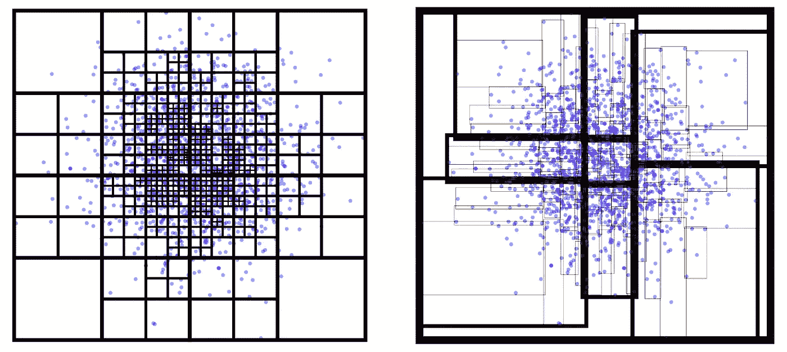
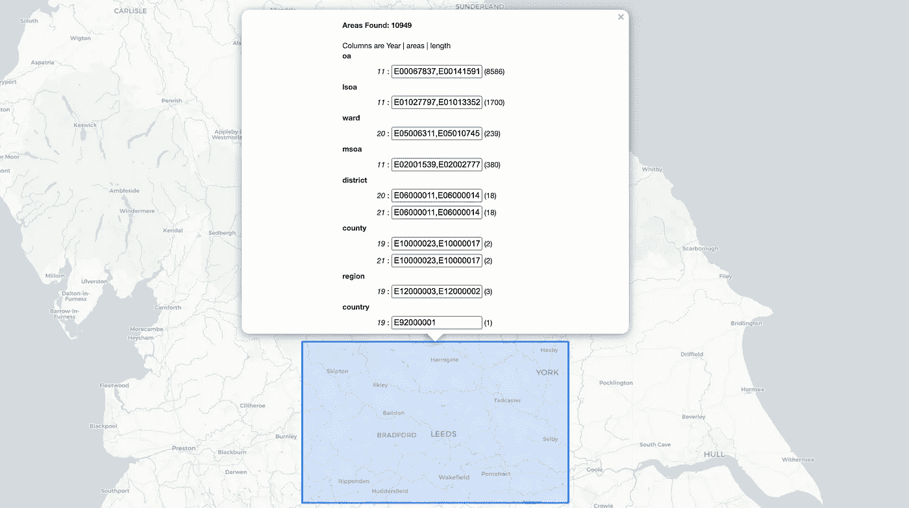

# 使用 RTrees 和地理数据的数据集识别

> 原文：<https://towardsdatascience.com/dataset-identification-using-rtrees-and-geographical-data-682f8dab78fa>

## 找出哪些数据集包含预定义区域内的面


史蒂文·卡梅纳在 Unsplash[拍摄的照片](https://unsplash.com?utm_source=medium&utm_medium=referral)

# 背景

地理区域数据集通常在每个文件中包含大量多边形。此外，不同的分类意味着有几种类型的区域文件可供选择。

如果我们想要定位特定选择的所有相关数据集，加载每个单独的 GeoJSON 或是低效的。shp 文件并查询它们。相反，我们利用分层树结构([很像使用 k 维树来定位最近的邻居](https://daniel-ellis.medium.com/extracting-similar-data-using-k-d-trees-to-efficiently-locate-nearest-neighbors-332a014f2fb))来减少所需的搜索时间。

## 什么是树

Rtrees 不是将超平面分割成大小相等的盒子(quad/oct 树)或使用二进制分割方法(k-d 树)，而是将数据分割成矩形，使得每组中有相等数量的叶子。

R 树的主要好处是它们是面向地理的。它们的多维搜索关键字结构使它们针对空间数据进行了优化(包含“分组”矩形不需要覆盖整个空间域)。对每个多边形使用边界框是 RTrees 更适合索引质心(点)数据的原因。正是由于这个原因，许多 RTree 实现可以在空间数据库或地理空间包中找到(例如来自 geopandas 的`.sindex`)。



同一个数据集上的八叉树(左)、三叉树(右)。来源:代码改编自 [**法蒂陈**](https://observablehq.com/@stardisblue)

***注意:*** *由于多边形从来都不是正方的，所以边界上可能会有一些矩形重叠。尽管这对于多边形定位非常有用，但如果您需要将每个项目一一映射到一个组，这可能会导致问题。在使用 k-d 或八叉树的这种情况下，方法可能是优选的。*

## 数据集

我们使用的数据集是从国家统计局下载的，涵盖了许多区域大小(输出区域→国家),跨越数年。它们位于[这个存储库](https://github.com/wolfiex/ONSAreaFinder/tree/main/data)中，以 gzipped geoJSON 文件的形式存在。

读取数据和提取内存中的数据可以按如下方式完成:

```
import geopandas as gpd
import gzipgdf = gpd.read_file(gzip.open(**<filename.gz>**,'rb'))
```

# 获取边界框并构造项目对象

一旦我们加载了我们的文件，我们需要计算每个几何图形的边界框和我们希望传递的任何附加信息。在本例中，我感兴趣的是每个 geoJSON 文件的文件名和年份，使用 regex 搜索很容易提取出来:

```
def splice(area,name):        bbox = dict(zip(['minX','minY','maxX','maxY'],area.geometry.bounds))        origin = re.search(r'\D+',name).group()    
    year = re.search(r'\d+',name).group()     

   return **dict(id = area.areacd, origin=origin, year=year, **bbox)**
```

然后这个函数被应用到每个文件的每个项目，并连接成一个列表——准备转换成一个 RTree！

# r bush(RTree NPM 包)

虽然我们使用 python 进行处理，但是这个工具的最终版本将在 JavaScript 中执行(并且在 web 上)。出于这个原因，我们选择使用 RTree 库的 JS 实现，而不是 geopandas 中使用的 python‘RTree’库。

## 在 Python 中使用 RBush

为了在 python 中运行 javascript，我们利用了`js2py`库。这里，我们首先设置一个具有 require 功能的 JS 评估引擎，然后加载节点 RBush 库。最后，我们创建一个新的 RBush 元素，并将其读入我们的 python 程序。

```
import js2py context = js2py.EvalJs(enable_require=True)context.eval("const RBush = require('rbush')")tree = context.eval(f"new RBush({size})")
```

## 向 RBush 批量添加数据

就计算和处理而言，单个大型操作通常比需要在运行时改变数组大小的单个操作更有效。出于这个原因，我们使用以下命令将之前生成的变量列表读入 RBush 对象:

```
tree.load(list_of_items)
```

对于大型数据集，这可能需要几分钟时间。

## 保存到磁盘

最后，我们希望将生成的树保存到磁盘上，供以后使用，并加载到我们的 web 应用程序中。我们通过将`js2py` JSON 树结构转换成 python 字典，然后使用 python `json`库将其写入文件来实现这一点。

```
import json 
**json.dump**(tree.toJSON()**.to_dict()**,open('docs/tree.json','w'))
```

# 构建 Web 应用程序并执行

现在我们已经生成了我们的树，最后一步是在我们的定制 web 应用程序上执行它。我们需要做的第一件事是加载新保存的 JSON 文件:

```
const data = await fetch(            
     "https://wolfiex.github.io/ONSAreaFinder/tree.json"          
   ).then((d) => d.json()) const tree = new rbush(10).fromJSON(data)
```

接下来，自定义边界框选择工具与下面的树搜索功能相结合:

```
tree.search({
    minX: bbox.mnx,
    minY: bbox.mny,
    maxX: bbox.mxx,
    maxY: bbox.mxy
});
```

这将产生一个描述所有区域类型及其源文件的界面，如下图所示。现场互动版可以在这里 **找到 [**。**](https://wolfiex.github.io/ONSAreaFinder/)**



该工具运行时的屏幕截图。来源:Self(此处可用<https://wolfiex.github.io/ONSAreaFinder/>****)****

# **结论**

**RTrees 已被大量用于快速多边形索引，并在地理数据集查询程序的几个数据库中实现。我们填充了 RBrush npm 库，并从 javascript 和 python 中使用它来构建一个可查询的地图，该地图标识哪些区域类型属于特定的选择。**

## **应用:**

**[https://wolfiex.github.io/ONSAreaFinder/](https://wolfiex.github.io/ONSAreaFinder/)**

## **代码:**

**该项目的代码可在 `(__main__.py)`找到:**

**<https://github.com/wolfiex/ONSAreaFinder>  

“docs”目录下的 web 应用程序`(index.js).`

```
Dan Ellis. (2022). 
wolfiex/ONSAreaFinder: v1.0 (v1.0). Zenodo. https://doi.org/10.5281/zenodo.6408276
```