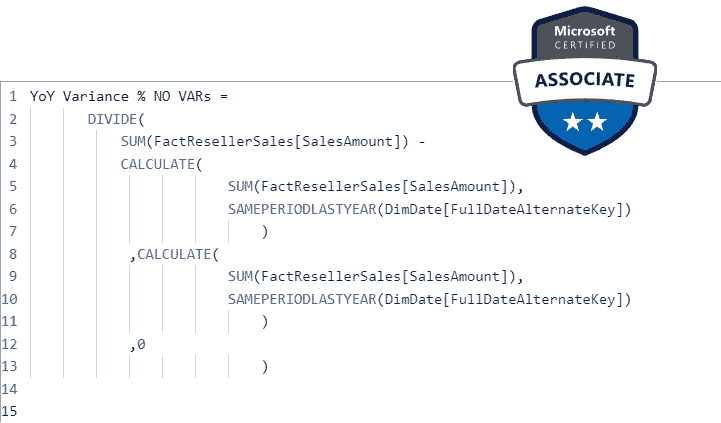
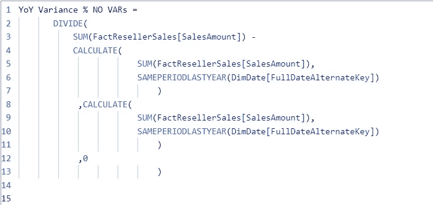
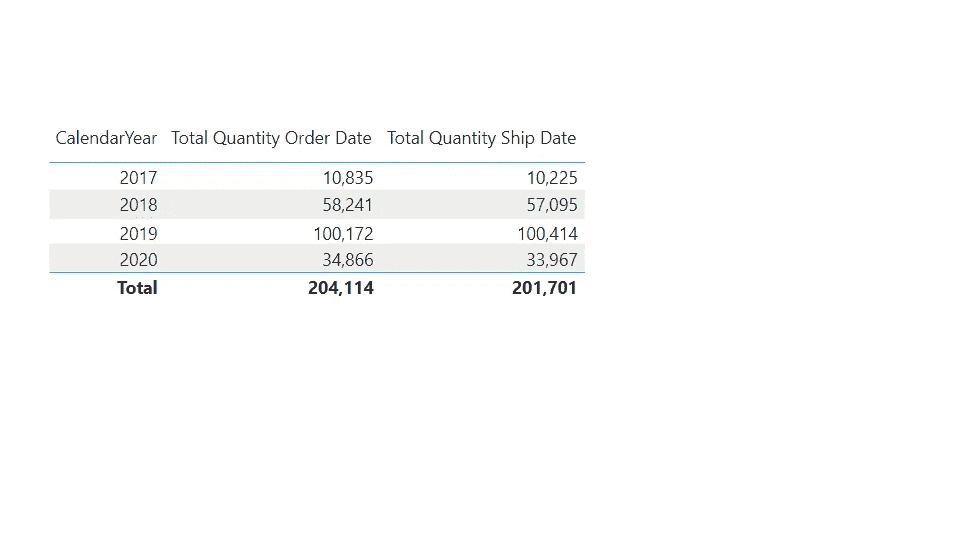
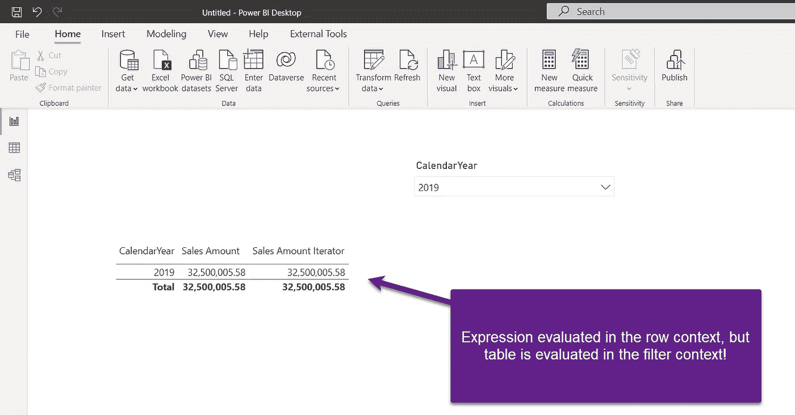

# Power BI 中的 DAX 变量、虚拟关系和迭代器

> 原文：<https://towardsdatascience.com/dax-variables-virtual-relationships-and-iterators-in-power-bi-fbbc2fb5b103>

## “DAX 简单，但不容易！”让我们学习一些 DAX 的细微差别，可以让你成为一个真正的权力 BI 英雄！



作者图片

“DAX 简单，但不容易！”—当被问及哪种语言最能描述数据分析表达式语言时，阿尔贝托·法拉利(Alberto Ferrari)说了一句名言。这可能是 DAX 指数最精确的定义。乍一看，这可能非常容易，但是理解细微差别和 DAX 的实际工作方式，需要大量的时间和“试错”案例。

显然，这篇文章不是对 DAX 内部的深入探讨，也不会深入这些细微差别，但它将(有希望)帮助您更好地理解几个非常重要的概念，这将使您的 DAX 之旅更加愉快，并帮助您准备 DP-500 (Azure 企业数据分析师)考试。

# DAX 中的变量

作为 DAX 新手，很容易陷入认为不需要变量的陷阱。简单地说，当您的 DAX 公式由一两行代码组成时，您为什么要关心变量呢？！

然而，随着时间的推移，你开始写更复杂的计算，你会开始欣赏变量的概念。当我说更复杂的计算时，我指的是使用嵌套函数，并可能重用表达式逻辑。此外，在许多情况下，变量可能会显著提高您的计算性能，因为引擎将只对表达式求值一次，而不是多次！

最后，使用变量使您能够更容易地调试代码，并验证公式某些部分的结果。

下面是一个在 DAX 代码中使用变量的简单示例:


作者图片

正如您可能注意到的，定义变量需要在表达式被求值并赋给特定变量之前使用 ***var*** 关键字。

当然，上面的例子相当简单，但是让我们假设我们想以百分比的形式显示同比变化。我们可以这样写一个度量:



作者图片

这里要注意的第一件事是，我们重复使用完全相同的表达式来计算前一年的销售额。我们可以这样写同样的度量:


作者图片

我想我们都同意第二个版本可读性更强，更容易阅读和理解。正如我所说，这是一个相当基本的公式，你可以想象在更复杂的场景中使用嵌套函数的变量的影响。

变量可以在度量和计算列中使用。

# 处理空白

在创建报告时，我相信您会面临得到*(空白)*的情况，并且您不希望以这种方式向最终用户显示。

我已经写了一篇文章，展示了三种可能的方法来处理你的 Power BI 报告中的空白。

您可以选择使用 IF 语句、COALESCE()函数，或者通过在数值计算中添加 0 来应用技巧。

然而，在另一篇文章中，我也解释了为什么在用其他值替换空白值之前应该三思。在某些情况下，这可能是真正的性能杀手。

# DAX 中的虚拟关系

在我解释什么是虚拟关系以及如何创建虚拟关系之前，我想强调的是，在数据模型中的表之间拥有物理关系的 ***始终是一种推荐的做法*** ！但是，在某些情况下，可能会发生表之间没有物理关系的情况，您只需要模拟不存在的物理关系。

创建虚拟关系最方便的方法是使用 DAX 中的 *TREATAS()* 函数。正如 SQL BI 的文章[中所解释的，这是创建与 TREATAS 的虚拟关系的伪代码的样子:](https://www.sqlbi.com/articles/propagate-filters-using-treatas-in-dax/)

```
[Filtered Measure] :=
CALCULATE (
    <target_measure>,
    TREATAS (
        SUMMARIZE (
            <lookup_table>
            <lookup_granularity_column_1>
            <lookup_granularity_column_2>
        ),
        <target_granularity_column_1>,
        <target_granularity_column_2>
    )
)
```

让我们看看现实生活中的例子是什么样的！我将向您展示如何在角色扮演维度场景中利用虚拟关系。在之前的一篇文章中，我解释了如何使用 USERELATIONSHIP()函数处理角色扮演维度来更改表之间的活动关系，现在我将向您展示如何在表之间创建两个与模型中的物理关系无关的虚拟关系:


作者图片

假设我想分析在特定日期(订单日期)下了多少订单，以及在特定日期(发货日期)下了多少订单。第一个度量将在 OrderDate 列上的 FactResellerSales 和 DimDate 表之间建立虚拟关系:

```
Total Quantity Order Date = 
                CALCULATE(
                            SUM(FactResellerSales[OrderQuantity]),
                            TREATAS(
                                VALUES(DimDate[FullDateAlternateKey]),
                                FactResellerSales[OrderDate]
                            )
                )
```

本质上，作为虚拟关系的查找表，通过使用 VALUES()函数，我们从 DimDate 表中获取所有不同的(非空)值。在这个虚拟关系的另一边是我们的 OrderDate 列。让我们创建一个类似的度量，但是这次在 ShipDate 列上建立一个虚拟关系:

```
Total Quantity Ship Date = 
                CALCULATE(
                            SUM(FactResellerSales[OrderQuantity]),
                            TREATAS(
                                VALUES(DimDate[FullDateAlternateKey]),
                                FactResellerSales[ShipDate]
                            )
                )
```

这是我们在表格上放置两个度量后的外观:



作者图片

因此，即使我们的表与物理关系无关，我们也能够“即时”创建关系，并在 Power BI 报告中显示正确的数字。

# DAX 迭代器

不像*聚合器*聚合特定列的所有值，*返回单个值* , ***迭代器为它们正在操作的表格的每一行应用表达式*** ！

因此，两者之间的第一个区别是迭代器需要(至少)两个参数才能工作——第一个参数始终是迭代器需要迭代的表(物理表或虚拟表),第二个参数是需要应用于该表每一行的表达式。

最常见的迭代器函数实际上是聚合器函数的“亲戚”:


作者图片

如你所见，迭代器函数的末尾有字母 X，这是在 DAX 公式中识别它们的最简单的方法。然而，一个有趣的事实是聚合函数也被引擎内部翻译成迭代器函数！所以，当你写下这样的话:

```
Sales Amount = SUM('Online Sales'[SalesAmount])
```

在内部翻译成:

```
Sales Amount = SUMX('Online Sales',
                     'Online Sales'[SalesAmount]
                 )
```

请记住，当你想写一个包含不止一列的表达式时，你必须使用迭代器！

迭代器函数需要理解的关键是它们运行的上下文。当它们逐行迭代时，表达式在行上下文中进行计算，类似于计算列 DAX 公式。然而，该表是在筛选器上下文中进行评估的，这意味着，比方说，如果“在线销售”表上有一个活动的筛选器只显示 2019 年的数据，则最终结果将包括 2019 年的行的总和(假设您使用的是 SUMX 迭代器函数)。

```
Sales Amount Iterator = 
                    SUMX (
                        FactResellerSales,
                        FactResellerSales[OrderQuantity] * FactResellerSales[UnitPrice]
                    )
```



作者图片

关于迭代器函数的最后一个警告:在大量数据上使用复杂的迭代器函数时要小心，因为它们是逐行计算的，在某些情况下可能会导致性能问题。

# 结论

不断重复:“DAX 很简单，但不容易！”…正如您可能已经看到的，DAX 为您提供了一个快速进入(im)可能世界的入口，在这里您可以执行各种计算，但您需要了解语言的细微差别，并了解引擎在后台的实际工作方式。

我强烈建议关注 SQL BI 频道和博客，或者阅读“DAX 圣经”:DAX 权威指南，第二版。

网络上还有其他学习 DAX 的极好资源，比如企业 DNA 频道，或者布莱安·葛兰特的令人敬畏的系列视频，叫做“DAX 元素”。

感谢阅读！