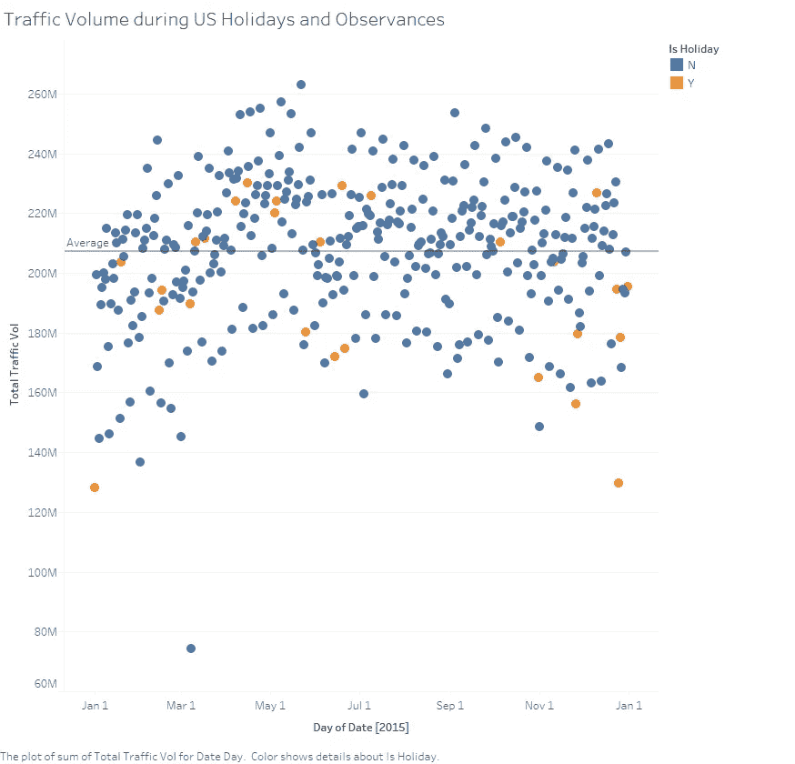
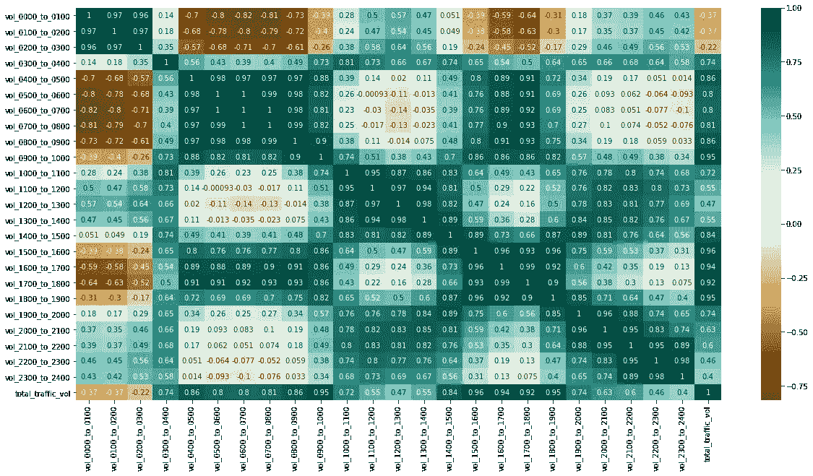
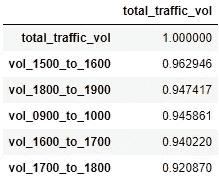
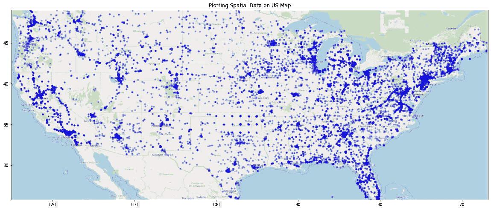
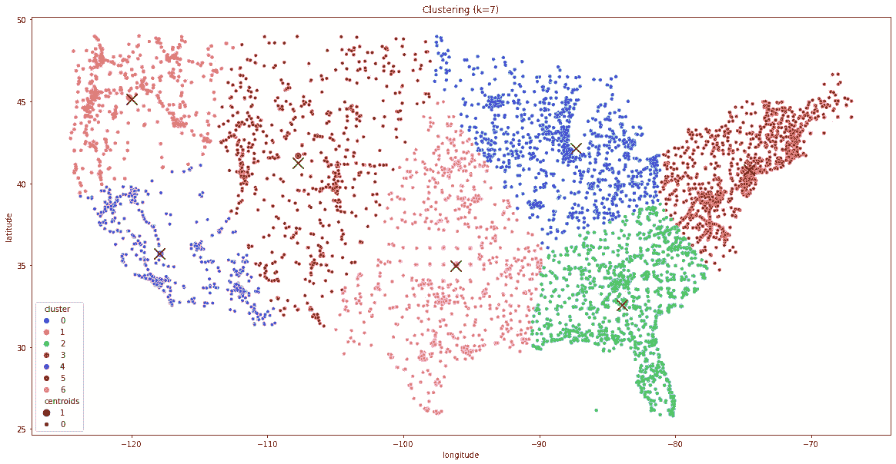
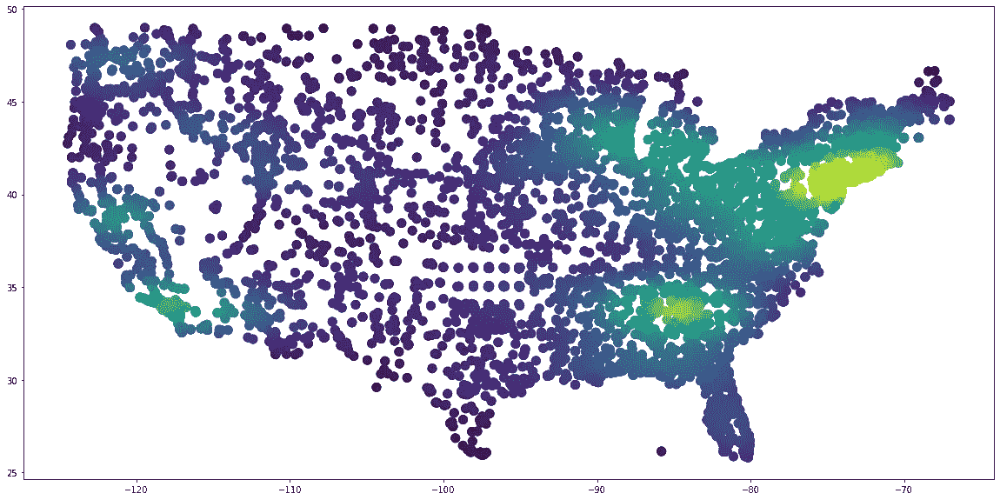
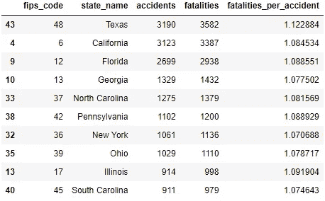
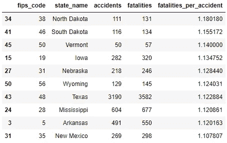
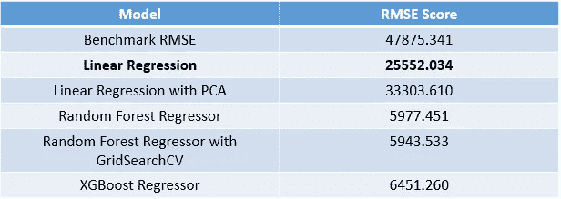

# 揭穿我对交通数据的假设

> 原文：<https://towardsdatascience.com/debunking-my-assumptions-on-traffic-data-328f6a38a772>

# 揭穿我对交通数据的假设

## 从数据探索到模型训练，如何充分利用交通数据集。


美国宇航局在 [Unsplash](https://unsplash.com/s/photos/usa-map?utm_source=unsplash&utm_medium=referral&utm_content=creditCopyText) 拍摄的照片

前阵子，作为黑客马拉松的一部分，我对 [**美国交通 2015 数据**](https://www.kaggle.com/jboysen/us-traffic-2015) 做了一个分析。交通数据集由[美国交通部](https://www.transportation.gov/data)编制，可在[谷歌大查询](https://cloud.google.com/bigquery/public-data/)上获得

黑客马拉松组织者没有给出任何问题陈述，除了从这个数据集中找出 5 个最明显的模式。我照做了——事情是这样的。

## **接近**

我处理交通数据集的经验有限，但我确实有大量关于交通量和交通状况的数据假设。从这些假设和我自己的探索性数据分析中，我形成了假设，并尽力去证明！

# 1.美国节假日和纪念日对日交通量的影响

当浏览美国交通数据时，我首先想到的是许多好莱坞电影，这些电影展示了假期期间家庭在长时间的交通堵塞中穿行的场景。因此，我决定测试一下我的假设，即日流量的激增主要是由假日季节造成的。

我导入了 2015 年美国假日日期，并创建了一个 Tableau 可视化，每个数据点表示当天观察到的交通量。



作者图片

画出平均线后，我观察到，从“Y”(橙色)点的分布来看，假日日期对交通量的影响并不显著。

我决定扩大突出显示点的数量，以包括节假日前后的+/- 1 天(例如，圣诞节—12 月 24 日和 12 月 26 日)。尤其是因为游客们很有可能在假期的前一天或后一天走遍全国。


作者图片

不幸的是，即使突出显示的点扩大了，我仍然没有观察到假日日期和交通流量之间的任何模式。事实上，与假日日期(51.47%)相比，非假日日期高于平均交通量(57.77%)的百分比更高。这进一步证明了我最初的假设是错误的。

# 2.时刻与日交通量的相关性

对于我的第二个任务，我试图在**找出在整个 24 小时周期中哪个时间段对日交通量影响最大。**

我是通过一天中的时间流量与每日总流量之间的关联热图来做到这一点的。

```
plt.figure(figsize=(20,10))
c= df2.corr()
sns.heatmap(c,cmap='BrBG',annot=True)
c
```



作者图片

## 相关值



作者图片

在对这些值进行排序后，我观察到下班后的高峰时间与早上上班前的交通相比，对整体每日交通有更大的影响，因为在最高的 5 个相关值中，4/5 是 1500-1900 的时段。


作者图片

然后，该表通常遵循上午高峰时间，随后是下午时段。我还观察到负相关值是从 0000 到 0300 没有流量模式的奇数周期。

# 3.交通站的几何位置与交通事故和死亡人数的关系

在前两次分析后，我不禁想知道交通量是否代表了整个美国，因为肯定会有农村地区的数据收集可能是一个问题。收集交通数据有多种原因，如经济和环境原因。然而，在我看来，最大的原因必须是限制交通事故和这些事故造成的死亡。

因此，我的假设是，美国政府会在交通事故风险更大的州设立额外的交通站。

为了测试我的假设，我利用了 [**OpenStreetMap**](https://www.openstreetmap.org/about) 和来自国家公路交通安全管理局(NHTSA)[2**015 交通事故数据集**](https://console.cloud.google.com/bigquery?p=bigquery-public-data&d=nhtsa_traffic_fatalities&page=dataset&project=ace-axon-271215&ws=!1m4!1m3!3m2!1sbigquery-public-data!2snhtsa_traffic_fatalities) 的额外数据来源。



作者图片

在 OpenStreetMap 上绘制了交通站点后，我注意到有几个热点，并希望使用 **KMeans clustering** 将地图分成几个聚类，以便进一步分析。



作者图片

使用肘方法发现了 7 个簇。此外，我还决定绘制一个热图，以更好地显示交通站的密度。



作者图片

“热区”可以通过黄色和浅绿色色调从密度图中识别出来。有了这些信息，就可以将这些“热点”区域的状态与死亡率进行比较了。

## 交通事故最多的 10 个州(2015 年)



作者图片

## 事故死亡率最高的 10 个州(2015 年)



作者图片

在分析了每个州的事故和死亡趋势后，我观察到，事故发生率高的州很可能在道路上安装了交通站。这证明了我的假设是正确的，州政府很可能会在事故多发路段设置更多的加油站。

# 4 & 5.加州交通量预测

在之前的分析中，我注意到加利福尼亚州安装的交通站数量最多，与第二多的州佐治亚州相比有显著差异。

因此，在我最后的分析中，我选择关注加利福尼亚州，并部署了几个机器学习模型来预测交通量。

## 模型结果



作者图片

在尝试了不同的 ML 模型之后，线性回归模型仍然是产生最低 RMSE 结果的模型。在最终的测试数据集上部署它之后，我能够将基准 RMSE 降低大约。47875.341 到最终的 RMSE 25285.543，提高了近 50%。

## 特征重要性分数


作者图片

我观察到最高的三个分数属于与车道数相关的特征。这可能是因为高速公路等车道数较多的道路能够容纳不同等级、重量和容量的大量车辆。因此提高了交通流量。反之亦然，对于车道数少的道路。


作者图片

从下面的分数中，我们可以观察到出行交通的方向流对交通量的影响最小。因此，我相信在这个预测模型中更重要的特征是基于道路的分类而不是交通流量。

# 未来作品

在数据科学项目中，数据建模很少有尽头。即使模型已经被批准部署，也总是有机会继续完善模型，要么使用更好的机器学习工具，要么使用新的数据源。

在这个项目中，我相信如果黑客马拉松给出的数据包括天气条件、光照条件、道路交叉口类型和道路施工等特征，最终的模型可以进一步改进。

在这个项目的过程中，我偶然发现了 NHTSA[**的死亡分析报告系统**](https://cdan.nhtsa.gov/) 的一个综合数据集，记录了车辆碰撞事件。我觉得这个数据集将是一个很好的方式来补充我上面所做的分析，我很高兴能够继续揭示我脑海中关于交通数据的许多假设。

这个项目的代码可以在我的 git repo [**这里**](https://github.com/ngohweijie/us-traffic-patterns-2015) 找到。

*快乐编码！*