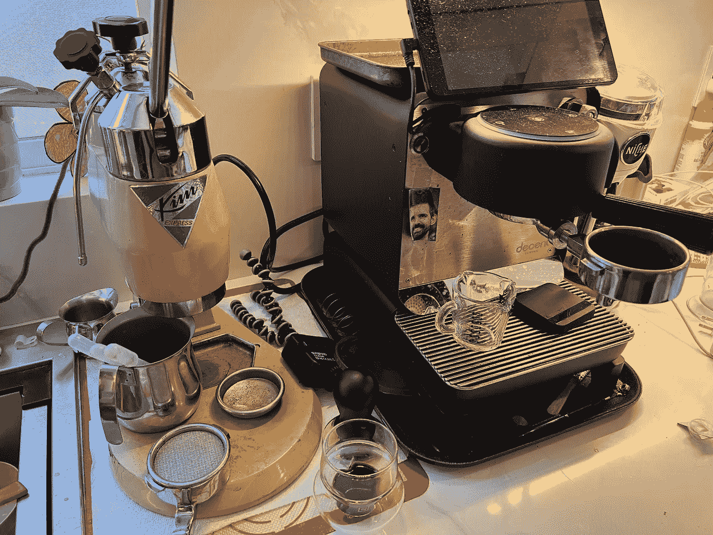
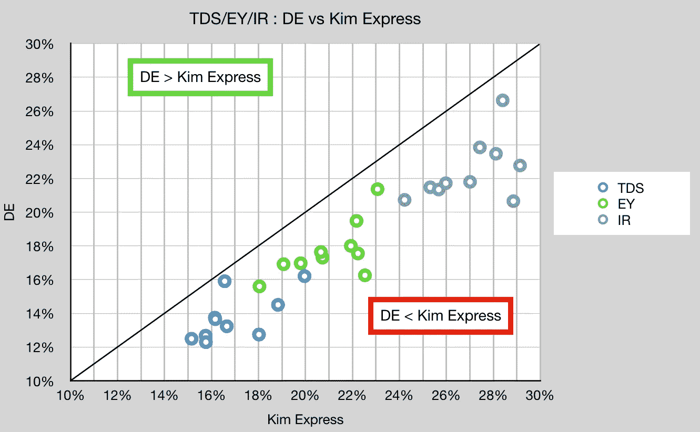
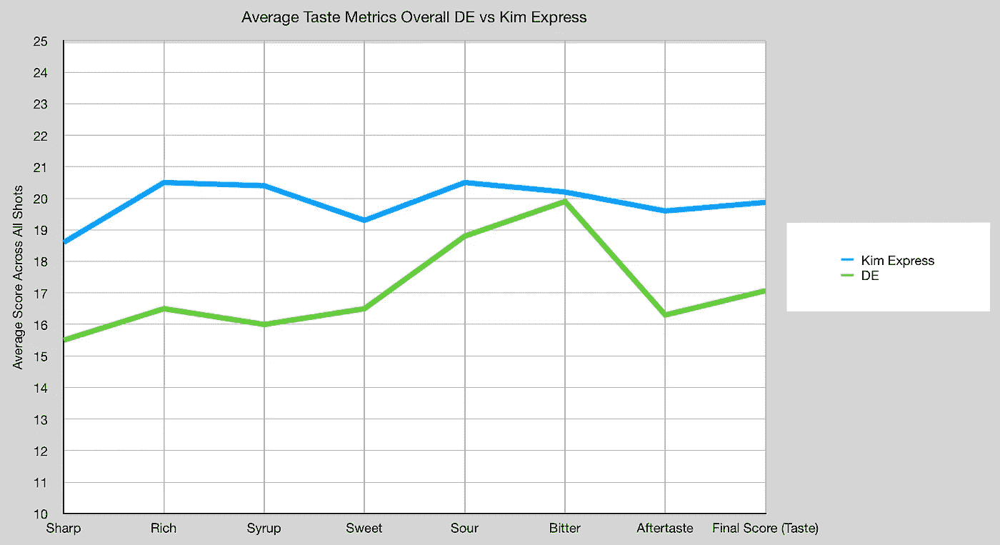

# 体面的浓缩咖啡 DE1Pro vs 金快递:第 1 轮

> 原文：<https://towardsdatascience.com/decent-espresso-de1pro-vs-kim-express-round-1-54dffdfd2892>

## 咖啡数据科学

## 金是卫冕冠军

我在一月份买了一杯不错的浓缩咖啡，并尽我所能做了最好的简介。我买的是 DE1Pro 型号。我想是时候和我心爱的[金快线](/kim-express-vs-la-pavoni-espresso-face-off-5c37158dc3b3)做一次面对面的比较了。

金氏家族不只是赢了。金被摧毁了。这让我怀疑我对浓缩咖啡了解多少？

我们可以改天再来讨论这个问题，但是今天，让我们把注意力集中在这次表演有多么不同，以及为什么会这样的一些初步想法。

所有图片由作者提供

[Kim Express](https://rmckeon.medium.com/kim-express-espresso-machine-instructions-93288f70be6c) 是 20 世纪 60 年代到 80 年代生产的手动挡，后来公司倒闭了。有几个还在，但没有关于他们的其他信息。Kim 是一种弹簧驱动的杠杆机器，与其他杠杆机器的关键区别在于，Kim 的机头位于封闭的锅炉内部。其他杠杆的头部在锅炉内，但锅炉是敞开的。

这种设计允许在锅炉和顶盖之间进行一些惊人的温度控制。温度仍然不受控制回路的控制，因此通过手动关闭和打开开关来进行一些温度冲浪是必要的。水温可能会高于泵机，因为大多数泵机，如 E61 或 DE，都有一个 105℃的限制器。

我的 Kim 对[泄压阀](/increasing-the-pressure-for-la-pavoni-espresso-2a8ee0febb1e)做了一点小改动，所以我可以去 126C。通常，我在 116C 和 120C 之间拉球。

这是与 DE 相比最大的区别之一。我已尝试更改 DE 的温度校准，使其更接近 120C，但我能做到的最好温度是 113C。这不是公司推荐的，我也不推荐。我在这些实验中使用了这个温度，因为我试图缩小这个差距，但我认为其他一些关键的差异被忽略了。

# 设备/技术

[意式浓缩咖啡机](/taxonomy-of-lever-espresso-machines-f32d111688f1) : [体面的意式浓缩咖啡机](/developing-a-decent-profile-for-espresso-c2750bed053f)和金特快

[咖啡研磨机](/rok-beats-niche-zero-part-1-7957ec49840d) : [小生零位](https://youtu.be/2F_0bPW7ZPw)

咖啡:[家庭烘焙咖啡](https://rmckeon.medium.com/coffee-roasting-splash-page-780b0c3242ea)，中杯(第一口+ 1 分钟)

镜头准备:常规镜头

[预灌注](/pre-infusion-for-espresso-visual-cues-for-better-espresso-c23b2542152e):长，约 25 秒

输液:[压力脉动](/pressure-pulsing-for-better-espresso-62f09362211d)

[过滤篮](https://rmckeon.medium.com/espresso-baskets-and-related-topics-splash-page-ff10f690a738):7 克 VST 多装至 14 克

其他设备: [Atago TDS 计](/affordable-coffee-solubility-tools-tds-for-espresso-brix-vs-atago-f8367efb5aa4)、 [Acaia Pyxis 秤](/data-review-acaia-scale-pyxis-for-espresso-457782bafa5d)

# 绩效指标

我使用两组[指标](/metrics-of-performance-espresso-1ef8af75ce9a)来评估技术之间的差异:最终得分和咖啡萃取。

[**最终得分**](https://towardsdatascience.com/@rmckeon/coffee-data-sheet-d95fd241e7f6) 是评分卡上 7 个指标(辛辣、浓郁、糖浆、甜味、酸味、苦味和余味)的平均值。当然，这些分数是主观的，但它们符合我的口味，帮助我提高了我的拍摄水平。分数有一些变化。我的目标是保持每个指标的一致性，但有时粒度很难确定。

</coffee-solubility-in-espresso-an-initial-study-88f78a432e2c>**总溶解固体(TDS)是用折射仪测量的，这个数字结合弹丸的输出重量和咖啡的输入重量用来确定提取到杯中的咖啡的百分比，称为**提取率(EY)** 。**

**</improving-coffee-extraction-metrics-intensity-radius-bb31e266ca2a>****强度半径(IR)定义为 TDS vs EY 的控制图上原点的半径，所以 IR = sqrt( TDS + EY)。这一指标有助于标准化产量或酿造比的击球性能。******

# ******成对拍摄******

******我在 7 次烘烤中观察了 10 对输出比率相似的镜头。除了一个例外，所有的金镜头味道更好。******

************

******金的味道更好，因为它们有更高的萃取物和 TDS。******

************

******当查看单个指标时，除了苦味之外，还有很大的差距。******

************

******我应用了一个双尾 t 检验，他们显示差异在统计学上是显著的。从数据来看，这似乎是显而易见的，但 t 检验并无大碍。这个数据集很小，但考虑到巨大的差距，还是很有趣的。******

************

******我进行这种比较并不是为了抨击 DE。DE 是一台令人惊叹的机器，我在 53 次轮廓迭代和 100 多次更改后制作了轮廓。因此，在我制作的配置文件和我试图模仿的机器之间有着本质上的不同。我将在未来几周内公布我的发现，因为我相信我发现了一个被忽视的变量，这个变量以前没有在 espresso 社区中讨论过。******

******如果你愿意，可以在推特、 [YouTube](https://m.youtube.com/channel/UClgcmAtBMTmVVGANjtntXTw?source=post_page---------------------------) 和 [Instagram](https://www.instagram.com/espressofun/) 上关注我，我会在那里发布不同机器上的浓缩咖啡照片和浓缩咖啡相关的视频。你也可以在 [LinkedIn](https://www.linkedin.com/in/dr-robert-mckeon-aloe-01581595) 上找到我。也可以关注我在[中](https://towardsdatascience.com/@rmckeon/follow)和[订阅](https://rmckeon.medium.com/subscribe)。******

# ******[我的进一步阅读](https://rmckeon.medium.com/story-collection-splash-page-e15025710347):******

******[我未来的书](https://www.kickstarter.com/projects/espressofun/engineering-better-espresso-data-driven-coffee)******

******[我的链接](https://rmckeon.medium.com/my-links-5de9eb69c26b?source=your_stories_page----------------------------------------)******

******[浓缩咖啡系列文章](https://rmckeon.medium.com/a-collection-of-espresso-articles-de8a3abf9917?postPublishedType=repub)******

******工作和学校故事集******