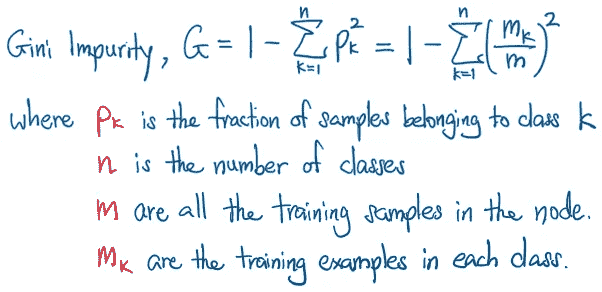
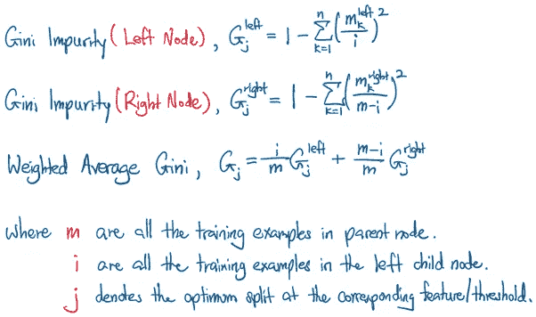
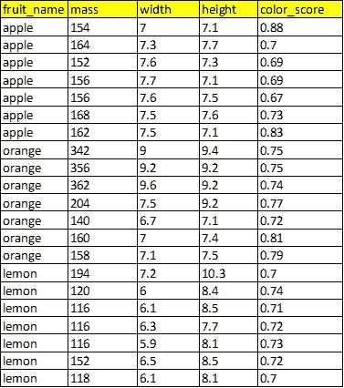
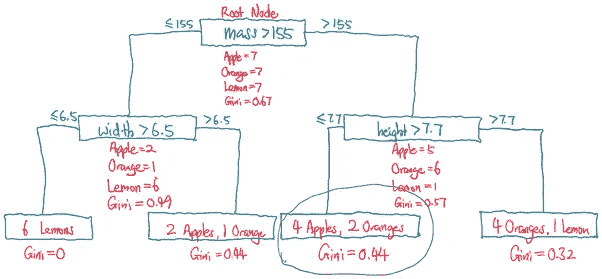
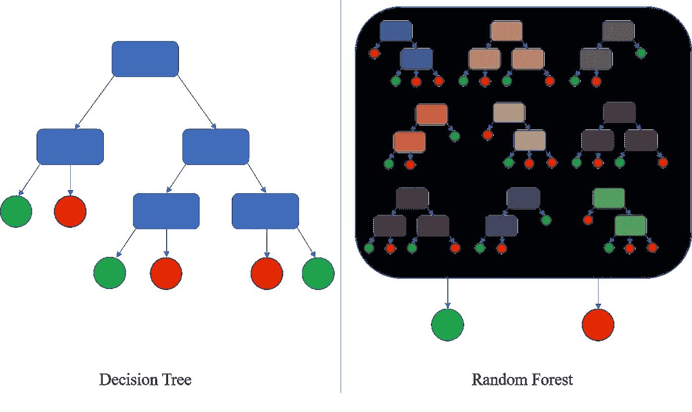

# 从零开始的决策树和随机森林

> 原文：<https://towardsdatascience.com/decision-tree-and-random-forest-from-scratch-4c12b351fe5e>

# 从零开始的决策树和随机森林

## 对决策树和随机森林算法的全面外行介绍

图片由[叶夫根尼·切尔卡斯基](https://unsplash.com/@evgenit)在 [Unsplash](https://unsplash.com/) 上拍摄

决策树和随机森林可能是机器学习领域中最经典的算法之一。在本教程中，我们将带读者在公园里漫步，欣赏这些雄伟树木背后的算法之美。除了为您提供这些算法结构背后的简单直觉之外，我们将带您从头开始理解这些代码，这样在本教程结束时，您将基本掌握强大的决策树和随机森林算法。

页（page 的缩写）s:这篇文章受到了由[约阿希姆·瓦伦蒂](https://medium.com/@joachimvalente)撰写的关于[决策树](/decision-tree-from-scratch-in-python-46e99dfea775)和由[达里奥·拉德契奇](https://medium.com/@radecicdario)撰写的[随机森林](/master-machine-learning-random-forest-from-scratch-with-python-3efdd51b6d7a)的早期文章的启发，但是为了更好的算法和更容易理解，这些想法被进一步微调和提炼。

# 1.决策树算法

虽然决策树可以用于回归(预测连续的实值目标，例如预测汽车价格，给定特征)，但在本教程中，我们将只考虑分类决策树(预测目标的离散类别，例如预测水果类型，给定特征)。

在关于特征-目标关系的**模型训练**期间，从**根(父)节点**(包含特征-目标关系的所有数据)生长一棵树，然后以二进制方式递归地分裂成**子节点**(整个数据的子集)。在父节点中的单个特征上，在该特征的期望阈值**处执行每次分割。例如，在父节点的每次分裂期间，如果特征小于阈值，我们转到左节点(具有相应的数据子集)，否则转到右节点。但是我们如何决定分割呢？进入基尼杂质。**

## 1.1.基尼杂质

决定父节点分裂的成本函数被称为基尼不纯度，这基本上是一个量化节点的同质性或“纯净”程度的概念，与节点中目标的分布有关。如果节点中的所有**训练样本属于同一类，则节点被认为是纯的(G=0 ),而具有来自许多不同类的许多训练样本的节点将具有接近 1 的 Gini 杂质。**

作者图片

决策树向基尼杂质递减的方向生长，根节点最不纯。因此，**在每个节点，搜索并选择最优特征和相应的最优阈值**，使得 2 个子节点的加权平均基尼系数最小。

如果最小可能加权平均 Gini 杂质仍大于父节点的 Gini 杂质，则不会发生二进制分裂，父节点将被视为**终端节点**。

作者图片

## 1.2.水果分类示例

水果表及其特点。图片作者。

以`fruit_name`为对象、`mass`、`width`、`height`、`color_score`为特征的表格数据为例。当我们将这些数据训练到一个这样的模型上时，决策树(最大深度=2)看起来会是什么样子？

页（page 的缩写）为了演示的简单，二进制分割被认为是随机发生的，而不应该被认为是最佳分割。

最大深度=2 的决策树。图片作者。

为了更好地理解，我们鼓励你勾画出上述决策树，并对其进行必要的基尼系数计算。我们也邀请你勾画出决策树的其他排列。

## 1.3.推理时的预测

给定一个新的水果，具有其指定特征的苹果，预测的水果将从其根节点遍历决策树，遵循每个节点给定的规则，到达终端节点。

通过模型进行推理的测试示例。图片作者。

在上面的测试示例中，因为 mass=160>155，所以决策路径从根节点到右边的子节点。从这一点开始，由于 height=7.4≤7.7，所以它进入左侧子节点，该子节点是没有进一步分割的终端节点。

使用决策树对单个测试示例进行推理。图片作者。

来自决策树的预测类然后由终端节点处的多数类给出，这是在训练过程中确定的。

## 1.4.从头开始编写决策树

在我们对决策树的工作原理有了基本和直观的了解之后，让我们开始构建一个决策树吧！从头开始构建一个决策树可能看起来令人生畏，但是随着我们一步一步地构建它的组件，情况可能会变得简单得多。在这一节中，我们将按模块介绍代码。

*1.4.1。实例化节点类*

在导入必要的库之后，我们创建一个带有几个伴随属性的类`Node`。这通常被认为是父节点。

首先，`self.predicted_class`将在每个(父)节点中存储预测的类。是的，这是正确的，每个节点都应该有多数类作为预测类，即使是根节点。并且该属性在代码中特别重要，尤其是对于终端节点，当在推断期间应该检索预测的类时。

`self.feature_index`和`self.threshold`主要记录父节点处的最优特征和该特征对应的最优阈值，将与父节点发生分裂形成子节点。

`self.left`和`self.right`是非常重要的属性，用于递归实例化子节点。因此，这些属性本质上只是另一个类`Node`，它又可能有`self.left`和`self.right`属性作为子节点。

*1.4.2。实例化决策树类*

决策树模型可以有几个超参数，可以调整这些参数以获得特定数据集的最佳性能模型。在我们的算法中，我们对这种定制进行了编码。虽然`self.max_depth`确定了树生长的最大深度，但为了在较低深度实现终端节点(通常是为了防止过度拟合)，`self.max_features`允许我们仅考虑有限数量的特征来搜索最佳分割，这允许对特征进行一些正则化效果。

`self.random_state`控制估计器的随机性，特别是特征置换。每次分割时，特征总是随机排列。当`max_features` < `n_features`时，算法将在每次分割时随机选择`max_features`，然后在其中找到最佳分割。但是最佳发现分割可能在不同的运行中有所不同，即使`max_features` = `n_features.`是这种情况，如果标准的改进对于几个分割是相同的，并且必须随机选择一个分割。

最后，`self.tree`是根`Node`，包含所有其他的子`Node`作为属性，当生长树的函数被调用时，这些属性将被递归生长。

*1.4.3。拟合方法*

`DecisionTree`类的`fit`方法接受 Pandas DataFrame/Series 或 Numpy 数组形式的训练数据集，然后确定类的数量、特征的数量和最大特征。最后，调用函数`self.grow_tree`递归构建决策树。

*1.4.4。* *种树的方法*

在将自身实例化为父节点`Node`并确定其父节点的预测类之前，`grow_tree`方法首先接收来自`fit`方法的数据。当满足`self.max_depth`条件时，调用函数`self.best_split`来找到最优特征 ID 和相应的最优阈值，以分裂成子节点。

如果存在最佳特征 ID 和最佳阈值(子节点的 Gini 杂质的加权平均值小于父节点的 Gini 杂质)，则将为左子节点和右子节点过滤在特征阈值处分裂的对比数据子集。

然后，各个数据子集被递归调用到同一个`grow_tree`函数中，并作为父`Node`的属性存储为`node.left`和`node.right`。

然后返回父对象`Node`。

*1.4.5。最佳拆分方法*

`best_split`方法从`grow_tree` 方法中的父节点获取数据，然后检查父节点的 Gini 杂质。如果父节点已经是纯的(G=0)，`best_feat_id`和`best_threshold`作为`None`返回。否则，该方法继续基于最大特征数量对特征索引进行加扰和随机化。

接下来，该方法继续搜索最佳特征索引和相应的阈值。在迭代该特征的连续值之间的每个平均值之前，首先过滤和排序每个特征的唯一数据值。

对于每对特征指数和特征阈值，计算平均基尼系数。对应于最低平均 Gini 杂质(如果它低于父节点 Gini 杂质)的特征索引和特征阈值对作为`best_feat_id`和`best_threshold`返回。

*1.4.6。预测方法*

最后，在训练集上训练决策树之后，可以通过`predict`方法对测试集进行推理。使用`predict_example`方法，通过合适的决策树运行测试集中的每个测试示例，一次一个。

*1.4.7。预测示例方法*

每个测试示例都是特征值的向量。在`predict_example`方法中，测试示例根据每个特性的阈值遍历基于规则的节点，直到到达终端节点，在那里存储并返回预测的类。

决策树算法的完整代码显示在 [Github](https://github.com/tanpengshi/ML_Algorithms_from_Scratch/blob/master/decision_tree.py) 上。精度性能与 scikit-learn 的实现非常接近，我们邀请您试用。

# 2.随机森林算法

随机森林，顾名思义，是决策树的集合，也用于回归和分类任务。同样，我们在这里只考虑随机森林进行分类。

随机森林算法建立在“弱”学习者(决策树)投票的思想上，给出了树组成森林的类比。随机性元素有几个方面:

1.  每棵树都适合整个数据集的子集，因此每棵树的生长方式不同，规则也不同
2.  如果**整个数据集**用替换随机引导**，对于每棵树，每棵树仍将具有略微不同的数据分布，因此将以不同的规则不同地生长。**
3.  即使**整个数据集**在没有替换的情况下被引导**，每个树仍然可能不同地生长，这是由于在决策树中被考虑用于最佳分裂的特征的随机顺序或子集。**

决策树与随机森林。图片由[来源](https://commons.wikimedia.org/wiki/File:Decision_Tree_vs._Random_Forest.png)。

这种随机森林算法被称为[自举聚合](https://en.wikipedia.org/wiki/Bootstrap_aggregating)或 bagging。本质上，它是一个结合多个模型(决策树)的概念，在数据集上引导，通过减少方差和避免单个模型的过度拟合来提高性能。

总而言之，

*   在训练*期间，从整个数据集顺序获得 N 个*自举数据集。
*   每个决策树(总共 *N* 个决策树)都是从每个自举数据集构建的。
*   在推理过程中，每个决策树都会做出一个预测，随机树的最终预测将作为多数投票返回。

对随机森林进行推断时的预测。图片由[来源](https://commons.wikimedia.org/wiki/File:Random_forest_diagram_complete.png)提供。

## 2.1.从头开始编码随机森林

如您所见，随机森林与决策树算法密切相关。因此，从某种意义上来说，它是上述决策树算法代码的结转。同样，我们将按模块介绍代码。

*2.1.1。实例化随机森林类*

在导入必要的库(包括决策树算法的模块)之后，我们创建一个带有相应属性的类`RandomForest`:

*   `self.num_trees`:用于分类的投票决策树分类器的数量。
*   `self.subsample_size`:用于训练每个决策树的总训练样本的比例。
*   `self.max_depth`:每个决策树的最大深度。如果没有，那么节点被扩展，直到所有的叶子都是最纯的。
*   `self.max_features`:对于每个决策树，在从父节点到子节点的每次分裂中，仅考虑“最大特征”来寻找阈值分裂。
*   `self.bootstrap`:训练样本的 Bootstrap 抽样，有无替换。
*   `self.random_state`:控制估计器的随机性。在每个决策树的每次分裂中，特征总是随机排列的，并且引导抽样是随机排列的。
*   `self.decision_tree`:包含构建后的决策树对象的列表。最初，列表是空的。

*2.1.2。拟合方法*

在训练期间，`RandomForest`类的`fit`方法接受 Pandas DataFrame/Series 或 Numpy 数组形式的训练数据集，并在训练数据集的随机引导样本上顺序构建每个决策树(导入的模块)，然后将其作为对象附加到`RandomForest`类的`self.decision_tree`属性。通过`sample`方法获取随机引导样本。

*2.1.3。取样方法*

在`fit`方法中，训练数据集被摄取到被调用的`sample`方法中，以返回基于整个数据集的随机引导子集。

*2.1.4。预测方法*

在推理过程中，每个决策树将所有测试实例的结果预测到预测的**列**中。这些预测列在所有决策树中并排附加在 Numpy 数组中。此后，对于每个测试示例，在每个**行**中采用**模式或大多数**预测。最后一列作为最终预测结果返回。

随机森林算法的完整代码显示在 [Github](https://github.com/tanpengshi/ML_Algorithms_from_Scratch/blob/master/random_forest.py) 上。同样，我们的精度性能与 scikit-learn 的实现非常接近。

# 3.结论

祝贺你成功来到这里！给你一些编码和机器学习的经验，从这本简单的指南中，你将会对决策树和随机森林如何从头开始工作有一个原始的和完整的理解。这种理解对于任何严肃的数据科学家的学习课程都是必不可少的。

在未来，我期待以最浅显易懂的方式从零开始介绍其他机器学习算法，如香草神经网络(多层感知器)、CNN 和 RNNs。敬请关注，关注我在 [Linkedin](https://www.linkedin.com/in/tanpengshi/) 和 [Github](https://github.com/tanpengshi) 的报道。

更新(2022 年 7 月 28 日):我已经从头开始完成了关于逻辑回归和神经网络的 3 篇文章系列。查看它们以了解更多:

 [## 从零开始的神经网络:逻辑回归—第 1 部分

### 单层神经网络与裸基础的逻辑回归

medium.com](https://medium.com/mlearning-ai/neural-networks-from-scratch-logistic-regression-part-1-d8cfc4a2fb3b) 

干杯！_/\_

> ***支持我！*** —如果你*没有*订阅 Medium，并且喜欢我的内容，请考虑通过我的[推荐链接](https://tanpengshi.medium.com/membership)加入 Medium 来支持我。

 [## 加入我的介绍链接媒体-谭师鹏阿尔文

### 阅读谭·师鹏·阿尔文(以及媒体上成千上万其他作家)的每一个故事。您的会员费直接…

tanpengshi.medium.com](https://tanpengshi.medium.com/membership)