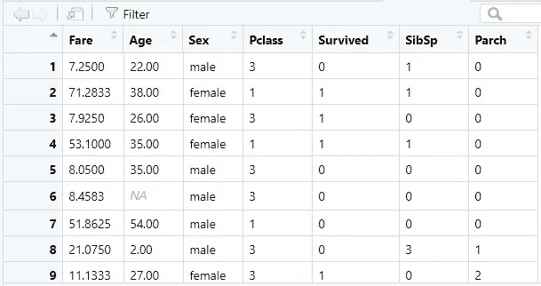
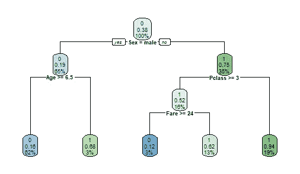
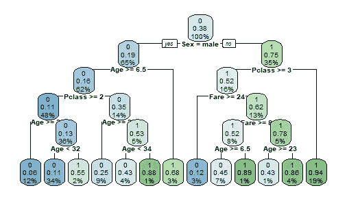
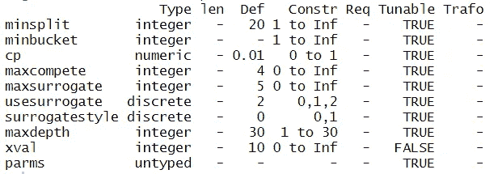
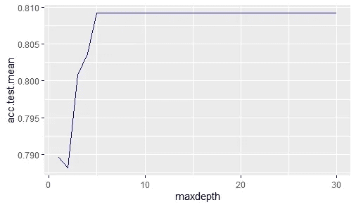
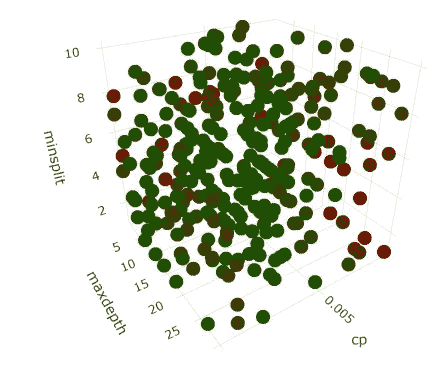
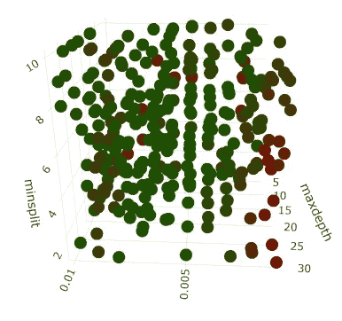

# 使用 mlr 在 R 中调整决策树超参数

> 原文：<https://towardsdatascience.com/decision-tree-hyperparameter-tuning-in-r-using-mlr-3248bfd2d88c>

## 了解如何使用 mlr 在 R 中执行超参数网格搜索


照片由[Alexis bay doun](https://unsplash.com/@alexisbaydoun)@ unsplash . com 拍摄

许多人通过研究和应用决策树算法进入数据科学之旅。这并不奇怪，因为这种算法可能是最容易解释的一种，它很好地模仿了人类的决策。

理解决策树还有另一个巨大的优势:它们是最著名的 boosting(极端梯度 Boosting)和 bagging(随机森林)算法的基础，这些算法在世界各地发起了 Kaggle 竞赛，解决了无数的商业问题。

在您掌握了[决策树如何构建](/classification-decision-trees-easily-explained-f1064dde175e)以及它如何选择用于在数据中执行关键拆分的特征的细节后，您会立即明白，当我们开始让决策树适合解决问题时，有许多决策要做，即:

*   树应该有多深？
*   应该考虑多少个相关的*示例*来拆分一个节点？
*   我们要考虑多少个*例子*才能做出决定？
*   考虑新拆分的最小基尼/熵增阈值是多少？

所有这些问题似乎都有点武断。但是，您可能会注意到，它们都与决策树的一个关键特性相关联— *超参数:*不是由模型学习而是由用户参数化的一组值。

调整这些超参数对于实现所有机器学习算法的最终目标——泛化能力——至关重要。而且，在决策树中，可以说它们甚至更重要，因为基于树的算法对*超参数*空间中的微小变化极其敏感。

训练*超参数*是全世界数据科学家和机器学习工程师的一项基本任务。而且，了解这些*参数*中的每一个参数的个体影响会让你更信任并更好地解释你的表现。

在这篇文章中，我们将使用 R 和`mlr`库来优化决策树*超参数*。我还想向您展示如何可视化和评估每个*参数*对我们算法性能的影响。对于我们的例子，我们将使用神话般的泰坦尼克号数据集，可在 [Kaggle](https://www.kaggle.com/c/titanic/data?select=train.csv) 中获得。

开始吧！

# 加载数据

在加载数据之前，让我们调用代码的所有依赖项:

```
library(dplyr)
library(rpart)
library(rpart.plot)
library(Metrics)
library(mlr)
library(ggplot2)
library(plotly)
```

描述我们的依赖关系:

*   `dplyr`执行一些数据角力任务。
*   `rpart`无需调整即可拟合决策树。
*   `rpart.plot`绘制我们的决策树。
*   `Metrics`评估我们模型的性能；
*   `mlr`训练我们模型的*超参数*。
*   `ggplot2`对于一般的剧情我们都会做。
*   `plotly`用于三维绘图。

Titanic 数据集是一个 csv 文件，我们可以使用`read.csv`函数加载它。该数据集包含有关泰坦尼克号乘客的信息，包括以下各列:

*   **幸存** —表示乘客是否在泰坦尼克号失事中幸存的标志。
*   **pclass** —乘客的机票等级。
*   **性别**—乘客的性别。
*   **年龄**——以年为单位的年龄。
*   泰坦尼克号上兄弟姐妹/配偶的数量。
*   泰坦尼克号上父母/孩子的数量。
*   **车票**—车票号码。
*   **票价** —客运票价。
*   **客舱** —乘客的客舱号。
*   **登船** —乘客登船的港口。

我已经用以下方式加载了它:

```
titanic <- read.csv(‘train.csv’)
```

为了简化，我将只使用来自`titanic`数据框架的原始列的子集——让我使用`dplyr`来选择它们:

```
titanic <- titanic %>%
  select(Fare, Age, Sex, Pclass, Survived, SibSp, Parch)
```

让我们也将数据分成训练测试—留下 20%的数据作为维持组:

```
# Splitting data into Train and Test
titanic['row_id'] = rownames(titanic)set.seed(123)
train_data <- titanic %>%
  sample_frac(0.8)test_data <- titanic %>%
  anti_join(train_data, by='row_id')# Drop row_id from both dataframes
train_data[,'row_id'] <- NULL
test_data[,'row_id'] <- NULL
```

尽管我们将在*超参数*调整中使用交叉验证(稍后我会提到这一点)，但测试集将用于确保我们不会过度拟合我们的训练集或交叉验证集。对于决策树来说，这是非常重要的，因为它们非常容易出现高方差。

在我们继续之前，让我们先预览一下我们的数据:



我们泰坦尼克号数据的前 9 行——作者图片

很好，我们已经有了数据，让我们来拟合第一个决策树吧！

# 拟合第一决策树

对于决策树的第一个*普通*版本，我们将使用带有默认*超参数*的`rpart`包。

```
d.tree = rpart(Survived ~ ., 
               data=train_data, 
               method = 'class')
```

由于我们没有指定*超参数*，我们使用 [rpart 的](https://www.rdocumentation.org/packages/rpart/versions/4.1.16/topics/rpart)默认值:

*   我们的树可以下降到 30 级—`maxdepth = 30`；
*   一个节点中执行拆分的最小实例数为 20—`minsplit = 20`；
*   终端节点中的最小实例数是 7—`minbucket = 7`；
*   分割必须增加树的“性能”(虽然不是那么直接，我们可以认为“性能”是`cp`的代理)至少 0.01—`cp = 0.01`；

我们如何知道这些是我们数据的最佳超参数？这些都是随机选择，使用默认选项是一个冒险的赌注。

也许我们可以把节点分离得更远一点。或者，我们可能使用低样本来根据低`minsplit`和`minbucket`做出决策。在继续之前，这是我们树:



普通决策树—作者图片

我们看到这是一个相对较浅的树，有 4 个层次。让我们检查一下测试集的准确性:

```
# Predict Values
predicted_values <- predict(d.tree, test_data, type = 'class')# Getting Accuracy
accuracy(test_data$Survived, predicted_values)
```

我们的准确率约为 79.21%。我们还能提高这个值吗？也许吧！调整*超参数*是我们可以探索的第一个想法！

让我们首先手动设置它们——我们可以使用`rpart`函数中的`rpart.control`来覆盖默认的*超参数*:

```
d.tree.custom = rpart(Survived~ ., 
               data=train_data, 
               method = 'class',
               control = c(maxdepth = 5, cp=0.001))
```

在这棵树上，我将`maxdepth`设置为 5，强制我的树比我们上面看到的更深一点。此外，我还调整了`cp`——让我们看看结果:



带有调整的超参数的决策树—作者图片

新的树更深一点，包含更多的规则——在性能方面，它的准确率约为 79.78%，比我们的普通版本好一点！

**随着我们的准确度提高了几个百分点，我们的指标也在变化。**从我们可以调优的*超参数*的整体情况来看，其中肯定有一些在测试集上产生了*最佳*性能——对吗？我们必须手动尝试这些参数吗？

**幸好没有！**虽然`rpart`不能让我们自动进行搜索，但是我们有一个名为`mlr`的库可以帮助我们！

# 使用 MLR 的超参数调整—调整一个参数

一件很酷的事情是，我们将在这里学到的东西可以扩展到其他模型。`mlr`库使用完全相同的方法，我们将学习调整*随机森林、xgboosts、SVM 等的参数。*

过去你可能听说过`caret`，一个著名的 R 数据科学库。虽然`caret`也有一些内置的*超参数*搜索，`mlr`使我们能够更好地查看那些*超参数的影响，*不那么“黑箱化”——这是我在这篇文章中使用`mlr`的主要原因。

所以，`mlr` [，R 库中的机器学习](https://mlr.mlr-org.com/)是 R 中一个很酷的人工智能包，它给了我们训练几个不同模型并执行调优的工具。正如我们已经讨论过的，其中一个优点是它让我们可以查看每个*超参数*对模型性能的影响。

`mlr`中一个方便的函数是`getParamSet`,它返回特定模型的所有可调整参数——对于`classification rpart`,我们可以调用`getParamSet("classif.rpart")`,得到:



用于分类决策树的可调超参数—作者图片

所有这些参数都可以使用`mlr`进行调整。让我们重点关注其中的三种——仅从`maxdepth`开始。

在列`constr`上，我们可以看到我们可以调整的值的范围——对于`maxdepth`,我们可以从 1 到 30 进行深度调整。

如果有一种简单的方法来拟合这 30 种不同版本的决策树，并评估这些模型的准确性，岂不是很有趣？这就是`mlr`的作用！

`mlr`需要比普通`rpart`甚至`caret`多一点的代码。首先，我们需要定义一个任务——在本例中，我用`train_data`和`target = 'Survived`定义一个分类任务:

```
d.tree.params <- makeClassifTask(
 data=train_data, 
 target=”fraud”
 )
```

然后，我们需要创建要迭代的参数网格——就像我们讨论的那样，让我们从单个参数开始。我们需要`makeParamSet`并使用`makeDiscreteParam`:

```
param_grid <- makeParamSet( 
 makeDiscreteParam(“maxdepth”, values=1:30))
```

我在上面的代码中声明的是，我的树将迭代 30 个不同的`maxdepth`值，这是一个向量(`1:30`)，它包含 1，2，3 …，30 作为输入到*超参数*的值。

然后，我们需要做三件事——初始化控制网格实验，选择交叉验证方法，并选择一种用于评估我们结果的方法:

```
# Define Grid
control_grid = makeTuneControlGrid()# Define Cross Validation
resample = makeResampleDesc("CV", iters = 3L)# Define Measure
measure = acc
```

[交叉验证是改善决策树结果的一种方式](https://medium.com/analytics-vidhya/deeply-explained-cross-validation-in-ml-ai-2e846a83f6ed)。在我们的例子中，我们将使用三重交叉验证。对于测量，我们将使用精确度(`acc`)。

一切就绪！是时候将一切输入到神奇的`tuneParams`函数中了，这将启动我们的*超参数*调谐！

```
set.seed(123)
dt_tuneparam <- tuneParams(learner=’classif.rpart’, 
 task=d.tree.params, 
 resampling = resample,
 measures = measure,
 par.set=param_grid, 
 control=control_grid, 
 show.info = TRUE)
```

当您运行上面的代码时，我们的超参数搜索将开始执行！`show.info = TRUE`将输出执行的反馈:

```
[Tune-x] 1: maxdepth=1
[Tune-y] 1: acc.test.mean=0.7895909; time: 0.0 min
[Tune-x] 2: maxdepth=2
[Tune-y] 2: acc.test.mean=0.7881845; time: 0.0 min
[Tune-x] 3: maxdepth=3
[Tune-y] 3: acc.test.mean=0.8008132; time: 0.0 min
...
```

每个`maxdepth`生成一个 acc.test.mean，交叉验证中使用的几个数据集的`acc`的平均值。`mlr`也让我们用`generateHyperParsEffectData`来评估结果:

```
result_hyperparam <- generateHyperParsEffectData(dt_tuneparam, partial.dep = TRUE)
```

我们可以使用`ggplot`绘制精度的变化图:

```
ggplot(
  data = result_hyperparam$data,
  aes(x = maxdepth, y=acc.test.mean)
) + geom_line(color = 'darkblue')
```



每最大深度精度的演变——作者提供的图片

查看我们的图，我们知道在深度为 5 之后，对精确度的影响是微不足道的，差异极小。让我们确认一下`tuneParams`函数选择的最佳模型——我们可以通过直接调用`dt_tuneparam`对象来检查:

```
Tune result:
Op. pars: maxdepth=11
f1.test.mean=0.9985403
```

调整结果选择 19 `maxdepth`作为最佳参数，只是因为微小的差异——不过，让我们使用对象`dt_tuneparam$x`来拟合我们的最佳参数，以拾取保存的*超参数*并使用`setHyperPars`来存储它们:

```
best_parameters = setHyperPars(
 makeLearner(“classif.rpart”), 
 par.vals = dt_tuneparam$x
 )best_model = train(best_parameters, dt_task)
```

`train`将用保存在`best_parameters`对象中的*超参数*来拟合决策树。

运行上面的代码后，我们得到了一个拟合树，其中包含从`best_model`上的网格搜索中返回的最佳*超参数*。为了在我们的测试集上评估这个模型，我们需要创建一个指向测试数据的新的`makeClassifTask`:

```
d.tree.mlr.test <- makeClassifTask(
 data=test_data, 
 target=”Survived”
)
```

在`test_data`上预测和检查准确性:

```
results <- predict(best_model, task = d.tree.mlr.test)$data
accuracy(results$truth, results$response)
```

我们的准确率约为 79.21%，与我们的普通版本相同。所以…很可能，我们对`cp`参数的调整是为了提高我们的模型性能。

问题是..在本例中，我们保持其他参数不变，这是否意味着我们只能逐个调整*超参数**？*不对！

有了`mlr`，我们可以同时调整整个参数范围，只需在代码中做一点小小的调整！就这么办吧。

# 调整多个参数

调整多个*超参数*很容易！还记得我们为网格搜索创建的`param_grid`对象吗？让我们回忆一下:

```
param_grid <- makeParamSet( 
 makeDiscreteParam(“maxdepth”, values=1:30))
```

如果我在`makeParamSet`函数中添加新的参数，我将会添加新的参数，这些参数将会在搜索中进行组合——例如，让我们将`cp`和`minsplit`添加到我们的场景中:

```
param_grid_multi <- makeParamSet( 
 makeDiscreteParam(“maxdepth”, values=1:30),
 makeNumericParam(“cp”, lower = 0.001, upper = 0.01),
 makeDiscreteParam(“minsplit”, values=1:30)
 )
```

`makeNumericParam`创建`numeric`参数(例如包含小数位的`cp`)—我们可以在`getParamSet`函数中检查哪些*超参数*是离散的还是数字的(记住`integers`可以用`makeDiscreteParam`调用)。

又该如何训练这种多参数搜索呢？通过将我们的`param_grid_multi`输入到`tuneParams`函数中！

```
dt_tuneparam_multi <- tuneParams(learner=’classif.rpart’, 
 task=d.tree.mlr, 
 resampling = resample,
 measures = measure,
 par.set=param_grid_multi, 
 control=control_grid, 
 show.info = TRUE)
```

**当我们训练更多数量的超参数时，存在计算成本。**你会注意到`dt_tuneparam_multi`将比`dt_tuneparam`搜索花费更多的时间，因为我们将在 3000(！)树到我们的数据。

在搜索结束时，您可能会得到如下输出:


在`[Tune]`输出中，我们有搜索的最佳参数:

*   15 的一个`maxdepth`。
*   0.003 的一个`cp`。
*   5 的一个`minsplit`。

这个*超参数*的组合在交叉验证中产生了大约 82%的准确率，不错！

让我们提取最佳参数，用它们训练一个新的树，并在我们的测试集上查看结果:

```
# Extracting best Parameters from Multi Search
best_parameters_multi = setHyperPars(
 makeLearner(“classif.rpart”, predict.type = “prob”), 
 par.vals = dt_tuneparam_multi$x
)best_model_multi = train(best_parameters_multi, d.tree.mlr)# Predicting the best Model
results <- predict(best_model_multi, task = d.tree.mlr.test)$dataaccuracy(results$truth, results$response)
```

**我们在** `test_set` **的准确率是 81.46%！**仅仅通过调整这些参数，我们就能够将基线精度提高 2 个百分点，这是一个非常好的结果！

最后，为了帮助您直观地了解我们所做的工作，让我们绘制一个网格搜索结果样本的准确性结果:

```
# Extracting results from multigrid
result_hyperparam.multi <- generateHyperParsEffectData(dt_tuneparam_multi, partial.dep = TRUE)# Sampling just for visualization
result_sample <- result_hyperparam.multi$data %>%
 sample_n(300)hyperparam.plot <- plot_ly(result_sample, 
 x = ~cp, 
 y = ~maxdepth, 
 z = ~minsplit,
 marker = list(color = ~acc.test.mean, colorscale = list(c(0, 1), c(“darkred”, “darkgreen”)), showscale = TRUE))
hyperparam.plot <- hyperparam.plot %>% add_markers()
hyperparam.plot
```



超参数搜索景观-作者图片

在 y 轴上我们有`minsplit`。x 轴上有`maxdepth`，z 轴上有`cp`。

每个点都是一个实验(由*超参数*组合而成)，颜色与该实验的精度结果相关。红点表示准确度较低。绿点意味着更好的性能。

在三维图中有一个明显的红色区域，我们看到来自`cp`的结果不是很好——让我旋转它以获得更好的视图:



超参数搜索景观-作者图片

**请注意，真正低的** `cp` **会产生更差的性能，尤其是与低的** `minsplit` **结合使用时！**

可视化我们的*超参数*搜索结果‘让我们可以鸟瞰我们的训练过程是如何进行的。

如果你想查看以上剧情的互动版本，请点击[链接](https://rpubs.com/ivopbernardo/hyperparam_mlr)！

感谢你花时间阅读这篇文章！我希望你已经欣赏了它，现在你可以理解如何使用 r 训练*超参数*。

*超参数*可以建立或破坏一个模型，作为数据科学家，我们需要知道如何用几行代码有效地调整它们。如果使用 R，`mlr`可能是做这个常见机器学习任务的绝佳选择！

***我在 Udemy 上建立了一个***[***R 简介***](https://www.udemy.com/course/r-for-absolute-beginners/?referralCode=F839A741D06F0200F312) ***和一个*** [***学习数据科学的训练营***](https://www.udemy.com/course/r-for-data-science-first-step-data-scientist/?referralCode=6D1757B5E619B89FA064) ***。这两个课程都是为初学者量身定做的，我希望你能在我身边！***


[数据科学训练营:你成为数据科学家的第一步](https://www.udemy.com/course/r-for-data-science-first-step-data-scientist/?referralCode=6D1757B5E619B89FA064) —图片由作者提供

<https://ivopbernardo.medium.com/membership>  

下面是这篇文章中代码的一个小要点:

*数据集许可:本文中使用的数据集在*[https://www.openml.org/d/40945](https://www.openml.org/d/40945)公开提供使用