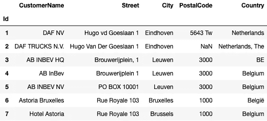
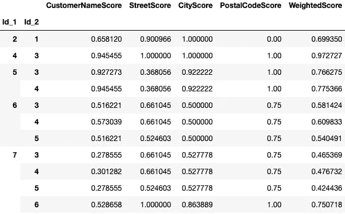
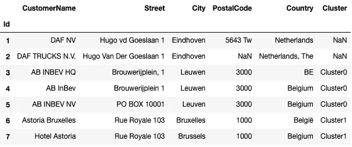
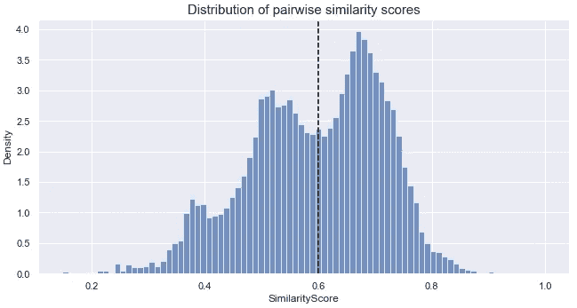

# 删除重复数据并清理数百万条位置记录

> 原文：<https://towardsdatascience.com/deduplicate-and-clean-up-millions-of-location-records-abcffb308ebf>

## 记录链接和地理编码相结合如何提高数据质量

拉夫(拉维)凯登在 [Unsplash](https://unsplash.com?utm_source=medium&utm_medium=referral) 上的照片

大公司出于不同的目的将数据存储在几个系统中(ERP、CRM、本地文件)。每一个都可能保存客户数据，并且不是所有的数据(如果有的话)都同步。此外，跨来源的链接要么不存在，要么没有得到适当维护。结果是重复记录、不一致和总体数据质量差。这是我们展示算法解决方案的绝佳机会。

这篇文章是关于具有地址属性的记录。我的建议在合理的时间内对数百万张唱片都适用。可能适用于大多数大型公司的主要用例是具有帐单或工作地点地址的客户记录。因此，我们将解决企业的以下棘手问题:

*   我们如何消除每个客户数据源中的所有重复记录？我们如何将所有数据源中的记录联系起来，以对任何一个客户进行全方位总结？
*   我们对每个地址记录的质量有多少信心？我们如何快速识别并修复无效或不完整的记录？

我的建议包括两个部分，记录链接和地理编码。这两个步骤的输出有助于加速不可避免的手工审查过程:我们从一百万条记录开始。然后，算法总结出一个可行的可能的质量问题清单，熟练的评审人员花几个小时(或几天)评估结果。

## 我对位置的算法记录链接的了解

这篇文章是关于有地址的记录。如果你的只有地址，没有别的，跳到下一部分。我下面的例子是关于客户位置记录——有名字的地址。同样的想法也适用于更复杂的情况，如数量、日期和时间等。，如合同记录。因此，假设我们要处理来自比荷卢三国的一大张客户位置表，下面给出了其中的 7 个位置。

有重复的位置记录的几个例子。这是人工生成的数据，灵感来自作者在真实世界用例中看到的记录(图片由作者提供)。

在最简单的情况下，如果所有相关属性都相同，则两条记录代表相同的实体。但这并没有考虑到拼写错误、语言或其他名称和地址的变化。因此，我们需要一种适用于单词和其他字符串的相似感(或距离感)。这就是记录链接有所帮助的地方，至少有十几个开源框架；参见[本概述](https://github.com/J535D165/data-matching-software)。我使用 Python 和 [**RecordLinkage**](https://github.com/J535D165/recordlinkage) 包来说明这个过程和关键的学习。我们从文本预处理开始，它可以在匹配质量上产生很大的差异。

首先，我们将国家标准化。对于索引阻塞来说，这是一个简单而重要的步骤，稍后将介绍。第二，我们使用了 RecordLinkage 的默认清理方法(全部小写，没有标点符号，编码等。).通过借鉴 NLP 社区的想法(和代码),我们可以做得更多。如果您想了解更多信息，请从 TextHero 开始:

 [## Texthero:熊猫数据帧的文本预处理、表示和可视化

### 用一行 Python 代码处理您的文本

towardsdatascience.com](/texthero-text-preprocessing-representation-and-visualization-for-a-pandas-dataframe-525405af16b6) 

例如，所谓的“停用词移除”，在我们的示例中，这可以翻译成移除诸如荷兰语“N.V .”的合法形式或诸如“酒店”的其他常用词(假设我们有许多酒店作为客户)。

记录链接可能是计算密集型。一百万条记录可能转化为一万亿对的比较。索引技术减少了候选对的数量，最简单的称为“阻塞”:只比较那些具有共同属性的候选对。我首选的阻止方式是地址所在的国家。这是质量最好的属性，或者至少修复起来很简单。如果按国家的索引阻塞导致太多的操作需要处理:在第二个高质量属性上结合排序的邻域索引，比如城市或邮政编码(或者客户名称，如果您没有选择的话)。

准备好候选人后，我们在下面的代码片段中定义如何度量他们的相似性。这个包提供了几个内置选项来测量单个字符串组件的相似性——参见 string 类的[文档。Jaro-Winkler 非常适合(短)名称，它将更多的重要性放在字符串的开头附近。Levenshtein 对邮政编码更有意义。](https://recordlinkage.readthedocs.io/en/latest/ref-compare.html#recordlinkage.compare.String)

相似性得分表(图片由作者提供)。

我添加了一个加权分数，权重基于直觉。这样的标量总结和阈值允许我们做出最终的“是”或“否”决定。或者，我们可以在一个相对较小的、平衡的标签样本集上拟合一个分类模型。但是在解释模型性能时要小心，因为在现实中，我们面临着一个极其不平衡的问题(非链接比链接多得多)。

通常有不止一个副本；有时，有几十个相同的实体。并且手动审查过程受益于并排拥有单个地址的所有可能副本。我用的是 Python 的 [NetworkX](https://networkx.org/) 包:记录是节点，超过一个阈值的相似度是边。每个子图都是这样一个可能的副本或链接的集合。

原始数据由相似记录的聚类扩展(图片由作者提供)。

我们错过了将记录 1 和 2 放入它们的集群。我们可能会选择一个较低的阈值，但这有可能会给我们的输出增加假阳性。那么如何以编程方式选择阈值呢？下图说明了一个简单的解决方案。

使用 4 万对真实世界的位置记录比较创建了一个直方图。阈值(虚线)的选择试图“最好地分离”正确和不正确匹配的两个未知分布，假设它们大致是单峰和对称的(图片由作者提供)。

或者，你可以从分类文献中借用一个解决方案:知道混淆矩阵中所有四种情况的成本和收益，并估计它们作为阈值函数的频率。但是由于高度的不平衡，这将需要相对较大的一组标记的例子。

最后，我们为一个聚类中的每个记录添加汇总统计信息，以表明我们对匹配质量的信心。

对于分配给一个聚类的每条记录，我们计算与同一聚类中所有其他记录的最小、平均和最大相似性得分(按作者分类的图像)。

熟练的评审人员可以使用这些统计数据来排序并快速处理几乎完美的匹配，并将时间花在人工评审最重要的地方。

## geoapify.com 如何帮助提高质量和丰富位置记录

地理编码是将地址转换为纬度和经度的过程。如果你处理的只是一小部分地址，有很多免费的服务——查看一下 [GeoPy](https://geopy.readthedocs.io/en/stable/) 。但是如果你的数据超过了，比如说，一千条记录，所有这些方法都是不可行的(并且可能是不合法的)。在现实世界中 1000 人还是很少的。即使你开始寻找像谷歌地图这样的商业提供商，你也会意识到他们要么不提供“批量”地理编码服务，要么价格昂贵。幸运的是，geoapify.com 的[填补了这个空白。这还不是唯一的好消息:他们的网络服务利用了 openstreetmap.org 的生态系统。在内部数据和公开数据之间建立联系带来了位置数据质量之外的机会。](https://www.geoapify.com/)

好吧，但当主题是数据质量时，我们为什么要讨论地理编码呢？首先，它是一种特殊的地址记录链接解决方案。实际上，我们甚至可以在前面的部分中使用它作为预处理步骤。但主要原因是该服务并不期待用户完美的搜索输入。nomist im(OpenStreetMap 的地理编码引擎)从搜索文本中提取要素，并应用评分逻辑来确定与已知位置记录的最佳匹配。最佳匹配以结构化的形式提供，包括地理坐标和几个置信度得分:街道、城市和总体置信度。这三个数字中的任何一个分数低都表明质量差，这有助于快速识别原始输入中的数据质量问题。

我们继续上一节的例子。如果你想复读，你必须在[geoapify.com](https://www.geoapify.com/)注册并生成你的密钥。广泛的免费层允许您每天免费对多达 6000 个地址进行地理编码。

批量地理编码服务接受字符串列表作为输入，每个地址一个字符串。我们将结构化的地址数据连接起来，请求批量地理编码，并将选定的输出属性解析到数据帧中。

geoapify.com 批量地理编码服务的输出被解析为数据帧。最后三列表示原始输入数据中的数据质量问题(图片由作者提供)。

该服务返回的不仅仅是地址。它还指示位置的类型。我们不期望地址 5 中的整个地区—原来的输入结果是一个邮政信箱。

## 结论和展望

公司通过有机增长或并购增长。他们的数据也是如此。通常，质量跟不上增长。本文提出了一种方法来加速清理杂乱的位置记录(客户的帐单地址、工作地点等)。).它从基于算法关联和地理编码的两步程序开始。这些算法可以很好地扩展到数百万条记录，并且根据我的经验，熟练的审核人员在使用输出时可以在非常短的时间内处理手动检查。

我们使用 geoapify.com 的批量地理编码服务来验证地址数据的质量。这只是他们的网络服务带来的众多机会之一。

*   通过地理坐标丰富我们的数据允许我们将位置智能添加到我们可以用数据科学处理的许多问题中；参见[这本关于空间数据科学的介绍的开源书籍](https://geographicdata.science/book/intro.html)。你处理客户流失吗？你有没有检查过附近的顾客是否也有离开的风险？
*   Geoapify.com 利用 OpenStreetMap 生态系统，该生态系统[链接到维基数据](https://wiki.openstreetmap.org/wiki/Wikidata)。因此，我们可以将我们的内部位置记录与大量开源数据集联系起来。place_id 属性是每个地理编码输出的一部分。这能告诉我们更多关于地点的信息。同样，我们可以使用另一个名为 Place Details API 的 geoapify.com 端点来帮助我们完成这项工作。例如，使用地址 7 Hotel Astoria 的 place_id，我们得到更多的细节，例如到他们网站的链接和 Wikidata Id [Q649690](https://www.wikidata.org/wiki/Q649690) 。另一方面，Places API 可以告诉我们，在任何给定的地区，我们在客户数据库中遗漏了哪些酒店。

这是我第一篇关于位置智能和相关主题的文章。更多将很快跟进。