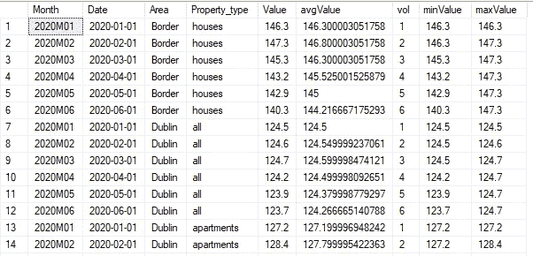
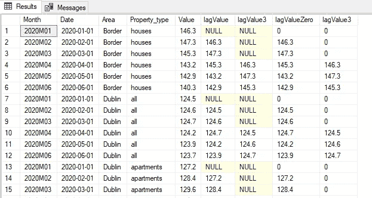
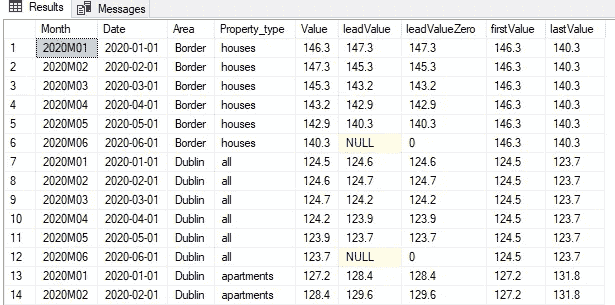
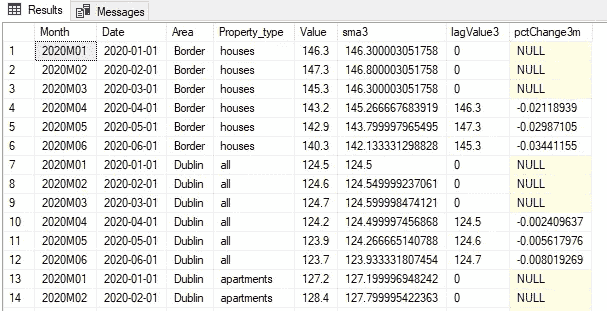

# 深入研究 SQL 窗口函数

> 原文：<https://towardsdatascience.com/deep-dive-into-sql-window-functions-bdcb29b05853>

## SQL 窗口函数跨一组表行执行计算，以简化数据分析

照片由[维达尔·诺德里-马西森](https://unsplash.com/@vidarnm?utm_source=medium&utm_medium=referral)在 [Unsplash](https://unsplash.com?utm_source=medium&utm_medium=referral) 拍摄

M 在数据分析过程中，我们随时都会面临为一组行创建聚合计算的挑战。出现了许多不得不跨多个临时表创建多个汇总输出的例子。创建新结果后，它们将与原始数据集合并，以继续数据分析过程。创建和附加汇总统计数据的这种连续循环引用会导致比所需时间更长的流程。利用 SQL 窗口函数可以让开发人员避免产生大量数据和消耗内存的情况。

在本文中，我们将展示 SQL 窗口函数可以帮助解决的一些初始属性。此外，还将介绍一些时间序列功能，以展示跨时间处理数据的步骤。

## 数据集和软件

由于许多人对房地产价值感兴趣，我们将回顾一个提供宏观经济视角的房价指数。我们将回顾从[data.gov.ie](https://data.gov.ie/)获得的爱尔兰共和国住宅价格指数。请注意，对数据集完成了一些预处理，以使其更易于使用。字符变量“住宅物业类型”包含国家、地区和物业类型的详细信息。因此，在数据集中把这个变量分成两个独立的变量“Area”和“Property_type”是有意义的。

<https://data.gov.ie/dataset/hpm09-residential-property-price-index?package_type=dataset>  

本文中显示的 SQL 代码是使用 Microsoft SQL Server Management Studio 18 的一个实例创建的。

当使用 SQL 窗口函数时，有许多不同的类别可用。我们正在审查三个常见的类别级别；聚合、分析和排名功能。添加的时间序列处理部分显示了可用于查看的时间元素。

## 聚合函数

聚合提供了正在审查的数据集的汇总统计信息。这些基本的统计数据有助于我们理解数字变量的结构。从这种见解中，我们能够更好地理解数据的故事。通常，这些汇总值是在单独的查询中创建的，然后将统计数据联接回第一个数据集。创建临时表可以处理即席分析。然而，如果我们想要改变被评估的值的范围，这可能会导致错误，因为需要更新多个代码段。拥有一个更加自动化的方法确实有助于提高代码的可用性。

这就是窗口函数可以帮助提供更大灵活性的地方。在下面的代码中，我们对窗口函数的运行有了基本的了解。over 关键字指定聚合函数的窗口子句。在括号中，第一个选项是要使用的分区依据字段。它是定义窗口函数将在其上操作的窗口或行集的分区字段列表。接下来，我们有 order by 选项，它将对分区变量的行进行排序。

SQL 代码 1.1 聚合窗口函数的范围(图片由作者提供)

从上面的代码中，我们展示了四个可用的统计选项。count 函数将记录窗口中的行数。使用其他三个函数时，它们将在窗口中一次一行地前进。

SQL 输出 1.1 聚合函数值随日期变化(图片由作者提供)

对于别名 avgValue，average 方法用于了解平均值如何随着更多行的添加而变化。包括最小值和最大值，有助于检查值的界限。当第 7 行出现一个新窗口时，我们可以看到聚合变量值将如何重置。

## 分析函数

要使用窗口功能执行更高级的操作，可以使用分析功能区域。我们将看到，这些函数中有许多将有助于从窗口的不同部分移动数据点。

SQL 代码 1.2 使用滞后分析函数(图片由作者提供)

从上面的代码中，我们已经了解了 lag 函数的许多不同选项。默认情况下，滞后函数将采用第一个滞后值。对于下面输出中的第 2 行，我们可以看到 lagValue 从第一行的 Value 变量中获取了数据。要查找三个月前的滞后数据，可将参数值 3 添加到滞后函数括号中。

剩下的两个函数强调了当数据不可用时，如何为空值赋值。首先，使用 coalesce 将检查函数并了解是否会产生非空值。我们必须记住，coalesce 函数的输入顺序是关键，如果第一个输入可用，就访问它，然后使用它的值。如果不是这种情况，那么将采用第二个参数值零。我们可以看到，lag 函数也提供了这个功能，并且在第 20 行中包含了第三个参数零，展示了如何在一个步骤中完成这个方法。

SQL 输出 1.2 使用滞后函数设置的不同影响(图片由作者提供)

在对数据集进行时间序列比较时，获取滞后值的能力会有所帮助。窗口函数再次帮助自动化许多滞后值选项，而不是必须执行多个连接。通过获取三个月的滞后值，这有助于审查季度变化。包括六个月或十二个月的差异将显示半年或一年的变动。

SQL 代码 1.3 了解前导值、第一个值和最后一个值选项(图片由作者提供)

lead 函数将把未来的值带回当前行。类似于 lag 函数，使用默认选项 1，也可以指定空值的填充。使用 first_value 函数提供窗口开始的细节。如果在考虑某个时间序列日期的情况下查看值的范围，这可能会有所帮助。对于本例，第一个值是日历年的年初。但是，当使用 last_value 函数时，需要一个附加子句来确保对整个值窗口进行检查。包括在开始(前面)和结束(后面)的无界范围，完成了这个过程。

范围开始和结束处的 SQL output 1.3 值可以帮助定义边界(图片由作者提供)

第一个和最后一个值将有助于显示中间值在窗口的时间段内是如何移动的。如果数据分析需要与这些数据点进行相对比较，那么计算可以快速完成。

## 排名功能

将排名函数合并到数据分析中将对指定字段的值进行排名。很多时候我们感兴趣的是了解某个值的前(N)条记录。其他时候，根据所提的问题，底部(N)记录可能提供更多信息。

SQL code 1.4 排名选项通过分区分组提供对值范围的洞察(图片由作者提供)

等级函数旨在理解从最高到最低的值。通过此评估，我们将查看前(N)个值。正如我们在代码中看到的，添加了一个 descending 关键字，以确保 order by 子句正确处理这些值。为了保持输入数据集的原始顺序，我们在第 16 行包含了一个 order by 子句，以便在窗口函数完成后对结果进行重新排序。能够对结果重新排序显示了窗口功能的灵活性。

对于行号函数，使用 partition by 子句可以确保为每个窗口重置行数。这个变量的输出类似于前面的 count 函数。

SQL 输出 1.4 等级之间的差异可以帮助理解值的分布(图片由作者提供)

如果结果被保持在窗口函数输出顺序中，那么数据的时间特性将会丢失。正如我们所看到的，第 1 行和第 2 行交换了位置。如果数据与时间序列无关，那么这个输出应该是好的。必须注意确保输出结果与预期一致。

## 时间序列处理

当回顾房价指数时，数据分析集中于价值随时间的变化。使用从本文前面部分获得的知识，我们能够创建一些初始时间序列函数。了解不同时期的趋势有助于更深入地了解生成数据的宏观经济环境。

SQL 代码 1.5 使用时间序列选项来了解移动平均值和百分比变化(图片由作者提供)

首先生成一个聚合值，对一个时间窗口内的值进行平均。简单的移动平均线有助于降低时间序列数据点的波动性。该操作的结果应该显示数据点如何随时间变化的更平滑的数据可视化。为了创建三个月的平均值，包含了 rows 选项以减少要包含的行数。添加的选项将确保使用的数据点在当前行和前两行之间。

要创建三个月的百分比变化，我们可以使用之前的滞后函数。在当前行和三个月前的滞后值之间进行比较。通过使用除法并从结果中减去 1，负输出将显示减少，正输出将显示增加。

SQL 输出 1.5 使用时间序列分析来了解价值变动(图片由作者提供)

使用百分比变化逻辑时，零默认值已被排除。如果包含了这个值，那么 SQL 解释器将返回一个被零除的错误。这样做的结果是在计算开始时出现三个空值。随着更多的数据被加入到计算中，一个更平滑的趋势开始出现。

## 结论

本文使用了 SQL windows 函数来强调 SQL 查询可以实现的功能。所发生的特征工程过程显示了如何为每个窗口产生集合统计。以前，我们必须在一个临时表中生成这些统计数据，然后将它连接到原始表中。但是，我们已经了解到，窗口功能提供了在流程中避免这一步骤的选项。对于分析和排名功能，我们看到了如何生成时间序列指标来帮助数据可视化。在机器学习模型中，我们可以使用这些新功能来帮助预测未来的价值。

留下您的评论，非常感谢您的阅读！

**您可以使用下面的链接成为高级媒体会员，并访问我的所有故事和数以千计的其他故事:**

<https://jamesmcneill06.medium.com/membership>  

**你可以在** [**LinkedIn**](https://www.linkedin.com/in/james-mc-neill-180a9057/) **上联系我，友好地聊一聊所有的事情数据。我分享过的其他故事:**

</declaring-variables-within-sql-fe6a479a7f9c>  </developing-sql-tables-3f9b96bc21e1>  </strings-in-sql-part-1-122185dd0099>  

[1]数据集摘自网站 DATA.GOV.IE[https://data . gov . ie/Dataset/HPM 09-住宅-房产-价格-指数？package_type=dataset](https://data.gov.ie/dataset/hpm09-residential-property-price-index?package_type=dataset) ，该数据的版权归[https://creativecommons.org/licenses/by/4.0/](https://creativecommons.org/licenses/by/4.0/)所有