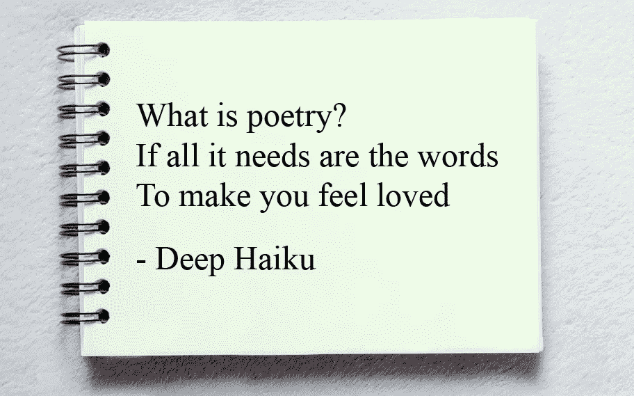
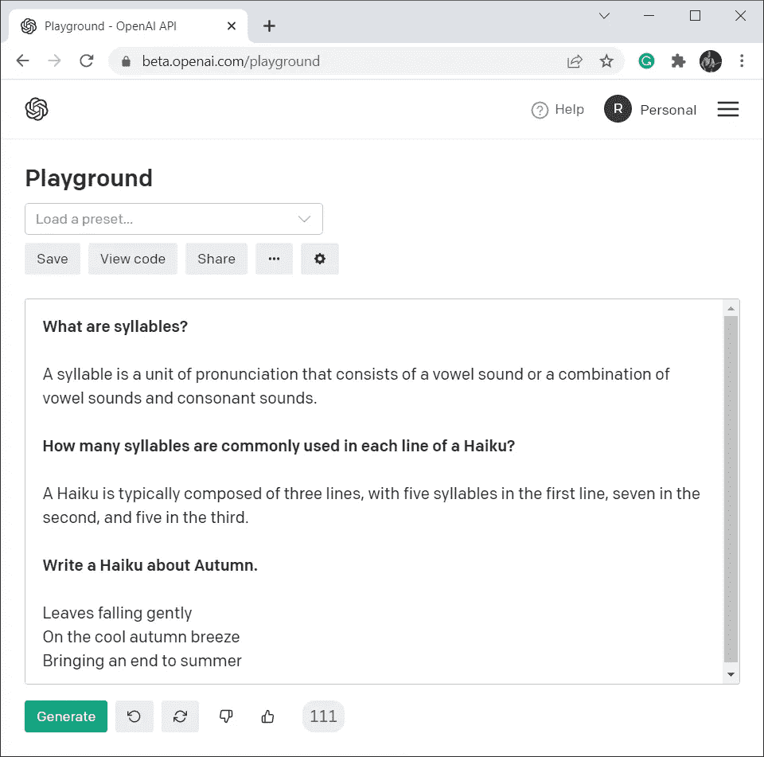
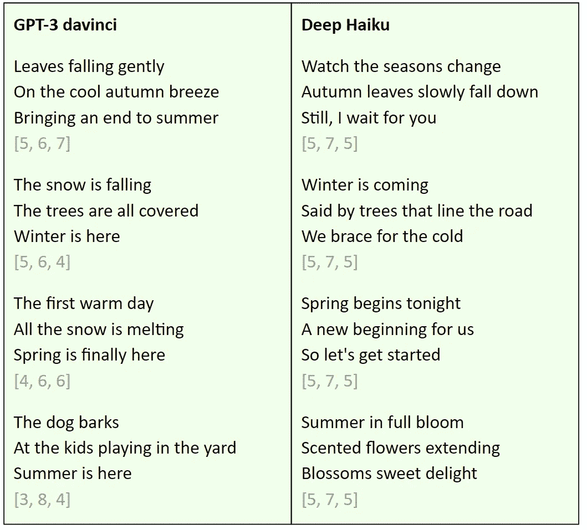
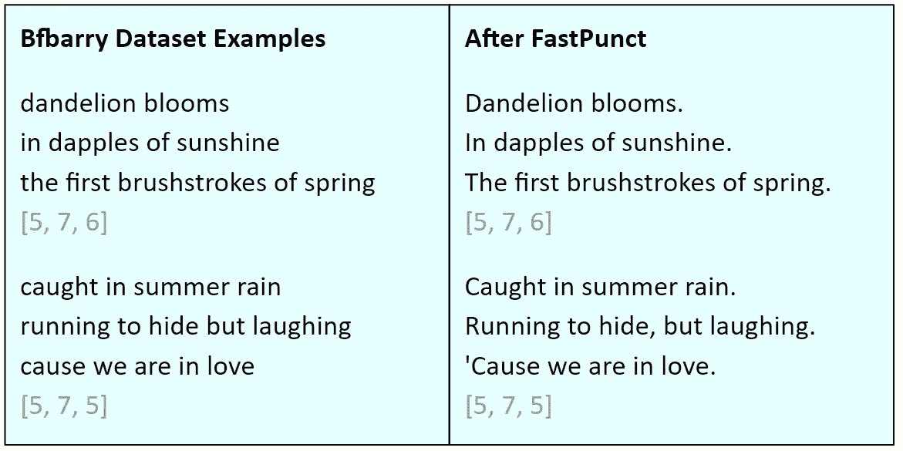
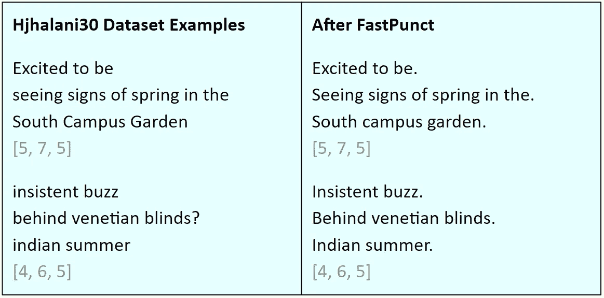
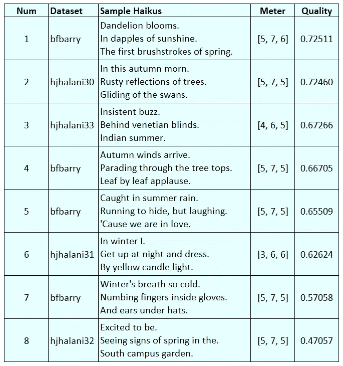
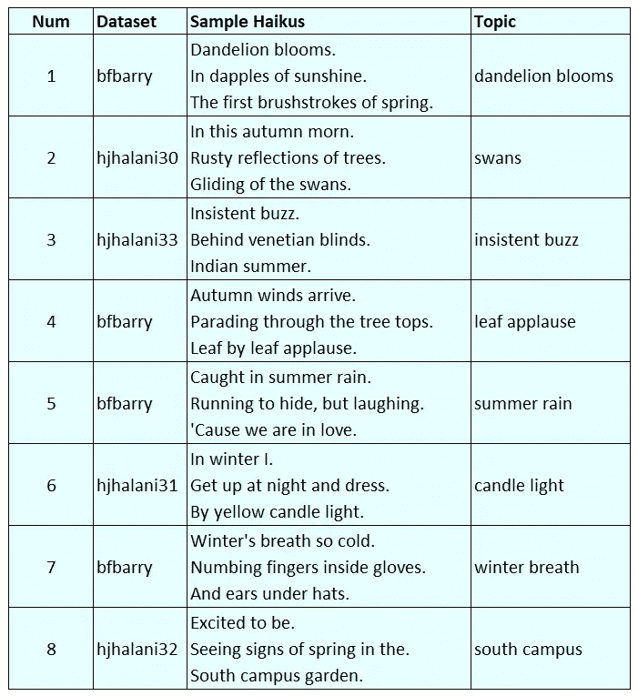
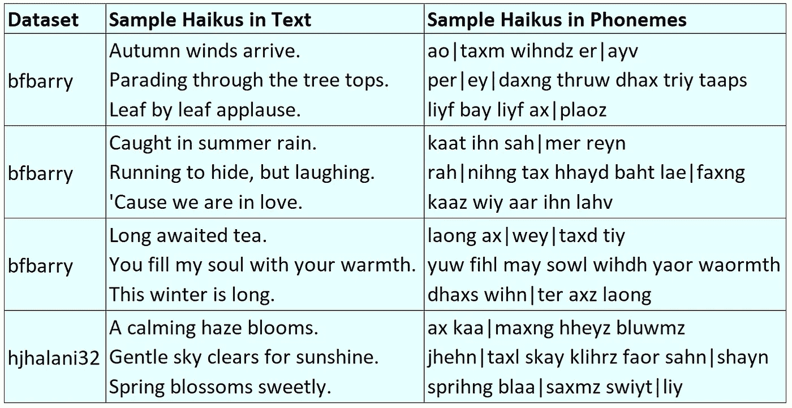
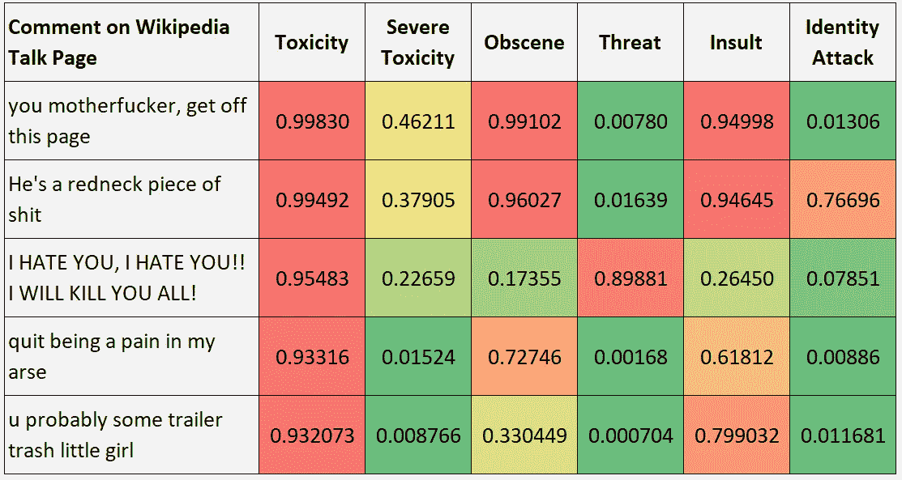

# 深刻的俳句:教 GPT J 用音节模式作曲

> 原文：<https://towardsdatascience.com/deep-haiku-teaching-gpt-j-to-compose-with-syllable-patterns-5234bca9701>

## 如何用音位微调一个大变压器后生成有节奏的散文



作者图片，图片来源于 [Unsplash](https://unsplash.com/photos/1ixT36dfuSQ) 上的 [Diana Polekhina](https://unsplash.com/@diana_pole)

在这篇文章中，我将向你展示我是如何微调一个名为 GPT J 的人工智能系统来创造新的俳句，这是一种源于日本的短诗。关键是让我的模型，Deep Haiku，看到并理解诗中的音节数。

我通常不会在我的文章中显示目录，但我认为这是值得的，因为我在这个项目中使用了各种各样的技术。如果您对这些主题感兴趣，请随意跳到下面的任何部分:

*   用 FastPunct 给文本添加标点和大写；
*   使用 GRUEN 评估生成文本的质量；
*   用 KeyBERT 从文本中抽取主题:
*   用 Phonemizer 将文本拆分成音节和音素；
*   对变形金刚进行多任务训练；
*   微调 GPT-J 8 位谷歌 Colab(免费！);
*   使用解毒功能标记淫秽和威胁性文本；

如果你想为某个特定的主题创作俳句，你可以在这里使用 T4。请务必查看附录中生成的俳句。

# 背景

正如我们在波士顿所说，OpenAI 的 GPT-3 语言生成模型非常棒。你可以问任何问题，它会给出一个合理的、往往很有见地的答案。如果你让它产生创造性的散文，比如诗歌，它会做得出奇的好。

但是 GPT-3 和大多数其他语言模型似乎不能使用格律(诗歌中常用的节奏结构)来写散文。这是因为单词在模型中的表现方式。大多数语言模型使用单词部分，而不是字母或音节作为数据类型。语言生成系统根本不知道单词中有多少音节，所以它们无法提取和复制任何节奏模式。

例如，这里有一个与 OpenAI 的 GPT-3 的交互，我询问音节，并提示它创建一个俳句。请注意，我的提示是粗体的，响应文本来自使用默认参数的 GPT-3 达芬奇模型。



**GPT 三号游乐场**，图片作者

好了，它清楚地知道什么是音节，以及俳句常用的音节数[5，7，5]。但是当我让它写一首关于秋天的俳句时，它想出了一首可爱的诗，音节数是[5，6，7]。

这里有一些由 GPT-3 写的四季生成的俳句和我的新模型，深度俳句。仪表显示为灰色。



GPT-3 的四季俳句和作者的深俳句

正如你所看到的，两个系统都创造了一套很好的诗歌。我会让你来判断散文的质量，但很明显，GPT-3 不知道如何遵循标准的米。相比之下，深度俳句在所有四种俳句中都使用了[5，7，5]音步。

# 先前的工作

显然，我不是唯一一个希望获得一个转换器来生成带有计量散文的文本的人。例如，在他的论文“俳句生成，一种基于变压器的方法，有很多控制，”贾科莫·米塞利指出，典型的俳句格律模式并没有严格遵循[1]。

> 现代的，尤其是英语的俳句并不严格遵循 5-7-5 的模式，而是通常坚持大约 10/12 个单词的短-长-短形式。—贾科莫·米塞利

米塞利的海辜系统也创造了一些优秀的散文，但在本文的 12 个例子中，只有 1 个遵循[5，7，5]模式。请注意，我借用了第一行，看看深俳句会把它带到哪里。他们来了。


**样本俳句**，由俳句和深俳句组成，由作者列表

米塞利引用了另一篇论文，直接论述了生成散文的韵律。不是用来写俳句的；是用来写打油诗的。在他们的论文“曾经有一个非常糟糕的诗人，它是自动化的，但你不知道它，”王建友等人讨论了他们使用 open ais 2 模型的早期实验。

> 一个 GPT-2 的简单实现不能产生原始的和有效的打油诗。GPT-2 倾向于生成超过打油诗音节限制的长句。为了满足音节限制，我们需要截断生成的句子，这就产生了结尾不正确的行。—王健友，等。

他们接着描述了一个用于生成五行打油诗的自定义转换器 LimGen，它根据词性、音节数和重读音节的位置来选择单词。

对于深度俳句，我构建了一个系统，通过微调一个通用转换器，根据用户指定的提示生成俳句，并遵循[5，7，5]节拍。

# 概观

下面是我用来训练和运行 Deep Haiku 的组件和流程图。在快速讨论了每个部分的作用之后，我将更详细地讨论这些内容。


**深俳句组件**，作者配图

我首先从用户 hjhalani30 和 bfbarry 那里下载了两个 Kaggle.com 俳句数据集。数据集分别在 CC0 和 CC-BY 许可下发布。组合数据集中的俳句数量超过 140，000。我使用 FastPunct 为俳句添加标点和大小写，并运行 KeyBERT 模型[3]来提取用作提示的短语。

然后，我通过使用 GRUEN metric 来衡量文本的质量[4]和 phoenemizer 库[5]来过滤数据，以计算音节并将提示和俳句转换为音素。过滤产生了超过 26K 的相对高质量的俳句，它们都有[5，7，5]音步。

我使用了 Eluther [6]的 GPT-J 6B 模型作为深层俳句的基础。在将模型量化为 8 位以在谷歌 Colab 上运行后，我使用过滤后的俳句作为十个时代的训练数据对其进行了微调，这在谷歌 Colab 上用了 11 个小时，使用了特斯拉 V100 GPU。

生成新的俳句从选择一个词或短语作为提示开始，比如“秋天”我用微调过的模型创造了 20 首候选俳句。对结果进行过滤以符合量表，并使用解毒库选择性地过滤以移除包含明确语言的候选者。是的，深俳句懂得骂人。剩下的候选人将与分数一起显示。

例如，我生成了 20 个带有提示“秋天”的俳句，11 个使用了[5，7，5]格律。这是过滤后的结果和分数。


**深俳句**的输出示例，作者列表

好吧，前三名看起来不错，虽然有点老土。但他们都没有使用脏话，所以毒性几乎为零。唯一轻微的亮点是第六个提到了“世界末日”和“死亡的尖端”对于一首关于秋天的俳句来说有点暗，但也不算冒犯。


由[克里斯·劳顿](https://unsplash.com/@chrislawton?utm_source=medium&utm_medium=referral)在 [Unsplash](https://unsplash.com?utm_source=medium&utm_medium=referral) 上拍摄

# 系统详细信息

## 培训用数据

和我的许多项目一样，这个项目从获取训练数据开始。如果你没有好的训练数据，很难得到一个好的工作的 AI 模型。

幸运的是，Kaggle 上至少有两个合适的俳句数据集。bfbarry 的第一个包含了超过 11K 的收集和清理的俳句。他在知识共享 CC0 许可下发布了数据集。第二个俳句数据集来自 Kaggle 上的 hjhalani30。这是一个从不同地方聚集起来的更大的数据集。收藏中有超过 14 万首俳句。超过 110，000 条的绝大多数来自与#twaiku 标签相关的 Twitter。这个数据集是在知识共享 CC 4.0 许可下发布的。

## 使用 FastPunct 为文本添加标点符号和大写字母

我注意到第一个数据集中的俳句都是小写的，没有标点符号。我知道以这种方式写诗是一种风格选择，但我决定添加大写字母和标点符号，因为这有助于下一步的文本质量分析。为此，我使用了 [FastPunct](https://github.com/notAI-tech/fastPunct) 模块。

这里有一些 Python 中的示例代码，它为数据集中的一个俳句添加了标点符号和大小写。

```
from fastpunct import FastPunct

fastpunct = FastPunct()
print(fastpunct.punct(["""**was it all a dream
                          i most certainly hope not
                          that was happiness**"""]))
# Output:
# **Was it all a dream?** # **I most certainly hope not.** # **That was happiness.**
```

请注意，将每个句子的第一个单词大写也会将第一行识别为疑问句，并相应地对其进行标点。下面是数据集中的几个俳句来说明 FastPunct 的功能。



**使用 FastPunct** 前后来自 Bfbarry 数据集 **的俳句，表由作者提供**

请注意 FastPunct 如何对这些样本做了更多的工作。最后一个例子在“hide”后面加了一个逗号，在缩写的“cause”前面加了一个撇号。

第二个数据集中的一些俳句有大小写和标点，但很多没有。因此，为了保持一致性，我去掉了标点符号和大小写，并将其放回 FastPunct 中。以下是该数据集中的一些示例。



**使用 FastPunct** 前后来自 Hjhalani30 数据集 **的俳句，表由作者提供**

综合这些数据集，我得到了超过 15 万首俳句。然后，我使用以下步骤中描述的方法对它们进行过滤。

## 使用 GRUEN 评估生成文本的质量

如果你最近一直在阅读自然语言处理(NLP)，你可能听说过 BLEU 的度量标准及其变体。BLEU 代表双语评估 Understudy，是一种使用计算机过程评估从一种自然语言翻译成另一种自然语言的文本质量的算法。您有翻译任务的前后文本，BLEU 让您知道生成的文本是否与人类编写的预期翻译相匹配。你可以在 Renu Khandelwal 关于 TDS 的[文章](/bleu-bilingual-evaluation-understudy-2b4eab9bcfd1)中阅读 BLEU 算法是如何工作的。

尽管 BLEU 在根据预期结果评估文本质量方面表现良好，但它并不能帮助确定创造性写作的质量。因此，我使用了一个名为 GRUEN 的自动化系统来评估俳句数据集中使用的散文的质量。

由朱和 Suma Bha 开发的 GRUEN 系统[4]试图使用 Hoa Trang Dang 在 2006 年文档理解会议(DUC) [9]上提出的三种质量来自动评估文本。

**Q1:语法-** 文本不应该有大写错误或明显不合语法的句子(例如，片段，缺少组件)，使文本难以阅读。

**Q2:无冗余**——不应该有不必要的重复。

**Q3:焦点**-**文字要有焦点；句子应该只包含与整个文本相关的信息。**

下面是一些展示如何使用 GRUEN 的示例代码。

```
import GRUEN.Main as gruen
doc =["**Dendelion blooms. In dapples of sunshine. The first brushstrokes of spring.**"]
print(gruen.get_gruen(doc)[0])# Output **0.72511**
```

GRUEN 度量的结果是一个从 0.0 到 1.0 的单一数字，它是三种文本质量的总和，其中越大越好。这是上面八首俳句的格林评分。



**来自数据集** **的俳句，带有 GRUEN 质量评分**，作者列表

你可以看到系统是如何给含有三个独立句子或从句的俳句评分的，而不是那些由一个句子任意分成三部分的俳句。我只过滤了 0.5 分以上的俳句，得到了 45K 个样本。

## 用 KeyBERT 从文本中提取主题

因为我想对模型进行微调，以在给定主题的情况下创建新的俳句，所以我需要从训练集中的俳句中提取一个关键字或短语来调节系统。为此，我求助于 KeyBERT 系统，它已经被训练成从文本中提取关键词。这是我使用的源代码。

```
from keybert import KeyBERT
kw_model = KeyBERT()
doc = """**An old silent pond.
         A frog jumps into the pond.
         Splash! Silence again.**"""keywords = kw_model.extract_keywords(doc, keyphrase_ngram_range=(1, 2), stop_words=None)
print(keywords[0][0])# Output: **silent pond**
```

KeyBERT 系统是“提取的”，这意味着它总是选择包含在源文本中的单词或短语。以下是系统从一组俳句样本中提取的主题。



**数据集** **中的俳句，主题来自 KeyBERT** ，作者列表

正如你所看到的，它从每首俳句中找到了一个重要的单词或短语。我用这段摘录的文字作为主题，让 GPT-J 在训练中根据提示写俳句。

## 用 Phonemizer 将文本分成音节和音素

正如我上面提到的，Transformer 模型使用单词部分进行文本编码，因此不能“看到”音素。这使得模型几乎不可能在文本中找到和复制音节模式。为了解决这个问题，我将样本俳句翻译成带有音节中断的音素，以教模型如何在文本中看到节拍。

在尝试了几种将文本从英语转换成音素的技术后，我发现 [Phonemizer](https://github.com/bootphon/phonemizer) 项目效果最好。

Phonemizer 可以使用以下后端:ESpeak、ESpeak-Mbrola、Festival 和 Segments [5]。其中，我发现节日最适合我手头的任务。Festival 是一个文本到语音的引擎，只支持美国英语。我没有用它来从文本中创建声音文件，因为它是被设计来做的。然而，我确实用它将语音转换成音素，并在音节级别进行标记化。下面是一些示例代码，展示了如何使用这个包。

```
from phonemizer import phonemize
from phonemizer.separator import Separatordoc = """**Awaken before dawn.
         I hear the city rising.
         The new day begins.**"""phn = phonemize(doc, language='en-us', backend='festival',
                with_stress=False, separator=Separator(phone=None,
                word=' ', syllable="|"), strip=True)
print(phn)# Output:
# **ax|wey|kaxn biy|faor daon**
# **ay hhihr dhax sih|tiy ray|zaxng**
# **dhax nuw dey bax|gihnz**
```

阅读 Festival 的音素输出有点困难，但您最终可以找到窍门。请注意，我使用|字符分隔音节，因为这将有助于 GPT-J 计算出音节数。

例如，单词**wake**在带有音节标记的节日注音中被写成 **ax|wey|kaxn** ，而在标准的[国际音标](https://en.wikipedia.org/wiki/International_Phonetic_Alphabet)中则被写成 **əˈwākən** 。

这里有一些明文和节日注音的俳句样本。



**来自数据集** **的样本俳句，由音素化器**生成，表格由作者生成

在获得文本和音素形式的数据集后，我使用音节计数来只使用[5，7，5]格律的俳句进行训练。然后，我使用俳句的文本和音素版本进行多任务学习，以微调 GPT-J。这将训练数据集筛选到 26K 个样本。

## 执行变形金刚的多任务训练

多任务学习是由卡内基梅隆大学的 Rich Caruna 开发的一种训练机器模型的方法。在他的论文“多任务学习”中，他指出，该技术通过使用相关任务的训练数据中包含的领域信息来提高泛化能力。它通过使用共享表示并行学习任务来做到这一点；每个任务学到的东西可以帮助其他任务学得更好[7]。

对于深度俳句，我对 GPT J 进行了微调，教它执行以下四项任务:

1.  使用文本为给定主题生成俳句；
2.  使用音素为给定主题生成俳句；
3.  将俳句从文本翻译成音素；
4.  将俳句从音素翻译成文本；

注:我用括号将第一个任务的文本括起来，用尖括号将第二个任务括起来，用方括号将第三个任务括起来，用花括号将第四个任务括起来。我这样做是为了提示文本生成器知道哪个任务是哪个任务。我用等号来分隔所有任务的输入和输出。例如，这里有一个样本俳句的四行训练数据。

```
(encouragement = Need encouragement. / Making myself positive. / I want happiness.)<axn|ker|axjh|maxnt = niyd axn|ker|axjh|maxnt / mey|kaxng may|sehlf paa|zax|tihv / ay waant hhae|piy|naxsy>[need encouragement / making myself positive / i want happiness = niyd axn|ker|axjh|maxnt / mey|kaxng may|sehlf paa|zax|tihv / ay waant hhae|piy|naxs]{niyd axn|ker|axjh|maxnt / mey|kaxng may|sehlf paa|zax|tihv / ay waant hhae|piy|naxs = need encouragement / making myself positive / i want happiness}
```

注意，用于生成明文中的俳句的主题被指定为文本，并且用于生成音素中的俳句的主题被指定为音素。

我希望训练系统同时学习这四项任务能帮助它写出有趣且连贯的[5，7，5]格律的俳句。

## 微调 GPT-J 8 位谷歌 Colab(免费！)

为了让 GPT-J 理解、学习和执行所有四项任务，我使用了一个有 60 亿个参数的变压器模型。据 eluther.ai 报道，GPT-J 6B 模型的大小与 OpenAI 的居里模型相当，后者是他们的第二大 GPT-3 模型。他们最大的模型 davinci 拥有高达 175B 的参数。

目前，谷歌 Colab 只使用 16g 内存的 GPU，32 位版本的 GPT-J 6-B 将耗尽内存。为了使用 Google Colab 进行微调，我使用了他们的 8 位版本的模型。关于它如何工作的详细解释可以在[这张模型卡](https://huggingface.co/hivemind/gpt-j-6B-8bit)中找到。

我的训练系统是基于[的作品](https://colab.research.google.com/drive/1ft6wQU0BhqG5PRlwgaZJv2VukKKjU4Es)。它使用了微软的 Edward Hu 等人提出的低秩自适应技术[8]。

> 当我们预训练更大的模型时，重新训练所有模型参数的完全微调变得不太可行。以 GPT-3 175B 为例，部署微调模型的独立实例，每个实例都有 175B 参数，这是非常昂贵的。我们提出了低秩自适应，即 LoRA，它冻结了预训练的模型权重，并将可训练的秩分解矩阵注入到变压器架构的每一层中，从而大大减少了下游任务的可训练参数的数量。—爱德华·胡等。

我在 Google Colab 上对系统进行了 11 个小时的训练。以下是我用于训练的参数，基于尼基塔·施耐德的[文章](https://medium.com/geekculture/fine-tune-eleutherai-gpt-neo-to-generate-netflix-movie-descriptions-in-only-47-lines-of-code-40c9b4c32475)。

```
num_train_epochs = 10
batch_size = 2
warmup_steps = 100
weight_decay = 0.01
```

这是训练好的模型对 rain 主题的输出:

> 在雨中行走,
> 人行道闪耀着古老的记忆
> 
> -深刻的俳句

所以它看起来起作用了！经过微调的模型可以生成更多情况下遵循[5，7，5]模式的俳句，这比没有通过音素进行多任务学习的模型好得多。它似乎有能力从最初的训练中挖掘背景。例如，这里有三个关于人工智能和人工智能的俳句:

> AI 和 ML /能够预测/你在想什么
> AI 和 ML /不能发展一个灵魂/它们只是数字
> AI 和 ML /和我们一样是种族主义者/我们才是问题所在

注意，在训练数据集中没有任何关于人工智能和人工智能的俳句。出于风格的考虑，我去掉了所有的尾随句点。

## 使用解毒功能标记淫秽和威胁性文本

正如我前面提到的，Deep Haiku 知道如何使用淫秽内容，因为我没有过滤训练数据以删除明确的内容。即使我这样做了，它可能还是会偶尔使用脏话，因为它最初是在一个大型的、未经过滤的文本语料库上训练的。

为了标记或过滤显式文本，我使用解毒模块来检查深层俳句的输出。解毒寻找以下类型的言论:有毒，严重中毒，淫秽，威胁，侮辱，身份攻击[9]。

以下是该系统如何对维基百科上的言论页面上发现的有毒评论进行评级。



**维基百科对话页面上的有毒评论**，来源: [Kaggle](https://www.kaggle.com/c/jigsaw-toxic-comment-classification-challenge) ，作者列表

由于各种原因，所有这些评论在毒性方面得分很高。就我的目的而言，我过滤掉所有有毒的俳句，让家人安全地观看。

这里有更多关于雨的俳句，有质量和毒性的分数。


**深俳句**输出样本，作者列表

请务必在附录中查看更多生成的俳句，或在此创建自己的[。](https://colab.research.google.com/github/robgon-art/DeepHaiku/blob/main/Deep_Haiku_Generator.ipynb)

# 讨论

如上图，你可以用多任务学习来教大型变形金刚数音节。注意不是 100%完美；许多生成的俳句不遵循[5，7，5]模式。但它确实极大地增加了遵循它的可能性。它似乎保留了许多不同科目的原始语言训练。

对于未来的工作，可能有一种方法可以为 Transformer 模型使用基于音素和音节而不是单词部分的定制标记器。该系统本来就能够看到和复制散文的韵律。这样做可以消除多任务学习的需要。棘手的部分将是保留在 word 部件上执行的初始训练的知识。

# 源代码和 Colabs

这个项目的所有源代码都可以在 [GitHub](https://github.com/robgon-art/DeepHaiku) 上获得。我在 [CC BY-SA 许可](https://creativecommons.org/licenses/by-sa/4.0/)下发布了源代码。


**知识共享署名共享**

# 感谢

我要感谢詹尼弗·林和奥利弗·斯特瑞普对这个项目的帮助。

# 参考

[1] **俳句**，g .米塞利，[俳句生成，一种基于变压器的方法，具有大量控制](https://www.jamez.it/blog/wp-content/uploads/2021/05/Haiku-Generation-A-Transformer-Based-Approach-With-Lots-Of-Control.pdf) (2021)

[2] **林根**，j .王等人[曾经有一个很烂的诗人，是自动化的但是你不知道](https://arxiv.org/pdf/2103.03775.pdf) (2021)

[3] M. Grootendorst， [**KeyBERT** :用 BERT](https://github.com/MaartenGr/KeyBERT) 进行最小关键词提取(2020)

[4] W. Zhu 和 S. Bhat， [**GRUEN** 用于评估生成文本的语言质量](https://arxiv.org/pdf/2010.02498.pdf) (2020)

[5] M. Bernard，[**Phonemizer**:Python 中多种语言的文本到电话转录](https://github.com/bootphon/phonemizer) (2016)

[6] **GPT-J** ，网格-变压器-JAX:模型-与 JAX (2021)并行实现变压器语言模型

[7] R .卡鲁阿纳，<http://www.cs.cornell.edu/~caruana/mlj97.pdf>**(1997)**

**[8] E .胡等， [**LoRA** :大型语言模型的低秩适应](https://arxiv.org/pdf/2106.09685.pdf) (2021)**

**[9] L. Hanu 与《酉队》，<https://github.com/unitaryai/detoxify>****(2020)******

# ******附录******

******以下是针对以下主题的深度俳句的输出示例。这些是我认为每批 20 个中最好的。******

## ********COVID********

> ******冠状病毒
> 用面罩封锁
> 垂死挣扎******

## ******理发******

> ******刚剪了头发
> 我的头发不再浓密了
> 现在更精致了******

## ******笑******

> ******我仍在努力寻找欢笑和泪水的最佳组合******

## ******早晨******

> ******早晨带给我们新的一天，让我们重新开始。让我们看看我感觉如何******

## ******音乐******

> ******鬼魂从来没有去过音乐区是有原因的******

## ******计算机编程语言******

> ******精通 Python 语言是一个很大的优势******

******为了无限制地访问 Medium 上的所有文章，[成为会员](https://robgon.medium.com/membership)，每月支付 5 美元。非会员每月只能看三个锁定的故事。******