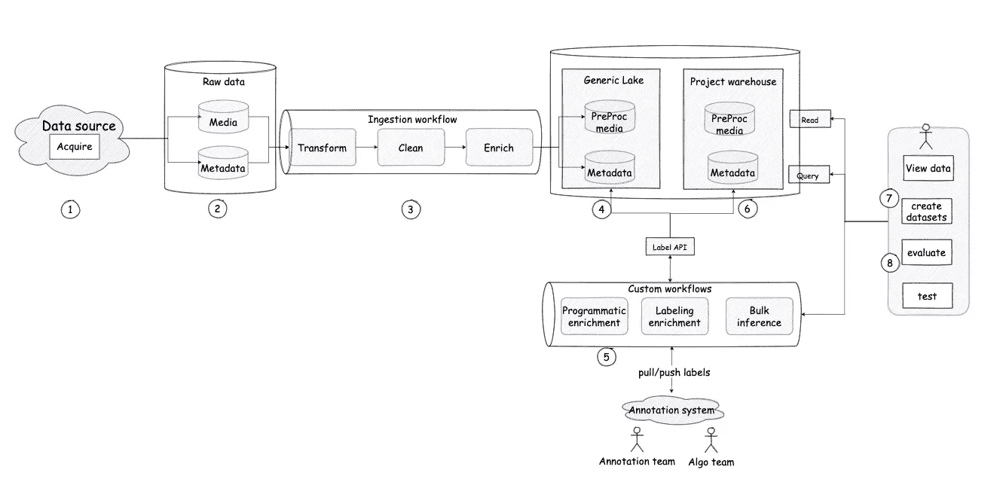

# Deep Lake —大规模管理深度学习数据的架构蓝图—第一部分

> 原文：<https://towardsdatascience.com/deep-lake-an-architectural-blueprint-for-managing-deep-learning-data-at-scale-part-i-effafd488e7c>

图片由作者使用 [vqgan + clip](https://arxiv.org/abs/2204.08583) (“水下机器人世界| art station 上的趋势”，1000 iter)。)

# 介绍

在过去的几年里，机器学习数据管理实践发生了巨大的变化，引入了新的设计模式和工具，如**特征库、数据和模型监控实践以及特征生成框架**。

> 机器学习的数据管理方面的大多数进展都集中在经典(基于特征的)数据上，不能按原样应用于非结构化数据，留下了深度学习数据管理实践

本系列的目标是描述 **Deep Lake —** 一个用于管理深度学习数据的架构蓝图，它可以被视为**数据湖、特征库和深度学习评估库之间的交叉。**

**本系列的第一部分**将强调管理深度学习应用数据的独特挑战，并在高层次上介绍 **Deep Lake** 。

**本系列的第二部分**将深入探讨该蓝图支持的特定设计模式，以及关于实现和技术堆栈选择的注意事项。

## 范围

这篇文章涵盖了深度学习的用例，其中原始数据包括图像、视频、音频或其他信号，通常表示为**大型二进制数据**(相对于表格数据的深度学习)。

这篇文章中的例子指的是深度学习任务，这些任务可以用结构化目标来表示(例如分类、对象检测、音素预测等)，但也可以应用于输出非结构化数据的生成模型。

**警告:**重点是那些至少部分依赖于**带注释数据集**的任务(相对于大规模自我监督方法)。

## **观众**

这篇文章假设读者熟悉机器学习和深度学习的实践和术语，以及数据工程设计模式和实践的工作知识。

# 深度学习数据生命周期 101

本节的目标是从高层次上描述在深度学习模型/系统的生命周期中产生和消费数据的方式。

作者图片

## 数据采集

团队经常使用多个数据源来训练深度学习模型，其中数据以不同的节奏和不同的格式到达。

*   从外部数据源获取数据集**是很常见的——比如开放数据集或从第三方一次性提取的数据。**
*   在某些情况下，数据也是使用**模拟** **或** **生成算法**合成生成的，或者通过**主动**活动(例如，准备并捕捉携带武器的人的图像)或搜索数据(例如，谷歌街景或特斯拉的车队)。
*   只要有可能,**生产数据**就被用来创造一个模型改进的良性循环——这通常只能在初始模型发布后才能创造。

## 数据管道

在数据可以使用之前，我们经常需要对其进行转换、清理和丰富。

这个过程需要处理大量的二进制数据，这使得它很有挑战性。

*   **非结构化*数据的***转换可以简单到**缩放和裁剪、采样**或**编码、**或者在更复杂的情况下**使用预训练模型(可能需要也可能不需要定期训练和验证)将数据嵌入到向量空间中。**
*   清理通常意味着标记损坏的数据，比如空的数据文件或者不合理的注释。
*   **丰富**可以包括通过编程从原始字节中提取感兴趣的数据(例如每幅图像的“照明条件”)。
*   另一种不同类型的丰富是**使用人工标注者**创建标签——人工标注任务可能像使用众包平台对猫和狗进行分类一样简单，或者需要严格的、受监管的、多领域专家标签，并带有解决专家间分歧的强制协议。
*   最后，丰富可能包括在训练过程之前对数据的**扩充**，尤其是如果扩充是一个繁重的过程。

## 构建数据集

通常，团队可以访问不能全部用于建模的数据池——特别是当任务需要标记时。

*   随机选择数据通常是不够的——因为我们需要确保数据集代表足够广泛的****分布**(例如，照明条件、背景、性别等可变性。).**
*   **数据集通常还必须包含**罕见且困难的边缘案例**的表示(对于关键任务应用程序尤其常见)。**
*   **因此，一个常见的工作流程是缩小数据范围，并使用某种形式的**分层技术**对其进行采样，然后**由人工注释者**创建标签。**
*   **有时，数据集创建是一个**迭代循环**(例如，当需要一些标签来引导数据集时)，并且通常遵循**一个复杂且特定于领域的工作流**(在第二部分中有更多关于这个的内容)。**
*   **最后，在训练和评估中经常使用多个数据集来从不同方面测试模型的行为。**

## ****培训、验证和测试****

**当然，这些过程消耗数据集，但是**也产生**数据。**

*   ****两种型号性能的指标报告****
*   ****模型预测数据**，包括**可解释数据、置信度得分**等。**
*   ****实验谱系、训练模型、指标等。**通常存储在一个**实验跟踪系统中。****

## **生产数据捕获和监控**

**一旦将模型部署到生产环境中，就需要监控原始数据和预测，以确保模型正确运行。**

*   **通常监控标签的**分布或它们的属性**(类别分布、边界框大小)以及**预测置信度**等。**
*   **很多时候，我们可以从生产系统中捕捉信号，这些信号可能表明我们的算法执行得有多好——例如，通过产品本身从用户那里收集明确或隐含的反馈。**
*   **如果可能的话，获取这些生产数据是很有用的，因为我们可以用它来改进模型的下一个版本。**

# **深度学习数据的独特挑战**

**在高层次上，深度学习模型的生命周期与经典的 ML 模型没有太大的不同。然而，深度学习有一些独特的差异，当涉及到数据管理时，这些差异会带来相当大的挑战:**

## **大型非结构化有效载荷**

**在传统的 ML 中，单个有效载荷由特征构成，并且对于单个模型示例，通常可以用 1K 以下的数据来表示，这使得利用专门为结构化数据构建的各种存储、查询和可视化引擎变得相对简单。**

**另一方面，非结构化数据:**

*   **通常不能或不应该存储在数据库引擎中**
*   **不附带声明性查询语言(如 SQL)**
*   **没有专门的观众是无法“目测”的**

> **这需要设计用于存储、查询和可视化非结构化数据的定制解决方案**

## **数据量**

**在经典的 ML 中，我们通常可以完全依赖系统本身产生的数据(例如，用户点击或购买、交易等)。)—并无限期存储几乎所有相关数据。**

**在 DL 中，完全收集生产数据非常昂贵的情况并不少见(想想无限期存储特斯拉所有汽车拍摄的所有视频)。**

**此外，一段时间后，来自生产系统的 99.9%的数据对改进模型没有什么价值，剩余的 0.1%变得很重要，但很难获得(例如，与安全相关的罕见边缘情况)。**

> **在一些深度学习系统中，数据采集或数据处理管道需要能够识别和过滤感兴趣的数据，以便长期保留**

**数据量的另一个挑战是，训练深度学习模型需要高端、快速的存储(和独特的数据格式)，以便优化从磁盘到 GPU 内存的数据加载路径。**

**由于这种存储级别非常昂贵，并且数据量很大，我们被迫在更便宜的长期存储中管理“冷”数据，该存储针对吞吐量、成本进行了优化，并支持对单个示例的随机访问(以便能够标记和关注示例)。**

> **深度学习数据通常需要具有不同性价比的多个存储层，并针对不同的消费者以不同的存储格式存储**

## **数据标记**

**在经典 ML 中，我们经常“免费”获得所有数据示例的标签，或者可以通过编程从其余数据中获得它们。**

> **在深度学习中，我们经常需要执行一些注释，通常遵循复杂、昂贵和漫长的过程——包括利用人工注释器。**

# **管理深度学习数据的反模式**

**管理用于深度学习的庞大且不断增长的数据语料库可能是一项艰巨的任务。下面是 DL 团队有时会遵循的一些常见的反模式:**

****将数据准备视为临时任务** 团队执行从原始数据到为 GPU 准备的训练样本的整个数据准备过程，作为单个模型开发或改进工作的一部分，这并不罕见。**

> **这相当于从生产数据库的副本开始开发经典的 ML 模型版本(这是 5-10 年前的行业)。**

****存储丛林**** 

> **这使得项目和团队之间的数据共享成为一个巨大的挑战，因为大多数数据都不容易访问，更不用说发现了。**

****格式面条** 即使数据可以在一个中心位置访问，每个数据源甚至每个数据集都以不同的**格式**存储也并不罕见——无论是在如何将非结构化数据组织到文件夹中方面，还是在如何表示标签方面。**

**这增加了组合来自多个来源和项目的数据的工作量。**

****维度忽略** 管理包含领域数据的良好表示的数据集需要团队了解他们的(二进制)数据中有什么——例如，收集白天和夜晚场景的图像。**

> **但是对于万亿字节的数据，你怎么知道哪张图像包含白天的场景还是夜晚的场景呢？**
> 
> **一种手工方式是观察足够多的示例，并以特定的方式收集它们。然而，这既费时又重复，而且对于不常见的情况(如“夜间冰雹风暴”)效果不佳**

**每次您想要改进您的模型时，手动进行这项工作的成本是令人望而却步的，因此团队通常在他们的数据集中没有足够好的分布。**

# **技术发展水平**

**领先的科技巨头如何应对这些挑战？不幸的是，关于这个话题的文章并不多。**

## **优步·ATG**

**一篇来自优步的博客帖子描述了<https://eng.uber.com/petastorm/>****—**一个由自动驾驶小组创建的库，它有助于以不同格式存储和表示数据集，对查询和训练都有用。****

********

****作者图片****

****帖子还**提到了优步的自动驾驶“数据湖”**，它统一了来自多个来源的数据，对其进行预处理，并以优化的方式存储，以便在数据集生成过程之前进行查询和检索。****

****参考上面的数据生命周期 101 图，优步的内部平台似乎包括:****

1.  ****从原始数据到通用/有用格式的数据管道****
2.  ****一个带有数据模式的数据湖，可以方便地访问数据(通过 HDFS 和拼花地板)****
3.  ****数据之上的查询引擎(Apache Spark ),它通过将一些信息提取到可查询的列中来支持对数据的高效查询，并对存储进行建模以简化时序数据的检索。****
4.  ****能够轻松地将数据转换为高效的培训和特定于框架的数据格式(使用 PetaStorm 格式)****

****一个没有提到的问题是，人类是否以及如何访问数据进行目测或标记——因为提到的格式不允许非常容易地进行点查询。****

## ******特斯拉******

****在最近特斯拉的人工智能日的谈话中，特斯拉的人工智能团队似乎建立了:****

1.  ****具有角色和场景库的合成数据生成器****
2.  ****一个自动预处理工具，可以为交叉点和其他区域创建注释(可能需要人工标注)****

> ****所有迹象表明，这些任务是一个更大的公共基础设施的一部分，该基础设施在任何具体的建模任务之前执行大量繁重的工作****

## ****相关数据管理领域****

*   ****一些**标记工具**提供可视化和搜索非结构化数据的功能(例如，使用元数据或向量相似度)****
*   ******矢量数据库**帮助团队管理大规模嵌入数据——尽管通常用于矢量相似性搜索期间的点查询，而不是数据探索和分析****
*   ****在更下游的地方，**数据版本控制**工具帮助团队在数据选择之后存储和管理他们的数据集——尽管数据存储的方式并不适合探索或分析。****

# ****将数据工程的首要原则应用于数字图书馆数据****

## ****执行上游起重****

****大多数数据工程架构模式都是围绕在业务任务之前提取常见的、繁重的数据工作而构建的，从而使下游团队能够专注于解决他们独特的问题。****

******数据湖和数据仓库、ETL 管道和特性存储**都是基于这个原理运行的。****

****注意:当有足够多的下游消费者需要类似的数据处理来创建一次完成这项工作的效率时，这种方法是可行的。****

## ****根据数据的处理级别在层中存储数据****

****由于并非所有下游用例都可以提前预测，并且可能需要从头开始重新处理数据，因此数据湖通常将数据存储在不同的层中:****

*   ****生的****
*   ****轻度加工和清洁****
*   ****为常用案例(有时在商场中)做好准备。****

****这通常被称为“青铜、白银、黄金”数据层设计模式。****

## ****创建显式数据模型****

****数据建模有助于理解数据，并围绕数据进行思考。****

****首先，我们需要设计组织二进制数据的结构，以便我们能够管理它—应用保留策略、清单、在存储层之间移动等。****

****更重要的是，正如我们所看到的，建立数据集需要按“维度”过滤我们的数据，例如，按图像分辨率、光照条件、个人资料照片的性别等。****

****明确定义数据模型是有意义的，例如:****

*   ****识别“域实体”****
*   ****确定这些实体上的“尺寸”****
*   ****识别描述“发生在我们实体上的事情”的“事件”。****

> ****一旦可以描述显式数据模型，根据定义，它具有结构，并且可以存储在结构化数据的存储引擎(例如，数据库)中****

## ****如果访问模式不同，则创建单独的“物化视图”****

****一般来说，我们试图预先计算并以有用的格式存储数据。****

****如果我们有多个消费者，他们有非常不同的数据访问模式，有时将数据具体化为不同的存储设备和格式会很有用，以方便消费。****

****在我们的例子中，GPU 数据加载需要非常优化的存储设备和格式，这对于目测数据或长期存储通常是没有用的。****

## ****维护更改日志与覆盖数据****

****如果可能的话，最好添加新版本的数据(原始数据、标签等)。)vs .覆盖旧版本。****

# ****深湖建筑模式—概述****

****通常，这种模式遵循现代数据湖和数据仓库模式。****

********

****作者图片****

*****编号参考上图。****

## ******(1)收购******

****我们从数据源中捕获数据，或者以批处理方式，或者以流方式。****

****从外部数据源来看，这可能意味着非结构化数据和一些类似标签的结构化数据。****

****如果来源是生产系统，我们通常可以获得非结构化的原始数据、预测、元数据、附加的相关事件或以上所有内容。****

****如果(非结构化)数据需要积极过滤(想想物联网设备)，采集逻辑需要处理至少部分过滤。****

## ******(2)土地******

****“着陆区”中原始形式的结构化和非结构化信息。通常在这个阶段，它们都可以作为文件或对象存储。****

## ******(3)摄入管道(ETL/ELT)******

****从原始数据到常见的有用结构。
“ETL/ELT”中的“T”包括将非结构化数据转换成有用的**格式**，提取公共**维度**，**清理**破碎数据，**组织**数据模型**中的数据。******

****这包括查询、过滤和转换结构化和非结构化数据。****

****一些或所有被认为保留起来不太有用的数据过滤通常发生在 ETL 管道内部。****

****为了处理来自多个不同数据源的数据，在继续处理之前，我们将首先使用每个数据源的逻辑对数据进行规范化。****

## ******(4)** **存储在公共层******

****有用形式的数据存储在一个中央数据湖中，可以为多个项目服务。****

****数据是根据一个很好理解的模式建模的，包括非结构化数据的布局(例如分区)，尤其是结构化数据的数据模型。****

****可以统一用于结构化数据和非结构化数据的存储技术(例如使用 HDFS)，或者对结构化数据和非结构化数据使用不同的存储技术(权衡利弊)。****

****此时，我们可以对数据执行查询，以了解和描述原始数据属性以及标签、预测和数据的其他方面。****

## ******(5)领域工作流和(6)仓库******

****如果数据用于不同的目的，那么每个领域通常都需要更丰富的数据模型——比如数据的额外维度。****

## ****(7)创建数据集****

****通常，创建数据集的任务需要一个工作流:****

*   ****使用分层通过分布选择数据池****
*   ****仅对所选数据执行附加标注****
*   ****执行验证和拆分****
*   ****以 GPU 培训友好的格式准备和存储****

****对于具有边缘情况和复杂分布的复杂数据集，我们可能需要多次重复这个循环，直到得到我们需要的数据集。****

****用于准备大型数据池的相同管道*工具*可用于生成特定数据集。****

## ******(8)评估******

****可能需要通过对(多个)数据集进行推断并应用通过/失败标准来评估通过了初始有用性标准的模型。****

****将预测反馈到湖中是很有用的，并且能够将它们传递给注释系统中的人类审阅者，以便进行更严格的验证以及积极的学习机会。****

****执行大规模推理、将数据存储在仓库中以及与注释系统进行交互可以被表达为使用管道工具的工作流。****

# ****建筑视图****

## ****数据模型****

****数据模型通常在某种程度上是特定于领域和模态的。然而，构建它的方法通常是相似的:****

*   ****原始数据(例如图像或音频文件)—作为一个“实体”，我们希望“了解一些东西”****
*   ****派生的非结构化数据(如嵌入)—也是一个实体，指向“父项”(原始数据)****
*   ****标签和预测是“事件”****

> ****标签和预测通常共享一个共同的表示，并且可以被认为是“某个参与者关于主题(原始数据)的某个问题的意见”。****
> 
> ****每个实体可以有任意数量的这种“意见”，包括来自多个参与者的意见(例如，标注者之间的共识)****

*   ****尺寸:
    -技术尺寸(分辨率、FPS、编码等。)
    -领域维度——帮助描述原始数据内容但不是模型主要目标的东西(如照明条件、物体数量、人的性别等)。)****
*   ****在一些更高级的情况下，较低级别的数据可用于获得关于其他较高级别的实体的见解。例如，我们可以执行聚合，并将汇总的模型性能数据存储在仓库中。****
*   ****一个更高级的用例是具体化我们对其执行预测的对象的信息，例如，从那里的多个预测导出一个十字路口的真实世界高分辨率地图。****

## ****组件视图****

******非结构化存储引擎** 如集中式文件系统或对象存储，以逻辑方式分区。
用作数据的真实来源，包括来自观众/标签系统的访问。****

******结构化存储**如云数据仓库或适度的关系数据库。****

****注意:根据优步的博客文章，您可能能够将这些引擎和查询引擎结合在一个基础设施中(具有重要的权衡)****

******逻辑数据层** —原始、公共和领域仓库
通常作为结构化存储中的模式或名称空间来实施，因为非结构化数据是不可变的，所以复制它没有意义。****

******管道工具** 通常是 DAG 编制器，支持长时间运行的步骤(人工标记)和触发数据处理基础设施的能力(见下文)****

******非结构化数据处理基础设施******

*   ****用命令式代码表示的逻辑****
*   ****计算在集群上执行(例如，无服务器、k8s 作业、Spark 作业等。)****
*   ****进程从非结构化存储中读取并将输出写入某个(可能是单独的)存储设备(包括消息总线、对象存储等)。)****
*   ****下游管道步骤和工程师可以访问输出。****

******结构化数据处理和查询工具**
理想情况下是一种**声明式查询语言**(存储解决方案自带)，用于检索数据以及执行 DML 语句，如 CTAS。****

## ****应用程序接口****

******读取 API******

*   ****低级—分别针对结构化数据和非结构化数据****
*   ****高级—用于查询符合标准的所有原始数据，并将其具体化为指定的格式(适用于标记/目测或训练数据准备)****

******编写 API** ，重点关注从不同来源(标签系统、外部数据和模型预测)获取新的**标签和预测******

******标签格式翻译 API******

*   ****到/从注释系统标签表达****
*   ****从模型预测数据格式****

# ****总结和后续步骤****

****由于数据的非结构化、大容量和劳动密集型性质，深度学习的数据管理是一项挑战。****

****在这篇文章中，我们介绍了“Deep Lake”——一个利用数据工程最佳实践和模式的架构蓝图，并将其应用于管理深度学习数据的领域。****

****在本系列的下一部分，我们将描述 Deep Lake 系统中使用的设计模式，并回顾潜在的技术栈实现替代方案。****