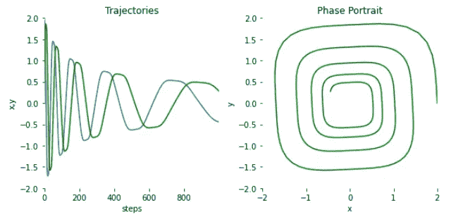
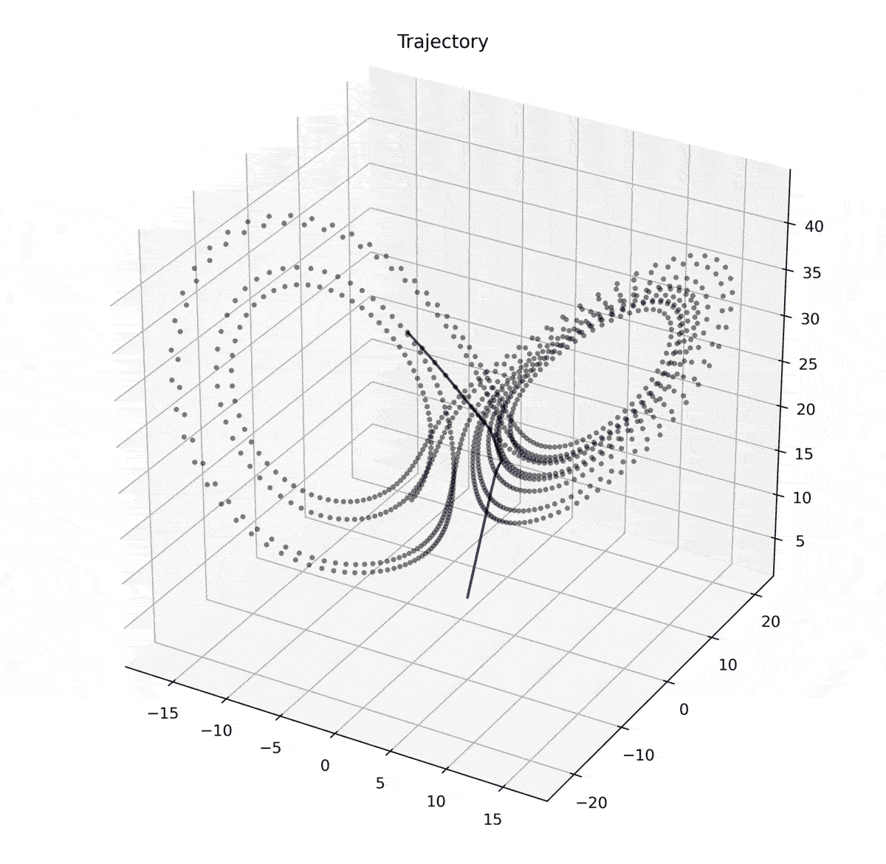
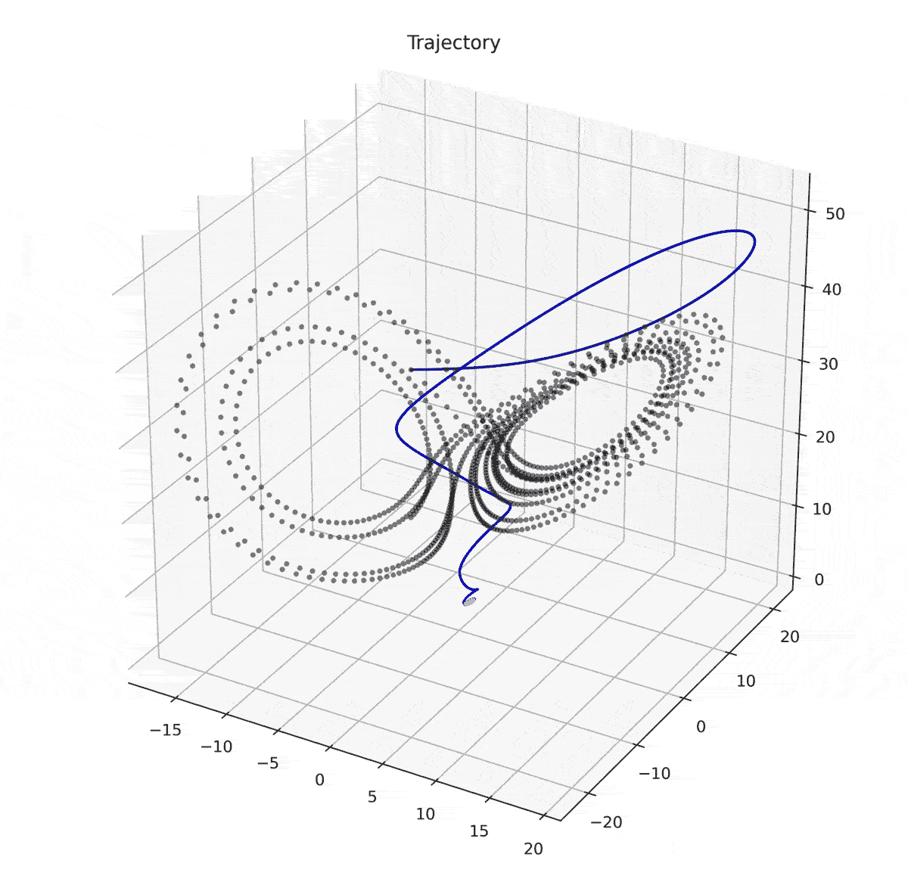
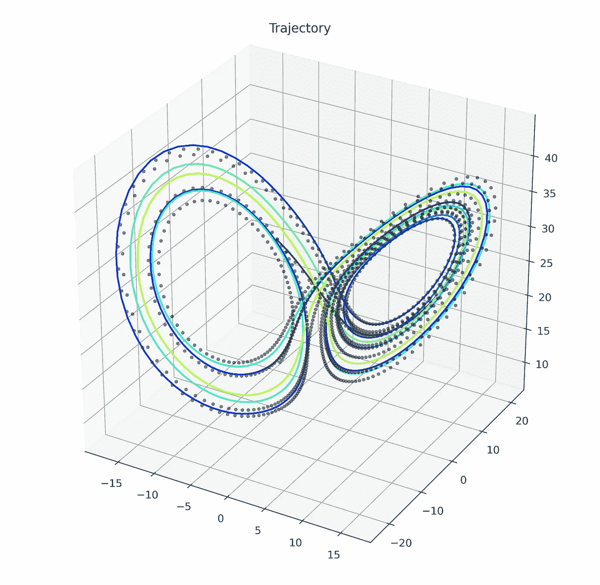

# 动力学的深度学习——直觉

> 原文：<https://towardsdatascience.com/deep-learning-for-dynamics-the-intuitions-20a67942dfbc>

## 深度学习在学习动力学方面已经显示出有希望的结果，这里是两种流行方法背后的直觉，用 PyTorch 编码的例子进行说明。

这篇博文假设了深度学习的一些基础知识。这篇文章中使用的所有代码都可以在我的 GitHub 中找到:[https://github.com/TomJZ/DeepLearningForDynamics-Intuition](https://github.com/TomJZ/DeepLearningForDynamics-Intuition)

# 微分方程

大多数物理模型都是用微分方程(DEs)编写的，具体来说就是常微分方程(ODEs)和偏微分方程(PDEs)。牛顿万有引力定律写道 *F = G*m1* m2/r = m*a* ，其中 *a* 为加速度，位置的二阶导数。爱因斯坦著名的广义相对论使用偏微分方程系统将时空、能量和动量联系起来。薛定谔方程使用线性 PDE 描述了量子力学系统的波函数，在量子尺度上模拟了概率分布的流动。毫不夸张地说，经典和现代物理学的成功都归功于 DEs 令人难以置信的表现力。

DEs 背后的假设很简单:时间和空间是连续的，因此它们可以被分成无限小的部分。通过恰当地描述这些部分在最小尺度下如何相互作用，观察到的宏观行为应该会浮现出来。


情商。1:颂歌的一般形式

上面的方程是 ODEs 的一般形式，它与大多数其他函数的明显区别在于 *f(。,.)*设为 *x_dot* ，状态的导数。这个方程非常简单——它只是状态和时间的函数。这种简单的形式可以模拟从新冠肺炎传播到机器人动力学的各种各样的现象。

假设系统从点 *x0* 在 *t=0* 开始，其在 *t=c* 的状态由下式给出


情商。2:给定初始条件时 c 时刻的状态

通过评估上面的等式，可以获得在 *t=c* 的状态。关键是积分的计算。如果积分可以解析地计算出来，则称常微分方程有*解析解*。否则，积分可能需要使用数值方法进行评估，如[欧拉法](https://en.wikipedia.org/wiki/Euler_method)、[龙格-库塔法](https://en.wikipedia.org/wiki/Runge%E2%80%93Kutta_methods)或多步解算器。用这些方法我们得到了给定初始条件的常微分方程的数值解。著名的三体没有解析解，并且本质上是混沌的，这一点我们将在后面讨论。

在我们深入研究机器学习之前，让我们先弄清楚一些术语。在这篇博文中，我将提到 *f(。,.)*作为*动力学*，它是支配一个系统如何进化的函数。然后是前面段落中描述的 ODE 的*解决方案*的概念。一种解决方案是使用 ODE 在初始条件下生成的状态序列(想象将时间 *c* 设置为等式中的时间戳序列)。2，你就可以解出一系列的状态)。由微分方程表示的动力学有时更明确地表述为*矢量场*，相应地，微分方程的解可以称为*轨迹*。为了一致和清晰，我将成对使用这些术语: *DEs* 和它们的*解；矢量场*和这些场中的轨迹。

给定系统演化的观测值，或其轨迹 Z = [x(t1)，x(t2)，x(t3)，…，x(tn)]，其中采样时间戳是 T = [t1，t2，…，tn]，因此机器学习任务是找到一个模型来拟合这些观测值。让我们在这里暂停一下，想一想到底如何处理这个问题。这就是哲学二分法的由来。一些人认为这个问题仅仅是学习一个时间序列轨迹，而另一些人认为学习潜在的向量场是重要的。

# 这些系统

在我们深入到不同的思想流派之前，这里有两个经典的动力系统我们将用来作为说明性的例子:(1)一个稳定的螺旋，和(2)洛伦兹系统。

2D 稳定螺旋，顾名思义，是一个稳定的系统。它的轨迹，随着时间的推移，收敛到一个固定点。

```
# Stable Spiral system dynamics
class Spiral(nn.Module):
    def __init__(self):
        super(Spiral, self).__init__()
        self.lin = nn.Linear(2, 2, bias=False)
        W = torch.tensor([[-0.1, -2.0],
                         [2.0, -0.1]])
        self.lin.weight = nn.Parameter(W) def forward(self, t, y):
        return self.lin(y**3)
```



图 1:稳定的螺旋。轨迹最终收敛到一个固定点

另一方面，2D 混沌的洛伦兹系统要有趣得多。它是由数学家和气象学家爱德华·洛伦茨在 1963 年发现的。它以 [**混沌**](https://en.wikipedia.org/wiki/Chaos_theory#Chaotic_dynamics) 而闻名，这意味着给定一个参考初始条件和由此产生的轨迹，对这个初始条件的任何微小扰动都会导致轨迹以指数速度发散。然而，这种分歧并没有使轨迹走向无穷:轨迹最终停留在一个称为吸引子的有界集合上。术语*蝴蝶效应*是洛伦兹吸引子的真实含义。

```
# Lorenz system dynamics
class Lorenz(nn.Module):
    def __init__(self):
        super(Lorenz, self).__init__()
        self.lin = nn.Linear(5, 3, bias=False)
        W = torch.tensor([[-10., 10., 0., 0., 0.],
                          [28., -1., 0., -1., 0.],
                          [0., 0., -8\. / 3., 0., 1.]])
        self.lin.weight = nn.Parameter(W) def forward(self, t, x):
        y = y = torch.ones([1, 5])
        y[0][0] = x[0][0]
        y[0][1] = x[0][1]
        y[0][2] = x[0][2]
        y[0][3] = x[0][0] * x[0][2]
        y[0][4] = x[0][0] * x[0][1]
        return self.lin(y)
```


图 2:洛伦兹系统。两个“翅膀”停留在一个吸引子上

在上面洛伦兹系统的图中，我根据时间对轨迹进行了颜色编码。轨迹从深蓝色开始，以黄色结束。可以观察到，在蝴蝶的两个“翅膀”上，颜色是混合的——这表明了轨迹的“随机性”。简单来说，你无法预测它会在未来的某个时间落脚在哪一翼。另一个有趣的事实是，混乱只可能在 3D 或更高的维度，这让我想起了道家的智慧:*道产生了一个；一个产生了两个；两个产生三个；三生万物。*

请注意，许多人将洛伦兹系统误认为非确定性系统。洛伦兹系统，像任何常微分方程一样，事实上完全是确定性的。它的“随机性”来源于指数级快速发散的轨迹，而不是任何随机性。混沌的本质使得洛伦兹系统更难学习，我们将在后面的学习示例中展示。

# 学习轨迹

对于不熟悉动力系统的人来说，当一个类似 Z = [x(t1)，x(t2)，x(t3)，…，x(tn)]的轨迹出现时，他们可能会把这看成一个时间序列建模问题。任务是直接模拟轨迹 Z 本身。像 RNNs 和 transformers 这样的经典时间序列建模工具自然就派上了用场。这些模型有许多变种，如油藏计算机、LSTMs、时空器等等。

我们将用最简单的 RNN 作为例证。不熟悉 RNNs 的可以在这里看一下[。](https://machinelearningmastery.com/an-introduction-to-recurrent-neural-networks-and-the-math-that-powers-them/)

```
class fcRNN(nn.Module):
    def __init__(self, input_size, hidden_dim, output_size, n_layers):
        super(fcRNN, self).__init__()
        self.hidden_dim = hidden_dim
        self.n_layers = n_layers
        self.rnn = nn.RNN(input_size, 
                          hidden_dim, 
                          n_layers,
                          nonlinearity='relu',
                          batch_first=True) # RNN hidden units self.fc = nn.Linear(hidden_dim, output_size) # output layer def forward(self, x):
        bs, _, _ = x.shape
        h0 = torch.zeros(self.n_layers, bs,
                        self.hidden_dim).requires_grad_().to(device)
        out, hidden = self.rnn(x, h0.detach())
        out = out.view(bs, -1, self.hidden_dim)
        out = self.fc(out)
        return out[:, -1, :]
```

这个 RNN 没有什么特别的。输入大小和输出大小与系统的维数相同(螺旋为 2，洛伦兹为 3)。


情商。3:用 RNN 生成轨迹，假设训练时间窗口为 3

训练 RNN 的方法如下:首先为输入定义一个时间窗口，然后 RNN 预测下一步，由此可以计算损失。更具体地说，给定轨迹 Z = [x(t1)，x(t2)，x(t3)，…，x(tn)]，以及比如说 3 的时间窗，我们处理 Z 以给出训练数据 S = {([x(t1)，x(t2)，x(t3)]，x(t4)，([x(t2)，x(t3)，x(t4)]，x(t5)，…，([x(tn-3)，x(tn-2)，x(tn-1)]，x(tn))}。以第一个训练样本为例，RNN 取[x(t1)，x(t2)，x(t3)]并输出其预测。在预测和 x(t4)之间计算损失。


图 3:和 RNN 一起学习稳定螺旋


图 4:稳定螺旋的 RNN 预测

如图 4 所示，得到的模型在预测稳定螺旋的轨迹方面做得相当不错。然而，从图 3 中可以看出，训练过程并不那么美好。在训练过程中，轨迹的某些部分经常变得不平滑。

接下来让我们看看学习洛伦兹系统。在我下面的洛伦兹系统图中，深灰色散点图是训练数据，而渐变颜色线是模型预测。



图 5:用 RNN 学习洛伦兹系统


图 6:洛伦兹系统的 RNN 预测

在训练过程中我们仍然可以观察到轨迹并不是那么平滑。更糟糕的是，轨迹似乎在跳来跳去。得到的模型预测很难捕捉到系统的吸引子。根据颜色，系统错误地收敛到右“翼”中心的一个固定点。虽然我没有做大量的调整，但这种趋向于收敛到一个固定点或极限环的趋势经常被观察到。

# 学习向量场

对于那些有一些动力系统背景的人来说，学习基础向量场是最自然的方法。毕竟，对动力系统的研究本身就是数学的一个分支，它本身就应该告知学习是如何进行的。换句话说，我们希望为未知的 f(.,.)在 Eq。1 利用对其状态序列的观察。


情商。4:生成带节点的轨迹。fNN(。,.)是描述向量场的神经网络

许多最近的作品[1，2，6]采用了这一观点，并展示了学习动力学的令人印象深刻的结果。这类神经网络称为神经常微分方程(节点)[1]。在加速和改善其优化收敛方面取得了很大进展。还有关于这些学习技巧的[好教程](/neural-odes-breakdown-of-another-deep-learning-breakthrough-3e78c7213795)。

在这篇文章中，我将使用 [TorchDiffEq](https://github.com/rtqichen/torchdiffeq) 库，它几乎是当今 NODE 的标准工具箱。它不仅提供了各种解算器，还集成了 py torch[伴随灵敏度方法](/the-story-of-adjoint-sensitivity-method-from-meteorology-906ab2796c73)，这是一种内存高效的反向传播替代方法。稳定螺旋和 Lorenz 系统的模型是具有 ReLU 激活功能的黑盒全连接神经网络。

与 RNNs 不同，我们不需要处理训练数据——观察到的轨迹可以直接用于学习。虽然大多数演示使用随机梯度下降(SGD)从训练数据中随机抽样批次进行训练，但我使用梯度下降并同时从所有批次中学习。我稍后会解释这样做的原因。

节点“批处理”的概念很重要。它是沿着训练轨迹的一批点，您可以将这些点用作生成神经网络模型预测的初始条件。还有一个至关重要的超参数，我称之为**前瞻**。前瞻是神经网络根据一批初始条件预测未来的步数。然后计算这些批预测和地面实况之间的损失。

前瞻与你试图学习的系统动力学有很大关系，必须小心选择。对于大多数稳定的系统，更大的前瞻会起作用。然而，对于混乱和不稳定的系统，前瞻必须保持较小(您可以始终将其保持为 1)。对于混沌/不稳定动力学保持较小的原因直接来自于这些动力学的定义。如果系统的轨迹随着不同的权重以指数方式快速发散，计算该轨迹上的损失将是没有意义的。简单来说，你不能强迫两个注定有分歧的东西变得一样。

```
# A 2D system for fixed point
class FixedPointTrain(nn.Module):
    """
    neural network for learning the stable spiral
    """
    def __init__(self):
        super(FixedPointTrain, self).__init__()
        self.lin = nn.Linear(2, 128)
        self.lin3 = nn.Linear(128, 2)
        self.relu = nn.ReLU()def forward(self, t, x):
        x = self.relu(self.lin(x))
        x = self.lin3(x)
        return x# A 3D system for Lorenz system
class LorenzTrain(nn.Module):
    """
    neural network for learning the chaotic lorenz system
    """
    def __init__(self):
        super(LorenzTrain, self).__init__()
        self.lin = nn.Linear(3, 256)
        self.lin3 = nn.Linear(256, 3)
        self.relu = nn.ReLU()def forward(self, t, x):
        x = self.relu(self.lin(x))
        x = self.lin3(x)
        return x
```


图 7:学习带有节点的稳定螺旋


图 8:稳定螺旋的节点预测

稳定螺旋的学习结果如图 8 所示，其中我也画出了矢量场。图 7 所示的学习过程在训练期间的任何时候都显示出平滑得多的轨迹。



图 9:学习带有节点的洛伦兹系统



图 10:洛伦兹系统的节点预测

对于 Lorenz 系统，如图 9 所示，在训练期间，轨迹似乎仍在跳跃。然而，在整个训练过程中，轨迹要平滑得多。图 10 中得到的模型预测也很好地捕捉了系统的吸引子。虽然神经网络仍然表现出收敛到一个固定点或极限环的趋势，但 NODE 已经显示出产生真正的混沌轨迹[2]。

有些人可能想知道为什么学习轨迹与训练数据不完全匹配。但任务首先不是要匹配这些轨迹，因为这些系统的混沌本质会让任何努力都变得徒劳。相反，神经网络正在学习矢量场，尽管预测轨迹存在抖动，但矢量场会随着时间的推移而收敛。如果向量场学习得足够好，混沌系统的吸引子将被很好地捕获，如图 10 所示。

最后一点是关于我使用梯度下降而不是 SGD 的原因。由于系统的混沌特性，使用神经网络生成的轨迹一旦被学习，不仅对初始条件敏感，而且对其自身的权重敏感。这意味着对神经网络权重的轻微更新将彻底改变所得系统的稳定性(例如稳定或混沌)，并进而改变其轨迹。SGD 是随机的，除非学习率降到极低，否则它会放大这种效应。如果除了基础向量场之外，我们还想捕捉吸引子，那么减少训练中的随机性是很重要的。由于学习低维动态系统的大多数任务只涉及小数据集，使用梯度下降比 SGD 快得多。

# 那么有什么区别呢？

## 时间嵌入

RNNs 可以被认为是[时间延迟系统](https://arxiv.org/pdf/1902.05198.pdf)，其中系统的动态被*嵌入到状态的时间历史中。这在我们处理用于训练 RNNs 的数据的方式中是明显的。还有诸如[图克嵌入定理](https://en.wikipedia.org/wiki/Takens%27s_theorem#:~:text=In%20the%20study%20of%20dynamical,state%20of%20a%20dynamical%20system.)的理论，给出了混沌动力学可以从嵌入式系统中重构的条件。*

另一方面，NODE 可以直接学习向量场。它不需要对系统进行任何变换，如时间嵌入。不过 NODE 也可以用来学习嵌入式系统，只要可以参数化为 DEs。

## 隐式积分器

另一个重要的区别是，RNNs 可以被认为内部有一个隐式积分器。它直接从先前的状态预测下一个状态。情商。2 显示了从动力系统生成轨迹的方式，并且存在积分。当学习动态系统时，RNNs 隐式地执行这种集成。然而，这使 RNNs 处于不利地位，因为它只能以规定的时间间隔输出状态。对于以不规则时间间隔采样的观察值，RNNs 可能难以应用。

相比之下，NODE 输出状态的导数，并依靠外部积分器/解算器使用学习的场来生成轨迹。这不仅允许 NODE 使用不规则采样点对观察值进行训练，还允许它利用任何现有的求解器来满足我们的需求。

## 平滑

正如从前面的例子中观察到的，一个显著的区别是，在训练期间，NODE 的轨迹比 RNNs 的轨迹平滑得多。

这是在节点外部执行集成的结果，这使得节点成为真正的动态系统。用数学术语来说，它构成了[微分同胚](https://en.wikipedia.org/wiki/Diffeomorphism#:~:text=In%20mathematics%2C%20a%20diffeomorphism%20is,and%20its%20inverse%20are%20differentiable.)的一个[单参数群](https://en.wikipedia.org/wiki/One-parameter_group)，这里的“单参数”就是时间。微分同胚给了轨迹许多有趣的性质，我将遵从外部来源。因此，轨迹在时间上的平滑度可以被认为是这些属性之一。然而，对于 RNNs，没有这样的理论性质。

## 在先的；在前的

在建模方面，自上而下的深度学习方法和自下而上的第一原理方法之间经常存在争论。实际上，这两种方法都有各自的优点和缺点。自上而下的方法可以从数据中提取复杂的隐藏模式，但缺乏可解释性，而且通常缺乏可推广性；自下而上的方法产生可概括和可解释的模型，但需要对过程进行艰苦的分解，而且常常需要一点运气。作为一名机器人专家，在诉诸黑盒方法之前，我倾向于拥有尽可能多的第一原理知识。两者的有机结合当然是最理想的。

节点更“暴露”的性质使得合并物理先验更容易。毕竟我们大部分的物理模型都是常微分方程或者偏微分方程。当我们想在 n ODE 中加入一些已知的 ODE 结构时，这使得 NODE 成为一个更兼容的选择。其中一个例子可以在我以前的工作中找到，我试图结合两个世界的优点。然而，RNNs 更具挑战性，因为动力学隐藏在其隐式积分中。

当学习动力系统时，一些显示良好结果的工作假设完全函数形式。注意，这使得它成为一个参数估计问题，而不是深度学习问题。参数估计问题比仅用黑盒神经网络学习要简单得多，因此这种工作的结果应该仔细评估。

# 挑战和机遇

## 测试真正的混乱


图 11:混沌洛伦兹系统与极限环的 0–1 测试。(a) Lorenz 系统轨迹(b)Lorenz 系统 0–1 测试的“pq”图，应类似于无界布朗运动(c)极限环轨迹(d)极限环的 0–1 测试的“pq”图，应是有界的

目前还不知道神经网络是否能够“真正”代表混沌动力学。一些测试，如[0–1 测试](https://www.maths.usyd.edu.au/u/gottwald/preprints/testforchaos_MPI.pdf)可以根据系统足够长的轨迹将系统归类为混沌系统。但是多长时间才算足够长呢？有人可能会说，总有一个时间点，轨迹收敛到一个固定点或极限环，特别是我们已经根据经验表明了他们的这种收敛趋势。

## 学习僵硬的系统


图 12:范德波尔振荡器。刚性系统的一个例子

[僵硬的系统](http://www.scholarpedia.org/article/Stiff_systems)在化学和生物系统中普遍存在，并且是出了名的难以处理。它们生成的轨迹在时间尺度上有如此巨大的差异，以至于学习它们需要大量的调整。

## 学习高维动力系统


图 13: 1D 仓本-西瓦辛斯基方程。时空混沌的偏微分方程

虽然本文中的例子都是低维的常微分方程，但偏微分方程才是真正的数学瑰宝。海洋预报、气象学、传热学、量子力学等等，都可以用偏微分方程很好地建模。学习偏微分方程的一个巨大挑战在于它们的高空间维度，这通常需要离散化。学习和求解偏微分方程是一个活跃的研究领域，近年来产生了许多引人入胜的作品。

## 应用程序

学习过的颂歌在各个领域的应用越来越多。我很幸运在计算机视觉[3]和机器人学[4，5]中应用了学习动力学的框架。在每一个项目之后，我都有了更多的直觉，对这个领域更加兴奋。与此同时，我也意识到我们还有很长的路要走，才能真正理解动力学和深度学习的相互作用。

我的一些代码片段是根据[这个演示](https://github.com/rtqichen/torchdiffeq/blob/master/examples/ode_demo.py)修改的。

**参考文献**

[1] T. Q. Chen、Y. Rubanova、J. Bettencourt 和 D. Duvenaud，“神经常微分方程”载于 NeurIPS，2018 年，第 6572–6583 页。

[2] T. Z .贾浩，M. A. Hsieh，E. Forgoston，“基于知识的非线性动力学和混沌的学习”，混沌，第 31 卷，第 11 期，第 111101 页，2021 年。

[3]吴、贾浩、王、谢美华、谢志伟，“基于神经常微分方程的可变形图像配准优化框架”，计算机视觉与模式识别(CVPR)IEEE 会议，2022 .

[4] K. Y. Chee*、T. Z. Jiahao*和 M. A. Hsieh，“Knode-mpc:基于知识的数据驱动的空中机器人预测控制框架”，IEEE 机器人与自动化快报(RA-L)，第 7 卷，第 2 期，第 2819–2826 页，2022 年。

[5]贾浩，潘立群，谢美华，“用基于知识的神经常微分方程学习群集”，IEEE 机器人与自动化国际会议(ICRA)，2022 年。

[6] S. Brunton，J. Proctor 和 J. Kutz，“从数据中发现控制方程:非线性动力系统的稀疏识别”，《美国国家科学院院刊》113，3932–3937(2015)。