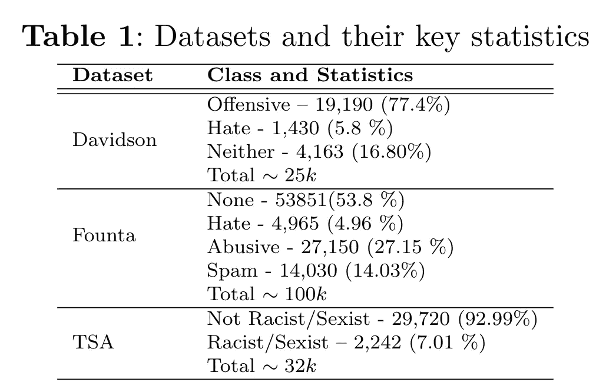
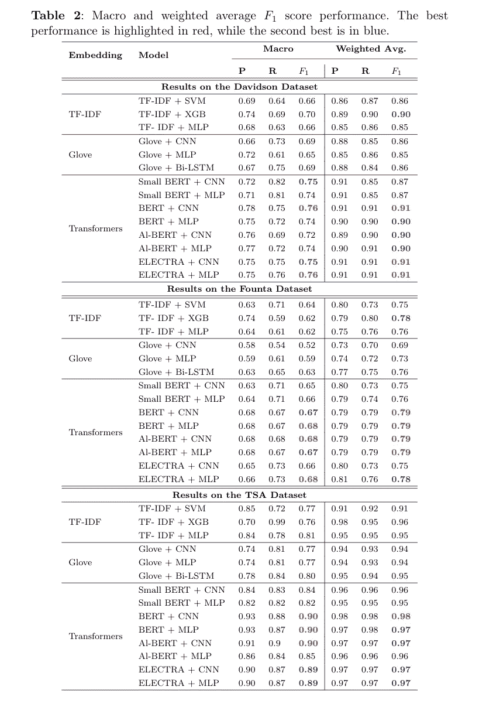
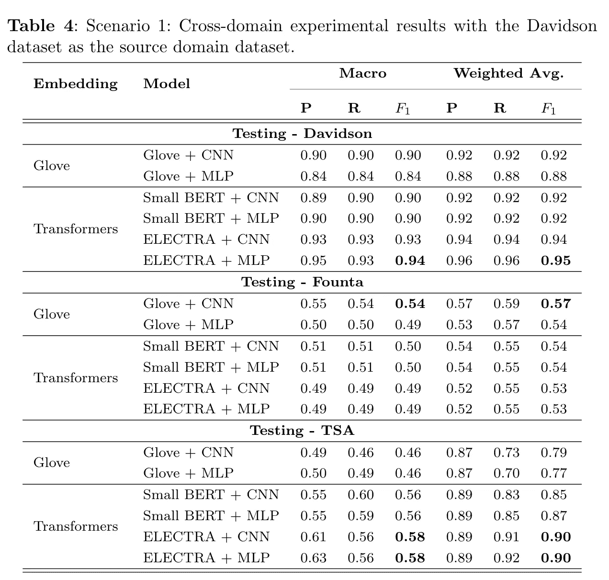

# 用于仇恨言论检测的深度学习:大规模实证评估

> 原文：<https://towardsdatascience.com/deep-learning-for-hate-speech-detection-a-large-scale-empirical-evaluation-92831ded6bb6>

## 为仇恨言论检测在实践中的使用提供指导，量化最新水平，并确定未来的研究方向

A 自动化的仇恨言论检测是打击仇恨言论传播的重要工具，尤其是在社交媒体中。已经为该任务开发了许多方法，包括最近激增的基于深度学习的方法。还开发了各种数据集，举例说明仇恨言论检测问题的各种表现。在这里，我们通过三个最常用的数据集，对深度和浅层仇恨言论检测方法进行了大规模的实证比较。我们的目标是阐明该领域的进展，并确定当前最先进技术的优势和弱点。我们特别关注对实际性能的测量，包括检测准确性、计算效率、使用预训练模型的能力和领域泛化。我们这样做的目的是为仇恨言论检测在实践中的使用提供指导，量化最新技术水平，并确定未来的研究方向。arXiv [1]提供了完整的研究报告。在这里，我们介绍了这项研究的概况和一些有趣的结果。查看下面的完整文件了解更多细节。

<https://arxiv.org/abs/2202.09517>  

本研究中使用的代码和数据集可从下面的存储库中获得。

<https://github.com/jmjmalik22/Hate-Speech-Detection>  

# 动机

在过去的十年里，社交媒体经历了令人难以置信的增长，无论是其规模还是作为一种沟通形式的重要性。社交媒体的本质意味着任何人都可以发布任何他们想要的东西，提出任何立场，无论是启发性的，令人反感的还是介于两者之间的。根据论坛的不同，这些帖子可能会被数百万人看到。不同的论坛对不当内容有不同的定义，识别不当内容的过程也不同，但媒体的规模意味着自动化方法是这项任务的重要组成部分。仇恨言论是这种不当内容的一个重要方面。

然而，仇恨言论是一个主观和复杂的术语，没有单一的定义。无论术语的定义或问题如何，很明显，在某些情况下，自动检测仇恨言论的方法是必要的。在这种情况下，采用准确、有效和高效的方法至关重要。

已经探索了用于仇恨语音检测任务的各种方法，包括传统分类器、基于深度学习的分类器或者两种方法的组合。另一方面，已经引入并发布了许多数据集基准来评估这些方法的性能，如 Davidson [2]、Founta [3]和 Twitter 情感分析(TSA) [4]。

为了提供有见地的应用指南，本研究旨在对这些数据集上不同类型的仇恨言论检测方法进行全面的实证评估和比较。通过这项评估研究，我们回答了仇恨言论检测中的以下四个关键问题。I)不同流行检测模型对不同仇恨言论数据集的有效性如何？这很重要，因为拥有不同应用环境的从业者经常需要从大量的检测器中进行选择。ii)是否有任何特定的模型可以实现比其他模型更理想的性能(在检测精度和效率方面)？准确性和效率都是至关重要的，因为及时处理这些大量的在线文本数据需要计算上可扩展的和准确的检测器。iii)流行的预训练方法对检测模型的效果如何？预训练方法在推动许多机器学习和自然语言处理领域的发展方面一直发挥着重要作用，包括仇恨言论检测。因此，重要的是评估不同的预训练和仇恨言论检测器相结合的有效性。iv)检测模型在处理域转换时的可推广性如何？包括这个问题是因为，由于仇恨言论的种类、表达仇恨文本的方式以及不同语言之间的差异的多样性，跨域仇恨言论检测已经成为最重要的问题之一。

# 实证结果

在我们的实验中，采用了三个广泛使用的数据集，包括 Davidson、Founta 和 Twit-ter 情感分析(TSA ),它们的关键统计数据如下表 1 所示。

在这三个数据集上评估了 14 个浅、深分类器及其组合。

## Q1:不同模型对流行基准的有效性

表 2 显示了所有 14 个仇恨言论检测模型在三个流行基准上的宏观和加权平均结果。ELECTRA 在三个数据集上表现出优异的性能；有趣的是，使用 TF-IDF 的 XGB 也获得了令人印象深刻的性能。

## Q2:特定模型在准确性和效率上的优势

如表 2 所示，Glove 和 TF-IDF 模型并不总是具有优于彼此的性能。有趣的是，与基于手套的神经网络模型获得的结果相比，基于 TF-IDF 的 XGB 能够表现得更好或相当。在一些现有的研究中也可以发现类似的结果。就变压器嵌入而言，使用 BERT、ELECTRA 和 Al-BERT 在所有三个数据集中提供了最佳结果，表现出比竞争模型相当一致的优异性能。模型的计算时间如下图所示。据观察，虽然由转换器提供的准确性高于其他嵌入，但是它确实需要更多的时间来在数据集上训练。

## 问题 3:深度仇恨言论检测模型的预培训

如表 2 所示，预训练模型(例如，基于手套的 MLP 和基于变形金刚的 MLP)在三个数据集上的表现通常优于普通模型(例如，基于 TF-IDF 的 MLP)。基于变形金刚的预训练通常比基于 TF-IDF 的 MLP 模型好得多。

与基于手套的预训练相比，在宏 F1 和加权平均 F1 测量中，不同的基于变压器的预训练方法在所有三个数据集上都表现得一致更好。这适用于 CNN 和 MLP 的分类器。

## Q4。跨域仇恨言论检测

然后，我们执行三组跨域实验，每个模型在三个数据集之一的训练数据上进行训练，并在另外两个数据集的测试数据上进行评估，即，一个数据集用作源域，而另外两个数据集用作目标域。此外，我们还展示了源域数据集测试数据的结果，作为基准性能。下图说明了三种跨域场景。

实验场景 1 是在 Davidson 上训练模型，在另外两个数据集上测试模型。结果如表 4 所示。与源域数据集 Davidson 的测试数据结果相比，Founta 和 TSA 上的跨域性能显著下降，尤其是在 Founta 上，所有手套和变形金刚模型在 macroF1and 和加权平均 1 得分上都获得了大约 0.5 到 0.6 的 1 得分。大多数模型在 TSA 上的表现变得更好，特别是在加权平均结果上。这表明 TSA 中的非仇恨推文与 Davidson 中的非仇恨推文具有一些共同的特征，导致在 nen-仇恨推文分类上的良好性能，从而导致良好的加权平均 F1 性能。

查看我们下面的预印本全文，了解更多跨领域的实验结果

<https://arxiv.org/abs/2202.09517>  

# 结论

我们在三个不同数据特征的常用基准上，对 14 个用于仇恨言论检测的浅层和深层模型进行了大规模的经验评估。这将为其检测准确性、计算效率、使用预训练模型的能力以及在现实应用中部署的领域可推广性提供重要的见解。

模型实现和数据集在以下 GitHub 上公开发布。

<https://github.com/jmjmalik22/Hate-Speech-Detection>  

**参考文献**

[1] Singh Malik，Jitendra，Guansong Pang 和 Anton van den Hengel .“仇恨言论检测的深度学习:一项比较研究。” *arXiv 电子版* (2022): arXiv-2202。
[2]戴维森、托马斯、达纳·沃姆斯利、迈克尔·梅西和英格玛·韦伯。"自动仇恨言论检测和攻击性语言的问题."在*网络和社交媒体国际 AAAI 会议记录*中，第 11 卷，第 1 期，第 512-515 页。2017.
[3]丰塔、安提戈尼·玛丽亚、康斯坦丁诺斯·朱瓦斯、德斯波纳·查察库、伊利亚斯·莱昂蒂亚迪斯、杰里米·布莱克本、吉安卢卡·斯特林希尼、雅典娜·瓦卡利、迈克尔·西里瓦诺斯和尼古拉斯·库尔特利斯。" twitter 滥用行为的大规模众包和特征描述."在*第十二届国际网络和社交媒体 AAAI 会议上*。2018.
【4】[https://data hack . analyticsvidhya . com/contest/practice-problem-Twitter-情操-分析/？UTM _ source = av _ blog&UTM _ medium = practice _ blog _ text _ class ification # # discuss tab](https://datahack.analyticsvidhya.com/contest/practice-problem-twitter-sentiment-analysis/?utm_source=av_blog&utm_medium=practice_blog_text_classification##DiscussTab)