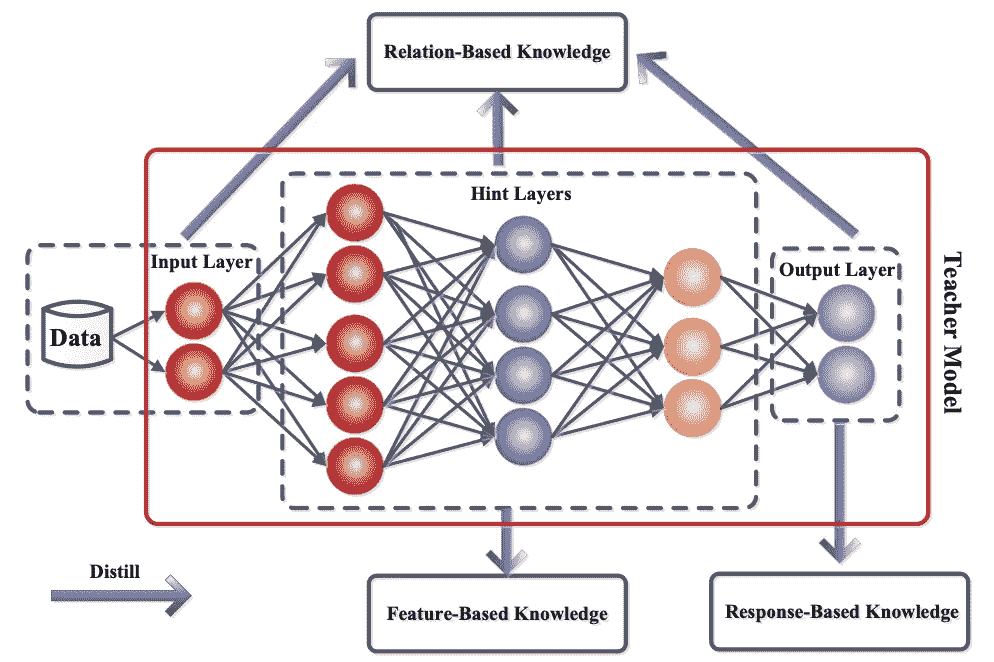

# 深度学习模型优化变得容易(或至少更容易)

> 原文：<https://towardsdatascience.com/deep-learning-model-optimizations-made-easy-or-at-least-easier-a0255182f427>

## 可持续人工智能，一次优化一个模型


照片由 [DeepMind](https://unsplash.com/es/@deepmind?utm_source=medium&utm_medium=referral) 在 [Unsplash](https://unsplash.com?utm_source=medium&utm_medium=referral) 上拍摄

# 介绍

深度学习人工智能模型在过去十年中发展迅速，伴随着这种快速增长的是计算资源需求的爆炸式增长。每一个更大的模型都需要更多的计算资源和更多的位移动，包括进出不同的内存层次和跨系统。

## 可持续人工智能以及为什么深度学习优化对我很重要

2020 年 1 月，连线杂志发表了这篇文章，[人工智能可以做伟大的事情——如果它不烧毁地球](https://www.wired.com/story/ai-great-things-burn-planet/)。最近，MIT Technology Review 撰写了一篇文章，[这些简单的变化可以使人工智能研究更加节能](https://www.technologyreview.com/2022/07/06/1055458/ai-research-emissions-energy-efficient/)，讲述了艾伦人工智能研究所、微软、拥抱脸和几所大学如何合作，以了解如何通过基于可再生能源何时可用来运行工作负载来减少排放。

在我的[上一篇文章](/ai-emerging-technologies-to-watch-c91b8834ddd9)中，我花了一些时间思考可持续人工智能，并讨论了传统深度学习神经网络的一些软件/硬件替代方案。虽然我没有围绕可持续发展来撰写这篇文章，但所有这些技术都有机会解决与特定领域的深度学习模型类似的问题，同时显著减少用于实现这些解决方案的计算能力。

模型性能优化的奇妙之处在于，它不仅提高了性能，还降低了成本和能耗。通过利用下面的一些技术，我们可以更快、更便宜、更可持续地解决有趣的问题。

# 常见的深度学习优化

## 知识蒸馏

顾名思义，知识提炼的目标是从一个模型中获取功能，并将其转移到另一个模型中。通过利用已经是问题的工作解决方案的模型，我们能够创建一个相似的、不太复杂的模型来执行相同的任务。显然，较小的模型必须具有相似的精度才能成功地进行蒸馏。

在许多关于该主题的现代出版物中，教师/学生类比被用来描述知识提炼学习模型如何工作。使用较大的教师模型来帮助训练较小的学生模型有三种不同的方式:基于响应的知识、基于特征的知识和基于关系的知识。下图很好地帮助我们理解了教师模型如何通知学生模型。



我们的知识从哪里来？来源:[知识提炼:一项调查](https://arxiv.org/abs/2006.05525)

基于响应的知识通过查看教师模型的输出来帮助训练学生模型。这可能是创建较小模型的最常见的方式。我们采用较大的模型输出，并基于相同或相似的输入，尝试在较小的模型上获得相同的输出行为。

基于特征的知识通过尝试让中间层模仿教师模型的行为来帮助训练学生模型。这可能很困难，因为捕捉模型的中间特征激活并不总是容易的。然而，在这个领域中已经做了各种工作来捕获中间特征的行为，这使得这种基于特征的知识提取成为可能。

基于关系的知识转移是基于这样一种思想，即在教师网络中，网络中显著不同部分的输出可以一起工作来帮助推动输出。定义算法来帮助训练有点不太直观，但基本思想是采用各种节点组，通常称为特征图，并训练学生节点来提供与父节点中的特征图相似的输出。

通过这三种技术的不同组合，已经表明一些非常大的模型可以被移植到较小的表示中。可能其中最著名的是 [DistilBERT](https://medium.com/huggingface/distilbert-8cf3380435b5) ，它能够保持“与 BERT 相比 97%的语言理解能力，同时拥有 40%的小模型和 60%的快速度。”

## 量化

也许最知名的深度学习优化类型是量化。量化包括采用使用更高精度数字格式(如 32 位或 64 位浮点表示)训练的模型，以及使用较小精度数字格式(通常为 8 位整数(INT8)格式)的神经网络来再现功能。

有几种量化的方法。可以在初始模型被训练之后执行量化。然后，可以通过缩放原始模型内的权重来计算后续 INT8 模型，以生成新模型。这样做的好处是，可以在对现有模型进行微调后，对它们进行优化。

另一种选择是将量化技术作为初始训练过程的一部分。与上述训练后计算的 INT8 模型方法相比，此过程通常会创建更准确的 INT8 模型，但这是以创建模型训练系统时的前期复杂性为代价的。

在这两种情况下，使用 INT8 表示的结果在模型大小方面提供了显著的节省，这转化为更低的内存和计算需求。正如官方 TensorFlow [量子化感知培训](https://www.tensorflow.org/model_optimization/guide/quantization/training)网站上记录的那样，这通常可以在很少或没有准确度损失的情况下完成。

# 使优化更容易

可以想象，这些关于如何创建更小但仍然有效的模型的简单描述需要各种复杂的现实世界的解决方案来正确执行它们。有大量的研究论文致力于这些主题，并且大量的研究已经进入可以概括这些解决方案的方法。

TensorFlow 和 PyTorch 都提供了一些量化 API 来简化量化过程。我还打算在网上找一些知识提炼过程的例子，这无疑是相当复杂的。Keras 有一个很好的张量流例子:

<https://keras.io/examples/vision/knowledge_distillation/>  

对于 PyTorch 来说，这是一个很好的知识提炼的例子，尽管示例代码有点老:

</model-distillation-and-compression-for-recommender-systems-in-pytorch-5d81c0f2c0ec>  

可以想象，结合这些技术来生成一个优化的模型并不一定是一项简单的任务。为了帮助提供简化的模型优化工作流程，英特尔最近发布了[英特尔神经压缩器](https://www.intel.com/content/www/us/en/developer/tools/oneapi/neural-compressor.html)，作为[英特尔人工智能分析工具包](https://www.intel.com/content/www/us/en/developer/tools/oneapi/ai-analytics-toolkit.html)的一部分。这个用于 CPU 和 GPU 部署的开源 python 库简化并自动化了执行这些优化的大量设置和过程。由于它支持 TensorFlow、PyTorch、MXNet 和 ONNX，这个库应该能够帮助快速地将许多较大的模型迁移到更小、更优化的模型中，这些模型需要更少的硬件资源来运行。关于如何在 PyTorch 中利用这个库的更多细节，请查看这篇文章:

<https://medium.com/pytorch/pytorch-inference-acceleration-with-intel-neural-compressor-842ef4210d7d>  

根据您的用例以及您已经在使用的框架，还有其他的选择。例如，如果你碰巧在使用类似 [openVINO](https://docs.openvino.ai/latest/index.html) 的东西，你可以利用框架的相关解决方案，[神经网络压缩框架(NNCF)](https://docs.openvino.ai/latest/docs_nncf_introduction.html) 和[训练后优化工具(POT)](https://docs.openvino.ai/latest/pot_docs_FrequentlyAskedQuestions.html) 。显然，您的最佳选择是尝试使用一个与您已经利用的框架或 SDK 相关联的工具。

# 结论

深度学习模型是许多行业解决方案的重要组成部分。随着这种趋势的继续，模型压缩和优化对于减少模型的大小，使它们比以前运行得更快更有效是至关重要的。这些技术提供了能量使用量的标量减少，但是在其核心，最终解决方案仍然是神经网络。

作为一个社区，这既是一个难以置信的挑战，也是我们在推动创新的同时找到更多减少能源使用的方法的当务之急。展望未来，我希望看到范式是否以及如何转变，以使我们能够继续利用人工智能，但计算和能源使用量将呈指数级下降。

```
**Want to Connect?**If you want to see what random tech news I’m reading, you can [follow me](https://twitter.com/tonymongkolsmai) on Twitter.Tony is a Software Architect and Technical Evangelist at Intel. He has worked on several software developer tools and most recently led the software engineering team that built the data center platform which enabled Habana’s scalable MLPerf solution.Intel, the Intel logo and other Intel marks are trademarks of Intel Corporation or its subsidiaries. Other names and brands may be claimed as the property of others.
```

## 参考

1.  提取神经网络中的知识。辛顿 G，维尼亚尔斯 O，迪安 J(2015)[https://arxiv.org/abs/1503.02531](https://arxiv.org/abs/1503.02531)
2.  知识升华:一个综述。苟 J，于 B，梅班克 SJ，陶 D(2021)
3.  蒸馏伯特，伯特的蒸馏版本:更小，更快，更便宜，更轻。桑五，出道 L，肖蒙德 J，狼 T(2019)[https://arxiv.org/abs/1910.01108](https://arxiv.org/abs/1910.01108)