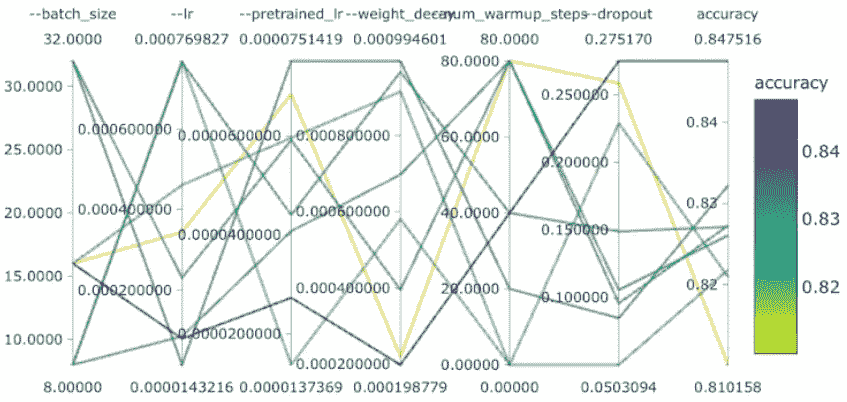
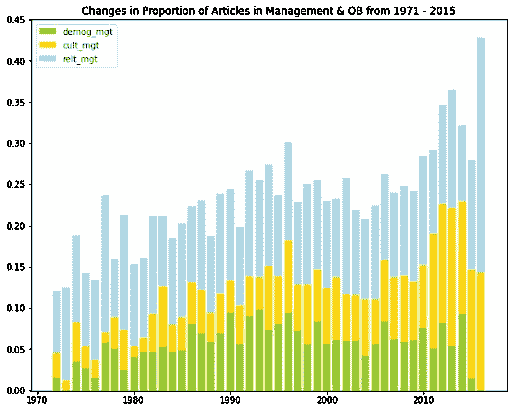

# 深度学习回顾文献

> 原文：<https://towardsdatascience.com/deep-learning-reviews-the-literature-3abd90027c90>

## 用变形器对复杂文本进行分类的指南

由 [Jaren R Haber](https://medium.com/u/e393a0d6684?source=post_page-----3abd90027c90--------------------------------) (乔治城大学) [Thomas Lu](https://medium.com/u/1865a1d2f0b2?source=post_page-----3abd90027c90--------------------------------) (加州大学伯克利分校) [Nancy Xu](https://medium.com/u/9c797a119b78?source=post_page-----3abd90027c90--------------------------------) (加州大学伯克利分校)


在 [Unsplash](https://unsplash.com?utm_source=medium&utm_medium=referral) 上由 [Jaredd Craig](https://unsplash.com/@jareddc?utm_source=medium&utm_medium=referral) 拍照

对于研究人员和科学家来说，有太多的东西需要阅读:更多的博客文章、期刊文章、书籍、技术手册、评论等等。等。比以往任何时候都多。然而，我们必须阅读，因为从过去学习和避免重复发明轮子——或者更糟的是，爆胎——的主要方法是通过历史悠久的文献综述。当我们的书桌和书架上堆满了知识，提供了太多的内容让一个人消化不了的时候，我们如何才能跟上邻居的步伐——也就是说，学术的最新发展及其随着时间的推移而发生的许多变化？

数字时代最受欢迎的消遣来了:计算机阅读东西，或者自然语言处理(NLP)。我们提供 NLP 工具和示例代码来帮助解析数量呈指数级增长的学术期刊文章——尤其是交叉于学术领域的跨学科研究。作为一个案例研究，我们开发了阅读和跟踪一个特定的跨学科领域的方法:社会学和管理学学科中的组织理论。我们使用深度学习来帮助大规模阅读这些文献，我们称之为*计算文献综述*的管道。

在 JSTOR 提供的约 70，000 篇期刊文章[的语料库中，我们具体追踪了现代社会学和管理学研究](https://about.jstor.org/whats-in-jstor/text-mining-support/)中的三大视角——人口统计学、关系学和文化学。我们的模型通过利用一套强大的 NLP 工具:预训练的 Transformer 模型来确定在学术文本中使用这些视角中的哪些(如果有的话)。变形金刚可以处理大量文本，使用[注意力层](https://arxiv.org/abs/1706.03762)和神经网络在高层次上“理解”其内容，并生成有用的输出，如预测。它们是用于训练机器学习分类器的最先进、细致入微的工具，我们构建这些工具是为了帮助审阅学术文献。

读完这篇博客后，你应该能够:

*   了解我们在数字文本语料库中跟踪想法的工作流程，从预处理到模型训练
*   比较几种深度学习算法在获取组织理论方面的性能
*   想象一下随着时间的推移，学术文本中的观点是如何转变的
*   找到(并在此基础上构建！)我们的计算文献综述代码

# 工作流程

我们团队中的专家组织学者手工编写了大约 700 篇文章，为每个观点的出现提供了基础事实。我们使用这些带标签的训练数据，在来自 JSTOR 的预处理过的全文数据上训练基于 Transformer 的分类器。这些模型为组织理论中的三个观点输出二元预测，我们根据交叉验证的准确性选择了最好的一个。然后，我们对未标记的数据进行预测，并分析社会学和管理学学科中每个角度的趋势。

我们的目标是对学术文章进行分类，这些文章平均长度为 7640 个单词。然而，传统的基于变压器的模型通常无法处理长序列: [BERT](https://arxiv.org/abs/1810.04805) 依赖于[自我关注](http://jalammar.github.io/illustrated-transformer/)，这与序列长度成二次比例，并且在处理更长的序列时产生难以维持的计算需求。这个限制在这里很重要，因为我们的分析单位通常是长篇文章。此外，BERT 预先接受了 ebook scorpus(800 万字)和英语维基百科(2500 万字)的培训，这可能会限制其在科学文献领域的可移植性。出于这些原因，我们将我们的关注点缩小到两种变形的 Transformer 模型，以及用于比较的 BERT 本身:SciBERT 和 Longformer。 [SciBERT](https://arxiv.org/abs/1903.10676v3) 基于 BERT，但在与我们的语料库更相似的学术期刊文章上进行训练:具体来说，它的语料库是语义学者的 114 万篇论文(18%来自计算机科学，82%来自生物医学领域)。


我们的计算文献综述工作流程。作者图片。

相比之下， [Longformer](https://arxiv.org/pdf/2004.05150.pdf) 是一个基于 Transformer 的模型，在与 BERT 相同的原始数据集上训练，但它最多可以接受 16K 个令牌(与 BERT 和 SciBERT 的 512 个相反)。Longformer 通过不执行所有可能的比较，而只执行与相关单词的比较，最大限度地减少了注意力的计算负担。Longformer 提供了许多策略来做到这一点(见下图)，例如让大多数令牌只关注它们的邻居，而只有少数令牌关注每个令牌(并且每个令牌也关注它们)。


*变形金刚的高效注意力模式。资料来源:I. Beltagy，M. Peters，A. Cohan，*[Long former:The Long-Document Transformer](https://arxiv.org/pdf/2004.05150.pdf)(*2020)，arXiv*

这种更长的序列长度允许我们的深度学习分类器捕捉组织观点，这些观点不仅嵌入在学术文章的摘要或介绍中，还嵌入在文本的主体中(如理论部分)。我们用最大令牌长度 1024(出于资源管理的原因)训练 Longformer 模型，远低于 16K 的限制。即便如此(剧透警告)，在我们的案例中，这种更长的序列长度被证明是 Longformer 的一个关键优势，与 BERT 相比，准确性提高了 2%左右。

# 我们工作流程的代码

## 预处理

因为像 BERT 这样的转换器利用句子的结构，并根据单词周围的单词(相当于每个单词的上下文唯一向量，这比像 [word2vec](https://radimrehurek.com/gensim/models/word2vec.html) 这样的单词嵌入更有优势)为单词分配意义，所以停用词和语法结构对于模型训练很重要。因此，我们对文本进行最低限度的预处理，用 Apache Lucene tokenizer 对文本进行标记，只删除 HTML 标记、页面格式标记和其他各种垃圾。以下简单的正则表达式替换清理了 JSTOR 用 OCR 对文章文本进行数字化后留下的页面格式和 XML 标签。我们完整的文本预处理代码可以在[这里](https://github.com/h2researchgroup/classification/blob/main/preprocess/preprocess_article_text_full.py)找到。

```
def remove_tags(article):
    """
    Cleans page formatting and XML tags from JSTOR articles.
    """ article = re.sub(‘<plain_text> <page sequence=”1">’, ‘’, article)
    article = re.sub(r’</page>(\<.*?\>)’, ‘ \n ‘, article)
    # remove xml tags
    article = re.sub(r’<.*?>’, ‘’, article)
    article = re.sub(r’<body.*\n\s*.*\s*.*>’, ‘’, article) return article
```

## 过采样

因为我们的二元分类器只预测两个类，所以我们的训练数据中的最佳类平衡将是 1:1: 50%真实正例(本文中引用了视角)，50%真实负例(未引用视角)。然而，我们手工标注的数据中，阴性病例是阳性病例的两倍。为了解决训练和测试样本中的这种类不平衡，我们通过从少数类(正例)进行引导来进行过采样，以达到 1:1 的类比率。

```
from imblearn.over_sampling import RandomOverSampler
from imblearn.under_sampling import RandomUnderSampler

def oversample_shuffle(X, y, random_state=52):
    """
    Oversamples X and y for equal class proportions.
    """

    fakeX = np.arange(len(X), dtype=int).reshape((-1, 1))
    ros = RandomOverSampler(random_state=random_state, sampling_strategy=1.0)
    fakeX, y = ros.fit_resample(fakeX, y)
    p = np.random.permutation(len(fakeX))
    fakeX, y = fakeX[p], y[p]
    X = X.iloc[fakeX.reshape((-1, ))] return X.to_numpy(), y.to_numpy()
```

## 列车测试分离

模型训练需要单独的训练集和测试集来提供准确的预测。为了创建用于训练的数据集，我们执行训练-测试分割，然后对两个数据集进行过采样，以解决前面提到的类别不平衡问题。

```
def create_datasets(texts, scores, test_size=0.2, random_state=42):
    """
    Splits the texts (X variables) and the scores (y variables) 
    then oversamples from the minority class to achieve a balanced sample.
    """ 

    X_train1, X_test1, y_train1, y_test1 = train_test_split(
        texts, scores, test_size=test_size, 
        random_state=random_state) X_train1, y_train1 = oversample_shuffle(
        X_train1, y_train1, random_state=random_state)
    X_test1, y_test1 = oversample_shuffle(
        X_test1, y_test1, random_state=random_state)

    return X_train1, y_train1, X_test1, y_test1
```

## 模特培训

我们在 HuggingFace Transformers 库中的 Longformer 模型的基础上构建我们的分类器，并使用一个线性层将 Longformer 表示转换为每个标签的一组预测。下面是 BERTClassifier 类，它包含用于加载和初始化具有指定最大令牌长度的预训练 long former 模型的代码，以及用于模型训练和交叉验证的“get_batches()”、“forward()”和“evaluate()”等帮助函数。[这是模特训练的完整代码。](https://github.com/h2researchgroup/classification/blob/main/modeling/Azure%20Files/Longformer-CV.py)

```
class BERTClassifier(nn.Module):
    """ 
    Initializes the max length of Longformer, the pretrained model, and its tokenizer.
    """ def __init__(self, params):
        super().__init__()
        self.tokenizer = LongformerTokenizer.from_pretrained('allenai/longformer-base-4096')
        self.bert = LongformerModel.from_pretrained("allenai/longformer-base-4096", gradient_checkpointing=True)
        self.fc = nn.Linear(768, self.num_labels)
```

然后，我们在“BERTClassifier”类中定义“get_batches()”辅助函数，该函数使用 BERT 标记器标记文本。

```
 def get_batches(self, all_x, all_y, batch_size=10):
        """
        Tokenizes text using a BERT tokenizer. 
        Limits the maximum number of WordPiece tokens to 1096.
        """ batch_x = self.tokenizer.batch_encode_plus(
            x, max_length=self.max_length, truncation=True, 
            padding='max_length', return_tensors="pt") batch_y=all_y[i:i+batch_size] ## code omitted return batches_x, batches_y
```

为了运行该模型，我们在“BERTClassifier”中定义了一个“forward()”函数。这将获取模型输出，并通过完全连接的线性图层运行最后一个图层，以通过执行所有输出类别的 softmax 来生成预测，这在 logit 模型中很常见。

```
 def forward(self, batch_x):
        """
        Gets outputs from the pretrained model and generates predictions.
        Note that Longformer is a RoBERTa model, so we don't need to pass in input type ids.
        """        # First, get the outputs of Longformer from the pretrained model
        bert_output = self.bert(input_ids=batch_x["input_ids"],
                        attention_mask=batch_x["attention_mask"],
                        output_hidden_states=True)

        # Next, we represent an entire document by its [CLS] embedding (at position 0) and use the *last* layer output (layer -1).
            bert_hidden_states = bert_output['hidden_states']
            out = bert_hidden_states[-1][:,0,:]
            if self.dropout:
                out = self.dropout(out)
            out = self.fc(out) return out.squeeze()
```

最后，我们为“BERTClassifier”定义一个“evaluate()”函数，以基于批次 y 确定批次 x 的预测的准确性

```
 def evaluate(self, batch_x, batch_y):
        """
        Evaluates the model during training by getting predictions (batch x) and comparing to true labels (batch y).
        """ self.eval()
        corr = 0.
        total = 0. # disable gradient calculation
        with torch.no_grad():
            for x, y in zip(batch_x, batch_y):
        # for each batch of x and y, get the predictions
        # and compare with the true y labels
                y_preds = self.forward(x)
                for idx, y_pred in enumerate(y_preds):
                    prediction=torch.argmax(y_pred)
                    if prediction == y[idx]:
                        corr += 1.
                    total+=1    

       return corr/total
```

然后，我们训练模型并确定最佳超参数。我们使用了微软 Azure 的机器学习服务器来搜索超参数空间，并最大化交叉验证的准确性；下面是完成这项工作的完整代码。此代码中的主要部分是下面的“train_bert()”函数，它使用“create_datasets()”来准备训练和测试数据，然后从“BERTClassifier”类中“get_batches()”来获取用于模型构建的批。接下来，我们定义超参数变量、Adam 优化器及其调度程序。然后，我们训练和评估该模型，记录它的最佳开发精度和时期，用于模型比较。

```
def train_bert(texts, scores, params, test_size=0.2):
    """
    This deep learning workhorse function trains a BERT model 
    with the given hyperparameters, 
    returning the best accuracy out of all epochs.
    (Code is simplified for ease of reading.) Inputs:
        texts: a list of article texts for training
        scores: a list of labels for the texts (0 or 1)
        test_size: proportion of input data to use for model testing (rather than training)
        params: a dict of parameters with optional keys like batch_size, learning_rate, adam_beta, weight_decay, max_memory_size, and num_epochs (full list omitted).
    """ # cross entropy loss is used for binary classification
    cross_entropy=nn.CrossEntropyLoss()
    best_dev_acc = 0.
    best_dev_epoch = 0. for epoch in tqdm(range(num_epochs)): # loop over epochs
        bert_model.train()
        # Train model
        optimizer.zero_grad() # Clear any previously accumulated gradients
        for i, (x, y) in enumerate(zip(batch_x, batch_y)):
            # Find the loss for the next training batch
            y_pred = bert_model.forward(x)
            loss = cross_entropy(y_pred.view(-1, bert_model.num_labels), y.view(-1))
            loss.backward() # Accumulate gradients for back-propagation if (i + 1) % (batch_size // max_memory_size) == 0:
                # Check if enough gradient accumulation steps occurred. If so, perform a step of gradient descent
                optimizer.step()
                scheduler.step()
                optimizer.zero_grad()

       # Evaluate model and record best accuracy and epoch 
        dev_accuracy=bert_model.evaluate(dev_batch_x, dev_batch_y)
        if epoch % 1 == 0:
            if dev_accuracy > best_dev_acc:
                best_dev_acc = dev_accuracy
                best_dev_epoch = epoch

    print("\nBest Performing Model achieves dev accuracy of : %.3f" % (best_dev_acc))
    print("\nBest Performing Model achieves dev epoch of : %.3f" % (best_dev_epoch)) return best_dev_acc
```

## 模型评估

我们用“cross_validate()”函数将上述所有内容联系在一起，该函数接受一个预处理文本列表、一个分类分数列表(如果文章是关于给定的视角，则为 1，否则为 0)和一个要优化的超参数列表。然后，该函数训练该模型并返回交叉验证精度，或者跨数据的几个(这里是 5 个)切片或*折叠*中的每一个的模型的平均精度。与单一训练/测试分割相比，[*k*-折叠交叉验证](https://en.wikipedia.org/wiki/Cross-validation_%28statistics%29#k-fold_cross-validation)提供了一种更通用的模型性能测量方法，最大限度地降低了模型过度拟合输入数据的风险。

```
def cross_validate(texts, scores, params, folds=5, seed=42):
    """
    Trains BERT model and returns cross-validation accuracy.
    Communicates directly with Azure to run model 
    and record accuracy of given hyperparameters.
    """

    np.random.seed(seed)
    states = np.random.randint(0, 100000, size=folds)
    accs = []
    for state in states:
        print(state)
        accs.append(train_bert(
            texts, scores, params, test_size=round(1/folds, 2),
            random_state=state, save=False))
    acc = np.mean(accs)
    run.log('accuracy', acc) # works with Azure return acc
```

下面是我们代码的一个用法示例，使用“orgs”Pandas 数据框架作为训练数据。每行是一篇社会学文章，列“全文”包含文章的全文，而“组织分数”表示文章是关于组织的(1)还是关于组织的(0)。

```
orgs['text_no_tags'] = [remove_tags(art) for art in orgs['full_text']]
orgs = orgs[orgs['orgs_score']!=0.5]

cross_validate(orgs['text_no_tags'], orgs['orgs_score'],{'batch_size': 16, 'lr': 1e-4, 'dropout': 0.2, 'weight_decay':0.005, 'num_warmup_steps': 60})
```

然后可以使用 Azure 的专业机器学习仪表板来可视化结果。下图显示了我们训练的模型的超参数组合(批量大小、学习率、预训练学习率、重量衰减、热身步骤数和辍学率)。最精确的模型(紫色线)对除辍学率之外的所有超参数都有相对较低的值。



跨超参数的模型性能。图片由作者提供，使用 Microsoft Azure 平台制作。

与 BERT 和 SciBERT 相比，我们发现基于 Longformer 的优化二元分类器在所有三个角度和组织社会学方面表现最佳。下表比较了我们测试的不同变压器型号的精度。最佳模型超参数见附录 A，Longformer 性能替代指标见附录 B。


## 做出并可视化预测

由于其卓越的性能，我们使用 Longformer 为 65K 左右尚未标记的 JSTOR 文章生成二元和连续预测(是/否以及参与每个视角的概率)。你可以在这里找到生成预测的完整代码。

```
**def** get_preds(model, batch_x, batch_y):
    """
    Using input model, outputs predictions (1,0) and 
    scores (continuous variable ranging from 0 to 1) for batch_x
    Note that batch_y contains dummy labels to take advantage of pre-existing batching code
    """ model**.**eval()
    predictions **=** []
    scores **=** [] **with** torch**.**no_grad():
        **for** x, y **in** tqdm(zip(batch_x, batch_y)):
            y_preds **=** model**.**forward(x)
            **for** idx, y_pred **in** enumerate(y_preds):
                predictions**.**append(torch**.**argmax(y_pred)**.**item())
                sm **=** F**.**softmax(y_pred, dim**=**0)
            **try**:
                scores**.**append(sm[1]**.**item())
            **except**:
                print(len(scores))
                print(sm**.**shape, sm) **return** predictions, scores
```

我们将 JSTOR 语料库分为两个主要主题(社会学和管理&组织行为)，并从三个角度(人口统计、文化和关系)分析参与度。我们过滤掉了预测概率低于 0.7 的关于组织的社会学文章。

```
*# filter to only organizational sociology articles using threshold of 0.7* minority_threshold_orgs **=** 0.7
df_orgsoc **=** merged[merged['primary_subject']**==**'Sociology'][merged['org_score'] **>** minority_threshold_orgs]
```

接下来，我们创建一个辅助函数“cal_yearly_prop()”来计算涉及每个视角的文章的年度比例。这有助于随着时间的推移，可视化参与每个视角的文章比例。

```
def cal_yearly_prop(df_category):
    """
    For graphing purposes, calculate the proportion of articles 
    engaging a perspective (cultural, relational, or demographic) 
    for a given discipline (sociology or management studies) over years. Arg:
        df_category: DataFrame of article predictions with columns ‘publicationYear’ indicating year published and ‘article_name’ as identifier Returns:
        A list of proportion of articles engaging in a perspective over the years
    """

    yearly_grouped = df_category.groupby('publicationYear').count()
    yearly_total = list(yearly_grouped[‘article_name’])
    years = list(yearly_grouped.index) # get the yearly counts of articles 
    counts = df_category.groupby('publicationYear').count()[['article_name']].reset_index()
    not_present = list(set(years) - set(counts.publicationYear)) # create a dataframe for the article counts of missing years (0)
    df2 = pd.DataFrame.from_dict({'publicationYear':not_present, 'article_name': [0]*len(not_present)})

    # concatenate the counts df with df of missing years, and divide the yearly counts by yearly total to get a list of yearly proportions
    return np.array(pd.concat([counts, df2]).reset_index().sort_values('publicationYear')['article_name'])/yearly_total
```

下面的堆积条形图显示了一段时间内社会学和管理学文章比例的变化。这一指标的分子是在给定年份从事文化社会学、关系社会学或人口社会学的文章数量；分母是当年社会学的文章总数。管理研究中可视化趋势的代码非常相似。[你可以在这里找到可视化预测的完整代码。](https://github.com/h2researchgroup/classification/blob/main/modeling/longformer_sampling_analysis.ipynb)

```
# Visualize engagement across perspectives in organizational sociology
relt_fig = plt.figure()
relt_fig.set_figwidth(10)
relt_fig.set_figheight(8)

yearly_grouped = df_orgsoc.groupby('publicationYear').count()
years = list(yearly_grouped.index)

ax = plt.gca()# the start and end years are omitted because they are outliers
demog_fig = plt.bar(years[1:-1], demog_soc_minority_prop_os[1:-1], color = 'yellowgreen')
cult_fig = plt.bar(years[1:-1], cult_soc_minority_prop_os[1:-1], bottom = demog_soc_minority_prop_os[1:-1], color = 'gold')
relt_fig = plt.bar(years[1:-1], relt_soc_minority_prop_os[1:-1], bottom =  demog_soc_minority_prop_os[1:-1] + cult_soc_minority_prop_os[1:-1], color = 'lightblue')

plt.legend([ 'demog_soc','cult_soc', 'relt_soc' ])

plt.title('Changes in Proportion of Articles in Organizational Sociology from 1971 - 2015')
```


作者图片。



作者图片。

简而言之，我们看到人口统计学的观点在(组织)社会学的文章中是最常见的，而关系学的观点在管理和组织行为学中是最常见的。人口统计管理类文章从 2010 年开始逐渐下降，文化管理类文章在观察时间段内逐渐增长。所有其他类别多年来有所波动，但没有显示出随着时间的推移而普遍增长或下降。

# 结论

我们希望您喜欢了解我们的深度学习工作流，该工作流用于跟踪复杂文本中随时间变化的想法，并应用于我们对学术文章中的组织理论的案例研究。回顾:我们准备了一个完整的出版文献语料库，使用几个 transformer 模型来分析和预测文章内容，然后绘制跨时间和学科的特定理论的参与度。我们的总体目标是通过使用数据科学工具阅读和解释大量文本来提高文献综述的可访问性。我们认为变形金刚非常适合这种应用，激发我们的技术洞察力，将变形金刚应用于各种社会科学学科的学术文章——这是我们以前从未见过的练习。

我们希望您发现我们的演示很有趣，并对您自己的工作有所帮助。请关注我们未来探索其他采样方法、手工编码模型验证和更长序列长度的工作(关于这方面的具体想法，请参见附录 C)。我们还计划分析引用模式和组织理论中不断变化的词汇代表观点。敬请期待，感谢阅读！

# 附录

## A.最佳模型超参数


作为增加输入序列长度的另一种方法，我们还利用 BERT 探索了“分块”技术:我们将文本分成更小的部分，评估每个块上的模型，并组合结果([引用](https://arxiv.org/pdf/1910.10781.pdf))。我们发现使用 BERT 进行分块和使用其默认的 512 个标记的序列长度之间没有显著差异。

## B.备选 Longformer 指标


## C.未来的工作

## 手动编码的模型验证

为了验证我们的模型，我们使用似然阈值来选择六组样本(跨两个学科的三个视角)，包括少数和多数类以及那些具有低置信度预测的类(用于可能的主动学习应用)。我们的专家合作者对这些样本进行手工编码将有助于验证模型，确保过去大量假阳性的经验不会重复。

## 分层抽样

在数据预处理过程中，除了对少数类进行过采样之外，使用分层采样可能是有益的。总的来说，从 1970 年到 2005 年，吸引我们观点的 JSTOR 文章总数稳步增加，在 2005 年达到顶峰，从 2005 年到 2016 年开始急剧下降。除了观点的潜在变化之外，上述文章频率和比例的变化可能是由于某些期刊改变了发表文章的数量。为了确保样本中代表了某些观点，JSTOR 文章的总体可以根据出版年份和期刊等特征划分为子总体。然而，这也取决于 JSTOR 提供的文章数量。

## 长模型输入长度

由于时间约束和计算限制，我们用最大令牌长度= 1024 来训练长成形器。然而，继续用更大的标记长度训练长成形器并观察准确性的任何变化将是有见地的。截取一个长文本的中间部分([参考](https://arxiv.org/pdf/1905.05583.pdf))也是值得探索的。此外，在预处理过程中，我们还可以删除摘要或元数据信息，如开头的作者姓名和电子邮件。