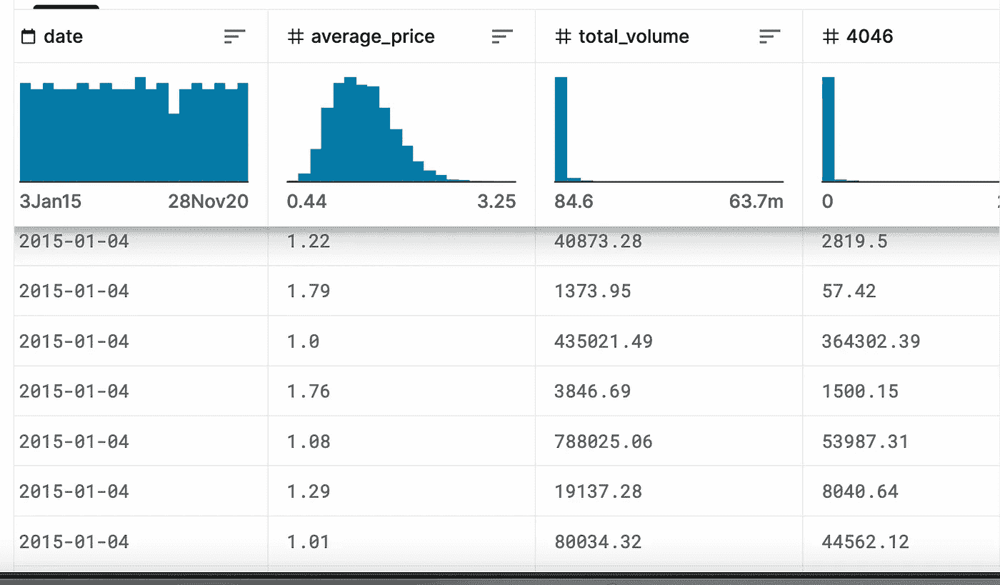
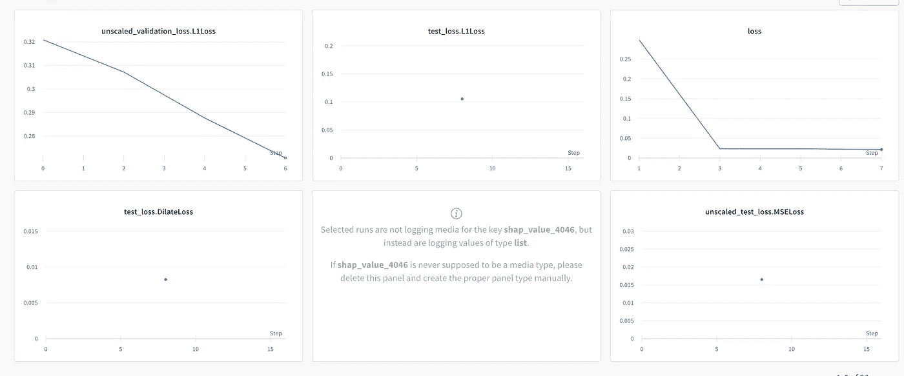
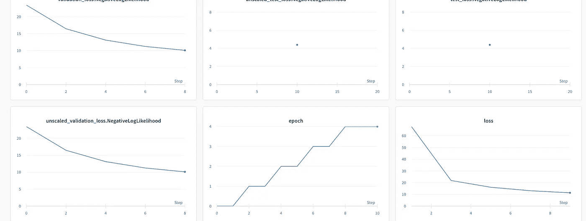
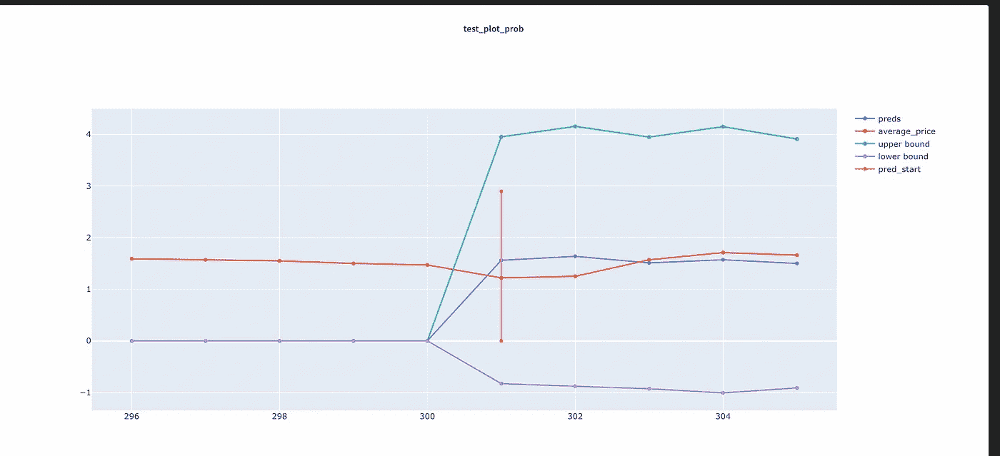

# 深度时间序列预测与流量预测第 1 部分:鳄梨价格

> 原文：<https://towardsdatascience.com/deep-time-series-forecasting-with-flow-forecast-part-1-avocado-prices-276a59eb454f>

## 利用[深度学习进行时间序列框架流量预测的实例](https://github.com/AIStream-Peelout/flow-forecast)预测时态数据


[图片来自 Unsplash](https://unsplash.com/photos/cueV_oTVsic)

[流量预测](https://github.com/AIStream-Peelout/flow-forecast)【FF】，是 PyTorch 内置的最先进的时间序列预测框架深度学习。在这个正在进行的系列中，我们将使用 FF 对真实世界的时间序列数据集进行预测(和分类)。在第一个例子中，我们将使用 FF 对位于 Kaggle(开放数据库)上的公开可用的 [Avocado 数据集](https://www.kaggle.com/datasets/neuromusic/avocado-prices)进行预测。预测农产品价格对消费者和生产者来说都是有价值的，因为它可以帮助确定最佳购买时间或预期收入。

**数据集:**该数据集包含 2015-2020 年美国每周鳄梨销售的信息。数据分散在不同的大都市地区，如芝加哥、底特律、密尔沃基等。对于数据集，总共大约有九列。所有事情都认为这是一个相对“简单”的数据集，因为在列中没有太多缺失值。



鳄梨数据集的示例。

我们现在将尝试根据 total_volume 和其他几个列(如 4046)来预测鳄梨的平均价格(例如，销售的某些包的数量)。

值得注意的是，在现实中，对于长期预测问题，我们通过模型进行一次以上的预测(例如，我们将来自目标模型的预测连接到其他要素，并将其重新输入到模型中)，我们可能需要将 total _ volume 4046 等内容也视为目标，因为我们无法提前几个时间步访问它们的真实值。然而，为了简化本教程，我们将假设我们有(这些值也可以来自其他单独的估计或其他模型)。

**方法 1:** 我们将尝试的第一种方法是 DA-RNN，这是一种更古老但仍然有效的时间序列预测模型深度学习方法。为此，我们将首先设计一个包含模型参数的配置文件:

```
the_config = {                 
   "model_name": "DARNN",
   "model_type": "PyTorch",
    "model_params": {
      "n_time_series":6,
      "hidden_size_encoder":128,
      "decoder_hidden_size":128,
      "out_feats":1,
      "forecast_history":5, 
      "gru_lstm": False
    },
    "dataset_params":
    { "class": "default",
       "training_path": "chicago_df.csv",
       "validation_path": "chicago_df.csv",
       "test_path": "chicago_df.csv",
       "forecast_length": 1,
       "batch_size":4,
       "forecast_history":4,
       "train_end": int(len(chicago_df)*.7),
       "valid_start":int(len(chicago_df)*.7),
       "valid_end": int(len(chicago_df)*.9),
       "test_start": int(len(chicago_df)*.9),
       "target_col": ["average_price"],
       "sort_column": "date",
        "no_scale": True,
       "relevant_cols": ["average_price"j., "total_volume", "4046", "4225", "4770"],
       "scaler": "StandardScaler", 
       "interpolate": False,
       "feature_param":
         {
             "datetime_params":{
                 "month":"numerical"
             }
         }
    },

    "training_params":
    {
       "criterion":"DilateLoss",
       "optimizer": "Adam",
       "optim_params":
       {"lr": 0.001},
       "epochs": 4,
       "batch_size":4
    },
    "inference_params":{
        "datetime_start": "2020-11-01",
        "hours_to_forecast": 5,
        "test_csv_path":"chicago_df.csv",
        "decoder_params":{
            "decoder_function": "simple_decode", 
            "unsqueeze_dim": 1
        } 
    },
    "GCS": False,

    "wandb": {
       "name": "avocado_training",
       "tags": ["DA-RNN", "avocado_forecast","forecasting"],
       "project": "avocado_flow_forecast"
    },
   "forward_params":{},
   "metrics":["DilateLoss", "MSE", "L1"]
}
```

在这种情况下，我们将使用 DilateLoss 函数。DilateLoss 函数是一个损失函数，根据 2020 年提出的时间序列的值和形状返回一个误差。这是一个很好的训练功能，但不幸的是，它并不适用于每个模型。我们还将在配置文件中添加月份作为一个特性。

现在，我们将使用训练函数为几个时期训练模型:

```
from flood_forecast.trainer import train_function
from kaggle_secrets import UserSecretsClient
user_secrets = UserSecretsClient()
secret_value_0 = user_secrets.get_secret("WANDB_KEY")
os.environ["WANDB_API_KEY"] = secret_value_0
trained_model = train_function("PyTorch", the_config)
```

现在让我们分析一些关于权重和偏差的结果:



我们可以看到这个模型似乎收敛得很好。基于 validation_loss，我们甚至可以挤出一些更多的性能训练用于下一个或两个时期。


预测在这里用红色显示，实际的平均价格用蓝色显示。

此外，预测并不可怕，特别是考虑到我们没有广泛地调整参数。然而，另一方面，我们可以看到模型在预测价格时并没有真正使用总量(至少根据 SHAP 的说法)。

你可以在这个[教程这里](https://www.kaggle.com/code/isaacmg/avocado-price-forecasting-with-flow-forecast-ff?scriptVersionId=110452136)和 W & B 日志这里看到完整的代码。

**方法 2:** 我们将使用 GRU 的概率版本来预测美国不同地区鳄梨的价格。

概率 m 的优势在于它可以预测预测值的上限和下限。我们再次定义一个配置文件:

```
the_config = {                 
   "model_name": "VanillaGRU",
   "model_type": "PyTorch",
    "model_params": {
      "n_time_series":6,
      "hidden_dim":32,
      "probabilistic": True, 
      "num_layers":1,
      "forecast_length": 2,
      "n_target":2,
      "dropout":0.15, 
    },
    "probabilistic": True,
    "dataset_params":
    { "class": "default",
       "training_path": "chicago_df.csv",
       "validation_path": "chicago_df.csv",
       "test_path": "chicago_df.csv",
       "forecast_length": 2,
       "forecast_history":5,
       "train_end": int(len(chicago_df)*.7),
       "valid_start":int(len(chicago_df)*.7),
       "valid_end": int(len(chicago_df)*.9),
       "test_start": int(len(chicago_df)*.9),
       "target_col": ["average_price"],
       "sort_column": "date",
        "no_scale": True,
       "relevant_cols": ["average_price", "total_volume", "4046", "4225", "4770"],
       "scaler": "StandardScaler", 
       "interpolate": False,
       "feature_param":
         {
             "datetime_params":{
                 "month":"numerical"
             }
         }
    },"training_params":
    {
       "criterion":"NegativeLogLikelihood",
       "optimizer": "Adam",
       "optim_params":
       {"lr": 0.001},
       "epochs": 5,
       "batch_size":4
    },
    "inference_params":{
        "probabilistic": True,
        "datetime_start": "2020-11-01",
        "hours_to_forecast": 5,
        "test_csv_path":"chicago_df.csv",
                 "decoder_params":{
         "decoder_function": "simple_decode", "unsqueeze_dim": 1, "probabilistic": True}
    },
    "GCS": False,

    "wandb": {
       "name": "avocado_training",
       "tags": ["GRU_PROB", "avocado_forecast","forecasting"],
       "project": "avocado_flow_forecast"
    },
   "forward_params":{},
   "metrics":["NegativeLogLikelihood"]
}
```

这里我们将使用负概率损失作为损失函数。这是概率模型的特殊损失函数。现在，像前面的模型一样，我们可以检查权重和偏差的结果。



训练似乎也进行得很顺利。



这里的模型有一个上限和下限以及一个预测的平均值。我们可以看到，该模型在预测平均值方面相当不错，但在上限和下限方面仍然相当不确定(甚至有一个负的下限)。

你可以在[本教程](https://www.kaggle.com/code/isaacmg/probablistic-gru-avocado-price-forecast)笔记本中看到完整代码。

**方法 3:** 我们现在可以尝试使用一个神经网络同时预测几个地理区域。为此，我们将使用一个简单的变压器模型。像最后两个模型一样，我们定义一个配置文件:

```
the_config = {                 
    "model_name": "CustomTransformerDecoder",
    "model_type": "PyTorch",
    "model_params": {
      "n_time_series":11,
      "seq_length":5,
      "dropout": 0.1,
      "output_seq_length": 2, 
      "n_layers_encoder": 2,
      "output_dim":2,
      "final_act":"Swish"
     },
     "n_targets":2,
    "dataset_params":
    {  "class": "default",
       "training_path": "multi_city.csv",
       "validation_path": "multi_city.csv",
       "test_path": "multi_city.csv",
       "sort_column": "date",
       "batch_size":10,
       "forecast_history":5,
       "forecast_length":2,
       "train_end": int(len(merged_df)*.7),
       "valid_start":int(len(merged_df)*.7),
       "valid_end": int(len(merged_df)*.9),
       "test_start": int(len(merged_df)*.9),
       "test_end": int(len(merged_df)),
       "target_col": ["average_price_ch", "average_price_dt"],
       "relevant_cols": ["average_price_ch", "average_price_dt", "total_volume_ch", "4046_ch", "4225_ch", "4770_ch", "total_volume_dt", "4046_dt", "4225_dt", "4770_dt"],
       "scaler": "MinMaxScaler",
       "no_scale": True,
       "scaler_params":{
         "feature_range":[0, 2]
       },
       "interpolate": False,
       "feature_param":
         {
             "datetime_params":{
                 "month":"numerical"
             }
         }
    },
    "training_params":
    {
       "criterion":"MSE",
       "optimizer": "Adam",
       "optim_params":
       {
        "lr": 0.001,
       },
       "epochs": 5,
       "batch_size":5

    },
    "GCS": False,

    "wandb": {
       "name": "avocado_training",
       "tags": ["multi_trans", "avocado_forecast","forecasting"],
       "project": "avocado_flow_forecast"
    },
    "forward_params":{},
   "metrics":["MSE"],
   "inference_params":
   {     
         "datetime_start":"2020-11-08",
          "num_prediction_samples": 20,
          "hours_to_forecast":5, 
          "test_csv_path":"multi_city.csv",
          "decoder_params":{
            "decoder_function": "simple_decode", 
            "unsqueeze_dim": 1},
   }

}
```

对于这个模型，我们将回到使用 MSE 作为损失函数。我们现在可以分析来自 W&B 的结果。


该模型似乎收敛得很好(尽管它可能没有足够的数据，因为变压器需要大量数据)。


绿色阴影区域是置信区间。

然而，芝加哥模型看起来有点偏离，通过一些额外的超参数调整，它可能会表现良好(特别是更多的辍学)。

[完整代码](https://wandb.ai/igodfried/avocado_flow_forecast/runs/10frtroh)

[权重和偏差日志](https://wandb.ai/igodfried/avocado_flow_forecast/runs/2g8j4k3b?workspace=user-)

**结论**

在这里，我们看到了三个不同模型在五周内预测鳄梨价格的结果。FF 使得训练许多不同类型的模型来进行预测以及查看哪种模型表现最好变得很容易。本系列的第二部分将回顾杂货销售预测。